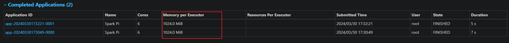
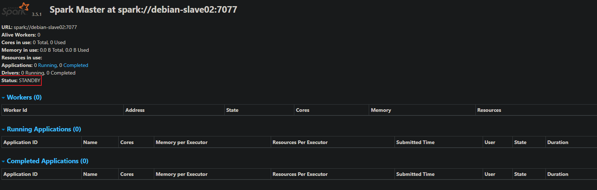

# 第一章 Spark概述

## Spark 是什么

Spark 是一种基于内存的快速、通用、可扩展的大数据分析计算引擎。

## Spark and Hadoop

在之前的学习中，Hadoop 的 MapReduce 是大家广为熟知的计算框架，那为什么咱们还 要学习新的计算框架 Spark 呢，这里就不得不提到 Spark 和 Hadoop 的关系。 

首先从时间节点上来看:

- Hadoop
  - 2006 年 1 月，Doug Cutting 加入 Yahoo，领导 Hadoop 的开发
  - 2008 年 1 月，Hadoop 成为 Apache 顶级项目
  - 2011 年 1.0 正式发布
  - 2012 年 3 月稳定版发布
  - **2013 年 10 月发布 2.X (Yarn)版本**
- Spark
  - 2009 年，Spark 诞生于伯克利大学的 AMPLab 实验室
  - 2010 年，伯克利大学正式开源了 Spark 项目
  - **2013 年 6 月，Spark 成为了 Apache 基金会下的项目**
  - 2014 年 2 月，Spark 以飞快的速度成为了 Apache 的顶级项目
  - 2015 年至今，Spark 变得愈发火爆，大量的国内公司开始重点部署或者使用 Spark

然后我们再从功能上来看:

- Hadoop
  - Hadoop 是由 java 语言编写的，在分布式服务器集群上存储海量数据并运行分布式 分析应用的开源框架
  - 作为 Hadoop 分布式文件系统，HDFS 处于 Hadoop 生态圈的最下层，存储着所有 的 数 据 ， 支 持 着 Hadoop 的 所 有 服 务 。 它 的 理 论 基 础 源 于 Google 的 TheGoogleFileSystem 这篇论文，它是 GFS 的开源实现
  - MapReduce 是一种编程模型，Hadoop 根据 Google 的 MapReduce 论文将其实现， 作为 Hadoop 的分布式计算模型，是 Hadoop 的核心。基于这个框架，分布式并行 程序的编写变得异常简单。综合了 HDFS 的分布式存储和 MapReduce 的分布式计 算，Hadoop 在处理海量数据时，性能横向扩展变得非常容易
  - HBase 是对 Google 的 Bigtable 的开源实现，但又和 Bigtable 存在许多不同之处。 HBase 是一个基于 HDFS 的分布式数据库，擅长实时地随机读/写超大规模数据集。 它也是 Hadoop 非常重要的组件
- Spark
  - Spark 是一种由 Scala 语言开发的快速、通用、可扩展的大数据分析引擎
  - Spark Core 中提供了 Spark 最基础与最核心的功能
  - Spark SQL 是 Spark 用来操作结构化数据的组件。通过 Spark SQL，用户可以使用 SQL 或者 Apache Hive 版本的 SQL 方言（HQL）来查询数据
  - Spark Streaming 是 Spark 平台上针对实时数据进行流式计算的组件，提供了丰富的 处理数据流的 API

由上面的信息可以获知，Spark 出现的时间相对较晚，并且主要功能主要是用于数据计算， 所以其实 Spark 一直被认为是 Hadoop 框架的升级版

## Spark or Hadoop

Hadoop 的 MR 框架和 Spark 框架都是数据处理框架，那么我们在使用时如何选择呢？

- Hadoop MapReduce 由于其设计初衷并不是为了满足循环迭代式数据流处理，因此在多 并行运行的数据可复用场景（如：机器学习、图挖掘算法、交互式数据挖掘算法）中存 在诸多计算效率等问题。所以 Spark 应运而生，Spark 就是在传统的 MapReduce 计算框 架的基础上，利用其计算过程的优化，从而大大加快了数据分析、挖掘的运行和读写速 度，并将计算单元缩小到更适合并行计算和重复使用的 RDD 计算模型
- 机器学习中 ALS、凸优化梯度下降等。这些都需要基于数据集或者数据集的衍生数据 反复查询反复操作。MR 这种模式不太合适，即使多 MR 串行处理，性能和时间也是一 个问题。数据的共享依赖于磁盘。另外一种是交互式数据挖掘，MR 显然不擅长。而 Spark 所基于的 scala 语言恰恰擅长函数的处理
- Spark 是一个分布式数据快速分析项目。它的核心技术是弹性分布式数据集（Resilient Distributed Datasets），提供了比 MapReduce 丰富的模型，可以快速在内存中对数据集 进行多次迭代，来支持复杂的数据挖掘算法和图形计算算法
- **Spark 和Hadoop 的根本差异是多个作业之间的数据通信问题 : Spark 多个作业之间数据 通信是基于内存，而 Hadoop 是基于磁盘**
- Spark Task 的启动时间快。Spark 采用 fork 线程的方式，而 Hadoop 采用创建新的进程 的方式。
- Spark 只有在 shuffle 的时候将数据写入磁盘，而 Hadoop 中多个 MR 作业之间的数据交 互都要依赖于磁盘交互
- Spark 的缓存机制比 HDFS 的缓存机制高效

经过上面的比较，我们可以看出在绝大多数的数据计算场景中，Spark 确实会比 MapReduce 更有优势。但是 Spark 是基于内存的，所以在实际的生产环境中，由于内存的限制，可能会 由于内存资源不够导致 Job 执行失败，此时，MapReduce 其实是一个更好的选择，所以 Spark 并不能完全替代 MR

> 一次性数据计算
> 框架在处理数据的时候，会从存储设备中读取数据，进行逻辑操作，然后将处理的结果重新存储到介质中
>
> 上图是Hadoop的map,reduer处理过程,如果需要经过多次运算,而中间把数据缓存在磁盘,经过多次的IO的操作,会大大加减低其计算能力
>
> 而下图Spark正好解决了此问题,会把计算完的数据暂保留在内存继续下次计算
>
> 

## Spark 核心模块


- Spark Core

  Spark Core 中提供了 Spark 最基础与最核心的功能，Spark 其他的功能如：Spark SQL， Spark Streaming，GraphX, MLlib 都是在 Spark Core 的基础上进行扩展的

- Spark SQL

  Spark SQL 是 Spark 用来操作结构化数据的组件。通过 Spark SQL，用户可以使用 SQL 或者 Apache Hive 版本的 SQL 方言（HQL）来查询数据

- Spark Streaming

  Spark Streaming 是 Spark 平台上针对实时数据进行流式计算的组件，提供了丰富的处理 数据流的 API。

- Spark MLlib

  MLlib 是 Spark 提供的一个机器学习算法库。MLlib 不仅提供了模型评估、数据导入等 额外的功能，还提供了一些更底层的机器学习原语

- Spark GraphX

  GraphX 是 Spark 面向图计算提供的框架与算法库。

------

# 第二章 Spark 快速上手

在大数据早期的课程中我们已经学习了 MapReduce 框架的原理及基本使用，并了解了 其底层数据处理的实现方式。接下来，就让咱们走进 Spark 的世界，了解一下它是如何带领 我们完成数据处理的

## 创建 Maven 项目 

### 增加 Scala 插件 

Spark 由 Scala 语言开发的，所以本课件接下来的开发所使用的语言也为 Scala，咱们当 前使用的 Spark 版本为 3.0.0，默认采用的 Scala 编译版本为 2.12，所以后续开发时。我们依 然采用这个版本。开发前请保证 IDEA 开发工具中含有 Scala 开发插件

### 增加依赖关系 

修改 Maven 项目中的 POM 文件，增加 Spark 框架的依赖关系。本课件基于 Spark3.0 版 本，使用时请注意对应版本。

```xml
<dependencies>
     <dependency>
         <groupId>org.apache.spark</groupId>
         <artifactId>spark-core_2.13</artifactId>
         <version>3.5.1</version>
     </dependency>
</dependencies>
<build>
     <plugins>
     <!-- 该插件用于将 Scala 代码编译成 class 文件 -->
         <plugin>
             <groupId>net.alchim31.maven</groupId>
             <artifactId>scala-maven-plugin</artifactId>
             <version>4.8.1</version>
             <executions>
                 <execution>
                     <!-- 声明绑定到 maven 的 compile 阶段 -->
                     <goals>
                         <goal>testCompile</goal>
                     </goals>
                 </execution>
             </executions>
         </plugin>
         <plugin>
            <groupId>org.apache.maven.plugins</groupId>
             <artifactId>maven-assembly-plugin</artifactId>
             <version>3.7.0</version>
             <configuration>
                 <descriptorRefs>
                     <descriptorRef>jar-with-dependencies</descriptorRef>
                 </descriptorRefs>
             </configuration>
             <executions>
                 <execution>
                     <id>make-assembly</id>
                     <phase>package</phase>
                     <goals>
                     	<goal>single</goal>
                 	 </goals>
            	 </execution>
         	</executions>
         </plugin>
     </plugins>
</build>
```

### WordCount

为了能直观地感受 Spark 框架的效果，接下来我们实现一个大数据学科中最常见的教学 案例 WordCount

1. 需求

   单词计数：将集合中出现的相同的单词，进行计数，取计数排名前三的结果

2. 需求分析

   

3. 实例操作

   ```scala
   package com.bigdata.core.wc
   
   import org.apache.spark.rdd.RDD
   import org.apache.spark.{SparkConf, SparkContext}
   
   object Spark01_WordCount {
   
     def main(args: Array[String]): Unit = {
       // Application
       // Spark框架
       // TODO 建立和Spark框架的连接
       // JDBC : Connection
   
       // 创建 Spark 运行配置对象
       val sparkConf = new SparkConf().setMaster("local").setAppName("WordCount")
       // 创建 Spark 上下文环境对象（连接对象）
       val sparkContext: SparkContext = new SparkContext(sparkConf)
   
       // TODO 执行业务操作
       // 1. 读取文件，获取一行一行的数据
       //    hello world
       // 读取文件数据
       val lines: RDD[String] = sparkContext.textFile("data")
   
       // 2. 将一行数据进行拆分，形成一个一个的单词（分词）
       //    扁平化：将整体拆分成个体的操作
       //   "hello world" => hello, world, hello, world
       // 将文件中的数据进行分词
       val words: RDD[String] = lines.flatMap(_.split(" "))
   
       // 3. 将数据根据单词进行分组，便于统计
       //    (hello, hello, hello), (world, world)
       val wordGroup: RDD[(String, Iterable[String])] = words.groupBy(word => word)
   
       // 4. 对分组后的数据进行转换
       //    (hello, hello, hello), (world, world)
       //    (hello, 3), (world, 2)
       // 转换数据结构 word => (word, 1)
       val wordToCount = wordGroup.map {
         case (word, list) => {
           (word, list.size)
         }
       }
   
       // 5. 将转换结果采集到控制台打印出来
       val array: Array[(String, Int)] = wordToCount.collect()
       array.foreach(println)
   
       // TODO 关闭连接
       sparkContext.stop()
     }
   }
   
   ```

   

   优化上述操作
   
   ```scala
   package com.bigdata.core.wc
   
   import org.apache.spark.rdd.RDD
   import org.apache.spark.{SparkConf, SparkContext}
   
   object Spark02_WordCount {
   
     def main(args: Array[String]): Unit = {
       // Application
       // Spark框架
       // TODO 建立和Spark框架的连接
       // JDBC : Connection
   
       // 创建 Spark 运行配置对象
       val sparkConf = new SparkConf().setMaster("local").setAppName("WordCount")
       // 创建 Spark 上下文环境对象（连接对象）
       val sparkContext: SparkContext = new SparkContext(sparkConf)
   
       // TODO 执行业务操作
       // 1. 读取文件，获取一行一行的数据
       //    hello world
       // 读取文件数据
       val lines: RDD[String] = sparkContext.textFile("data")
   
       // 2. 将一行数据进行拆分，形成一个一个的单词（分词）
       //    扁平化：将整体拆分成个体的操作
       //   "hello world" => hello, world, hello, world
       // 将文件中的数据进行分词
       val words: RDD[String] = lines.flatMap(_.split(" "))
   
       // 3. 将数据根据单词进行分组，便于统计
       //    (hello, hello, hello), (world, world)
       val wordOne = words.map(word => (word, 1))
   
       // 4. 对分组后的数据进行转换
       //    (hello, hello, hello), (world, world)
       //    (hello, 3), (world, 2)
       // 转换数据结构 word => (word, 1)
       val wordGroup = wordOne.groupBy(t => t._1)
   
       val wordToCount = wordGroup.map {
         case (word, list) => {
           list.reduce(
             (t1, t2) => {
               (t1._1, t1._2 + t2._2)
             }
           )
         }
       }
   
       // 5. 将转换结果采集到控制台打印出来
       val array: Array[(String, Int)] = wordToCount.collect()
       array.foreach(println)
   
       // TODO 关闭连接
       sparkContext.stop()
   
     }
   
   }
   
   ```
   
   最终优化如下
   
   ```scala
   package com.bigdata.core.wc
   
   import org.apache.spark.rdd.RDD
   import org.apache.spark.{SparkConf, SparkContext}
   
   object Spark03_WordCount {
   
     def main(args: Array[String]): Unit = {
       // Application
       // Spark框架
       // TODO 建立和Spark框架的连接
       // JDBC : Connection
   
       // 创建 Spark 运行配置对象
       val sparkConf = new SparkConf().setMaster("local").setAppName("WordCount")
       // 创建 Spark 上下文环境对象（连接对象）
       val sparkContext: SparkContext = new SparkContext(sparkConf)
   
       // TODO 执行业务操作
       // 1. 读取文件，获取一行一行的数据
       //    hello world
       // 读取文件数据
       val lines: RDD[String] = sparkContext.textFile("data")
   
       // 2. 将一行数据进行拆分，形成一个一个的单词（分词）
       //    扁平化：将整体拆分成个体的操作
       //   "hello world" => hello, world, hello, world
       // 将文件中的数据进行分词
       val words: RDD[String] = lines.flatMap(_.split(" "))
   
       // 3. 将数据根据单词进行分组，便于统计
       //    (hello, hello, hello), (world, world)
       val wordToOne: RDD[(String, Int)] = words.map((_, 1))
   
       // 4. 对分组后的数据进行转换
       //    (hello, hello, hello), (world, world)
       //    (hello, 3), (world, 2)
       // 转换数据结构 word => (word, 1)
       val wordToSum = wordToOne.reduceByKey(_ + _)
   
       // 5. 将转换结果采集到控制台打印出来
       val array: Array[(String, Int)] = wordToSum.collect()
       array.foreach(println)
   
       // TODO 关闭连接
       sparkContext.stop()
     }
   }
   
   ```

执行过程中，会产生大量的执行日志，如果为了能够更好的查看程序的执行结果，可以在项 目的 `resources `目录中创建 `log4j.properties` 文件，并添加日志配置信息：

```properties
log4j.rootCategory=ERROR, console
log4j.appender.console=org.apache.log4j.ConsoleAppender
log4j.appender.console.target=System.err
log4j.appender.console.layout=org.apache.log4j.PatternLayout
log4j.appender.console.layout.ConversionPattern=%d{yy/MM/ddHH:mm:ss} %p %c{1}: %m%n
# Set the default spark-shell log level to ERROR. When running the spark-shell,the
# log level for this class is used to overwrite the root logger's log level, sothat
# the user can have different defaults for the shell and regular Spark apps.
log4j.logger.org.apache.spark.repl.Main=ERROR
# Settings to quiet third party logs that are too verbose
log4j.logger.org.spark_project.jetty=ERROR
log4j.logger.org.spark_project.jetty.util.component.AbstractLifeCycle=ERROR
log4j.logger.org.apache.spark.repl.SparkIMain$exprTyper=ERROR
log4j.logger.org.apache.spark.repl.SparkILoop$SparkILoopInterpreter=ERROR
log4j.logger.org.apache.parquet=ERROR
log4j.logger.parquet=ERROR
# SPARK-9183: Settings to avoid annoying messages when looking up nonexistentUDFs in SparkSQL with Hive support
log4j.logger.org.apache.hadoop.hive.metastore.RetryingHMSHandler=FATAL
log4j.logger.org.apache.hadoop.hive.ql.exec.FunctionRegistry=ERROR
```

### 异常处理

如果本机操作系统是 Windows，在程序中使用了 Hadoop 相关的东西，比如写入文件到 HDFS，则会遇到如下异常

```scala
MapPartitionsRDD[2] at flatMap at Spark01_WordCount.scala:26
Exception in thread "main" java.lang.UnsatisfiedLinkError: org.apache.hadoop.io.nativeio.NativeIO$Windows.access0(Ljava/lang/String;I)Z
	at org.apache.hadoop.io.nativeio.NativeIO$Windows.access0(Native Method)
	at org.apache.hadoop.io.nativeio.NativeIO$Windows.access(NativeIO.java:793)
	at org.apache.hadoop.fs.FileUtil.canRead(FileUtil.java:1249)
	at org.apache.hadoop.fs.FileUtil.list(FileUtil.java:1454)
	at org.apache.hadoop.fs.RawLocalFileSystem.listStatus(RawLocalFileSystem.java:601)
	at org.apache.hadoop.fs.FileSystem.listStatus(FileSystem.java:1972)
	at org.apache.hadoop.fs.FileSystem.listStatus(FileSystem.java:2014)
	at org.apache.hadoop.fs.FileSystem$4.<init>(FileSystem.java:2180)
	at org.apache.hadoop.fs.FileSystem.listLocatedStatus(FileSystem.java:2179)
	at org.apache.hadoop.fs.ChecksumFileSystem.listLocatedStatus(ChecksumFileSystem.java:783)
	at org.apache.hadoop.mapred.FileInputFormat.singleThreadedListStatus(FileInputFormat.java:285)
	at org.apache.hadoop.mapred.FileInputFormat.listStatus(FileInputFormat.java:244)
	at org.apache.hadoop.mapred.FileInputFormat.getSplits(FileInputFormat.java:332)
	at org.apache.spark.rdd.HadoopRDD.getPartitions(HadoopRDD.scala:208)
	at org.apache.spark.rdd.RDD.$anonfun$partitions$2(RDD.scala:294)
	at scala.Option.getOrElse(Option.scala:201)
	at org.apache.spark.rdd.RDD.partitions(RDD.scala:290)
	at org.apache.spark.rdd.MapPartitionsRDD.getPartitions(MapPartitionsRDD.scala:49)
	at org.apache.spark.rdd.RDD.$anonfun$partitions$2(RDD.scala:294)
	at scala.Option.getOrElse(Option.scala:201)
	at org.apache.spark.rdd.RDD.partitions(RDD.scala:290)
	at org.apache.spark.rdd.MapPartitionsRDD.getPartitions(MapPartitionsRDD.scala:49)
	at org.apache.spark.rdd.RDD.$anonfun$partitions$2(RDD.scala:294)
	at scala.Option.getOrElse(Option.scala:201)
	at org.apache.spark.rdd.RDD.partitions(RDD.scala:290)
	at org.apache.spark.Partitioner$.$anonfun$defaultPartitioner$4(Partitioner.scala:78)
	at org.apache.spark.Partitioner$.$anonfun$defaultPartitioner$4$adapted(Partitioner.scala:78)
	at scala.collection.immutable.List.map(List.scala:246)
	at scala.collection.immutable.List.map(List.scala:79)
	at org.apache.spark.Partitioner$.defaultPartitioner(Partitioner.scala:78)
	at org.apache.spark.rdd.RDD.$anonfun$groupBy$1(RDD.scala:749)
	at org.apache.spark.rdd.RDDOperationScope$.withScope(RDDOperationScope.scala:151)
	at org.apache.spark.rdd.RDDOperationScope$.withScope(RDDOperationScope.scala:112)
	at org.apache.spark.rdd.RDD.withScope(RDD.scala:410)
	at org.apache.spark.rdd.RDD.groupBy(RDD.scala:749)
	at com.bigdata.core.wc.Spark01_WordCount$.main(Spark01_WordCount.scala:32)
	at com.bigdata.core.wc.Spark01_WordCount.main(Spark01_WordCount.scala)
```

出现这个问题的原因，并不是程序的错误，而是 windows 系统用到了 hadoop 相关的服务，解决办法是通过配置关联到 windows 的系统依赖就可以了,设置完下面环境变量后要得启IDEA才会生效

> win系统下需要使用`winutils.exe`连接Hadoop,如下url是已经编译好的地址,下载解压完配置win环境变量`HADOOP_HOME `和`Path`,双击`winutils.exe`没报异常即成功
>
> https://github.com/cdarlint/winutils
>
> 注:作者这里使用的是[hadoop-3.3.5/bin](https://github.com/cdarlint/winutils/tree/master/hadoop-3.3.5/bin)包,因现阶段还没有最新3.3.6版本,作者在调试过程中暂没发现任何BUG异常

------

# 第三章 Spark 运行环境

Spark 作为一个数据处理框架和计算引擎，被设计在所有常见的集群环境中运行, 在国 内工作中主流的环境为 Yarn，不过逐渐容器式环境也慢慢流行起来。接下来，我们就分别 看看不同环境下 Spark 的运行


## Local 模式

想啥呢，你之前一直在使用的模式可不是 Local 模式哟。所谓的 Local 模式，就是不需 要其他任何节点资源就可以在本地执行 Spark 代码的环境，一般用于教学，调试，演示等， 之前在 IDEA 中运行代码的环境我们称之为开发环境，不太一样。

### 解压缩文件 

将 spark-3.5.1-bin-hadoop3.tgz 文件上传到 Linux 并解压缩，放置在指定位置，路径中 不要包含中文或空格，课件后续如果涉及到解压缩操作，不再强调

```shell
tar -zxvf spark-3.5.1-bin-hadoop3.tgz -C /opt/software
cd /opt/software
mv spark-3.5.1-bin-hadoop3 spark-local
```

### 启动 Local 环境 

1. 进入解压缩后的路径，执行如下指令

   ```shell
   bin/spark-shell
   ```

2. 启动成功后，可以输入网址进行 Web UI 监控页面访问

   http://虚拟机地址:4040

   

### 命令行工具 

在解压缩文件夹下的 data 目录中，添加 word.txt 文件。在命令行工具中执行如下代码指 令（和 IDEA 中代码简化版一致）

```shell
sc.textFile("data/word.txt").flatMap(_.split(" ")).map((_,1)).reduceByKey(_+_).collect
```

### 退出本地模式 

按键 Ctrl+C 或输入 Scala 指令

```shell
:quit
```

### 提交应用

```shell
bin/spark-submit \
--class org.apache.spark.examples.SparkPi \
--master local[2] \
./examples/jars/spark-examples_2.12-3.0.0.jar \
10
```

1. --class 表示要执行程序的主类，**此处可以更换为咱们自己写的应用程序**

2. --master local[2] 部署模式，默认为本地模式，数字表示分配的虚拟 CPU 核数量

3. spark-examples_2.12-3.0.0.jar 运行的应用类所在的 jar 包，实际使用时，可以设定为咱 们自己打的 jar 包

4. 数字 10 表示程序的入口参数，用于设定当前应用的任务数量

   ```shell
   
   ```

## Standalone 模式

local 本地模式毕竟只是用来进行练习演示的，真实工作中还是要将应用提交到对应的 集群中去执行，这里我们来看看只使用 Spark 自身节点运行的集群模式，也就是我们所谓的 独立部署（Standalone）模式。Spark 的 Standalone 模式体现了经典的 master-slave 模式。 集群规划

| debian-slave01 | debian-slave02 | debian-slave03 |
| -------------- | -------------- | -------------- |
| Master         |                |                |
| Worker         | Worker         | Worker         |

### 解压缩文件

将 spark-3.0.0-bin-hadoop3.2.tgz 文件上传到 Linux 并解压缩在指定位置

```shell
tar -zxvf spark-3.0.0-bin-hadoop3.2.tgz -C /opt/module
cd /opt/module
mv spark-3.0.0-bin-hadoop3.2 spark-standalone
```

### 修改配置文件 

1. 进入解压缩后路径的 conf 目录，修改 slaves.template 文件名为 slaves

   ```shell
   mv slaves.template slaves
   ```

2. 修改 slaves 文件，添加 work 节点

   ```
   debian-slave01
   debian-slave02
   debian-slave03
   ```

3. 修改 spark-env.sh.template 文件名为 spark-env.sh

   ```shell
   mv spark-env.sh.template spark-env.sh
   ```

4. 修改 spark-env.sh 文件，添加 JAVA_HOME 环境变量和集群对应的 master 节点

   ```sh
   export JAVA_HOME=/opt/software/jdk1.8.0_144
   SPARK_MASTER_HOST=debian-slave01
   SPARK_MASTER_PORT=7077
   ```

   > 注意：7077 端口，相当于 hadoop3 内部通信的 8020 端口，此处的端口需要确认自己的 Hadoop 配置

5. 分发 spark-standalone 目录

   ```shell
   xsync spark-standalone
   ```

### 启动集群

1. 执行脚本命令

   ```shell
   sbin/start-all.sh
   ```

2. 查看三台服务器运行进程

   ```shelll
   jpsall
   ```

3. 查看 Master 资源监控 Web UI 界面: http://linux1:8080

   

### 提交应用

```shell
bin/spark-submit \
--class org.apache.spark.examples.SparkPi \
--master spark://linux1:7077 \
./examples/jars/spark-examples_2.12-3.0.0.jar \
10
```

1. --class 表示要执行程序的主类
2. --master spark://linux1:7077 独立部署模式，连接到 Spark 集群
3. spark-examples_2.12-3.0.0.jar 运行类所在的 jar 包
4. 数字 10 表示程序的入口参数，用于设定当前应用的任务数量

```shell

```

执行任务时，会产生多个 Java 进程

```shell

```

执行任务时，默认采用服务器集群节点的总核数，每个节点内存 1024M



### 提交参数说明

在提交应用中，一般会同时一些提交参

```shell
bin/spark-submit \
--class <main-class>
--master <master-url> \
... # other options
<application-jar> \
[application-arguments]
```

| 参数                     | 解释                                                         | 可选值举例                                 |
| ------------------------ | ------------------------------------------------------------ | ------------------------------------------ |
| --class                  | Spark 程序中包含主函数的类                                   |                                            |
| --master                 | Spark 程序运行的模式(环境)                                   | 模式：local[*]、spark://linux1:7077、 Yarn |
| --executor-memory 1G     | 指定每个 executor 可用内存为 1G                              | 符合集群内存配置即可,具体情况具体分析      |
| --total-executor-cores 2 | 指定所有executor使用的cpu核数 析。 为 2 个                   | 同上                                       |
| --executor-cores         | 指定每个executor使用的cpu核数                                | 同上                                       |
| application-jar          | 打包好的应用 jar，包含依赖。这 个 URL 在集群中全局可见。 比 如 hdfs:// 共享存储系统，如果是file:// path，那么所有的节点的 path 都包含同样的 jar | 同上                                       |
| application-arguments    | 传给 main()方法的参数                                        | 同上                                       |

### 配置历史服务

由于 spark-shell 停止掉后，集群监控 linux1:4040 页面就看不到历史任务的运行情况，所以 开发时都配置历史服务器记录任务运行情况。

1. 修改 spark-defaults.conf.template 文件名为 spark-defaults.conf

   ```shell
   
   ```

2. 修改 spark-default.conf 文件，配置日志存储路径

   ```xml
   spark.eventLog.enabled true
   spark.eventLog.dir hdfs://linux1:8020/directory
   ```

   > 注意：需要启动 hadoop 集群，HDFS 上的 directory 目录需要提前存在
   >
   > ```shell
   > sbin/start-dfs.sh
   > hadoop fs -mkdir /directory
   > ```

3. 修改 spark-env.sh 文件, 添加日志配置

   ```sh
   export SPARK_HISTORY_OPTS="
   -Dspark.history.ui.port=18080
   -Dspark.history.fs.logDirectory=hdfs://linux1:8020/directory
   -Dspark.history.retainedApplications=30"
   ```

   - 参数 1 含义：WEB UI 访问的端口号为 18080
   - 参数 2 含义：指定历史服务器日志存储路径
   - 参数 3 含义：指定保存 Application 历史记录的个数，如果超过这个值，旧的应用程序 信息将被删除，这个是内存中的应用数，而不是页面上显示的应用数

4. 分发配置文件

   ```shell
   xsync conf
   ```

5. 重新启动集群和历史服务

   ```shell
   sbin/start-all.sh
   sbin/start-history-server.sh
   ```

6. 重新执行任务

   ```
   bin/spark-submit \
   --class org.apache.spark.examples.SparkPi \
   --master spark://linux1:7077 \
   ./examples/jars/spark-examples_2.12-3.0.0.jar \
   10
   ```

7. 查看历史服务：http://linux1:18080

   

### 配置高可用（HA）

所谓的高可用是因为当前集群中的 Master 节点只有一个，所以会存在单点故障问题。所以 为了解决单点故障问题，需要在集群中配置多个 Master 节点，一旦处于活动状态的 Master 发生故障时，由备用 Master 提供服务，保证作业可以继续执行。这里的高可用一般采用

| debian-slave01 | debian-slave02 | debian-slave03 |
| -------------- | -------------- | -------------- |
| Master         | Master         |                |
| Zookeeper      | Zookeeper      | Zookeeper      |
| Worker         | Worker         | Worker         |

1. 停止集群

   ```shell
   sbin/stop-all.sh
   ```

2. 启动 Zookeeper

   ```shell
   xstart zk
   ```

3. 修改 spark-env.sh 文件添加如下配置

   ```sh
   注释如下内容：
   #SPARK_MASTER_HOST=linux1
   #SPARK_MASTER_PORT=7077
   添加如下内容:
   #Master 监控页面默认访问端口为 8080，但是可能会和 Zookeeper 冲突，所以改成 8989，也可以自
   定义，访问 UI 监控页面时请注意
   SPARK_MASTER_WEBUI_PORT=8989
   
   export SPARK_DAEMON_JAVA_OPTS="-Dspark.deploy.recoveryMode=ZOOKEEPER -Dspark.deploy.zookeeper.url=linux1,linux2,linux3 -Dspark.deploy.zookeeper.dir=/spark"
   ```

4. 分发配置文件

   ```shell
   xsync conf/
   ```

5. 启动集群

   ```shell
   sbin/start-all.sh
   ```

   

6. 启动 linux2 的单独 Master 节点，此时 linux2 节点 Master 状态处于备用状态

   ```shell
   [root@linux2 spark-standalone]# sbin/start-master.sh
   ```

   

7. 提交应用到高可用集群

   ```shell
   bin/spark-submit \
   --class org.apache.spark.examples.SparkPi \
   --master spark://linux1:7077,linux2:7077 \
   ./examples/jars/spark-examples_2.12-3.0.0.jar \
   10
   ```

8. 停止 `debian-slave01`的 Master 资源监控进程

   ```shell
   kill -9 进程
   ```

9. 查看 linux2 的 Master 资源监控 Web UI，稍等一段时间后，linux2 节点的 Master 状态 提升为活动状态

   


## Yarn 模式

独立部署（Standalone）模式由 Spark 自身提供计算资源，无需其他框架提供资源。这 种方式降低了和其他第三方资源框架的耦合性，独立性非常强。但是你也要记住，Spark 主 要是计算框架，而不是资源调度框架，所以本身提供的资源调度并不是它的强项，所以还是 和其他专业的资源调度框架集成会更靠谱一些。所以接下来我们来学习在强大的 Yarn 环境 下 Spark 是如何工作的（其实是因为在国内工作中，Yarn 使用的非常多）

### 解压缩文件

将 spark-3.0.0-bin-hadoop3.2.tgz 文件上传到 linux 并解压缩，放置在指定位置

```shell
tar -zxvf spark-3.0.0-bin-hadoop3.2.tgz -C /opt/module
cd /opt/module
mv spark-3.0.0-bin-hadoop3.2 spark-yarn
```

### 修改配置文件 

1. 修改 hadoop 配置文件/opt/module/hadoop/etc/hadoop/yarn-site.xml, 并分发

   ```xml
   <!--是否启动一个线程检查每个任务正使用的物理内存量，如果任务超出分配值，则直接将其杀掉，默认是 true -->
   <property>
        <name>yarn.nodemanager.pmem-check-enabled</name>
        <value>false</value>
   </property>
   <!--是否启动一个线程检查每个任务正使用的虚拟内存量，如果任务超出分配值，则直接将其杀掉，默认是 true -->
   <property>
        <name>yarn.nodemanager.vmem-check-enabled</name>
        <value>false</value>
   </property>
   ```

2. 修改 conf/spark-env.sh，添加 JAVA_HOME 和 YARN_CONF_DIR 配置

   ```sh
   mv spark-env.sh.template spark-env.sh
   。。。
   export JAVA_HOME=/opt/module/jdk1.8.0_144
   YARN_CONF_DIR=/opt/module/hadoop/etc/hadoop
   ```

### 启动 HDFS 以及 YARN 集群

瞅啥呢，自己启动去！

### 提交应用

```shell
bin/spark-submit \
--class org.apache.spark.examples.SparkPi \
--master yarn \
--deploy-mode cluster \
./examples/jars/spark-examples_2.12-3.0.0.jar \
10
```

查看 http://linux2:8088 页面，点击 History，查看历史页面


### 配置历史服务器 

1. 修改 `spark-defaults.conf.template` 文件名为 `spark-defaults.conf`

   ```shell
   mv spark-defaults.conf.template spark-defaults.conf
   ```

2. 修改 `spark-default.conf` 文件，配置日志存储路径

   ```xml
   spark.eventLog.enabled true
   spark.eventLog.dir hdfs://linux1:8020/directory
   ```

   > 注意：需要启动 hadoop 集群，HDFS 上的目录需要提前存在

   ```shell
   [root@linux1 hadoop]# sbin/start-dfs.sh
   [root@linux1 hadoop]# hadoop fs -mkdir /directory
   ```

3. 修改 spark-env.sh 文件, 添加日志配置

   ```sh
   export SPARK_HISTORY_OPTS="
   -Dspark.history.ui.port=18080
   -Dspark.history.fs.logDirectory=hdfs://linux1:8020/directory
   -Dspark.history.retainedApplications=30"
   ```

   - 参数 1 含义：WEB UI 访问的端口号为 18080
   - 参数 2 含义：指定历史服务器日志存储路径
   - 参数 3 含义：指定保存 Application 历史记录的个数，如果超过这个值，旧的应用程序 信息将被删除，这个是内存中的应用数，而不是页面上显示的应用数。

4. 修改 spark-defaults.conf

   ```xml
   spark.yarn.historyServer.address=linux1:18080
   spark.history.ui.port=18080
   ```

5. 启动历史服务

   ```shell
   sbin/start-history-server.sh 
   ```

6. 重新提交应用

   ```shell
   bin/spark-submit \
   --class org.apache.spark.examples.SparkPi \
   --master yarn \
   --deploy-mode client \
   ./examples/jars/spark-examples_2.12-3.0.0.jar \
   10
   ```

   ```
   
   ```

7. Web 页面查看日志：http://linux2:8088

   

   

## K8S & Mesos 模式

Mesos 是 Apache 下的开源分布式资源管理框架，它被称为是分布式系统的内核,在 Twitter 得到广泛使用,管理着 Twitter 超过 30,0000 台服务器上的应用部署，但是在国内，依 然使用着传统的 Hadoop 大数据框架，所以国内使用 Mesos 框架的并不多，但是原理其实都 差不多，这里我们就不做过多讲解了


容器化部署是目前业界很流行的一项技术，基于 Docker 镜像运行能够让用户更加方便 地对应用进行管理和运维。容器管理工具中最为流行的就是 Kubernetes（k8s），而 Spark 也在最近的版本中支持了 k8s 部署模式。这里我们也不做过多的讲解。给个链接大家自己感 受一下：https://spark.apache.org/docs/latest/running-on-kubernetes.html


## Windows 模式

在同学们自己学习时，每次都需要启动虚拟机，启动集群，这是一个比较繁琐的过程， 并且会占大量的系统资源，导致系统执行变慢，不仅仅影响学习效果，也影响学习进度， Spark 非常暖心地提供了可以在 windows 系统下启动本地集群的方式，这样，在不使用虚拟 机的情况下，也能学习 Spark 的基本使用，摸摸哒！

在后续的教学中，为了能够更加流畅的教学效果和教学体验，我们一般情况下 都会采用 windows 系统的集群来学习 Spark

### 解压缩文件

将文件 spark-3.0.0-bin-hadoop3.2.tgz 解压缩到无中文无空格的路径中

### 启动本地环境

1. 执行解压缩文件路径下 bin 目录中的 spark-shell.cmd 文件，启动 Spark 本地环境

   ```shell
   
   ```

2. 在 bin 目录中创建 input 目录，并添加 word.txt 文件, 在命令行中输入脚本代码

   ```shell
   
   ```

### 命令行提交应用

在 DOS 命令行窗口中执行提交指令

```shell
spark-submit --class org.apache.spark.examples.SparkPi --master local[2] ../examples/jars/spark-examples_2.12-3.0.0.jar 10
```

```

```

## 部署模式对比

| 模式       | Spark安装机器数 | 需启动的进程    | 所属者 | 应用场景 |
| ---------- | --------------- | --------------- | ------ | -------- |
| Local      | 1               | 无              | Spark  | 测试     |
| Standalone | 3               | Master & Worker | Spark  | 单独部署 |
| Yarn       | 1               | Yarn 及 HDFS    | Hadoop | 混合部署 |

## 端口号

- Spark 查看当前 Spark-shell 运行任务情况端口号：4040（计算）
- Spark Master 内部通信服务端口号：7077
- Standalone 模式下，Spark Master Web 端口号：8080（资源）
- Spark 历史服务器端口号：18080
- Hadoop YARN 任务运行情况查看端口号：8088


------

# 第四章 Spark 运行架构

## 运行架构

Spark 框架的核心是一个计算引擎，整体来说，它采用了标准 master-slave 的结构。

如下图所示，它展示了一个 Spark 执行时的基本结构。图形中的 Driver 表示 master， 负责管理整个集群中的作业任务调度。图形中的 Executor 则是 slave，负责实际执行任务。


## 核心组件

由上图可以看出，对于 Spark 框架有两个核心组件：

### Driver

Spark 驱动器节点，用于执行 Spark 任务中的 main 方法，负责实际代码的执行工作。 Driver 在 Spark 作业执行时主要负责

- 将用户程序转化为作业（job）
- 在 Executor 之间调度任务(task)
- 跟踪 Executor 的执行情况
- 通过 UI 展示查询运行情况

实际上，我们无法准确地描述 Driver 的定义，因为在整个的编程过程中没有看到任何有关 Driver 的字眼。所以简单理解，所谓的 Driver 就是驱使整个应用运行起来的程序，也称之为 Driver 类

### Executor

Spark Executor 是集群中工作节点（Worker）中的一个 JVM 进程，负责在 Spark 作业 中运行具体任务（Task），任务彼此之间相互独立。Spark 应用启动时，Executor 节点被同时启动，并且始终伴随着整个 Spark 应用的生命周期而存在。如果有 Executor 节点发生了 故障或崩溃，Spark 应用也可以继续执行，会将出错节点上的任务调度到其他 Executor 节点 上继续运行

Executor 有两个核心功能：

- 负责运行组成 Spark 应用的任务，并将结果返回给驱动器进程
- 它们通过自身的块管理器（Block Manager）为用户程序中要求缓存的 RDD 提供内存 式存储。RDD 是直接缓存在 Executor 进程内的，因此任务可以在运行时充分利用缓存 数据加速运算

### Master & Worker

Spark 集群的独立部署环境中，不需要依赖其他的资源调度框架，自身就实现了资源调 度的功能，所以环境中还有其他两个核心组件：Master 和 Worker，这里的 Master 是一个进 程，主要负责资源的调度和分配，并进行集群的监控等职责，类似于 Yarn 环境中的 RM, 而 Worker 呢，也是进程，一个 Worker 运行在集群中的一台服务器上，由 Master 分配资源对 数据进行并行的处理和计算，类似于 Yarn 环境中 NM

### ApplicationMaster

Hadoop 用户向 YARN 集群提交应用程序时,提交程序中应该包含 ApplicationMaster，用 于向资源调度器申请执行任务的资源容器 Container，运行用户自己的程序任务 job，监控整 个任务的执行，跟踪整个任务的状态，处理任务失败等异常情况

说的简单点就是，ResourceManager（资源）和 Driver（计算）之间的解耦合靠的就是 ApplicationMaster。

