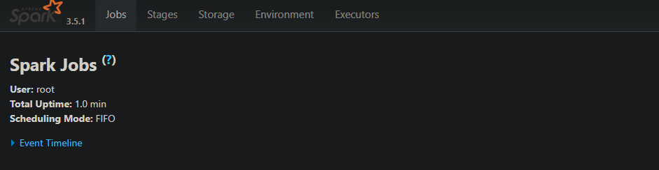
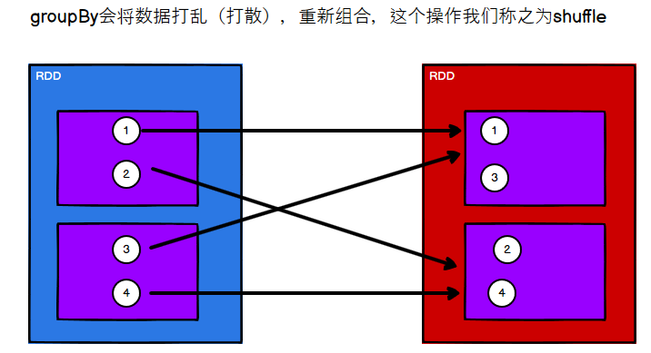
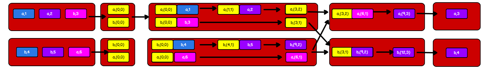

# 第一章 Spark概述

## Spark 是什么

Spark 是一种基于内存的快速、通用、可扩展的大数据分析计算引擎。

## Spark and Hadoop

在之前的学习中，Hadoop 的 MapReduce 是大家广为熟知的计算框架，那为什么咱们还要学习新的计算框架 Spark 呢，这里就不得不提到 Spark 和 Hadoop 的关系。 

首先从时间节点上来看:

- Hadoop
  - 2006 年 1 月，Doug Cutting 加入 Yahoo，领导 Hadoop 的开发
  - 2008 年 1 月，Hadoop 成为 Apache 顶级项目
  - 2011 年 1.0 正式发布
  - 2012 年 3 月稳定版发布
  - **2013 年 10 月发布 2.X (Yarn)版本**
- Spark
  - 2009 年，Spark 诞生于伯克利大学的 AMPLab 实验室
  - 2010 年，伯克利大学正式开源了 Spark 项目
  - **2013 年 6 月，Spark 成为了 Apache 基金会下的项目**
  - 2014 年 2 月，Spark 以飞快的速度成为了 Apache 的顶级项目
  - 2015 年至今，Spark 变得愈发火爆，大量的国内公司开始重点部署或者使用 Spark

然后我们再从功能上来看:

- Hadoop
  - Hadoop 是由 java 语言编写的，在分布式服务器集群上存储海量数据并运行分布式分析应用的开源框架
  - 作为 Hadoop 分布式文件系统，HDFS 处于 Hadoop 生态圈的最下层，存储着所有的数据 ， 支持着 Hadoop 的所有服务 。 它的理论基础源于 Google 的 TheGoogleFileSystem 这篇论文，它是 GFS 的开源实现
  - MapReduce 是一种编程模型，Hadoop 根据 Google 的 MapReduce 论文将其实现， 作为 Hadoop 的分布式计算模型，是 Hadoop 的核心。基于这个框架，分布式并行程序的编写变得异常简单。综合了 HDFS 的分布式存储和 MapReduce 的分布式计算，Hadoop 在处理海量数据时，性能横向扩展变得非常容易
  - HBase 是对 Google 的 Bigtable 的开源实现，但又和 Bigtable 存在许多不同之处。 HBase 是一个基于 HDFS 的分布式数据库，擅长实时地随机读/写超大规模数据集。 它也是 Hadoop 非常重要的组件
- Spark
  - Spark 是一种由 Scala 语言开发的快速、通用、可扩展的大数据分析引擎
  - Spark Core 中提供了 Spark 最基础与最核心的功能
  - Spark SQL 是 Spark 用来操作结构化数据的组件。通过 Spark SQL，用户可以使用 SQL 或者 Apache Hive 版本的 SQL 方言（HQL）来查询数据
  - Spark Streaming 是 Spark 平台上针对实时数据进行流式计算的组件，提供了丰富的处理数据流的 API

由上面的信息可以获知，Spark 出现的时间相对较晚，并且主要功能主要是用于数据计算， 所以其实 Spark 一直被认为是 Hadoop 框架的升级版

## Spark or Hadoop

Hadoop 的 MR 框架和 Spark 框架都是数据处理框架，那么我们在使用时如何选择呢？

- Hadoop MapReduce 由于其设计初衷并不是为了满足循环迭代式数据流处理，因此在多并行运行的数据可复用场景（如：机器学习、图挖掘算法、交互式数据挖掘算法）中存在诸多计算效率等问题。所以 Spark 应运而生，Spark 就是在传统的 MapReduce 计算框架的基础上，利用其计算过程的优化，从而大大加快了数据分析、挖掘的运行和读写速 度，并将计算单元缩小到更适合并行计算和重复使用的 RDD 计算模型
- 机器学习中 ALS、凸优化梯度下降等。这些都需要基于数据集或者数据集的衍生数据反复查询反复操作。MR 这种模式不太合适，即使多 MR 串行处理，性能和时间也是一个问题。数据的共享依赖于磁盘。另外一种是交互式数据挖掘，MR 显然不擅长。而 Spark 所基于的 scala 语言恰恰擅长函数的处理
- Spark 是一个分布式数据快速分析项目。它的核心技术是弹性分布式数据集（Resilient Distributed Datasets），提供了比 MapReduce 丰富的模型，可以快速在内存中对数据集进行多次迭代，来支持复杂的数据挖掘算法和图形计算算法
- **Spark 和Hadoop 的根本差异是多个作业之间的数据通信问题 : Spark 多个作业之间数据通信是基于内存，而 Hadoop 是基于磁盘**
- Spark Task 的启动时间快。Spark 采用 fork 线程的方式，而 Hadoop 采用创建新的进程的方式。
- Spark 只有在 shuffle 的时候将数据写入磁盘，而 Hadoop 中多个 MR 作业之间的数据交互都要依赖于磁盘交互
- Spark 的缓存机制比 HDFS 的缓存机制高效

经过上面的比较，我们可以看出在绝大多数的数据计算场景中，Spark 确实会比 MapReduce 更有优势。但是 Spark 是基于内存的，所以在实际的生产环境中，由于内存的限制，可能会由于内存资源不够导致 Job 执行失败，此时，MapReduce 其实是一个更好的选择，所以 Spark 并不能完全替代 MR

> 一次性数据计算
> 框架在处理数据的时候，会从存储设备中读取数据，进行逻辑操作，然后将处理的结果重新存储到介质中
>
> 上图是Hadoop的map,reduer处理过程,如果需要经过多次运算,而中间把数据缓存在磁盘,经过多次的IO的操作,会大大加减低其计算能力
>
> 而下图Spark正好解决了此问题,会把计算完的数据暂保留在内存继续下次计算
>
> 

## Spark 核心模块


- Spark Core

  Spark Core 中提供了 Spark 最基础与最核心的功能，Spark 其他的功能如：Spark SQL， Spark Streaming，GraphX, MLlib 都是在 Spark Core 的基础上进行扩展的

- Spark SQL

  Spark SQL 是 Spark 用来操作结构化数据的组件。通过 Spark SQL，用户可以使用 SQL 或者 Apache Hive 版本的 SQL 方言（HQL）来查询数据

- Spark Streaming

  Spark Streaming 是 Spark 平台上针对实时数据进行流式计算的组件，提供了丰富的处理数据流的 API。

- Spark MLlib

  MLlib 是 Spark 提供的一个机器学习算法库。MLlib 不仅提供了模型评估、数据导入等额外的功能，还提供了一些更底层的机器学习原语

- Spark GraphX

  GraphX 是 Spark 面向图计算提供的框架与算法库。

------

# 第二章 Spark 快速上手

在大数据早期的课程中我们已经学习了 MapReduce 框架的原理及基本使用，并了解了其底层数据处理的实现方式。接下来，就让咱们走进 Spark 的世界，了解一下它是如何带领我们完成数据处理的

## 创建 Maven 项目 

### 增加 Scala 插件 

Spark 由 Scala 语言开发的，所以接下来的开发所使用的语言也为 Scala，咱们当前使用的 Spark 版本为 3.5.1，默认采用的 Scala 编译版本为 2.13，所以后续开发时。采用这个版本。开发前请保证 IDEA 开发工具中含有 Scala 开发插件

### 增加依赖关系 

修改 Maven 项目中的 POM 文件，增加 Spark 框架的依赖关系。基于 Spark3.5.1版本，使用时请注意对应版本。

```xml
<dependencies>
     <dependency>
         <groupId>org.apache.spark</groupId>
         <artifactId>spark-core_2.13</artifactId>
         <version>3.5.1</version>
     </dependency>
</dependencies>
<build>
     <plugins>
     <!-- 该插件用于将 Scala 代码编译成 class 文件 -->
         <plugin>
             <groupId>net.alchim31.maven</groupId>
             <artifactId>scala-maven-plugin</artifactId>
             <version>4.8.1</version>
             <executions>
                 <execution>
                     <!-- 声明绑定到 maven 的 compile 阶段 -->
                     <goals>
                         <goal>testCompile</goal>
                     </goals>
                 </execution>
             </executions>
         </plugin>
         <plugin>
            <groupId>org.apache.maven.plugins</groupId>
             <artifactId>maven-assembly-plugin</artifactId>
             <version>3.7.0</version>
             <configuration>
                 <descriptorRefs>
                     <descriptorRef>jar-with-dependencies</descriptorRef>
                 </descriptorRefs>
             </configuration>
             <executions>
                 <execution>
                     <id>make-assembly</id>
                     <phase>package</phase>
                     <goals>
                     	<goal>single</goal>
                 	 </goals>
            	 </execution>
         	</executions>
         </plugin>
     </plugins>
</build>
```

### WordCount

为了能直观地感受 Spark 框架的效果，接下来我们实现一个大数据学科中最常见案例 WordCount

1. 需求

   单词计数：将集合中出现的相同的单词，进行计数，取计数排名前三的结果

2. 需求分析

   

3. 实例操作

   ```scala
   package com.bigdata.core.wc
   
   import org.apache.spark.rdd.RDD
   import org.apache.spark.{SparkConf, SparkContext}
   
   object Spark01_WordCount {
   
     def main(args: Array[String]): Unit = {
       // Application
       // Spark框架
       // TODO 建立和Spark框架的连接
       // JDBC : Connection
   
       // 创建 Spark 运行配置对象
       val sparkConf = new SparkConf().setMaster("local").setAppName("WordCount")
       // 创建 Spark 上下文环境对象（连接对象）
       val sparkContext: SparkContext = new SparkContext(sparkConf)
   
       // TODO 执行业务操作
       // 1. 读取文件，获取一行一行的数据
       //    hello world
       // 读取文件数据
       val lines: RDD[String] = sparkContext.textFile("data")
   
       // 2. 将一行数据进行拆分，形成一个一个的单词（分词）
       //    扁平化：将整体拆分成个体的操作
       //   "hello world" => hello, world, hello, world
       // 将文件中的数据进行分词
       val words: RDD[String] = lines.flatMap(_.split(" "))
   
       // 3. 将数据根据单词进行分组，便于统计
       //    (hello, hello, hello), (world, world)
       val wordGroup: RDD[(String, Iterable[String])] = words.groupBy(word => word)
   
       // 4. 对分组后的数据进行转换
       //    (hello, hello, hello), (world, world)
       //    (hello, 3), (world, 2)
       // 转换数据结构 word => (word, 1)
       val wordToCount = wordGroup.map {
         case (word, list) => {
           (word, list.size)
         }
       }
   
       // 5. 将转换结果采集到控制台打印出来
       val array: Array[(String, Int)] = wordToCount.collect()
       array.foreach(println)
   
       // TODO 关闭连接
       sparkContext.stop()
     }
   }
   
   ```

   

   优化上述操作
   
   ```scala
   package com.bigdata.core.wc
   
   import org.apache.spark.rdd.RDD
   import org.apache.spark.{SparkConf, SparkContext}
   
   object Spark02_WordCount {
   
     def main(args: Array[String]): Unit = {
       // Application
       // Spark框架
       // TODO 建立和Spark框架的连接
       // JDBC : Connection
   
       // 创建 Spark 运行配置对象
       val sparkConf = new SparkConf().setMaster("local").setAppName("WordCount")
       // 创建 Spark 上下文环境对象（连接对象）
       val sparkContext: SparkContext = new SparkContext(sparkConf)
   
       // TODO 执行业务操作
       // 1. 读取文件，获取一行一行的数据
       //    hello world
       // 读取文件数据
       val lines: RDD[String] = sparkContext.textFile("data")
   
       // 2. 将一行数据进行拆分，形成一个一个的单词（分词）
       //    扁平化：将整体拆分成个体的操作
       //   "hello world" => hello, world, hello, world
       // 将文件中的数据进行分词
       val words: RDD[String] = lines.flatMap(_.split(" "))
   
       // 3. 将数据根据单词进行分组，便于统计
       //    (hello, hello, hello), (world, world)
       val wordOne = words.map(word => (word, 1))
   
       // 4. 对分组后的数据进行转换
       //    (hello, hello, hello), (world, world)
       //    (hello, 3), (world, 2)
       // 转换数据结构 word => (word, 1)
       val wordGroup = wordOne.groupBy(t => t._1)
   
       val wordToCount = wordGroup.map {
         case (word, list) => {
           list.reduce(
             (t1, t2) => {
               (t1._1, t1._2 + t2._2)
             }
           )
         }
       }
   
       // 5. 将转换结果采集到控制台打印出来
       val array: Array[(String, Int)] = wordToCount.collect()
       array.foreach(println)
   
       // TODO 关闭连接
       sparkContext.stop()
   
     }
   
   }
   
   ```
   
   最终优化如下
   
   ```scala
   package com.bigdata.core.wc
   
   import org.apache.spark.rdd.RDD
   import org.apache.spark.{SparkConf, SparkContext}
   
   object Spark03_WordCount {
   
     def main(args: Array[String]): Unit = {
       // Application
       // Spark框架
       // TODO 建立和Spark框架的连接
       // JDBC : Connection
   
       // 创建 Spark 运行配置对象
       val sparkConf = new SparkConf().setMaster("local").setAppName("WordCount")
       // 创建 Spark 上下文环境对象（连接对象）
       val sparkContext: SparkContext = new SparkContext(sparkConf)
   
       // TODO 执行业务操作
       // 1. 读取文件，获取一行一行的数据
       //    hello world
       // 读取文件数据
       val lines: RDD[String] = sparkContext.textFile("data")
   
       // 2. 将一行数据进行拆分，形成一个一个的单词（分词）
       //    扁平化：将整体拆分成个体的操作
       //   "hello world" => hello, world, hello, world
       // 将文件中的数据进行分词
       val words: RDD[String] = lines.flatMap(_.split(" "))
   
       // 3. 将数据根据单词进行分组，便于统计
       //    (hello, hello, hello), (world, world)
       val wordToOne: RDD[(String, Int)] = words.map((_, 1))
   
       // 4. 对分组后的数据进行转换
       //    (hello, hello, hello), (world, world)
       //    (hello, 3), (world, 2)
       // 转换数据结构 word => (word, 1)
       val wordToSum = wordToOne.reduceByKey(_ + _)
   
       // 5. 将转换结果采集到控制台打印出来
       val array: Array[(String, Int)] = wordToSum.collect()
       array.foreach(println)
   
       // TODO 关闭连接
       sparkContext.stop()
     }
   }
   
   ```

执行过程中，会产生大量的执行日志，如果为了能够更好的查看程序的执行结果，可以在项 目的 `resources `目录中创建 `log4j.properties` 文件，并添加日志配置信息：

```properties
log4j.rootCategory=ERROR, console
log4j.appender.console=org.apache.log4j.ConsoleAppender
log4j.appender.console.target=System.err
log4j.appender.console.layout=org.apache.log4j.PatternLayout
log4j.appender.console.layout.ConversionPattern=%d{yy/MM/ddHH:mm:ss} %p %c{1}: %m%n
# Set the default spark-shell log level to ERROR. When running the spark-shell,the
# log level for this class is used to overwrite the root logger's log level, sothat
# the user can have different defaults for the shell and regular Spark apps.
log4j.logger.org.apache.spark.repl.Main=ERROR
# Settings to quiet third party logs that are too verbose
log4j.logger.org.spark_project.jetty=ERROR
log4j.logger.org.spark_project.jetty.util.component.AbstractLifeCycle=ERROR
log4j.logger.org.apache.spark.repl.SparkIMain$exprTyper=ERROR
log4j.logger.org.apache.spark.repl.SparkILoop$SparkILoopInterpreter=ERROR
log4j.logger.org.apache.parquet=ERROR
log4j.logger.parquet=ERROR
# SPARK-9183: Settings to avoid annoying messages when looking up nonexistentUDFs in SparkSQL with Hive support
log4j.logger.org.apache.hadoop.hive.metastore.RetryingHMSHandler=FATAL
log4j.logger.org.apache.hadoop.hive.ql.exec.FunctionRegistry=ERROR
```

### 异常处理

如果本机操作系统是 Windows，在程序中使用了 Hadoop 相关的东西，比如写入文件到 HDFS，则会遇到如下异常

```scala
MapPartitionsRDD[2] at flatMap at Spark01_WordCount.scala:26
Exception in thread "main" java.lang.UnsatisfiedLinkError: org.apache.hadoop.io.nativeio.NativeIO$Windows.access0(Ljava/lang/String;I)Z
	at org.apache.hadoop.io.nativeio.NativeIO$Windows.access0(Native Method)
	at org.apache.hadoop.io.nativeio.NativeIO$Windows.access(NativeIO.java:793)
	at org.apache.hadoop.fs.FileUtil.canRead(FileUtil.java:1249)
	at org.apache.hadoop.fs.FileUtil.list(FileUtil.java:1454)
	at org.apache.hadoop.fs.RawLocalFileSystem.listStatus(RawLocalFileSystem.java:601)
	at org.apache.hadoop.fs.FileSystem.listStatus(FileSystem.java:1972)
	at org.apache.hadoop.fs.FileSystem.listStatus(FileSystem.java:2014)
	at org.apache.hadoop.fs.FileSystem$4.<init>(FileSystem.java:2180)
	at org.apache.hadoop.fs.FileSystem.listLocatedStatus(FileSystem.java:2179)
	at org.apache.hadoop.fs.ChecksumFileSystem.listLocatedStatus(ChecksumFileSystem.java:783)
	at org.apache.hadoop.mapred.FileInputFormat.singleThreadedListStatus(FileInputFormat.java:285)
	at org.apache.hadoop.mapred.FileInputFormat.listStatus(FileInputFormat.java:244)
	at org.apache.hadoop.mapred.FileInputFormat.getSplits(FileInputFormat.java:332)
	at org.apache.spark.rdd.HadoopRDD.getPartitions(HadoopRDD.scala:208)
	at org.apache.spark.rdd.RDD.$anonfun$partitions$2(RDD.scala:294)
	at scala.Option.getOrElse(Option.scala:201)
	at org.apache.spark.rdd.RDD.partitions(RDD.scala:290)
	at org.apache.spark.rdd.MapPartitionsRDD.getPartitions(MapPartitionsRDD.scala:49)
	at org.apache.spark.rdd.RDD.$anonfun$partitions$2(RDD.scala:294)
	at scala.Option.getOrElse(Option.scala:201)
	at org.apache.spark.rdd.RDD.partitions(RDD.scala:290)
	at org.apache.spark.rdd.MapPartitionsRDD.getPartitions(MapPartitionsRDD.scala:49)
	at org.apache.spark.rdd.RDD.$anonfun$partitions$2(RDD.scala:294)
	at scala.Option.getOrElse(Option.scala:201)
	at org.apache.spark.rdd.RDD.partitions(RDD.scala:290)
	at org.apache.spark.Partitioner$.$anonfun$defaultPartitioner$4(Partitioner.scala:78)
	at org.apache.spark.Partitioner$.$anonfun$defaultPartitioner$4$adapted(Partitioner.scala:78)
	at scala.collection.immutable.List.map(List.scala:246)
	at scala.collection.immutable.List.map(List.scala:79)
	at org.apache.spark.Partitioner$.defaultPartitioner(Partitioner.scala:78)
	at org.apache.spark.rdd.RDD.$anonfun$groupBy$1(RDD.scala:749)
	at org.apache.spark.rdd.RDDOperationScope$.withScope(RDDOperationScope.scala:151)
	at org.apache.spark.rdd.RDDOperationScope$.withScope(RDDOperationScope.scala:112)
	at org.apache.spark.rdd.RDD.withScope(RDD.scala:410)
	at org.apache.spark.rdd.RDD.groupBy(RDD.scala:749)
	at com.bigdata.core.wc.Spark01_WordCount$.main(Spark01_WordCount.scala:32)
	at com.bigdata.core.wc.Spark01_WordCount.main(Spark01_WordCount.scala)
```

出现这个问题的原因，并不是程序的错误，而是 windows 系统用到了 hadoop 相关的服务，解决办法是通过配置关联到 windows 的系统依赖就可以了,设置完下面环境变量后要得启IDEA才会生效

> win系统下需要使用`winutils.exe`连接Hadoop,如下url是已经编译好的地址,下载解压完配置win环境变量`HADOOP_HOME `和`Path`,双击`winutils.exe`没报异常即成功
>
> https://github.com/cdarlint/winutils
>
> 注:作者这里使用的是[hadoop-3.3.5/bin](https://github.com/cdarlint/winutils/tree/master/hadoop-3.3.5/bin)包,因现阶段还没有最新3.3.6版本,作者在调试过程中暂没发现任何BUG异常

------

# 第三章 Spark 运行环境

Spark 作为一个数据处理框架和计算引擎，被设计在所有常见的集群环境中运行, 在国内工作中主流的环境为 Yarn，不过逐渐容器式环境也慢慢流行起来。接下来，我们就分别看看不同环境下 Spark 的运行


## Local 模式

想啥呢，你之前一直在使用的模式可不是 Local 模式哟。所谓的 Local 模式，就是不需要其他任何节点资源就可以在本地执行 Spark 代码的环境，一般用于教学，调试，演示等， 之前在 IDEA 中运行代码的环境我们称之为开发环境，不太一样。

### 解压缩文件 

将 `spark-3.5.1-bin-hadoop3.tgz` 文件上传到 `Linux `并解压缩，放置在指定位置，路径中不要包含中文或空格，后续如果涉及到解压缩操作，不再强调

```shell
root@debian-slave01:/opt/software# tar -zxvf spark-3.5.1-bin-hadoop3.tgz -C /opt/software/
root@debian-slave01:/opt/software# mv spark-3.5.1-bin-hadoop3 spark-local
```

### 启动 Local 环境

1. 进入解压缩后的路径，执行如下指令

   ```shell
   root@debian-slave01:/opt/software/spark-local# ./bin/spark-shell 
   Setting default log level to "WARN".
   To adjust logging level use sc.setLogLevel(newLevel). For SparkR, use setLogLevel(newLevel).
   24/03/30 16:46:13 WARN NativeCodeLoader: Unable to load native-hadoop library for your platform... using builtin-java classes where applicable
   Spark context Web UI available at http://debian-slave01:4040
   Spark context available as 'sc' (master = local[*], app id = local-1711788374564).
   Spark session available as 'spark'.
   Welcome to
         ____              __
        / __/__  ___ _____/ /__
       _\ \/ _ \/ _ `/ __/  '_/
      /___/ .__/\_,_/_/ /_/\_\   version 3.5.1
         /_/
            
   Using Scala version 2.12.18 (OpenJDK 64-Bit Server VM, Java 1.8.0_392)
   Type in expressions to have them evaluated.
   Type :help for more information.
   
   scala> 
   ```

2. 启动成功后，可以输入网址进行 Web UI 监控页面访问 http://虚拟机地址:4040

   

### 命令行工具 

在解压缩文件夹下的 data 目录中，添加 word.txt 文件。在命令行工具中执行如下代码指 令（和 IDEA 中代码简化版一致）

```scala
scala> sc.textFile("data/word.txt").flatMap(_.split(" ")).map((_,1)).reduceByKey(_+_).collect
res0: Array[(String, Int)] = Array((scala,1), (hello,4), (world,1), (spark,1), (hadoop,1))
```

### 退出本地模式

按键 Ctrl+C 或输入 Scala 指令

```scala
scala> :quit
```

### 提交应用

```shell
root@debian-slave01:/opt/software/spark-local# bin/spark-submit \
--class org.apache.spark.examples.SparkPi \
--master local[2] \
./examples/jars/spark-examples_2.12-3.5.1.jar \
10

24/03/30 16:54:40 INFO SparkContext: Running Spark version 3.5.1
24/03/30 16:54:40 INFO SparkContext: OS info Linux, 6.1.0-16-amd64, amd64
24/03/30 16:54:40 INFO SparkContext: Java version 1.8.0_392
24/03/30 16:54:41 WARN NativeCodeLoader: Unable to load native-hadoop library for your platform... using builtin-java classes where applicable
24/03/30 16:54:41 INFO ResourceUtils: ==============================================================
24/03/30 16:54:41 INFO ResourceUtils: No custom resources configured for spark.driver.
24/03/30 16:54:41 INFO ResourceUtils: ==============================================================
24/03/30 16:54:41 INFO SparkContext: Submitted application: Spark Pi
24/03/30 16:54:41 INFO ResourceProfile: Default ResourceProfile created, executor resources: Map(cores -> name: cores, amount: 1, script: , vendor: , memory -> name: memory, amount: 1024, script: , vendor: , offHeap -> name: offHeap, amount: 0, script: , vendor: ), task resources: Map(cpus -> name: cpus, amount: 1.0)
24/03/30 16:54:41 INFO ResourceProfile: Limiting resource is cpu
24/03/30 16:54:41 INFO ResourceProfileManager: Added ResourceProfile id: 0
24/03/30 16:54:41 INFO SecurityManager: Changing view acls to: root
24/03/30 16:54:41 INFO SecurityManager: Changing modify acls to: root
24/03/30 16:54:41 INFO SecurityManager: Changing view acls groups to: 
24/03/30 16:54:41 INFO SecurityManager: Changing modify acls groups to: 
24/03/30 16:54:41 INFO SecurityManager: SecurityManager: authentication disabled; ui acls disabled; users with view permissions: root; groups with view permissions: EMPTY; users with modify permissions: root; groups with modify permissions: EMPTY
24/03/30 16:54:41 INFO Utils: Successfully started service 'sparkDriver' on port 32847.
24/03/30 16:54:41 INFO SparkEnv: Registering MapOutputTracker
24/03/30 16:54:41 INFO SparkEnv: Registering BlockManagerMaster
24/03/30 16:54:41 INFO BlockManagerMasterEndpoint: Using org.apache.spark.storage.DefaultTopologyMapper for getting topology information
24/03/30 16:54:41 INFO BlockManagerMasterEndpoint: BlockManagerMasterEndpoint up
24/03/30 16:54:41 INFO SparkEnv: Registering BlockManagerMasterHeartbeat
24/03/30 16:54:41 INFO DiskBlockManager: Created local directory at /tmp/blockmgr-51b1bb48-8e70-49d4-b976-4c26923a0d8e
24/03/30 16:54:41 INFO MemoryStore: MemoryStore started with capacity 366.3 MiB
24/03/30 16:54:41 INFO SparkEnv: Registering OutputCommitCoordinator
24/03/30 16:54:41 INFO JettyUtils: Start Jetty 0.0.0.0:4040 for SparkUI
24/03/30 16:54:42 INFO Utils: Successfully started service 'SparkUI' on port 4040.
24/03/30 16:54:42 INFO SparkContext: Added JAR file:/opt/software/spark-local/examples/jars/spark-examples_2.12-3.5.1.jar at spark://debian-slave01:32847/jars/spark-examples_2.12-3.5.1.jar with timestamp 1711788880953
24/03/30 16:54:42 INFO Executor: Starting executor ID driver on host debian-slave01
24/03/30 16:54:42 INFO Executor: OS info Linux, 6.1.0-16-amd64, amd64
24/03/30 16:54:42 INFO Executor: Java version 1.8.0_392
24/03/30 16:54:42 INFO Executor: Starting executor with user classpath (userClassPathFirst = false): ''
24/03/30 16:54:42 INFO Executor: Created or updated repl class loader org.apache.spark.util.MutableURLClassLoader@2c43eb8 for default.
24/03/30 16:54:42 INFO Executor: Fetching spark://debian-slave01:32847/jars/spark-examples_2.12-3.5.1.jar with timestamp 1711788880953
24/03/30 16:54:42 INFO TransportClientFactory: Successfully created connection to debian-slave01/192.168.10.57:32847 after 42 ms (0 ms spent in bootstraps)
24/03/30 16:54:42 INFO Utils: Fetching spark://debian-slave01:32847/jars/spark-examples_2.12-3.5.1.jar to /tmp/spark-d8a21695-06fe-45b5-89ab-6b1827714d47/userFiles-bdf2795e-9e96-4d33-b688-6eecd3f94424/fetchFileTemp8284702645725723290.tmp
24/03/30 16:54:42 INFO Executor: Adding file:/tmp/spark-d8a21695-06fe-45b5-89ab-6b1827714d47/userFiles-bdf2795e-9e96-4d33-b688-6eecd3f94424/spark-examples_2.12-3.5.1.jar to class loader default
24/03/30 16:54:42 INFO Utils: Successfully started service 'org.apache.spark.network.netty.NettyBlockTransferService' on port 33671.
24/03/30 16:54:42 INFO NettyBlockTransferService: Server created on debian-slave01:33671
24/03/30 16:54:42 INFO BlockManager: Using org.apache.spark.storage.RandomBlockReplicationPolicy for block replication policy
24/03/30 16:54:42 INFO BlockManagerMaster: Registering BlockManager BlockManagerId(driver, debian-slave01, 33671, None)
24/03/30 16:54:42 INFO BlockManagerMasterEndpoint: Registering block manager debian-slave01:33671 with 366.3 MiB RAM, BlockManagerId(driver, debian-slave01, 33671, None)
24/03/30 16:54:42 INFO BlockManagerMaster: Registered BlockManager BlockManagerId(driver, debian-slave01, 33671, None)
24/03/30 16:54:42 INFO BlockManager: Initialized BlockManager: BlockManagerId(driver, debian-slave01, 33671, None)
24/03/30 16:54:43 INFO SparkContext: Starting job: reduce at SparkPi.scala:38
24/03/30 16:54:43 INFO DAGScheduler: Got job 0 (reduce at SparkPi.scala:38) with 10 output partitions
24/03/30 16:54:43 INFO DAGScheduler: Final stage: ResultStage 0 (reduce at SparkPi.scala:38)
24/03/30 16:54:43 INFO DAGScheduler: Parents of final stage: List()
24/03/30 16:54:43 INFO DAGScheduler: Missing parents: List()
24/03/30 16:54:43 INFO DAGScheduler: Submitting ResultStage 0 (MapPartitionsRDD[1] at map at SparkPi.scala:34), which has no missing parents
24/03/30 16:54:43 INFO MemoryStore: Block broadcast_0 stored as values in memory (estimated size 4.0 KiB, free 366.3 MiB)
24/03/30 16:54:43 INFO MemoryStore: Block broadcast_0_piece0 stored as bytes in memory (estimated size 2.3 KiB, free 366.3 MiB)
24/03/30 16:54:43 INFO BlockManagerInfo: Added broadcast_0_piece0 in memory on debian-slave01:33671 (size: 2.3 KiB, free: 366.3 MiB)
24/03/30 16:54:43 INFO SparkContext: Created broadcast 0 from broadcast at DAGScheduler.scala:1585
24/03/30 16:54:43 INFO DAGScheduler: Submitting 10 missing tasks from ResultStage 0 (MapPartitionsRDD[1] at map at SparkPi.scala:34) (first 15 tasks are for partitions Vector(0, 1, 2, 3, 4, 5, 6, 7, 8, 9))
24/03/30 16:54:43 INFO TaskSchedulerImpl: Adding task set 0.0 with 10 tasks resource profile 0
24/03/30 16:54:43 INFO TaskSetManager: Starting task 0.0 in stage 0.0 (TID 0) (debian-slave01, executor driver, partition 0, PROCESS_LOCAL, 7930 bytes) 
24/03/30 16:54:43 INFO TaskSetManager: Starting task 1.0 in stage 0.0 (TID 1) (debian-slave01, executor driver, partition 1, PROCESS_LOCAL, 7930 bytes) 
24/03/30 16:54:43 INFO Executor: Running task 1.0 in stage 0.0 (TID 1)
24/03/30 16:54:43 INFO Executor: Running task 0.0 in stage 0.0 (TID 0)
24/03/30 16:54:43 INFO Executor: Finished task 0.0 in stage 0.0 (TID 0). 1012 bytes result sent to driver
24/03/30 16:54:43 INFO Executor: Finished task 1.0 in stage 0.0 (TID 1). 1012 bytes result sent to driver
24/03/30 16:54:43 INFO TaskSetManager: Starting task 2.0 in stage 0.0 (TID 2) (debian-slave01, executor driver, partition 2, PROCESS_LOCAL, 7930 bytes) 
24/03/30 16:54:43 INFO Executor: Running task 2.0 in stage 0.0 (TID 2)
24/03/30 16:54:43 INFO TaskSetManager: Starting task 3.0 in stage 0.0 (TID 3) (debian-slave01, executor driver, partition 3, PROCESS_LOCAL, 7930 bytes) 
24/03/30 16:54:43 INFO Executor: Running task 3.0 in stage 0.0 (TID 3)
24/03/30 16:54:43 INFO TaskSetManager: Finished task 0.0 in stage 0.0 (TID 0) in 546 ms on debian-slave01 (executor driver) (1/10)
24/03/30 16:54:43 INFO TaskSetManager: Finished task 1.0 in stage 0.0 (TID 1) in 525 ms on debian-slave01 (executor driver) (2/10)
24/03/30 16:54:44 INFO Executor: Finished task 2.0 in stage 0.0 (TID 2). 969 bytes result sent to driver
24/03/30 16:54:44 INFO TaskSetManager: Starting task 4.0 in stage 0.0 (TID 4) (debian-slave01, executor driver, partition 4, PROCESS_LOCAL, 7930 bytes) 
24/03/30 16:54:44 INFO Executor: Running task 4.0 in stage 0.0 (TID 4)
24/03/30 16:54:44 INFO Executor: Finished task 3.0 in stage 0.0 (TID 3). 969 bytes result sent to driver
24/03/30 16:54:44 INFO TaskSetManager: Starting task 5.0 in stage 0.0 (TID 5) (debian-slave01, executor driver, partition 5, PROCESS_LOCAL, 7930 bytes) 
24/03/30 16:54:44 INFO Executor: Running task 5.0 in stage 0.0 (TID 5)
24/03/30 16:54:44 INFO TaskSetManager: Finished task 2.0 in stage 0.0 (TID 2) in 113 ms on debian-slave01 (executor driver) (3/10)
24/03/30 16:54:44 INFO TaskSetManager: Finished task 3.0 in stage 0.0 (TID 3) in 101 ms on debian-slave01 (executor driver) (4/10)
24/03/30 16:54:44 INFO Executor: Finished task 4.0 in stage 0.0 (TID 4). 969 bytes result sent to driver
24/03/30 16:54:44 INFO TaskSetManager: Starting task 6.0 in stage 0.0 (TID 6) (debian-slave01, executor driver, partition 6, PROCESS_LOCAL, 7930 bytes) 
24/03/30 16:54:44 INFO TaskSetManager: Finished task 4.0 in stage 0.0 (TID 4) in 52 ms on debian-slave01 (executor driver) (5/10)
24/03/30 16:54:44 INFO Executor: Running task 6.0 in stage 0.0 (TID 6)
24/03/30 16:54:44 INFO Executor: Finished task 5.0 in stage 0.0 (TID 5). 969 bytes result sent to driver
24/03/30 16:54:44 INFO TaskSetManager: Starting task 7.0 in stage 0.0 (TID 7) (debian-slave01, executor driver, partition 7, PROCESS_LOCAL, 7930 bytes) 
24/03/30 16:54:44 INFO TaskSetManager: Finished task 5.0 in stage 0.0 (TID 5) in 53 ms on debian-slave01 (executor driver) (6/10)
24/03/30 16:54:44 INFO Executor: Running task 7.0 in stage 0.0 (TID 7)
24/03/30 16:54:44 INFO Executor: Finished task 7.0 in stage 0.0 (TID 7). 1012 bytes result sent to driver
24/03/30 16:54:44 INFO Executor: Finished task 6.0 in stage 0.0 (TID 6). 969 bytes result sent to driver
24/03/30 16:54:44 INFO TaskSetManager: Starting task 8.0 in stage 0.0 (TID 8) (debian-slave01, executor driver, partition 8, PROCESS_LOCAL, 7930 bytes) 
24/03/30 16:54:44 INFO TaskSetManager: Starting task 9.0 in stage 0.0 (TID 9) (debian-slave01, executor driver, partition 9, PROCESS_LOCAL, 7930 bytes) 
24/03/30 16:54:44 INFO Executor: Running task 8.0 in stage 0.0 (TID 8)
24/03/30 16:54:44 INFO Executor: Running task 9.0 in stage 0.0 (TID 9)
24/03/30 16:54:44 INFO TaskSetManager: Finished task 6.0 in stage 0.0 (TID 6) in 67 ms on debian-slave01 (executor driver) (7/10)
24/03/30 16:54:44 INFO TaskSetManager: Finished task 7.0 in stage 0.0 (TID 7) in 56 ms on debian-slave01 (executor driver) (8/10)
24/03/30 16:54:44 INFO Executor: Finished task 8.0 in stage 0.0 (TID 8). 969 bytes result sent to driver
24/03/30 16:54:44 INFO TaskSetManager: Finished task 8.0 in stage 0.0 (TID 8) in 42 ms on debian-slave01 (executor driver) (9/10)
24/03/30 16:54:44 INFO Executor: Finished task 9.0 in stage 0.0 (TID 9). 969 bytes result sent to driver
24/03/30 16:54:44 INFO TaskSetManager: Finished task 9.0 in stage 0.0 (TID 9) in 43 ms on debian-slave01 (executor driver) (10/10)
24/03/30 16:54:44 INFO TaskSchedulerImpl: Removed TaskSet 0.0, whose tasks have all completed, from pool 
24/03/30 16:54:44 INFO DAGScheduler: ResultStage 0 (reduce at SparkPi.scala:38) finished in 0.938 s
24/03/30 16:54:44 INFO DAGScheduler: Job 0 is finished. Cancelling potential speculative or zombie tasks for this job
24/03/30 16:54:44 INFO TaskSchedulerImpl: Killing all running tasks in stage 0: Stage finished
24/03/30 16:54:44 INFO DAGScheduler: Job 0 finished: reduce at SparkPi.scala:38, took 1.006450 s
Pi is roughly 3.13993113993114
24/03/30 16:54:44 INFO SparkContext: SparkContext is stopping with exitCode 0.
24/03/30 16:54:44 INFO SparkUI: Stopped Spark web UI at http://debian-slave01:4040
24/03/30 16:54:44 INFO MapOutputTrackerMasterEndpoint: MapOutputTrackerMasterEndpoint stopped!
24/03/30 16:54:44 INFO MemoryStore: MemoryStore cleared
24/03/30 16:54:44 INFO BlockManager: BlockManager stopped
24/03/30 16:54:44 INFO BlockManagerMaster: BlockManagerMaster stopped
24/03/30 16:54:44 INFO OutputCommitCoordinator$OutputCommitCoordinatorEndpoint: OutputCommitCoordinator stopped!
24/03/30 16:54:44 INFO SparkContext: Successfully stopped SparkContext
24/03/30 16:54:44 INFO ShutdownHookManager: Shutdown hook called
24/03/30 16:54:44 INFO ShutdownHookManager: Deleting directory /tmp/spark-6e37286f-88cb-4a6f-9dd4-7d2ede63e818
24/03/30 16:54:44 INFO ShutdownHookManager: Deleting directory /tmp/spark-d8a21695-06fe-45b5-89ab-6b1827714d47
```

1. `--class` 表示要执行程序的主类，**此处可以更换为咱们自己写的应用程序**

2. `--master local[2]` 部署模式，默认为本地模式，数字表示分配的虚拟 CPU 核数量

3. `spark-examples_2.12-3.5.1.jar` 运行的应用类所在的 jar 包，实际使用时，可以设定为咱们自己打的 jar 包

4. 数字 `10 `表示程序的入口参数，用于设定当前应用的任务数量


## Standalone 模式

local 本地模式毕竟只是用来进行练习演示的，真实工作中还是要将应用提交到对应的集群中去执行，这里我们来看看只使用 Spark 自身节点运行的集群模式，也就是我们所谓的独立部署（Standalone）模式。Spark 的 `Standalone `模式体现了经典的 master-slave 模式。 集群规划

| debian-slave01 | debian-slave02 | debian-slave03 |
| -------------- | -------------- | -------------- |
| Master         |                |                |
| Worker         | Worker         | Worker         |

### 解压缩文件

将 `spark-3.5.1-bin-hadoop3.tgz` 文件上传到 Linux 并解压缩在指定位置

```shell
root@debian-slave01:/opt/software# tar -zxvf spark-3.5.1-bin-hadoop3.tgz -C /opt/software
root@debian-slave01:/opt/software# mv spark-3.5.1-bin-hadoop3 spark-standalone
```

### 修改配置文件

1. 进入解压缩后路径的 `conf `目录，修改 `slaves.template` 文件名为 `slaves`

   ```shell
   mv slaves.template slaves
   ```

2. 修改 slaves 文件，添加 work 节点

   ```
   debian-slave01
   debian-slave02
   debian-slave03
   ```

3. 修改 `spark-env.sh.template` 文件名为 `spark-env.sh`

   ```shell
   root@debian-slave01:/opt/software/spark-standalone/conf# mv spark-env.sh.template spark-env.sh
   ```

4. 修改 `spark-env.sh` 文件，添加 `JAVA_HOME `环境变量和集群对应的 `master `节点

   ```sh
   export JAVA_HOME=/opt/software/jdk8u392-b08
   SPARK_MASTER_HOST=debian-slave01
   SPARK_MASTER_PORT=7077
   ```

   > 注意：7077 端口，相当于 hadoop3 内部通信的 8020 端口，此处的端口需要确认自己的 Hadoop 配置

5. 分发 `spark-standalone` 目录

   ```shell
   root@debian-slave01:/opt/software# xsync spark-standalone/
   ```

### 启动集群

1. 执行脚本命令

   ```shell
   root@debian-slave01:/opt/software/spark-standalone# ./sbin/start-all.sh 
   starting org.apache.spark.deploy.master.Master, logging to /opt/software/spark-standalone/logs/spark-root-org.apache.spark.deploy.master.Master-1-debian-slave01.out
   debian-slave01: starting org.apache.spark.deploy.worker.Worker, logging to /opt/software/spark-standalone/logs/spark-root-org.apache.spark.deploy.worker.Worker-1-debian-slave01.out
   debian-slave03: starting org.apache.spark.deploy.worker.Worker, logging to /opt/software/spark-standalone/logs/spark-root-org.apache.spark.deploy.worker.Worker-1-debian-slave03.out
   debian-slave02: starting org.apache.spark.deploy.worker.Worker, logging to /opt/software/spark-standalone/logs/spark-root-org.apache.spark.deploy.worker.Worker-1-debian-slave02.out
   ```

2. 查看三台服务器运行进程

   ```shelll
   root@debian-slave01:/opt/software/spark-standalone# jpsall
   =============== debian-slave01 ===============
   995 Master
   1062 Worker
   1132 Jps
   =============== debian-slave02 ===============
   880 Worker
   936 Jps
   =============== debian-slave03 ===============
   913 Jps
   856 Worker
   ```

3. 查看 Master 资源监控 Web UI 界面: http://linux1:8080

   

### 提交应用

```shell
root@debian-slave01:/opt/software/spark-standalone# bin/spark-submit \
--class org.apache.spark.examples.SparkPi \
--master spark://debian-slave01:7077 \
./examples/jars/spark-examples_2.12-3.5.1.jar \
10

24/03/30 17:30:47 INFO SparkContext: Running Spark version 3.5.1
24/03/30 17:30:47 INFO SparkContext: OS info Linux, 6.1.0-16-amd64, amd64
24/03/30 17:30:47 INFO SparkContext: Java version 1.8.0_392
24/03/30 17:30:47 WARN NativeCodeLoader: Unable to load native-hadoop library for your platform... using builtin-java classes where applicable
24/03/30 17:30:47 INFO ResourceUtils: ==============================================================
24/03/30 17:30:47 INFO ResourceUtils: No custom resources configured for spark.driver.
24/03/30 17:30:47 INFO ResourceUtils: ==============================================================
24/03/30 17:30:47 INFO SparkContext: Submitted application: Spark Pi
24/03/30 17:30:47 INFO ResourceProfile: Default ResourceProfile created, executor resources: Map(memory -> name: memory, amount: 1024, script: , vendor: , offHeap -> name: offHeap, amount: 0, script: , vendor: ), task resources: Map(cpus -> name: cpus, amount: 1.0)
24/03/30 17:30:47 INFO ResourceProfile: Limiting resource is cpu
24/03/30 17:30:47 INFO ResourceProfileManager: Added ResourceProfile id: 0
24/03/30 17:30:47 INFO SecurityManager: Changing view acls to: root
24/03/30 17:30:47 INFO SecurityManager: Changing modify acls to: root
24/03/30 17:30:47 INFO SecurityManager: Changing view acls groups to: 
24/03/30 17:30:47 INFO SecurityManager: Changing modify acls groups to: 
24/03/30 17:30:47 INFO SecurityManager: SecurityManager: authentication disabled; ui acls disabled; users with view permissions: root; groups with view permissions: EMPTY; users with modify permissions: root; groups with modify permissions: EMPTY
24/03/30 17:30:48 INFO Utils: Successfully started service 'sparkDriver' on port 42523.
24/03/30 17:30:48 INFO SparkEnv: Registering MapOutputTracker
24/03/30 17:30:48 INFO SparkEnv: Registering BlockManagerMaster
24/03/30 17:30:48 INFO BlockManagerMasterEndpoint: Using org.apache.spark.storage.DefaultTopologyMapper for getting topology information
24/03/30 17:30:48 INFO BlockManagerMasterEndpoint: BlockManagerMasterEndpoint up
24/03/30 17:30:48 INFO SparkEnv: Registering BlockManagerMasterHeartbeat
24/03/30 17:30:48 INFO DiskBlockManager: Created local directory at /tmp/blockmgr-66c55b69-4be4-496c-a516-5f8b134c59f7
24/03/30 17:30:48 INFO MemoryStore: MemoryStore started with capacity 366.3 MiB
24/03/30 17:30:48 INFO SparkEnv: Registering OutputCommitCoordinator
24/03/30 17:30:48 INFO JettyUtils: Start Jetty 0.0.0.0:4040 for SparkUI
24/03/30 17:30:48 INFO Utils: Successfully started service 'SparkUI' on port 4040.
24/03/30 17:30:48 INFO SparkContext: Added JAR file:/opt/software/spark-standalone/examples/jars/spark-examples_2.12-3.5.1.jar at spark://debian-slave01:42523/jars/spark-examples_2.12-3.5.1.jar with timestamp 1711791047520
24/03/30 17:30:48 INFO StandaloneAppClient$ClientEndpoint: Connecting to master spark://debian-slave01:7077...
24/03/30 17:30:49 INFO TransportClientFactory: Successfully created connection to debian-slave01/192.168.10.57:7077 after 34 ms (0 ms spent in bootstraps)
24/03/30 17:30:49 INFO StandaloneSchedulerBackend: Connected to Spark cluster with app ID app-20240330173049-0000
24/03/30 17:30:49 INFO Utils: Successfully started service 'org.apache.spark.network.netty.NettyBlockTransferService' on port 38895.
24/03/30 17:30:49 INFO NettyBlockTransferService: Server created on debian-slave01:38895
24/03/30 17:30:49 INFO BlockManager: Using org.apache.spark.storage.RandomBlockReplicationPolicy for block replication policy
24/03/30 17:30:49 INFO BlockManagerMaster: Registering BlockManager BlockManagerId(driver, debian-slave01, 38895, None)
24/03/30 17:30:49 INFO StandaloneAppClient$ClientEndpoint: Executor added: app-20240330173049-0000/0 on worker-20240330172843-192.168.10.57-45699 (192.168.10.57:45699) with 2 core(s)
24/03/30 17:30:49 INFO StandaloneSchedulerBackend: Granted executor ID app-20240330173049-0000/0 on hostPort 192.168.10.57:45699 with 2 core(s), 1024.0 MiB RAM
24/03/30 17:30:49 INFO BlockManagerMasterEndpoint: Registering block manager debian-slave01:38895 with 366.3 MiB RAM, BlockManagerId(driver, debian-slave01, 38895, None)
24/03/30 17:30:49 INFO BlockManagerMaster: Registered BlockManager BlockManagerId(driver, debian-slave01, 38895, None)
24/03/30 17:30:49 INFO StandaloneAppClient$ClientEndpoint: Executor added: app-20240330173049-0000/1 on worker-20240330172843-192.168.10.59-44841 (192.168.10.59:44841) with 2 core(s)
24/03/30 17:30:49 INFO BlockManager: Initialized BlockManager: BlockManagerId(driver, debian-slave01, 38895, None)
24/03/30 17:30:49 INFO StandaloneSchedulerBackend: Granted executor ID app-20240330173049-0000/1 on hostPort 192.168.10.59:44841 with 2 core(s), 1024.0 MiB RAM
24/03/30 17:30:49 INFO StandaloneAppClient$ClientEndpoint: Executor added: app-20240330173049-0000/2 on worker-20240330172843-192.168.10.58-44591 (192.168.10.58:44591) with 2 core(s)
24/03/30 17:30:49 INFO StandaloneSchedulerBackend: Granted executor ID app-20240330173049-0000/2 on hostPort 192.168.10.58:44591 with 2 core(s), 1024.0 MiB RAM
24/03/30 17:30:49 INFO StandaloneAppClient$ClientEndpoint: Executor updated: app-20240330173049-0000/2 is now RUNNING
24/03/30 17:30:49 INFO StandaloneAppClient$ClientEndpoint: Executor updated: app-20240330173049-0000/1 is now RUNNING
24/03/30 17:30:49 INFO StandaloneAppClient$ClientEndpoint: Executor updated: app-20240330173049-0000/0 is now RUNNING
24/03/30 17:30:49 INFO StandaloneSchedulerBackend: SchedulerBackend is ready for scheduling beginning after reached minRegisteredResourcesRatio: 0.0
24/03/30 17:30:51 INFO SparkContext: Starting job: reduce at SparkPi.scala:38
24/03/30 17:30:51 INFO DAGScheduler: Got job 0 (reduce at SparkPi.scala:38) with 10 output partitions
24/03/30 17:30:51 INFO DAGScheduler: Final stage: ResultStage 0 (reduce at SparkPi.scala:38)
24/03/30 17:30:51 INFO DAGScheduler: Parents of final stage: List()
24/03/30 17:30:51 INFO DAGScheduler: Missing parents: List()
24/03/30 17:30:51 INFO DAGScheduler: Submitting ResultStage 0 (MapPartitionsRDD[1] at map at SparkPi.scala:34), which has no missing parents
24/03/30 17:30:51 INFO MemoryStore: Block broadcast_0 stored as values in memory (estimated size 4.0 KiB, free 366.3 MiB)
24/03/30 17:30:51 INFO MemoryStore: Block broadcast_0_piece0 stored as bytes in memory (estimated size 2.3 KiB, free 366.3 MiB)
24/03/30 17:30:51 INFO BlockManagerInfo: Added broadcast_0_piece0 in memory on debian-slave01:38895 (size: 2.3 KiB, free: 366.3 MiB)
24/03/30 17:30:51 INFO SparkContext: Created broadcast 0 from broadcast at DAGScheduler.scala:1585
24/03/30 17:30:51 INFO DAGScheduler: Submitting 10 missing tasks from ResultStage 0 (MapPartitionsRDD[1] at map at SparkPi.scala:34) (first 15 tasks are for partitions Vector(0, 1, 2, 3, 4, 5, 6, 7, 8, 9))
24/03/30 17:30:51 INFO TaskSchedulerImpl: Adding task set 0.0 with 10 tasks resource profile 0
24/03/30 17:30:53 INFO StandaloneSchedulerBackend$StandaloneDriverEndpoint: Registered executor NettyRpcEndpointRef(spark-client://Executor) (192.168.10.58:43272) with ID 2,  ResourceProfileId 0
24/03/30 17:30:53 INFO BlockManagerMasterEndpoint: Registering block manager 192.168.10.58:40829 with 366.3 MiB RAM, BlockManagerId(2, 192.168.10.58, 40829, None)
24/03/30 17:30:53 INFO StandaloneSchedulerBackend$StandaloneDriverEndpoint: Registered executor NettyRpcEndpointRef(spark-client://Executor) (192.168.10.59:59858) with ID 1,  ResourceProfileId 0
24/03/30 17:30:53 INFO BlockManagerMasterEndpoint: Registering block manager 192.168.10.59:44037 with 366.3 MiB RAM, BlockManagerId(1, 192.168.10.59, 44037, None)
24/03/30 17:30:53 INFO TaskSetManager: Starting task 0.0 in stage 0.0 (TID 0) (192.168.10.58, executor 2, partition 0, PROCESS_LOCAL, 7934 bytes) 
24/03/30 17:30:53 INFO TaskSetManager: Starting task 1.0 in stage 0.0 (TID 1) (192.168.10.58, executor 2, partition 1, PROCESS_LOCAL, 7934 bytes) 
24/03/30 17:30:53 INFO TaskSetManager: Starting task 2.0 in stage 0.0 (TID 2) (192.168.10.59, executor 1, partition 2, PROCESS_LOCAL, 7934 bytes) 
24/03/30 17:30:53 INFO TaskSetManager: Starting task 3.0 in stage 0.0 (TID 3) (192.168.10.59, executor 1, partition 3, PROCESS_LOCAL, 7934 bytes) 
24/03/30 17:30:54 INFO BlockManagerInfo: Added broadcast_0_piece0 in memory on 192.168.10.58:40829 (size: 2.3 KiB, free: 366.3 MiB)
24/03/30 17:30:54 INFO BlockManagerInfo: Added broadcast_0_piece0 in memory on 192.168.10.59:44037 (size: 2.3 KiB, free: 366.3 MiB)
24/03/30 17:30:54 INFO StandaloneSchedulerBackend$StandaloneDriverEndpoint: Registered executor NettyRpcEndpointRef(spark-client://Executor) (192.168.10.57:41474) with ID 0,  ResourceProfileId 0
24/03/30 17:30:54 INFO BlockManagerMasterEndpoint: Registering block manager 192.168.10.57:46779 with 366.3 MiB RAM, BlockManagerId(0, 192.168.10.57, 46779, None)
24/03/30 17:30:54 INFO TaskSetManager: Starting task 4.0 in stage 0.0 (TID 4) (192.168.10.57, executor 0, partition 4, PROCESS_LOCAL, 7934 bytes) 
24/03/30 17:30:54 INFO TaskSetManager: Starting task 5.0 in stage 0.0 (TID 5) (192.168.10.57, executor 0, partition 5, PROCESS_LOCAL, 7934 bytes) 
24/03/30 17:30:54 INFO TaskSetManager: Starting task 6.0 in stage 0.0 (TID 6) (192.168.10.58, executor 2, partition 6, PROCESS_LOCAL, 7934 bytes) 
24/03/30 17:30:54 INFO TaskSetManager: Starting task 7.0 in stage 0.0 (TID 7) (192.168.10.58, executor 2, partition 7, PROCESS_LOCAL, 7934 bytes) 
24/03/30 17:30:54 INFO BlockManagerInfo: Added broadcast_0_piece0 in memory on 192.168.10.57:46779 (size: 2.3 KiB, free: 366.3 MiB)
24/03/30 17:30:54 INFO TaskSetManager: Finished task 0.0 in stage 0.0 (TID 0) in 1332 ms on 192.168.10.58 (executor 2) (1/10)
24/03/30 17:30:54 INFO TaskSetManager: Finished task 1.0 in stage 0.0 (TID 1) in 1284 ms on 192.168.10.58 (executor 2) (2/10)
24/03/30 17:30:54 INFO TaskSetManager: Starting task 8.0 in stage 0.0 (TID 8) (192.168.10.58, executor 2, partition 8, PROCESS_LOCAL, 7934 bytes) 
24/03/30 17:30:55 INFO TaskSetManager: Starting task 9.0 in stage 0.0 (TID 9) (192.168.10.58, executor 2, partition 9, PROCESS_LOCAL, 7934 bytes) 
24/03/30 17:30:55 INFO TaskSetManager: Finished task 6.0 in stage 0.0 (TID 6) in 82 ms on 192.168.10.58 (executor 2) (3/10)
24/03/30 17:30:55 INFO TaskSetManager: Finished task 7.0 in stage 0.0 (TID 7) in 76 ms on 192.168.10.58 (executor 2) (4/10)
24/03/30 17:30:55 INFO TaskSetManager: Finished task 3.0 in stage 0.0 (TID 3) in 1251 ms on 192.168.10.59 (executor 1) (5/10)
24/03/30 17:30:55 INFO TaskSetManager: Finished task 8.0 in stage 0.0 (TID 8) in 102 ms on 192.168.10.58 (executor 2) (6/10)
24/03/30 17:30:55 INFO TaskSetManager: Finished task 2.0 in stage 0.0 (TID 2) in 1257 ms on 192.168.10.59 (executor 1) (7/10)
24/03/30 17:30:55 INFO TaskSetManager: Finished task 9.0 in stage 0.0 (TID 9) in 92 ms on 192.168.10.58 (executor 2) (8/10)
24/03/30 17:30:55 INFO TaskSetManager: Finished task 5.0 in stage 0.0 (TID 5) in 1108 ms on 192.168.10.57 (executor 0) (9/10)
24/03/30 17:30:55 INFO TaskSetManager: Finished task 4.0 in stage 0.0 (TID 4) in 1120 ms on 192.168.10.57 (executor 0) (10/10)
24/03/30 17:30:55 INFO TaskSchedulerImpl: Removed TaskSet 0.0, whose tasks have all completed, from pool 
24/03/30 17:30:55 INFO DAGScheduler: ResultStage 0 (reduce at SparkPi.scala:38) finished in 4.309 s
24/03/30 17:30:55 INFO DAGScheduler: Job 0 is finished. Cancelling potential speculative or zombie tasks for this job
24/03/30 17:30:55 INFO TaskSchedulerImpl: Killing all running tasks in stage 0: Stage finished
24/03/30 17:30:55 INFO DAGScheduler: Job 0 finished: reduce at SparkPi.scala:38, took 4.576218 s
Pi is roughly 3.1391911391911393
24/03/30 17:30:55 INFO SparkContext: SparkContext is stopping with exitCode 0.
24/03/30 17:30:55 INFO SparkUI: Stopped Spark web UI at http://debian-slave01:4040
24/03/30 17:30:55 INFO StandaloneSchedulerBackend: Shutting down all executors
24/03/30 17:30:55 INFO StandaloneSchedulerBackend$StandaloneDriverEndpoint: Asking each executor to shut down
24/03/30 17:30:55 INFO MapOutputTrackerMasterEndpoint: MapOutputTrackerMasterEndpoint stopped!
24/03/30 17:30:55 INFO MemoryStore: MemoryStore cleared
24/03/30 17:30:55 INFO BlockManager: BlockManager stopped
24/03/30 17:30:55 INFO BlockManagerMaster: BlockManagerMaster stopped
24/03/30 17:30:55 INFO OutputCommitCoordinator$OutputCommitCoordinatorEndpoint: OutputCommitCoordinator stopped!
24/03/30 17:30:55 INFO SparkContext: Successfully stopped SparkContext
24/03/30 17:30:55 INFO ShutdownHookManager: Shutdown hook called
24/03/30 17:30:55 INFO ShutdownHookManager: Deleting directory /tmp/spark-841d4333-f707-4ac0-a0ca-e1db3ddcb54e
24/03/30 17:30:55 INFO ShutdownHookManager: Deleting directory /tmp/spark-5db254b3-7bb5-434c-9e5d-ba40481d0d0f
```

1. `--class` 表示要执行程序的主类
2. `--master spark://debian-slave01:7077` 独立部署模式，连接到 Spark 集群
3. `spark-examples_2.12-3.5.1.jar` 运行类所在的 jar 包
4. 数字 10 表示程序的入口参数，用于设定当前应用的任务数量

执行任务时，会产生多个 Java 进程

```shell
root@debian-slave01:/opt/software# jpsall
=============== debian-slave01 ===============
995 Master
1428 Jps
1398 CoarseGrainedExecutorBackend		# 执行节点进程
1062 Worker
1306 SparkSubmit						# 提交节点进程
=============== debian-slave02 ===============
880 Worker
1025 CoarseGrainedExecutorBackend		# 执行节点进程
1052 Jps
=============== debian-slave03 ===============
856 Worker
989 CoarseGrainedExecutorBackend		# 执行节点进程
1038 Jps
```

执行任务时，默认采用服务器集群节点的总核数，每个节点内存 1024M


### 提交参数说明

在提交应用中，一般会同时一些提交参

```shell
bin/spark-submit \
--class <main-class>
--master <master-url> \
... # other options
<application-jar> \
[application-arguments]
```

| 参数                     | 解释                                                         | 可选值举例                                 |
| ------------------------ | ------------------------------------------------------------ | ------------------------------------------ |
| --class                  | Spark 程序中包含主函数的类                                   |                                            |
| --master                 | Spark 程序运行的模式(环境)                                   | 模式：local[*]、spark://linux1:7077、 Yarn |
| --executor-memory 1G     | 指定每个 executor 可用内存为 1G                              | 符合集群内存配置即可,具体情况具体分析      |
| --total-executor-cores 2 | 指定所有executor使用的cpu核数 析。 为 2 个                   | 同上                                       |
| --executor-cores         | 指定每个executor使用的cpu核数                                | 同上                                       |
| application-jar          | 打包好的应用 jar，包含依赖。这个 URL 在集群中全局可见。 比如 hdfs://共享存储系统，如果是file://path，那么所有的节点的 path 都包含同样的 jar | 同上                                       |
| application-arguments    | 传给 main()方法的参数                                        | 同上                                       |

### 配置历史服务

由于 `spark-shell` 停止掉后，集群监控 linux1:4040 页面就看不到历史任务的运行情况，所以开发时都配置历史服务器记录任务运行情况。

1. 修改 `spark-defaults.conf.template` 文件名为 `spark-defaults.conf`

   ```shell
   root@debian-slave01:/opt/software/spark-standalone/conf# mv spark-defaults.conf.template spark-defaults.conf
   ```

2. 修改 `spark-default.conf` 文件，配置日志存储路径

   ```xml
   spark.eventLog.enabled true
   spark.eventLog.dir hdfs://debian-slave01:8020/directory
   ```

   > 注意：需要启动 hadoop 集群，HDFS 上的 directory 目录需要提前存在
   >
   > ```shell
   > root@debian-slave01:/opt/software/hadoop-ha/sbin# start-dfs.sh 
   > root@debian-slave01:~# hadoop fs -mkdir /directory
   > ```
   
3. 修改 `spark-env.sh` 文件, 添加日志配置

   ```sh
   export SPARK_HISTORY_OPTS="
   -Dspark.history.ui.port=8080
   -Dspark.history.fs.logDirectory=hdfs://debian-slave01:8020/directory
   -Dspark.history.retainedApplications=30"
   ```

   - 参数 1 含义：WEB UI 访问的端口号为 8080
   - 参数 2 含义：指定历史服务器日志存储路径
   - 参数 3 含义：指定保存 Application 历史记录的个数，如果超过这个值，旧的应用程序信息将被删除，这个是内存中的应用数，而不是页面上显示的应用数

4. 分发配置文件

   ```shell
   root@debian-slave01:/opt/software/spark-standalone/conf# xsync ./
   ==================== debian-slave01 ====================
   sending incremental file list
   
   sent 287 bytes  received 12 bytes  199.33 bytes/sec
   total size is 20,842  speedup is 69.71
   ==================== debian-slave02 ====================
   sending incremental file list
   ./
   spark-defaults.conf
   spark-env.sh
   
   sent 2,540 bytes  received 99 bytes  5,278.00 bytes/sec
   total size is 20,842  speedup is 7.90
   ==================== debian-slave03 ====================
   sending incremental file list
   ./
   spark-defaults.conf
   spark-env.sh
   
   sent 2,540 bytes  received 99 bytes  1,759.33 bytes/sec
   total size is 20,842  speedup is 7.90
   ```

5. 重新启动集群和历史服务

   ```shell
   root@debian-slave01:/opt/software/spark-standalone/sbin# start-all.sh 
   Starting namenodes on [debian-slave01 debian-slave02 debian-slave03]
   debian-slave01: namenode is running as process 4285.  Stop it first and ensure /tmp/hadoop-root-namenode.pid file is empty before retry.
   debian-slave03: namenode is running as process 2740.  Stop it first and ensure /tmp/hadoop-root-namenode.pid file is empty before retry.
   debian-slave02: namenode is running as process 2635.  Stop it first and ensure /tmp/hadoop-root-namenode.pid file is empty before retry.
   Starting datanodes
   debian-slave01: datanode is running as process 4396.  Stop it first and ensure /tmp/hadoop-root-datanode.pid file is empty before retry.
   debian-slave03: datanode is running as process 2816.  Stop it first and ensure /tmp/hadoop-root-datanode.pid file is empty before retry.
   debian-slave02: datanode is running as process 2712.  Stop it first and ensure /tmp/hadoop-root-datanode.pid file is empty before retry.
   Starting journal nodes [debian-slave02 debian-slave01 debian-slave03]
   debian-slave01: journalnode is running as process 4592.  Stop it first and ensure /tmp/hadoop-root-journalnode.pid file is empty before retry.
   debian-slave03: journalnode is running as process 2909.  Stop it first and ensure /tmp/hadoop-root-journalnode.pid file is empty before retry.
   debian-slave02: journalnode is running as process 2805.  Stop it first and ensure /tmp/hadoop-root-journalnode.pid file is empty before retry.
   Starting ZK Failover Controllers on NN hosts [debian-slave01 debian-slave02 debian-slave03]
   debian-slave01: zkfc is running as process 4739.  Stop it first and ensure /tmp/hadoop-root-zkfc.pid file is empty before retry.
   debian-slave03: zkfc is running as process 2987.  Stop it first and ensure /tmp/hadoop-root-zkfc.pid file is empty before retry.
   debian-slave02: zkfc is running as process 2883.  Stop it first and ensure /tmp/hadoop-root-zkfc.pid file is empty before retry.
   Starting resourcemanagers on [ debian-slave01 debian-slave02 debian-slave03]
   Starting nodemanagers
   root@debian-slave01:/opt/software/spark-standalone/sbin# ./start-history-server.sh 
   starting org.apache.spark.deploy.history.HistoryServer, logging to /opt/software/spark-standalone/logs/spark-root-org.apache.spark.deploy.history.HistoryServer-1-debian-slave01.out
   ```

6. 重新执行任务

   ```
   root@debian-slave01:/opt/software/spark-standalone# bin/spark-submit \
   --class org.apache.spark.examples.SparkPi \
   --master spark://debian-slave01:7077 \
   ./examples/jars/spark-examples_2.12-3.5.1.jar \
   10
   24/04/01 08:12:48 INFO SparkContext: Running Spark version 3.5.1
   24/04/01 08:12:48 INFO SparkContext: OS info Linux, 6.1.0-16-amd64, amd64
   24/04/01 08:12:48 INFO SparkContext: Java version 1.8.0_392
   24/04/01 08:12:48 WARN NativeCodeLoader: Unable to load native-hadoop library for your platform... using builtin-java classes where applicable
   24/04/01 08:12:48 INFO ResourceUtils: ==============================================================
   24/04/01 08:12:48 INFO ResourceUtils: No custom resources configured for spark.driver.
   24/04/01 08:12:48 INFO ResourceUtils: ==============================================================
   24/04/01 08:12:48 INFO SparkContext: Submitted application: Spark Pi
   24/04/01 08:12:48 INFO ResourceProfile: Default ResourceProfile created, executor resources: Map(memory -> name: memory, amount: 1024, script: , vendor: , offHeap -> name: offHeap, amount: 0, script: , vendor: ), task resources: Map(cpus -> name: cpus, amount: 1.0)
   24/04/01 08:12:48 INFO ResourceProfile: Limiting resource is cpu
   24/04/01 08:12:48 INFO ResourceProfileManager: Added ResourceProfile id: 0
   24/04/01 08:12:48 INFO SecurityManager: Changing view acls to: root
   24/04/01 08:12:48 INFO SecurityManager: Changing modify acls to: root
   24/04/01 08:12:48 INFO SecurityManager: Changing view acls groups to: 
   24/04/01 08:12:48 INFO SecurityManager: Changing modify acls groups to: 
   24/04/01 08:12:48 INFO SecurityManager: SecurityManager: authentication disabled; ui acls disabled; users with view permissions: root; groups with view permissions: EMPTY; users with modify permissions: root; groups with modify permissions: EMPTY
   24/04/01 08:12:48 INFO Utils: Successfully started service 'sparkDriver' on port 41045.
   24/04/01 08:12:48 INFO SparkEnv: Registering MapOutputTracker
   24/04/01 08:12:48 INFO SparkEnv: Registering BlockManagerMaster
   24/04/01 08:12:49 INFO BlockManagerMasterEndpoint: Using org.apache.spark.storage.DefaultTopologyMapper for getting topology information
   24/04/01 08:12:49 INFO BlockManagerMasterEndpoint: BlockManagerMasterEndpoint up
   24/04/01 08:12:49 INFO SparkEnv: Registering BlockManagerMasterHeartbeat
   24/04/01 08:12:49 INFO DiskBlockManager: Created local directory at /tmp/blockmgr-148bcc85-2699-438c-9a15-74513c607421
   24/04/01 08:12:49 INFO MemoryStore: MemoryStore started with capacity 366.3 MiB
   24/04/01 08:12:49 INFO SparkEnv: Registering OutputCommitCoordinator
   24/04/01 08:12:49 INFO JettyUtils: Start Jetty 0.0.0.0:4040 for SparkUI
   24/04/01 08:12:49 INFO Utils: Successfully started service 'SparkUI' on port 4040.
   24/04/01 08:12:49 INFO SparkContext: Added JAR file:/opt/software/spark-standalone/examples/jars/spark-examples_2.12-3.5.1.jar at spark://debian-slave01:41045/jars/spark-examples_2.12-3.5.1.jar with timestamp 1711930367996
   24/04/01 08:12:49 INFO StandaloneAppClient$ClientEndpoint: Connecting to master spark://debian-slave01:7077...
   24/04/01 08:12:49 INFO TransportClientFactory: Successfully created connection to debian-slave01/192.168.10.57:7077 after 38 ms (0 ms spent in bootstraps)
   24/04/01 08:12:49 INFO StandaloneSchedulerBackend: Connected to Spark cluster with app ID app-20240401081249-0002
   24/04/01 08:12:50 INFO Utils: Successfully started service 'org.apache.spark.network.netty.NettyBlockTransferService' on port 41439.
   24/04/01 08:12:50 INFO NettyBlockTransferService: Server created on debian-slave01:41439
   24/04/01 08:12:50 INFO BlockManager: Using org.apache.spark.storage.RandomBlockReplicationPolicy for block replication policy
   24/04/01 08:12:50 INFO StandaloneAppClient$ClientEndpoint: Executor added: app-20240401081249-0002/0 on worker-20240330172843-192.168.10.57-45699 (192.168.10.57:45699) with 2 core(s)
   24/04/01 08:12:50 INFO StandaloneSchedulerBackend: Granted executor ID app-20240401081249-0002/0 on hostPort 192.168.10.57:45699 with 2 core(s), 1024.0 MiB RAM
   24/04/01 08:12:50 INFO StandaloneAppClient$ClientEndpoint: Executor added: app-20240401081249-0002/1 on worker-20240330172843-192.168.10.59-44841 (192.168.10.59:44841) with 2 core(s)
   24/04/01 08:12:50 INFO StandaloneSchedulerBackend: Granted executor ID app-20240401081249-0002/1 on hostPort 192.168.10.59:44841 with 2 core(s), 1024.0 MiB RAM
   24/04/01 08:12:50 INFO StandaloneAppClient$ClientEndpoint: Executor added: app-20240401081249-0002/2 on worker-20240330172843-192.168.10.58-44591 (192.168.10.58:44591) with 2 core(s)
   24/04/01 08:12:50 INFO StandaloneSchedulerBackend: Granted executor ID app-20240401081249-0002/2 on hostPort 192.168.10.58:44591 with 2 core(s), 1024.0 MiB RAM
   24/04/01 08:12:50 INFO BlockManagerMaster: Registering BlockManager BlockManagerId(driver, debian-slave01, 41439, None)
   24/04/01 08:12:50 INFO BlockManagerMasterEndpoint: Registering block manager debian-slave01:41439 with 366.3 MiB RAM, BlockManagerId(driver, debian-slave01, 41439, None)
   24/04/01 08:12:50 INFO BlockManagerMaster: Registered BlockManager BlockManagerId(driver, debian-slave01, 41439, None)
   24/04/01 08:12:50 INFO BlockManager: Initialized BlockManager: BlockManagerId(driver, debian-slave01, 41439, None)
   24/04/01 08:12:50 INFO StandaloneAppClient$ClientEndpoint: Executor updated: app-20240401081249-0002/2 is now RUNNING
   24/04/01 08:12:50 INFO StandaloneAppClient$ClientEndpoint: Executor updated: app-20240401081249-0002/1 is now RUNNING
   24/04/01 08:12:50 INFO StandaloneAppClient$ClientEndpoint: Executor updated: app-20240401081249-0002/0 is now RUNNING
   24/04/01 08:12:52 INFO SingleEventLogFileWriter: Logging events to hdfs://debian-slave01:8020/directory/app-20240401081249-0002.inprogress
   24/04/01 08:12:54 INFO StandaloneSchedulerBackend: SchedulerBackend is ready for scheduling beginning after reached minRegisteredResourcesRatio: 0.0
   24/04/01 08:12:54 INFO SparkContext: Starting job: reduce at SparkPi.scala:38
   24/04/01 08:12:54 INFO DAGScheduler: Got job 0 (reduce at SparkPi.scala:38) with 10 output partitions
   24/04/01 08:12:54 INFO DAGScheduler: Final stage: ResultStage 0 (reduce at SparkPi.scala:38)
   24/04/01 08:12:54 INFO DAGScheduler: Parents of final stage: List()
   24/04/01 08:12:55 INFO DAGScheduler: Missing parents: List()
   24/04/01 08:12:55 INFO DAGScheduler: Submitting ResultStage 0 (MapPartitionsRDD[1] at map at SparkPi.scala:34), which has no missing parents
   24/04/01 08:12:55 INFO StandaloneSchedulerBackend$StandaloneDriverEndpoint: Registered executor NettyRpcEndpointRef(spark-client://Executor) (192.168.10.59:53036) with ID 1,  ResourceProfileId 0
   24/04/01 08:12:55 INFO MemoryStore: Block broadcast_0 stored as values in memory (estimated size 4.0 KiB, free 366.3 MiB)
   24/04/01 08:12:55 INFO BlockManagerMasterEndpoint: Registering block manager 192.168.10.59:41765 with 366.3 MiB RAM, BlockManagerId(1, 192.168.10.59, 41765, None)
   24/04/01 08:12:55 INFO StandaloneSchedulerBackend$StandaloneDriverEndpoint: Registered executor NettyRpcEndpointRef(spark-client://Executor) (192.168.10.58:35426) with ID 2,  ResourceProfileId 0
   24/04/01 08:12:55 INFO MemoryStore: Block broadcast_0_piece0 stored as bytes in memory (estimated size 2.3 KiB, free 366.3 MiB)
   24/04/01 08:12:55 INFO BlockManagerInfo: Added broadcast_0_piece0 in memory on debian-slave01:41439 (size: 2.3 KiB, free: 366.3 MiB)
   24/04/01 08:12:55 INFO SparkContext: Created broadcast 0 from broadcast at DAGScheduler.scala:1585
   24/04/01 08:12:55 INFO DAGScheduler: Submitting 10 missing tasks from ResultStage 0 (MapPartitionsRDD[1] at map at SparkPi.scala:34) (first 15 tasks are for partitions Vector(0, 1, 2, 3, 4, 5, 6, 7, 8, 9))
   24/04/01 08:12:55 INFO TaskSchedulerImpl: Adding task set 0.0 with 10 tasks resource profile 0
   24/04/01 08:12:55 INFO BlockManagerMasterEndpoint: Registering block manager 192.168.10.58:36149 with 366.3 MiB RAM, BlockManagerId(2, 192.168.10.58, 36149, None)
   24/04/01 08:12:55 INFO TaskSetManager: Starting task 0.0 in stage 0.0 (TID 0) (192.168.10.59, executor 1, partition 0, PROCESS_LOCAL, 7934 bytes) 
   24/04/01 08:12:55 INFO TaskSetManager: Starting task 1.0 in stage 0.0 (TID 1) (192.168.10.59, executor 1, partition 1, PROCESS_LOCAL, 7934 bytes) 
   24/04/01 08:12:55 INFO TaskSetManager: Starting task 2.0 in stage 0.0 (TID 2) (192.168.10.58, executor 2, partition 2, PROCESS_LOCAL, 7934 bytes) 
   24/04/01 08:12:55 INFO TaskSetManager: Starting task 3.0 in stage 0.0 (TID 3) (192.168.10.58, executor 2, partition 3, PROCESS_LOCAL, 7934 bytes) 
   24/04/01 08:12:56 INFO BlockManagerInfo: Added broadcast_0_piece0 in memory on 192.168.10.58:36149 (size: 2.3 KiB, free: 366.3 MiB)
   24/04/01 08:12:56 INFO BlockManagerInfo: Added broadcast_0_piece0 in memory on 192.168.10.59:41765 (size: 2.3 KiB, free: 366.3 MiB)
   24/04/01 08:12:56 INFO StandaloneSchedulerBackend$StandaloneDriverEndpoint: Registered executor NettyRpcEndpointRef(spark-client://Executor) (192.168.10.57:60350) with ID 0,  ResourceProfileId 0
   24/04/01 08:12:57 INFO BlockManagerMasterEndpoint: Registering block manager 192.168.10.57:33649 with 366.3 MiB RAM, BlockManagerId(0, 192.168.10.57, 33649, None)
   24/04/01 08:12:57 INFO TaskSetManager: Starting task 4.0 in stage 0.0 (TID 4) (192.168.10.59, executor 1, partition 4, PROCESS_LOCAL, 7934 bytes) 
   24/04/01 08:12:57 INFO TaskSetManager: Starting task 5.0 in stage 0.0 (TID 5) (192.168.10.59, executor 1, partition 5, PROCESS_LOCAL, 7934 bytes) 
   24/04/01 08:12:57 INFO TaskSetManager: Starting task 6.0 in stage 0.0 (TID 6) (192.168.10.58, executor 2, partition 6, PROCESS_LOCAL, 7934 bytes) 
   24/04/01 08:12:57 INFO TaskSetManager: Starting task 7.0 in stage 0.0 (TID 7) (192.168.10.58, executor 2, partition 7, PROCESS_LOCAL, 7934 bytes) 
   24/04/01 08:12:57 INFO TaskSetManager: Starting task 8.0 in stage 0.0 (TID 8) (192.168.10.59, executor 1, partition 8, PROCESS_LOCAL, 7934 bytes) 
   24/04/01 08:12:57 INFO TaskSetManager: Finished task 1.0 in stage 0.0 (TID 1) in 1498 ms on 192.168.10.59 (executor 1) (1/10)
   24/04/01 08:12:57 INFO TaskSetManager: Finished task 4.0 in stage 0.0 (TID 4) in 97 ms on 192.168.10.59 (executor 1) (2/10)
   24/04/01 08:12:57 INFO TaskSetManager: Starting task 9.0 in stage 0.0 (TID 9) (192.168.10.59, executor 1, partition 9, PROCESS_LOCAL, 7934 bytes) 
   24/04/01 08:12:57 INFO TaskSetManager: Finished task 0.0 in stage 0.0 (TID 0) in 1578 ms on 192.168.10.59 (executor 1) (3/10)
   24/04/01 08:12:57 INFO TaskSetManager: Finished task 2.0 in stage 0.0 (TID 2) in 1444 ms on 192.168.10.58 (executor 2) (4/10)
   24/04/01 08:12:57 INFO TaskSetManager: Finished task 5.0 in stage 0.0 (TID 5) in 83 ms on 192.168.10.59 (executor 1) (5/10)
   24/04/01 08:12:57 INFO TaskSetManager: Finished task 3.0 in stage 0.0 (TID 3) in 1442 ms on 192.168.10.58 (executor 2) (6/10)
   24/04/01 08:12:57 INFO TaskSetManager: Finished task 6.0 in stage 0.0 (TID 6) in 87 ms on 192.168.10.58 (executor 2) (7/10)
   24/04/01 08:12:57 INFO TaskSetManager: Finished task 8.0 in stage 0.0 (TID 8) in 85 ms on 192.168.10.59 (executor 1) (8/10)
   24/04/01 08:12:57 INFO TaskSetManager: Finished task 9.0 in stage 0.0 (TID 9) in 40 ms on 192.168.10.59 (executor 1) (9/10)
   24/04/01 08:12:57 INFO TaskSetManager: Finished task 7.0 in stage 0.0 (TID 7) in 95 ms on 192.168.10.58 (executor 2) (10/10)
   24/04/01 08:12:57 INFO TaskSchedulerImpl: Removed TaskSet 0.0, whose tasks have all completed, from pool 
   24/04/01 08:12:57 INFO DAGScheduler: ResultStage 0 (reduce at SparkPi.scala:38) finished in 2.235 s
   24/04/01 08:12:57 INFO DAGScheduler: Job 0 is finished. Cancelling potential speculative or zombie tasks for this job
   24/04/01 08:12:57 INFO TaskSchedulerImpl: Killing all running tasks in stage 0: Stage finished
   24/04/01 08:12:57 INFO DAGScheduler: Job 0 finished: reduce at SparkPi.scala:38, took 2.476889 s
   Pi is roughly 3.140935140935141
   24/04/01 08:12:57 INFO SparkContext: SparkContext is stopping with exitCode 0.
   24/04/01 08:12:57 INFO SparkUI: Stopped Spark web UI at http://debian-slave01:4040
   24/04/01 08:12:57 INFO StandaloneSchedulerBackend: Shutting down all executors
   24/04/01 08:12:57 INFO StandaloneSchedulerBackend$StandaloneDriverEndpoint: Asking each executor to shut down
   24/04/01 08:12:57 INFO MapOutputTrackerMasterEndpoint: MapOutputTrackerMasterEndpoint stopped!
   24/04/01 08:12:57 INFO MemoryStore: MemoryStore cleared
   24/04/01 08:12:57 INFO BlockManager: BlockManager stopped
   24/04/01 08:12:57 INFO BlockManagerMaster: BlockManagerMaster stopped
   24/04/01 08:12:57 INFO OutputCommitCoordinator$OutputCommitCoordinatorEndpoint: OutputCommitCoordinator stopped!
   24/04/01 08:12:57 INFO SparkContext: Successfully stopped SparkContext
   24/04/01 08:12:57 INFO ShutdownHookManager: Shutdown hook called
   24/04/01 08:12:57 INFO ShutdownHookManager: Deleting directory /tmp/spark-acbc54a2-211c-4c7e-95b4-e1acf4aec2f3
   24/04/01 08:12:57 INFO ShutdownHookManager: Deleting directory /tmp/spark-7b13a36c-4022-4164-8df8-8bcd457482d1
   ```

7. 查看历史服务：http://dslave01:18080

   

### 配置高可用（HA）

所谓的高可用是因为当前集群中的 Master 节点只有一个，所以会存在单点故障问题。所以为了解决单点故障问题，需要在集群中配置多个 Master 节点，一旦处于活动状态的 Master 发生故障时，由备用 Master 提供服务，保证作业可以继续执行。这里的高可用一般采用

| debian-slave01 | debian-slave02 | debian-slave03 |
| -------------- | -------------- | -------------- |
| Master         | Master         |                |
| Zookeeper      | Zookeeper      | Zookeeper      |
| Worker         | Worker         | Worker         |

1. 停止集群

   ```shell
   root@debian-slave01:/opt/software/spark-standalone# ./sbin/stop-all.sh
   ```

2. 启动 `Zookeeper`

   ```shell
   root@debian-slave01:/opt/software/spark-standalone# zk.sh
   ```

3. 修改 `./conf/spark-env.sh` 文件添加如下配置

   ```sh
   注释如下内容：
   #SPARK_MASTER_HOST=linux1
   #SPARK_MASTER_PORT=7077
   
   添加如下内容:
   #Master 监控页面默认访问端口为 8080，但是可能会和 Zookeeper 冲突，所以改成 8989，也可以自定义，访问 UI 监控页面时请注意
   SPARK_MASTER_WEBUI_PORT=8989
   
   export SPARK_DAEMON_JAVA_OPTS="-Dspark.deploy.recoveryMode=ZOOKEEPER -Dspark.deploy.zookeeper.url=debian-slave01,debian-slave02,debian-slave03 -Dspark.deploy.zookeeper.dir=/spark"
   ```

4. 分发配置文件

   ```shell
   root@debian-slave01:/opt/software/spark-standalone# xsync ./conf/
   ==================== debian-slave01 ====================
   sending incremental file list
   
   sent 311 bytes  received 17 bytes  656.00 bytes/sec
   total size is 21,224  speedup is 64.71
   ==================== debian-slave02 ====================
   sending incremental file list
   conf/
   conf/spark-env.sh
   
   sent 1,521 bytes  received 87 bytes  1,072.00 bytes/sec
   total size is 21,224  speedup is 13.20
   ==================== debian-slave03 ====================
   sending incremental file list
   conf/
   conf/spark-env.sh
   
   sent 1,521 bytes  received 87 bytes  3,216.00 bytes/sec
   total size is 21,224  speedup is 13.20
   ```

5. 启动集群

   ```shell
   root@debian-slave01:/opt/software/spark-standalone# ./sbin/start-all.sh 
   starting org.apache.spark.deploy.master.Master, logging to /opt/software/spark-standalone/logs/spark-root-org.apache.spark.deploy.master.Master-1-debian-slave01.out
   debian-slave03: starting org.apache.spark.deploy.worker.Worker, logging to /opt/software/spark-standalone/logs/spark-root-org.apache.spark.deploy.worker.Worker-1-debian-slave03.out
   debian-slave02: starting org.apache.spark.deploy.worker.Worker, logging to /opt/software/spark-standalone/logs/spark-root-org.apache.spark.deploy.worker.Worker-1-debian-slave02.out
   debian-slave01: starting org.apache.spark.deploy.worker.Worker, logging to /opt/software/spark-standalone/logs/spark-root-org.apache.spark.deploy.worker.Worker-1-debian-slave01.out
   ```

   

6. 启动 `debian-slave02`的单独 Master 节点，此时  `debian-slave02`节点 Master 状态处于备用状态

   ```shell
   root@debian-slave02:/opt/software/spark-standalone# ./sbin/start-master.sh 
   starting org.apache.spark.deploy.master.Master, logging to /opt/software/spark-standalone/logs/spark-root-org.apache.spark.deploy.master.Master-1-debian-slave02.out
   ```

   

7. 提交应用到高可用集群

   ```shell
   root@debian-slave02:/opt/software/spark-standalone# bin/spark-submit \
   --class org.apache.spark.examples.SparkPi \
   --master spark://debian-slave01:7077,debian-slave02:7077 \
   ./examples/jars/spark-examples_2.12-3.5.1.jar \
   10
   
   24/04/01 10:34:55 INFO SparkContext: Running Spark version 3.5.1
   24/04/01 10:34:55 INFO SparkContext: OS info Linux, 6.1.0-16-amd64, amd64
   24/04/01 10:34:55 INFO SparkContext: Java version 1.8.0_392
   24/04/01 10:34:55 WARN NativeCodeLoader: Unable to load native-hadoop library for your platform... using builtin-java classes where applicable
   24/04/01 10:34:55 INFO ResourceUtils: ==============================================================
   24/04/01 10:34:55 INFO ResourceUtils: No custom resources configured for spark.driver.
   24/04/01 10:34:55 INFO ResourceUtils: ==============================================================
   24/04/01 10:34:55 INFO SparkContext: Submitted application: Spark Pi
   24/04/01 10:34:55 INFO ResourceProfile: Default ResourceProfile created, executor resources: Map(memory -> name: memory, amount: 1024, script: , vendor: , offHeap -> name: offHeap, amount: 0, script: , vendor: ), task resources: Map(cpus -> name: cpus, amount: 1.0)
   24/04/01 10:34:55 INFO ResourceProfile: Limiting resource is cpu
   24/04/01 10:34:55 INFO ResourceProfileManager: Added ResourceProfile id: 0
   24/04/01 10:34:55 INFO SecurityManager: Changing view acls to: root
   24/04/01 10:34:55 INFO SecurityManager: Changing modify acls to: root
   24/04/01 10:34:55 INFO SecurityManager: Changing view acls groups to: 
   24/04/01 10:34:55 INFO SecurityManager: Changing modify acls groups to: 
   24/04/01 10:34:55 INFO SecurityManager: SecurityManager: authentication disabled; ui acls disabled; users with view permissions: root; groups with view permissions: EMPTY; users with modify permissions: root; groups with modify permissions: EMPTY
   24/04/01 10:34:55 INFO Utils: Successfully started service 'sparkDriver' on port 43289.
   24/04/01 10:34:55 INFO SparkEnv: Registering MapOutputTracker
   24/04/01 10:34:55 INFO SparkEnv: Registering BlockManagerMaster
   24/04/01 10:34:55 INFO BlockManagerMasterEndpoint: Using org.apache.spark.storage.DefaultTopologyMapper for getting topology information
   24/04/01 10:34:55 INFO BlockManagerMasterEndpoint: BlockManagerMasterEndpoint up
   24/04/01 10:34:55 INFO SparkEnv: Registering BlockManagerMasterHeartbeat
   24/04/01 10:34:55 INFO DiskBlockManager: Created local directory at /tmp/blockmgr-fa5de241-bb4a-42eb-bf6d-e051d8b9c705
   24/04/01 10:34:55 INFO MemoryStore: MemoryStore started with capacity 366.3 MiB
   24/04/01 10:34:56 INFO SparkEnv: Registering OutputCommitCoordinator
   24/04/01 10:34:56 INFO JettyUtils: Start Jetty 0.0.0.0:4040 for SparkUI
   24/04/01 10:34:56 INFO Utils: Successfully started service 'SparkUI' on port 4040.
   24/04/01 10:34:56 INFO SparkContext: Added JAR file:/opt/software/spark-standalone/examples/jars/spark-examples_2.12-3.5.1.jar at spark://debian-slave02:43289/jars/spark-examples_2.12-3.5.1.jar with timestamp 1711938895037
   24/04/01 10:34:56 INFO StandaloneAppClient$ClientEndpoint: Connecting to master spark://debian-slave01:7077...
   24/04/01 10:34:56 INFO StandaloneAppClient$ClientEndpoint: Connecting to master spark://debian-slave02:7077...
   24/04/01 10:34:56 INFO TransportClientFactory: Successfully created connection to debian-slave01/192.168.10.57:7077 after 34 ms (0 ms spent in bootstraps)
   24/04/01 10:34:56 INFO TransportClientFactory: Successfully created connection to debian-slave02/192.168.10.58:7077 after 44 ms (0 ms spent in bootstraps)
   24/04/01 10:34:56 INFO StandaloneSchedulerBackend: Connected to Spark cluster with app ID app-20240401103456-0000
   24/04/01 10:34:56 INFO Utils: Successfully started service 'org.apache.spark.network.netty.NettyBlockTransferService' on port 46629.
   24/04/01 10:34:56 INFO NettyBlockTransferService: Server created on debian-slave02:46629
   24/04/01 10:34:56 INFO BlockManager: Using org.apache.spark.storage.RandomBlockReplicationPolicy for block replication policy
   24/04/01 10:34:56 INFO BlockManagerMaster: Registering BlockManager BlockManagerId(driver, debian-slave02, 46629, None)
   24/04/01 10:34:56 INFO StandaloneAppClient$ClientEndpoint: Executor added: app-20240401103456-0000/0 on worker-20240401093131-192.168.10.59-44343 (192.168.10.59:44343) with 2 core(s)
   24/04/01 10:34:56 INFO StandaloneSchedulerBackend: Granted executor ID app-20240401103456-0000/0 on hostPort 192.168.10.59:44343 with 2 core(s), 1024.0 MiB RAM
   24/04/01 10:34:56 INFO StandaloneAppClient$ClientEndpoint: Executor added: app-20240401103456-0000/1 on worker-20240401093131-192.168.10.58-34511 (192.168.10.58:34511) with 2 core(s)
   24/04/01 10:34:56 INFO StandaloneSchedulerBackend: Granted executor ID app-20240401103456-0000/1 on hostPort 192.168.10.58:34511 with 2 core(s), 1024.0 MiB RAM
   24/04/01 10:34:56 INFO StandaloneAppClient$ClientEndpoint: Executor added: app-20240401103456-0000/2 on worker-20240401093131-192.168.10.57-46421 (192.168.10.57:46421) with 2 core(s)
   24/04/01 10:34:56 INFO StandaloneSchedulerBackend: Granted executor ID app-20240401103456-0000/2 on hostPort 192.168.10.57:46421 with 2 core(s), 1024.0 MiB RAM
   24/04/01 10:34:56 INFO BlockManagerMasterEndpoint: Registering block manager debian-slave02:46629 with 366.3 MiB RAM, BlockManagerId(driver, debian-slave02, 46629, None)
   24/04/01 10:34:56 INFO BlockManagerMaster: Registered BlockManager BlockManagerId(driver, debian-slave02, 46629, None)
   24/04/01 10:34:56 INFO BlockManager: Initialized BlockManager: BlockManagerId(driver, debian-slave02, 46629, None)
   24/04/01 10:34:56 INFO StandaloneAppClient$ClientEndpoint: Executor updated: app-20240401103456-0000/0 is now RUNNING
   24/04/01 10:34:56 INFO StandaloneAppClient$ClientEndpoint: Executor updated: app-20240401103456-0000/2 is now RUNNING
   24/04/01 10:34:57 INFO StandaloneAppClient$ClientEndpoint: Executor updated: app-20240401103456-0000/1 is now RUNNING
   24/04/01 10:34:58 INFO SingleEventLogFileWriter: Logging events to hdfs://debian-slave01:8020/directory/app-20240401103456-0000.inprogress
   24/04/01 10:35:00 INFO StandaloneSchedulerBackend: SchedulerBackend is ready for scheduling beginning after reached minRegisteredResourcesRatio: 0.0
   24/04/01 10:35:00 INFO StandaloneSchedulerBackend$StandaloneDriverEndpoint: Registered executor NettyRpcEndpointRef(spark-client://Executor) (192.168.10.57:40108) with ID 2,  ResourceProfileId 0
   24/04/01 10:35:00 INFO StandaloneSchedulerBackend$StandaloneDriverEndpoint: Registered executor NettyRpcEndpointRef(spark-client://Executor) (192.168.10.59:37096) with ID 0,  ResourceProfileId 0
   24/04/01 10:35:00 INFO BlockManagerMasterEndpoint: Registering block manager 192.168.10.57:38425 with 366.3 MiB RAM, BlockManagerId(2, 192.168.10.57, 38425, None)
   24/04/01 10:35:00 INFO BlockManagerMasterEndpoint: Registering block manager 192.168.10.59:35819 with 366.3 MiB RAM, BlockManagerId(0, 192.168.10.59, 35819, None)
   24/04/01 10:35:01 INFO SparkContext: Starting job: reduce at SparkPi.scala:38
   24/04/01 10:35:01 INFO DAGScheduler: Got job 0 (reduce at SparkPi.scala:38) with 10 output partitions
   24/04/01 10:35:01 INFO DAGScheduler: Final stage: ResultStage 0 (reduce at SparkPi.scala:38)
   24/04/01 10:35:01 INFO DAGScheduler: Parents of final stage: List()
   24/04/01 10:35:01 INFO DAGScheduler: Missing parents: List()
   24/04/01 10:35:01 INFO DAGScheduler: Submitting ResultStage 0 (MapPartitionsRDD[1] at map at SparkPi.scala:34), which has no missing parents
   24/04/01 10:35:01 INFO MemoryStore: Block broadcast_0 stored as values in memory (estimated size 4.0 KiB, free 366.3 MiB)
   24/04/01 10:35:01 INFO MemoryStore: Block broadcast_0_piece0 stored as bytes in memory (estimated size 2.3 KiB, free 366.3 MiB)
   24/04/01 10:35:01 INFO BlockManagerInfo: Added broadcast_0_piece0 in memory on debian-slave02:46629 (size: 2.3 KiB, free: 366.3 MiB)
   24/04/01 10:35:01 INFO SparkContext: Created broadcast 0 from broadcast at DAGScheduler.scala:1585
   24/04/01 10:35:01 INFO DAGScheduler: Submitting 10 missing tasks from ResultStage 0 (MapPartitionsRDD[1] at map at SparkPi.scala:34) (first 15 tasks are for partitions Vector(0, 1, 2, 3, 4, 5, 6, 7, 8, 9))
   24/04/01 10:35:01 INFO TaskSchedulerImpl: Adding task set 0.0 with 10 tasks resource profile 0
   24/04/01 10:35:01 INFO TaskSetManager: Starting task 0.0 in stage 0.0 (TID 0) (192.168.10.57, executor 2, partition 0, PROCESS_LOCAL, 7934 bytes) 
   24/04/01 10:35:01 INFO TaskSetManager: Starting task 1.0 in stage 0.0 (TID 1) (192.168.10.59, executor 0, partition 1, PROCESS_LOCAL, 7934 bytes) 
   24/04/01 10:35:01 INFO TaskSetManager: Starting task 2.0 in stage 0.0 (TID 2) (192.168.10.57, executor 2, partition 2, PROCESS_LOCAL, 7934 bytes) 
   24/04/01 10:35:01 INFO TaskSetManager: Starting task 3.0 in stage 0.0 (TID 3) (192.168.10.59, executor 0, partition 3, PROCESS_LOCAL, 7934 bytes) 
   24/04/01 10:35:01 INFO BlockManagerInfo: Added broadcast_0_piece0 in memory on 192.168.10.57:38425 (size: 2.3 KiB, free: 366.3 MiB)
   24/04/01 10:35:01 INFO BlockManagerInfo: Added broadcast_0_piece0 in memory on 192.168.10.59:35819 (size: 2.3 KiB, free: 366.3 MiB)
   24/04/01 10:35:02 INFO TaskSetManager: Starting task 4.0 in stage 0.0 (TID 4) (192.168.10.59, executor 0, partition 4, PROCESS_LOCAL, 7934 bytes) 
   24/04/01 10:35:02 INFO TaskSetManager: Starting task 5.0 in stage 0.0 (TID 5) (192.168.10.59, executor 0, partition 5, PROCESS_LOCAL, 7934 bytes) 
   24/04/01 10:35:02 INFO TaskSetManager: Finished task 1.0 in stage 0.0 (TID 1) in 1224 ms on 192.168.10.59 (executor 0) (1/10)
   24/04/01 10:35:02 INFO TaskSetManager: Starting task 6.0 in stage 0.0 (TID 6) (192.168.10.57, executor 2, partition 6, PROCESS_LOCAL, 7934 bytes) 
   24/04/01 10:35:02 INFO TaskSetManager: Starting task 7.0 in stage 0.0 (TID 7) (192.168.10.57, executor 2, partition 7, PROCESS_LOCAL, 7934 bytes) 
   24/04/01 10:35:02 INFO StandaloneSchedulerBackend$StandaloneDriverEndpoint: Registered executor NettyRpcEndpointRef(spark-client://Executor) (192.168.10.58:36192) with ID 1,  ResourceProfileId 0
   24/04/01 10:35:02 INFO TaskSetManager: Finished task 3.0 in stage 0.0 (TID 3) in 1253 ms on 192.168.10.59 (executor 0) (2/10)
   24/04/01 10:35:02 INFO TaskSetManager: Starting task 8.0 in stage 0.0 (TID 8) (192.168.10.59, executor 0, partition 8, PROCESS_LOCAL, 7934 bytes) 
   24/04/01 10:35:02 INFO TaskSetManager: Finished task 4.0 in stage 0.0 (TID 4) in 85 ms on 192.168.10.59 (executor 0) (3/10)
   24/04/01 10:35:02 INFO TaskSetManager: Finished task 0.0 in stage 0.0 (TID 0) in 1339 ms on 192.168.10.57 (executor 2) (4/10)
   24/04/01 10:35:02 INFO TaskSetManager: Starting task 9.0 in stage 0.0 (TID 9) (192.168.10.59, executor 0, partition 9, PROCESS_LOCAL, 7934 bytes) 
   24/04/01 10:35:02 INFO TaskSetManager: Finished task 5.0 in stage 0.0 (TID 5) in 83 ms on 192.168.10.59 (executor 0) (5/10)
   24/04/01 10:35:02 INFO TaskSetManager: Finished task 2.0 in stage 0.0 (TID 2) in 1286 ms on 192.168.10.57 (executor 2) (6/10)
   24/04/01 10:35:02 INFO TaskSetManager: Finished task 8.0 in stage 0.0 (TID 8) in 71 ms on 192.168.10.59 (executor 0) (7/10)
   24/04/01 10:35:02 INFO TaskSetManager: Finished task 6.0 in stage 0.0 (TID 6) in 106 ms on 192.168.10.57 (executor 2) (8/10)
   24/04/01 10:35:02 INFO TaskSetManager: Finished task 7.0 in stage 0.0 (TID 7) in 104 ms on 192.168.10.57 (executor 2) (9/10)
   24/04/01 10:35:02 INFO TaskSetManager: Finished task 9.0 in stage 0.0 (TID 9) in 82 ms on 192.168.10.59 (executor 0) (10/10)
   24/04/01 10:35:02 INFO TaskSchedulerImpl: Removed TaskSet 0.0, whose tasks have all completed, from pool 
   24/04/01 10:35:02 INFO DAGScheduler: ResultStage 0 (reduce at SparkPi.scala:38) finished in 1.713 s
   24/04/01 10:35:03 INFO DAGScheduler: Job 0 is finished. Cancelling potential speculative or zombie tasks for this job
   24/04/01 10:35:03 INFO TaskSchedulerImpl: Killing all running tasks in stage 0: Stage finished
   24/04/01 10:35:03 INFO DAGScheduler: Job 0 finished: reduce at SparkPi.scala:38, took 1.938304 s
   Pi is roughly 3.1434671434671433
   24/04/01 10:35:03 INFO SparkContext: SparkContext is stopping with exitCode 0.
   24/04/01 10:35:03 INFO BlockManagerMasterEndpoint: Registering block manager 192.168.10.58:46237 with 366.3 MiB RAM, BlockManagerId(1, 192.168.10.58, 46237, None)
   24/04/01 10:35:03 INFO SparkUI: Stopped Spark web UI at http://debian-slave02:4040
   24/04/01 10:35:03 INFO StandaloneSchedulerBackend: Shutting down all executors
   24/04/01 10:35:03 INFO StandaloneSchedulerBackend$StandaloneDriverEndpoint: Asking each executor to shut down
   24/04/01 10:35:03 INFO MapOutputTrackerMasterEndpoint: MapOutputTrackerMasterEndpoint stopped!
   24/04/01 10:35:03 INFO MemoryStore: MemoryStore cleared
   24/04/01 10:35:03 INFO BlockManager: BlockManager stopped
   24/04/01 10:35:03 INFO BlockManagerMaster: BlockManagerMaster stopped
   24/04/01 10:35:03 INFO OutputCommitCoordinator$OutputCommitCoordinatorEndpoint: OutputCommitCoordinator stopped!
   24/04/01 10:35:03 INFO SparkContext: Successfully stopped SparkContext
   24/04/01 10:35:03 INFO ShutdownHookManager: Shutdown hook called
   24/04/01 10:35:03 INFO ShutdownHookManager: Deleting directory /tmp/spark-415b83a9-8df6-4311-bc38-0fd3bc434f43
   24/04/01 10:35:03 INFO ShutdownHookManager: Deleting directory /tmp/spark-e4fb1088-8dc5-4499-a31e-8f2860cbe977
   ```

8. 停止 `debian-slave01`的 Master 资源监控进程

   ```shell
   root@debian-slave01:/opt/software/spark-standalone# jps
   4592 JournalNode
   6737 ResourceManager
   4739 DFSZKFailoverController
   6837 NodeManager
   10134 Jps
   8521 HistoryServer
   4396 DataNode
   2221 QuorumPeerMain
   4285 NameNode
   9230 Master
   9326 Worker
   root@debian-slave01:/opt/software/spark-standalone# kill -9 9230
   ```

9. 查看 `debian-slave02`的 Master 资源监控 Web UI，稍等一段时间后，`debian-slave02`节点的 Master 状态提升为活动状态

   

## Yarn 模式

独立部署（Standalone）模式由 Spark 自身提供计算资源，无需其他框架提供资源。这种方式降低了和其他第三方资源框架的耦合性，独立性非常强。但是你也要记住，Spark 主要是计算框架，而不是资源调度框架，所以本身提供的资源调度并不是它的强项，所以还是和其他专业的资源调度框架集成会更靠谱一些。所以接下来我们来学习在强大的 Yarn 环境下 Spark 是如何工作的（其实是因为在国内工作中，Yarn 使用的非常多）

### 解压缩文件

将 `spark-3.5.1-bin-hadoop3.tgz` 文件上传到 linux 并解压缩，放置在指定位置

```shell
root@debian-slave01:/opt/software# tar -zxvf spark-3.5.1-bin-hadoop3.tgz -C /opt/software
root@debian-slave01:/opt/software# mv spark-3.5.1-bin-hadoop3 spark-yarn
```

### 修改配置文件

1. 修改 `hadoop` 配置文件`/opt/software/hadoop-ha/etc/hadoop/yarn-site.xml`, 并分发

   ```xml
   <!--是否启动一个线程检查每个任务正使用的物理内存量，如果任务超出分配值，则直接将其杀掉，默认是 true -->
   <property>
        <name>yarn.nodemanager.pmem-check-enabled</name>
        <value>false</value>
   </property>
   <!--是否启动一个线程检查每个任务正使用的虚拟内存量，如果任务超出分配值，则直接将其杀掉，默认是 true -->
   <property>
        <name>yarn.nodemanager.vmem-check-enabled</name>
        <value>false</value>
   </property>
   ```

2. 修改 `conf/spark-env.sh`，添加 `JAVA_HOME `和 `YARN_CONF_DIR `配置

   ```sh
   root@debian-slave01:/opt/software/spark-yarn/conf# mv spark-env.sh.template spark-env.sh
   root@debian-slave01:/opt/software/spark-yarn/conf# vim spark-env.sh 
   ```
   
   ```shell
   export JAVA_HOME=/opt/software/jdk8u392-b08
   YARN_CONF_DIR=/opt/software/hadoop-ha/etc/hadoop
   ```

### 启动 HDFS 以及 YARN 集群

瞅啥呢，自己启动去！

### 提交应用

```shell
root@debian-slave01:/opt/software/spark-yarn# bin/spark-submit \
--class org.apache.spark.examples.SparkPi \
--master yarn \
--deploy-mode cluster \
./examples/jars/spark-examples_2.12-3.5.1.jar \
10

24/04/01 10:52:17 WARN NativeCodeLoader: Unable to load native-hadoop library for your platform... using builtin-java classes where applicable
24/04/01 10:52:17 INFO ConfiguredRMFailoverProxyProvider: Failing over to rm2
24/04/01 10:52:18 INFO Configuration: resource-types.xml not found
24/04/01 10:52:18 INFO ResourceUtils: Unable to find 'resource-types.xml'.
24/04/01 10:52:18 INFO Client: Verifying our application has not requested more than the maximum memory capability of the cluster (8192 MB per container)
24/04/01 10:52:18 INFO Client: Will allocate AM container, with 1408 MB memory including 384 MB overhead
24/04/01 10:52:18 INFO Client: Setting up container launch context for our AM
24/04/01 10:52:18 INFO Client: Setting up the launch environment for our AM container
24/04/01 10:52:18 INFO Client: Preparing resources for our AM container
24/04/01 10:52:18 WARN Client: Neither spark.yarn.jars nor spark.yarn.archive is set, falling back to uploading libraries under SPARK_HOME.
24/04/01 10:52:20 INFO Client: Uploading resource file:/tmp/spark-ded10bac-3ea1-41df-9fb2-51500fcaeb0f/__spark_libs__3435230725108494941.zip -> hdfs://hadoopcluster/user/root/.sparkStaging/application_1711930275578_0001/__spark_libs__3435230725108494941.zip
24/04/01 10:52:25 INFO Client: Uploading resource file:/opt/software/spark-yarn/examples/jars/spark-examples_2.12-3.5.1.jar -> hdfs://hadoopcluster/user/root/.sparkStaging/application_1711930275578_0001/spark-examples_2.12-3.5.1.jar
24/04/01 10:52:25 INFO Client: Uploading resource file:/tmp/spark-ded10bac-3ea1-41df-9fb2-51500fcaeb0f/__spark_conf__2226876502735344751.zip -> hdfs://hadoopcluster/user/root/.sparkStaging/application_1711930275578_0001/__spark_conf__.zip
24/04/01 10:52:25 INFO SecurityManager: Changing view acls to: root
24/04/01 10:52:25 INFO SecurityManager: Changing modify acls to: root
24/04/01 10:52:25 INFO SecurityManager: Changing view acls groups to: 
24/04/01 10:52:25 INFO SecurityManager: Changing modify acls groups to: 
24/04/01 10:52:25 INFO SecurityManager: SecurityManager: authentication disabled; ui acls disabled; users with view permissions: root; groups with view permissions: EMPTY; users with modify permissions: root; groups with modify permissions: EMPTY
24/04/01 10:52:25 INFO Client: Submitting application application_1711930275578_0001 to ResourceManager
24/04/01 10:52:25 INFO YarnClientImpl: Submitted application application_1711930275578_0001
24/04/01 10:52:26 INFO Client: Application report for application_1711930275578_0001 (state: ACCEPTED)
24/04/01 10:52:26 INFO Client: 
         client token: N/A
         diagnostics: AM container is launched, waiting for AM container to Register with RM
         ApplicationMaster host: N/A
         ApplicationMaster RPC port: -1
         queue: default
         start time: 1711939945668
         final status: UNDEFINED
         tracking URL: http://debian-slave02:8088/proxy/application_1711930275578_0001/
         user: root
24/04/01 10:52:35 INFO Client: Application report for application_1711930275578_0001 (state: RUNNING)
24/04/01 10:52:35 INFO Client: 
         client token: N/A
         diagnostics: N/A
         ApplicationMaster host: debian-slave01
         ApplicationMaster RPC port: 44463
         queue: default
         start time: 1711939945668
         final status: UNDEFINED
         tracking URL: http://debian-slave02:8088/proxy/application_1711930275578_0001/
         user: root
24/04/01 10:52:45 INFO Client: Application report for application_1711930275578_0001 (state: FINISHED)
24/04/01 10:52:45 INFO Client: 
         client token: N/A
         diagnostics: N/A
         ApplicationMaster host: debian-slave01
         ApplicationMaster RPC port: 44463
         queue: default
         start time: 1711939945668
         final status: SUCCEEDED
         tracking URL: http://debian-slave02:8088/proxy/application_1711930275578_0001/
         user: root
24/04/01 10:52:45 INFO ShutdownHookManager: Shutdown hook called
24/04/01 10:52:45 INFO ShutdownHookManager: Deleting directory /tmp/spark-6afd9008-a072-45f8-8efd-2d7602d9545a
24/04/01 10:52:45 INFO ShutdownHookManager: Deleting directory /tmp/spark-ded10bac-3ea1-41df-9fb2-51500fcaeb0f
```

查看 http://dslave02:8088 页面，点击 History，查看历史页面


### 配置历史服务器 

1. 修改 `spark-defaults.conf.template` 文件名为 `spark-defaults.conf`

   ```shell
   root@debian-slave01:/opt/software/spark-yarn/conf# mv spark-defaults.conf.template spark-defaults.conf
   ```

2. 修改 `spark-default.conf` 文件，配置日志存储路径

   ```xml
   spark.eventLog.enabled true
   spark.eventLog.dir hdfs://hadoopcluster/directory
   ```

   > 注意：
   >
   > - 需要启动 hadoop 集群，HDFS 上的目录需要提前存在
   > - 作者这里使用的hadoop集群地址,如果使用单节点Hadoop的情况下请自行调整

   ```shell
   root@debian-slave01:~#  sbin/start-dfs.sh
   root@debian-slave01:~#  hadoop fs -mkdir /directory
   ```

3. 修改 `spark-env.sh` 文件, 添加日志配置

   ```sh
   export SPARK_HISTORY_OPTS="
   -Dspark.history.ui.port=18080
   -Dspark.history.fs.logDirectory=hdfs://hadoopcluster/directory
   -Dspark.history.retainedApplications=30"
   ```

   - 参数 1 含义：WEB UI 访问的端口号为 18080
   - 参数 2 含义：指定历史服务器日志存储路径
   - 参数 3 含义：指定保存 Application 历史记录的个数，如果超过这个值，旧的应用程序 信息将被删除，这个是内存中的应用数，而不是页面上显示的应用数。

4. 修改 `spark-defaults.conf`

   ```xml
   spark.yarn.historyServer.address=debian-slave01:18080
   spark.history.ui.port=18080
   ```

5. 启动历史服务

   ```shell
   root@debian-slave01:/opt/software/spark-yarn# ./sbin/start-history-server.sh 
   starting org.apache.spark.deploy.history.HistoryServer, logging to /opt/software/spark-yarn/logs/spark-root-org.apache.spark.deploy.history.HistoryServer-1-debian-slave01.out
   ```

6. 重新提交应用

   ```shell
   root@debian-slave01:/opt/software/spark-yarn# bin/spark-submit \
   --class org.apache.spark.examples.SparkPi \
   --master yarn \
   --deploy-mode client \
   ./examples/jars/spark-examples_2.12-3.5.1.jar \
   10
   
   24/04/01 16:12:59 INFO SparkContext: Running Spark version 3.5.1
   24/04/01 16:12:59 INFO SparkContext: OS info Linux, 6.1.0-16-amd64, amd64
   24/04/01 16:12:59 INFO SparkContext: Java version 1.8.0_392
   24/04/01 16:12:59 WARN NativeCodeLoader: Unable to load native-hadoop library for your platform... using builtin-java classes where applicable
   24/04/01 16:12:59 INFO ResourceUtils: ==============================================================
   24/04/01 16:12:59 INFO ResourceUtils: No custom resources configured for spark.driver.
   24/04/01 16:12:59 INFO ResourceUtils: ==============================================================
   24/04/01 16:12:59 INFO SparkContext: Submitted application: Spark Pi
   24/04/01 16:12:59 INFO ResourceProfile: Default ResourceProfile created, executor resources: Map(cores -> name: cores, amount: 1, script: , vendor: , memory -> name: memory, amount: 1024, script: , vendor: , offHeap -> name: offHeap, amount: 0, script: , vendor: ), task resources: Map(cpus -> name: cpus, amount: 1.0)
   24/04/01 16:12:59 INFO ResourceProfile: Limiting resource is cpus at 1 tasks per executor
   24/04/01 16:12:59 INFO ResourceProfileManager: Added ResourceProfile id: 0
   24/04/01 16:12:59 INFO SecurityManager: Changing view acls to: root
   24/04/01 16:12:59 INFO SecurityManager: Changing modify acls to: root
   24/04/01 16:12:59 INFO SecurityManager: Changing view acls groups to: 
   24/04/01 16:12:59 INFO SecurityManager: Changing modify acls groups to: 
   24/04/01 16:12:59 INFO SecurityManager: SecurityManager: authentication disabled; ui acls disabled; users with view permissions: root; groups with view permissions: EMPTY; users with modify permissions: root; groups with modify permissions: EMPTY
   24/04/01 16:12:59 INFO Utils: Successfully started service 'sparkDriver' on port 42657.
   24/04/01 16:12:59 INFO SparkEnv: Registering MapOutputTracker
   24/04/01 16:12:59 INFO SparkEnv: Registering BlockManagerMaster
   24/04/01 16:13:00 INFO BlockManagerMasterEndpoint: Using org.apache.spark.storage.DefaultTopologyMapper for getting topology information
   24/04/01 16:13:00 INFO BlockManagerMasterEndpoint: BlockManagerMasterEndpoint up
   24/04/01 16:13:00 INFO SparkEnv: Registering BlockManagerMasterHeartbeat
   24/04/01 16:13:00 INFO DiskBlockManager: Created local directory at /tmp/blockmgr-ad49a66e-3e83-48bd-acfe-4f3cd6dc8288
   24/04/01 16:13:00 INFO MemoryStore: MemoryStore started with capacity 366.3 MiB
   24/04/01 16:13:00 INFO SparkEnv: Registering OutputCommitCoordinator
   24/04/01 16:13:00 INFO JettyUtils: Start Jetty 0.0.0.0:4040 for SparkUI
   24/04/01 16:13:00 INFO Utils: Successfully started service 'SparkUI' on port 4040.
   24/04/01 16:13:00 INFO SparkContext: Added JAR file:/opt/software/spark-yarn/examples/jars/spark-examples_2.12-3.5.1.jar at spark://debian-slave01:42657/jars/spark-examples_2.12-3.5.1.jar with timestamp 1711959179337
   24/04/01 16:13:00 INFO ConfiguredRMFailoverProxyProvider: Failing over to rm2
   24/04/01 16:13:01 INFO Configuration: resource-types.xml not found
   ......
   24/04/01 16:13:24 INFO YarnScheduler: Removed TaskSet 0.0, whose tasks have all completed, from pool 
   24/04/01 16:13:24 INFO DAGScheduler: ResultStage 0 (reduce at SparkPi.scala:38) finished in 1.870 s
   24/04/01 16:13:24 INFO DAGScheduler: Job 0 is finished. Cancelling potential speculative or zombie tasks for this job
   24/04/01 16:13:24 INFO YarnScheduler: Killing all running tasks in stage 0: Stage finished
   24/04/01 16:13:24 INFO DAGScheduler: Job 0 finished: reduce at SparkPi.scala:38, took 1.971435 s
   Pi is roughly 3.142287142287142
   24/04/01 16:13:24 INFO SparkContext: SparkContext is stopping with exitCode 0.
   24/04/01 16:13:24 INFO SparkUI: Stopped Spark web UI at http://debian-slave01:4040
   24/04/01 16:13:24 INFO YarnClientSchedulerBackend: Interrupting monitor thread
   24/04/01 16:13:24 INFO YarnClientSchedulerBackend: Shutting down all executors
   24/04/01 16:13:24 INFO YarnSchedulerBackend$YarnDriverEndpoint: Asking each executor to shut down
   24/04/01 16:13:24 INFO YarnClientSchedulerBackend: YARN client scheduler backend Stopped
   24/04/01 16:13:24 INFO MapOutputTrackerMasterEndpoint: MapOutputTrackerMasterEndpoint stopped!
   24/04/01 16:13:24 INFO MemoryStore: MemoryStore cleared
   24/04/01 16:13:24 INFO BlockManager: BlockManager stopped
   24/04/01 16:13:24 INFO BlockManagerMaster: BlockManagerMaster stopped
   24/04/01 16:13:24 INFO OutputCommitCoordinator$OutputCommitCoordinatorEndpoint: OutputCommitCoordinator stopped!
   24/04/01 16:13:24 INFO SparkContext: Successfully stopped SparkContext
   24/04/01 16:13:24 INFO ShutdownHookManager: Shutdown hook called
   24/04/01 16:13:24 INFO ShutdownHookManager: Deleting directory /tmp/spark-8e40bd6b-9ba9-4488-9696-b6e67232ca51
   24/04/01 16:13:24 INFO ShutdownHookManager: Deleting directory /tmp/spark-59d7369b-cd3c-42ed-b5f0-a147344b1c03
   ```

7. Web 页面查看日志：http://dslave02:8088

   

   

## K8S & Mesos 模式

Mesos 是 Apache 下的开源分布式资源管理框架，它被称为是分布式系统的内核,在 Twitter 得到广泛使用,管理着 Twitter 超过 30,0000 台服务器上的应用部署，但是在国内，依然使用着传统的 Hadoop 大数据框架，所以国内使用 Mesos 框架的并不多，但是原理其实都差不多，这里我们就不做过多讲解了


容器化部署是目前业界很流行的一项技术，基于 Docker 镜像运行能够让用户更加方便地对应用进行管理和运维。容器管理工具中最为流行的就是 Kubernetes（k8s），而 Spark 也在最近的版本中支持了 k8s 部署模式。这里我们也不做过多的讲解。给个链接大家自己感 受一下：https://spark.apache.org/docs/latest/running-on-kubernetes.html


## Windows 模式

在自己学习时，每次都需要启动虚拟机，启动集群，这是一个比较繁琐的过程， 并且会占大量的系统资源，导致系统执行变慢，不仅仅影响学习效果，也影响学习进度， Spark 非常暖心地提供了可以在 windows 系统下启动本地集群的方式，这样，在不使用虚拟机的情况下，也能学习 Spark 的基本使用，摸摸哒！

在后续的教学中，为了能够更加流畅的教学效果和教学体验，我们一般情况下都会采用 windows 系统的集群来学习 Spark

### 解压缩文件

将文件 `spark-3.5.1-bin-hadoop3.tgz` 解压缩到无中文无空格的路径中

### 启动本地环境

1. 执行解压缩文件路径下 `bin `目录中的 `spark-shell.cmd` 文件，启动 `Spark `本地环境

   ```shell
   E:\Program Files\spark-3.5.1-bin-hadoop3\bin>spark-shell.cmd 
   Setting default log level to "WARN".
   To adjust logging level use sc.setLogLevel(newLevel). For SparkR, use setLogLevel(newLevel).
   Spark context Web UI available at http://DESKTOP-3FPJMGH:4040
   Spark context available as 'sc' (master = local[*], app id = local-1711960321613).
   Spark session available as 'spark'.
   Welcome to
         ____              __
        / __/__  ___ _____/ /__
       _\ \/ _ \/ _ `/ __/  '_/
      /___/ .__/\_,_/_/ /_/\_\   version 3.5.1
         /_/
   
   Using Scala version 2.12.18 (OpenJDK 64-Bit Server VM, Java 1.8.0_352)
   Type in expressions to have them evaluated.
   Type :help for more information.
   
   scala>
   ```

2. 在 `bin `目录中创建 `input `目录，并添加 `word.txt` 文件, 在命令行中输入脚本代码

   ```shell
   scala> sc.textFile("input/word.txt").flatMap(_.split(" ")).map((_,1)).reduceByKey(_+_).collect
   res0: Array[(String, Int)] = Array((scala,1), (hello,4), (world,1), (spark,1), (hadoop,1))
   ```

### 命令行提交应用

在 DOS 命令行窗口中执行提交指令

```shell
# spark-submit --class org.apache.spark.examples.SparkPi --master local[2] ../examples/jars/spark-examples_2.12-3.5.1.jar 10

24/04/01 17:01:58 INFO SparkContext: Running Spark version 3.5.1
24/04/01 17:01:58 INFO SparkContext: OS info Windows 10, 10.0, amd64
24/04/01 17:01:58 INFO SparkContext: Java version 1.8.0_352
24/04/01 17:01:59 INFO ResourceUtils: ==============================================================
24/04/01 17:01:59 INFO ResourceUtils: No custom resources configured for spark.driver.
24/04/01 17:01:59 INFO ResourceUtils: ==============================================================
24/04/01 17:01:59 INFO SparkContext: Submitted application: Spark Pi
24/04/01 17:01:59 INFO ResourceProfile: Default ResourceProfile created, executor resources: Map(cores -> name: cores, amount: 1, script: , vendor: , memory -> name: memory, amount: 1024, script: , vendor: , offHeap -> name: offHeap, amount: 0, script: , vendor: ), task resources: Map(cpus -> name: cpus, amount: 1.0)
24/04/01 17:01:59 INFO ResourceProfile: Limiting resource is cpu
24/04/01 17:01:59 INFO ResourceProfileManager: Added ResourceProfile id: 0
24/04/01 17:01:59 INFO SecurityManager: Changing view acls to: JWxDragon
24/04/01 17:01:59 INFO SecurityManager: Changing modify acls to: JWxDragon
24/04/01 17:01:59 INFO SecurityManager: Changing view acls groups to:
24/04/01 17:01:59 INFO SecurityManager: Changing modify acls groups to:
24/04/01 17:01:59 INFO SecurityManager: SecurityManager: authentication disabled; ui acls disabled; users with view permissions: JWxDragon; groups with view permissions: EMPTY; users with modify permissions: JWxDragon; groups with modify permissions: EMPTY
24/04/01 17:01:59 INFO Utils: Successfully started service 'sparkDriver' on port 6212.
24/04/01 17:01:59 INFO SparkEnv: Registering MapOutputTracker
24/04/01 17:01:59 INFO SparkEnv: Registering BlockManagerMaster
24/04/01 17:01:59 INFO BlockManagerMasterEndpoint: Using org.apache.spark.storage.DefaultTopologyMapper for getting topology information
24/04/01 17:01:59 INFO BlockManagerMasterEndpoint: BlockManagerMasterEndpoint up
24/04/01 17:01:59 INFO SparkEnv: Registering BlockManagerMasterHeartbeat
24/04/01 17:01:59 INFO DiskBlockManager: Created local directory at C:\Users\JWxDragon\AppData\Local\Temp\blockmgr-ded60f61-8aea-4dc6-9fc3-85720793ad3a
24/04/01 17:01:59 INFO MemoryStore: MemoryStore started with capacity 366.3 MiB
24/04/01 17:01:59 INFO SparkEnv: Registering OutputCommitCoordinator
24/04/01 17:01:59 INFO JettyUtils: Start Jetty 0.0.0.0:4040 for SparkUI
24/04/01 17:01:59 INFO Utils: Successfully started service 'SparkUI' on port 4040.
24/04/01 17:01:59 INFO SparkContext: Added JAR file:/E:/Program%20Files/spark-3.5.1-bin-hadoop3/examples/jars/spark-examples_2.12-3.5.1.jar at spark://DESKTOP-3FPJMGH:6212/jars/spark-examples_2.12-3.5.1.jar with timestamp 1711962118961
24/04/01 17:01:59 INFO Executor: Starting executor ID driver on host DESKTOP-3FPJMGH
24/04/01 17:01:59 INFO Executor: OS info Windows 10, 10.0, amd64
24/04/01 17:01:59 INFO Executor: Java version 1.8.0_352
24/04/01 17:01:59 INFO Executor: Starting executor with user classpath (userClassPathFirst = false): ''
24/04/01 17:01:59 INFO Executor: Created or updated repl class loader org.apache.spark.util.MutableURLClassLoader@7144655b for default.
24/04/01 17:01:59 INFO Executor: Fetching spark://DESKTOP-3FPJMGH:6212/jars/spark-examples_2.12-3.5.1.jar with timestamp 1711962118961
24/04/01 17:01:59 INFO TransportClientFactory: Successfully created connection to DESKTOP-3FPJMGH/192.168.10.200:6212 after 25 ms (0 ms spent in bootstraps)
24/04/01 17:01:59 INFO Utils: Fetching spark://DESKTOP-3FPJMGH:6212/jars/spark-examples_2.12-3.5.1.jar to C:\Users\JWxDragon\AppData\Local\Temp\spark-97324c72-7d91-43fa-b63b-83010b2c8adf\userFiles-766b55f8-44b0-4229-86a5-cf103b65acfc\fetchFileTemp462017523970386462.tmp
24/04/01 17:02:00 INFO Executor: Adding file:/C:/Users/JWxDragon/AppData/Local/Temp/spark-97324c72-7d91-43fa-b63b-83010b2c8adf/userFiles-766b55f8-44b0-4229-86a5-cf103b65acfc/spark-examples_2.12-3.5.1.jar to class loader default
24/04/01 17:02:00 INFO Utils: Successfully started service 'org.apache.spark.network.netty.NettyBlockTransferService' on port 6240.
24/04/01 17:02:00 INFO NettyBlockTransferService: Server created on DESKTOP-3FPJMGH:6240
24/04/01 17:02:00 INFO BlockManager: Using org.apache.spark.storage.RandomBlockReplicationPolicy for block replication policy
24/04/01 17:02:00 INFO BlockManagerMaster: Registering BlockManager BlockManagerId(driver, DESKTOP-3FPJMGH, 6240, None)
24/04/01 17:02:00 INFO BlockManagerMasterEndpoint: Registering block manager DESKTOP-3FPJMGH:6240 with 366.3 MiB RAM, BlockManagerId(driver, DESKTOP-3FPJMGH, 6240, None)
24/04/01 17:02:00 INFO BlockManagerMaster: Registered BlockManager BlockManagerId(driver, DESKTOP-3FPJMGH, 6240, None)
24/04/01 17:02:00 INFO BlockManager: Initialized BlockManager: BlockManagerId(driver, DESKTOP-3FPJMGH, 6240, None)
24/04/01 17:02:00 INFO SparkContext: Starting job: reduce at SparkPi.scala:38
24/04/01 17:02:00 INFO DAGScheduler: Got job 0 (reduce at SparkPi.scala:38) with 10 output partitions
24/04/01 17:02:00 INFO DAGScheduler: Final stage: ResultStage 0 (reduce at SparkPi.scala:38)
24/04/01 17:02:00 INFO DAGScheduler: Parents of final stage: List()
24/04/01 17:02:00 INFO DAGScheduler: Missing parents: List()
......
24/04/01 17:02:01 INFO TaskSchedulerImpl: Removed TaskSet 0.0, whose tasks have all completed, from pool
24/04/01 17:02:01 INFO DAGScheduler: ResultStage 0 (reduce at SparkPi.scala:38) finished in 0.469 s
24/04/01 17:02:01 INFO DAGScheduler: Job 0 is finished. Cancelling potential speculative or zombie tasks for this job
24/04/01 17:02:01 INFO TaskSchedulerImpl: Killing all running tasks in stage 0: Stage finished
24/04/01 17:02:01 INFO DAGScheduler: Job 0 finished: reduce at SparkPi.scala:38, took 0.499769 s
Pi is roughly 3.140839140839141
24/04/01 17:02:01 INFO SparkContext: SparkContext is stopping with exitCode 0.
24/04/01 17:02:01 INFO SparkUI: Stopped Spark web UI at http://DESKTOP-3FPJMGH:4040
24/04/01 17:02:01 INFO MapOutputTrackerMasterEndpoint: MapOutputTrackerMasterEndpoint stopped!
24/04/01 17:02:01 INFO MemoryStore: MemoryStore cleared
24/04/01 17:02:01 INFO BlockManager: BlockManager stopped
24/04/01 17:02:01 INFO BlockManagerMaster: BlockManagerMaster stopped
24/04/01 17:02:01 INFO OutputCommitCoordinator$OutputCommitCoordinatorEndpoint: OutputCommitCoordinator stopped!
24/04/01 17:02:01 INFO SparkContext: Successfully stopped SparkContext
24/04/01 17:02:01 INFO ShutdownHookManager: Shutdown hook called
24/04/01 17:02:01 INFO ShutdownHookManager: Deleting directory C:\Users\JWxDragon\AppData\Local\Temp\spark-97324c72-7d91-43fa-b63b-83010b2c8adf
24/04/01 17:02:01 INFO ShutdownHookManager: Deleting directory C:\Users\JWxDragon\AppData\Local\Temp\spark-26afd2d1-6ee8-4bd3-9da0-79f8cfa384a6
```

## 部署模式对比

| 模式       | Spark安装机器数 | 需启动的进程    | 所属者 | 应用场景 |
| ---------- | --------------- | --------------- | ------ | -------- |
| Local      | 1               | 无              | Spark  | 测试     |
| Standalone | 3               | Master & Worker | Spark  | 单独部署 |
| Yarn       | 1               | Yarn 及 HDFS    | Hadoop | 混合部署 |

## 端口号

- Spark 查看当前 Spark-shell 运行任务情况端口号：4040（计算）
- Spark Master 内部通信服务端口号：7077
- Standalone 模式下，Spark Master Web 端口号：8080（资源）
- Spark 历史服务器端口号：18080
- Hadoop YARN 任务运行情况查看端口号：8088

------

# 第四章 Spark 运行架构

## 运行架构

Spark 框架的核心是一个计算引擎，整体来说，它采用了标准 master-slave 的结构。

如下图所示，它展示了一个 Spark 执行时的基本结构。图形中的 Driver 表示 master， 负责管理整个集群中的作业任务调度。图形中的 Executor 则是 slave，负责实际执行任务。


## 核心组件

由上图可以看出，对于 Spark 框架有两个核心组件：

### Driver

Spark 驱动器节点，用于执行 Spark 任务中的 main 方法，负责实际代码的执行工作。 Driver 在 Spark 作业执行时主要负责

- 将用户程序转化为作业（job）
- 在 Executor 之间调度任务(task)
- 跟踪 Executor 的执行情况
- 通过 UI 展示查询运行情况

实际上，我们无法准确地描述 Driver 的定义，因为在整个的编程过程中没有看到任何有关 Driver 的字眼。所以简单理解，所谓的 Driver 就是驱使整个应用运行起来的程序，也称之为 Driver 类

### Executor

Spark Executor 是集群中工作节点（Worker）中的一个 JVM 进程，负责在 Spark 作业 中运行具体任务（Task），任务彼此之间相互独立。Spark 应用启动时，Executor 节点被同时启动，并且始终伴随着整个 Spark 应用的生命周期而存在。如果有 Executor 节点发生了故障或崩溃，Spark 应用也可以继续执行，会将出错节点上的任务调度到其他 Executor 节点上继续运行

Executor 有两个核心功能：

- 负责运行组成 Spark 应用的任务，并将结果返回给驱动器进程
- 它们通过自身的块管理器（Block Manager）为用户程序中要求缓存的 RDD 提供内存式存储。RDD 是直接缓存在 Executor 进程内的，因此任务可以在运行时充分利用缓存 数据加速运算

### Master & Worker

Spark 集群的独立部署环境中，不需要依赖其他的资源调度框架，自身就实现了资源调度的功能，所以环境中还有其他两个核心组件：Master 和 Worker，这里的 Master 是一个进程，主要负责资源的调度和分配，并进行集群的监控等职责，类似于 Yarn 环境中的 RM, 而 Worker 呢，也是进程，一个 Worker 运行在集群中的一台服务器上，由 Master 分配资源对数据进行并行的处理和计算，类似于 Yarn 环境中 NM

### ApplicationMaster

Hadoop 用户向 YARN 集群提交应用程序时,提交程序中应该包含 ApplicationMaster，用于向资源调度器申请执行任务的资源容器 Container，运行用户自己的程序任务 job，监控整个任务的执行，跟踪整个任务的状态，处理任务失败等异常情况

说的简单点就是，ResourceManager（资源）和 Driver（计算）之间的解耦合靠的就是 ApplicationMaster。

## 核心概念

### Executor 与 Core

Spark Executor 是集群中运行在工作节点（Worker）中的一个 JVM 进程，是整个集群中的专门用于计算的节点。在提交应用中，可以提供参数指定计算节点的个数，以及对应的资源。这里的资源一般指的是工作节点 Executor 的内存大小和使用的虚拟 CPU 核（Core）数量

应用程序相关启动参数如下：

| 名称                | 说明                                   |
| ------------------- | -------------------------------------- |
| `--num-executors`   | 配置 Executor 的数量                   |
| `--executor-memory` | 配置每个 Executor 的内存大小           |
| `--executor-cores`  | 配置每个 Executor 的虚拟 CPU core 数量 |

### 并行度（Parallelism）


在分布式计算框架中一般都是多个任务同时执行，由于任务分布在不同的计算节点进行计算，所以能够真正地实现多任务并行执行，记住，这里是并行，而不是并发。这里我们将整个集群并行执行任务的数量称之为**并行度**。那么一个作业到底并行度是多少呢？这个取决于框架的默认配置。应用程序也可以在运行过程中动态修改。

### 有向无环图（DAG）

如下图,A 依赖 B , B 依赖 C, B依赖D,这是就是一个明显的有向无环图,而当如果D 依赖 A 的的时候就会形成环状,这种是不允许的


在maven中,也经常会有这种情况,叫循环依赖,Test 依赖 Other, Other依赖 Test


大数据计算引擎框架我们根据使用方式的不同一般会分为四类，其中第一类就是 Hadoop 所承载的 MapReduce,它将计算分为两个阶段，分别为 Map 阶段和 Reduce 阶段。 对于上层应用来说，就不得不想方设法去拆分算法，甚至于不得不在上层应用实现多个 Job 的串联，以完成一个完整的算法，例如迭代计算。 由于这样的弊端，催生了支持 DAG 框架的产生。因此，支持 DAG 的框架被划分为第二代计算引擎。如 Tez 以及更上层的 Oozie。这里我们不去细究各种 DAG 实现之间的区别，不过对于当时的 Tez 和 Oozie 来 说，大多还是批处理的任务。接下来就是以 Spark 为代表的第三代的计算引擎。第三代计算引擎的特点主要是 Job 内部的 DAG 支持（不跨越 Job），以及实时计算

这里所谓的有向无环图，并不是真正意义的图形，而是由 Spark 程序直接映射成的数据流的高级抽象模型。简单理解就是将整个程序计算的执行过程用图形表示出来,这样更直观， 更便于理解，可以用于表示程序的拓扑结构

DAG（Directed Acyclic Graph）有向无环图是由点和线组成的拓扑图形，该图形具有方向，不会闭环


## 提交流程

所谓的提交流程，其实就是我们开发人员根据需求写的应用程序通过 Spark 客户端提交给 Spark 运行环境执行计算的流程。在不同的部署环境中，这个提交过程基本相同，但是又 有细微的区别，我们这里不进行详细的比较，但是因为国内工作中，将 Spark 引用部署到 Yarn 环境中会更多一些，所以本课程中的提交流程是基于 Yarn 环境的


Spark 应用程序提交到 Yarn 环境中执行的时候，一般会有两种部署执行的方式：Client 和 Cluster。**两种模式主要区别在于：Driver 程序的运行节点位置**

### Yarn Client 模式

Client 模式将用于监控和调度的 Driver 模块在客户端执行，而不是在 Yarn 中，所以一般用于测试

- Driver 在任务提交的本地机器上运行
- Driver 启动后会和 ResourceManager 通讯申请启动 ApplicationMaster
- ResourceManager 分配 container，在合适的 NodeManager 上启动 ApplicationMaster，负责向 ResourceManager 申请 Executor 内存
- ResourceManager 接到 ApplicationMaster 的资源申请后会分配 container，然后 ApplicationMaster 在资源分配指定的 NodeManager 上启动 Executor 进程
- Executor 进程启动后会向 Driver 反向注册，Executor 全部注册完成后 Driver 开始执行 main 函数
- 之后执行到 Action 算子时，触发一个 Job，并根据宽依赖开始划分 stage，每个 stage 生成对应的 TaskSet，之后将 task 分发到各个 Executor 上执行。

### Yarn Cluster 模式

Cluster 模式将用于监控和调度的 Driver 模块启动在 Yarn 集群资源中执行。一般应用于实际生产环境

- 在 YARN Cluster 模式下，任务提交后会和 ResourceManager 通讯申请启动 ApplicationMaster
- 随后 ResourceManager 分配 container，在合适的 NodeManager 上启动 ApplicationMaster， 此时的 ApplicationMaster 就是 Driver
- Driver 启动后向 ResourceManager 申请 Executor 内存，ResourceManager 接到 ApplicationMaster 的资源申请后会分配 container，然后在合适的 NodeManager 上启动 Executor 进程
- Executor 进程启动后会向 Driver 反向注册，Executor 全部注册完成后 Driver 开始执行 main 函数
- 之后执行到 Action 算子时，触发一个 Job，并根据宽依赖开始划分 stage，每个 stage 生 成对应的 TaskSet，之后将 task 分发到各个 Executor 上执行

------

# 第五章 Spark 核心编程

## 前言

以下模拟Spark的处理过程

1. 首先创建基本的客户端和服务端通信,如下

   

   - 客户端

     ```scala
     package com.bigdata.core.test
     
     import java.io.OutputStream
     import java.net.Socket
     
     /**
      * @program: spark-learning
      * @description: ${description}
      * @author: JunWen
      * @create: 2024-04-02 14:48
      * */
     object Driver {
     
       def main(args: Array[String]): Unit = {
         // 启动服务器,接收数据
         val client = new Socket("localhost", 9999)
     
         val outputStream: OutputStream = client.getOutputStream
         outputStream.write(2)
         outputStream.flush()
         outputStream.close()
         client.close()
       }
     }
     
     ```

   - 服务端

     ```scala
     package com.bigdata.core.test
     
     import java.io.InputStream
     import java.net.{ServerSocket, Socket}
     
     /**
      * @program: spark-learning
      * @description: ${description}
      * @author: JunWen
      * @create: 2024-04-02 14:49
      * */
     object Executor {
     
       def main(args: Array[String]): Unit = {
         // 启动服务器,接收数据
         val server = new ServerSocket(9999)
         println("服务器启动,等待接收数据")
     
         // 等待客户端的连接
         val client: Socket = server.accept()
         val inputStream: InputStream = client.getInputStream
     
         val i: Int = inputStream.read()
     
         println("接收到客户羰发送的数据: " + i)
         inputStream.close()
         client.close()
         server.close()
       }
     }
     
     ```

2. 再上面的基础上增加要处理任务类

   ```scala
   package com.bigdata.core.test2
   
   /**
    * @program: spark-learning
    * @description: ${description}
    * @author: JunWen
    * @create: 2024-04-02 21:48
    * */
   class Task extends Serializable {
   
     val datas = List(1, 2, 3, 4)
   
     // val logic = (num:Int) => {num * 2}
     val logic: (Int) => Int = _ * 2
   
     // 计算
     def compute(): List[Int] = {
       datas.map(logic)
     }
   
   }
   
   ```

   - 客户端

     ```scala
     package com.bigdata.core.test2
     
     import java.io.{ObjectOutputStream, OutputStream}
     import java.net.Socket
     
     /**
      * @program: spark-learning
      * @description: ${description}
      * @author: JunWen
      * @create: 2024-04-02 14:48
      * */
     object Driver {
     
       def main(args: Array[String]): Unit = {
         // 启动服务器,接收数据
         val client = new Socket("localhost", 9999)
     
         val outputStream: OutputStream = client.getOutputStream
     
         val objectOutputStream: ObjectOutputStream = new ObjectOutputStream(outputStream)
     
         val task = new Task()
         objectOutputStream.writeObject(task)
         
         objectOutputStream.flush()
         objectOutputStream.close()
         client.close()
         println("客户端发送成功!")
       }
     }
     
     ```

   - 服务端

     ```scala
     package com.bigdata.core.test2
     
     import java.io.{ObjectOutputStream, OutputStream}
     import java.net.Socket
     
     /**
      * @program: spark-learning
      * @description: ${description}
      * @author: JunWen
      * @create: 2024-04-02 14:48
      * */
     object Driver {
     
       def main(args: Array[String]): Unit = {
         // 启动服务器,接收数据
         val client = new Socket("localhost", 9999)
     
         val outputStream: OutputStream = client.getOutputStream
     
         val objectOutputStream: ObjectOutputStream = new ObjectOutputStream(outputStream)
     
         val task = new Task()
         objectOutputStream.writeObject(task)
         
         objectOutputStream.flush()
         objectOutputStream.close()
         client.close()
         println("客户端发送成功!")
       }
     }
     
     ```

3. 在实际开发中,不会单把数据和操作都固定在Task里的,数据是可变的也有可能会分发到不同的服务器进行处理,如下图,现要对上面的代码进行拆分,如下

   

   - 任务类

     ```scala
     package com.bigdata.core.test3
     
     /**
      * @program: spark-learning
      * @description: ${description}
      * @author: JunWen
      * @create: 2024-04-02 21:48
      * */
     class Task extends Serializable {
     
       val datas = List(1, 2, 3, 4)
     
       // val logic = (num:Int) => {num * 2}
       val logic: (Int) => Int = _ * 2
     
     
     }
     
     ```

     ```scala
     package com.bigdata.core.test3
     
     /**
      * @program: spark-learning
      * @description: ${description}
      * @author: JunWen
      * @create: 2024-04-02 22:03
      * */
     class SubTask extends Serializable {
     
       var datas: List[Int] = _
       var logic: (Int) => Int = _
     
       // 计算
       def compute() = {
         datas.map(logic)
       }
     }
     
     ```

   - 服务端

     ```scala
     package com.bigdata.core.test3
     
     import java.io.{InputStream, ObjectInputStream}
     import java.net.{ServerSocket, Socket}
     
     /**
      * @program: spark-learning
      * @description: ${description}
      * @author: JunWen
      * @create: 2024-04-02 14:49
      * */
     object ExecutorOne {
     
       def main(args: Array[String]): Unit = {
         // 启动服务器,接收数据
         val server = new ServerSocket(8888)
         println("服务器启动,等待接收数据")
     
         // 等待客户端的连接
         val client: Socket = server.accept()
         val inputStream: InputStream = client.getInputStream
     
     
         val objectInputStream = new ObjectInputStream(inputStream)
         val task: SubTask = objectInputStream.readObject().asInstanceOf[SubTask]
     
         val value: List[Int] = task.compute()
     
         println("计算节点计算的结果为: " + value)
         objectInputStream.close()
         client.close()
         server.close()
       }
     }
     
     ```

     ```scala
     package com.bigdata.core.test3
     
     import java.io.{InputStream, ObjectInputStream}
     import java.net.{ServerSocket, Socket}
     
     /**
      * @program: spark-learning
      * @description: ${description}
      * @author: JunWen
      * @create: 2024-04-02 14:49
      * */
     object ExecutorTwo {
     
       def main(args: Array[String]): Unit = {
         // 启动服务器,接收数据
         val server = new ServerSocket(7777)
         println("服务器启动,等待接收数据")
     
         // 等待客户端的连接
         val client: Socket = server.accept()
         val inputStream: InputStream = client.getInputStream
     
     
         val objectInputStream = new ObjectInputStream(inputStream)
         val task: SubTask = objectInputStream.readObject().asInstanceOf[SubTask]
     
         val value: List[Int] = task.compute()
     
         println("计算节点计算的结果为: " + value)
         objectInputStream.close()
         client.close()
         server.close()
       }
     }
     
     ```

   - 客户端

     ```scala
     package com.bigdata.core.test3
     
     import java.io.{ObjectOutputStream, OutputStream}
     import java.net.Socket
     
     /**
      * @program: spark-learning
      * @description: ${description}
      * @author: JunWen
      * @create: 2024-04-02 14:48
      * */
     object Driver {
     
       def main(args: Array[String]): Unit = {
         // 启动服务器,接收数据
         val clientOne = new Socket("localhost", 8888)
         val clientTwo = new Socket("localhost", 7777)
         val task = new Task()
     
         val outputStreamOne: OutputStream = clientOne.getOutputStream
         val objectOutputStreamOne: ObjectOutputStream = new ObjectOutputStream(outputStreamOne)
     
         val subTaskOne = new SubTask()
         subTaskOne.logic = task.logic
         subTaskOne.datas = task.datas.take(2)
     
         objectOutputStreamOne.writeObject(subTaskOne)
         objectOutputStreamOne.flush()
         objectOutputStreamOne.close()
         clientOne.close()
     
     
         val outputStreamTwo: OutputStream = clientTwo.getOutputStream
         val objectOutputStreamTwo: ObjectOutputStream = new ObjectOutputStream(outputStreamTwo)
     
         val subTaskTwo = new SubTask()
         subTaskTwo.logic = task.logic
         subTaskTwo.datas = task.datas.takeRight(2)
     
         objectOutputStreamTwo.writeObject(subTaskTwo)
         objectOutputStreamTwo.flush()
         objectOutputStreamTwo.close()
         clientTwo.close()
     
         println("客户端发送成功!")
       }
     }
     
     ```

Spark 计算框架为了能够进行高并发和高吞吐的数据处理，封装了三大数据结构，用于处理不同的应用场景。三大数据结构分别是

- RDD : 弹性分布式数据集
- 累加器：分布式共享只写变量
- 广播变量：分布式共享只读变量

接下来我们一起看看这三大数据结构是如何在数据处理中使用的

## RDD

首先这里先介绍一下IO流的操作

- 基本IO字节流

  

- 在上面的IO流的基础上增加缓冲区

  

- 在上面的字节流的基础上再套一成转换成字符流

  

### 什么是 RDD

根据上面的IO流的一系列操作,RDD类似于IO流的装饰者模式


同理根据之前的代码其RDD如下,其作用是不但有计算逻辑,而且还包含区分逻辑


RDD（Resilient Distributed Dataset）叫做弹性分布式数据集，是 Spark 中最基本的**数据处理模型**。代码中是一个抽象类，它代表一个弹性的、不可变、可分区、里面的元素可并行计算的集合

- 弹性
  - 存储的弹性：内存与磁盘的自动切换
  - 容错的弹性：数据丢失可以自动恢复
  - 计算的弹性：计算出错重试机制
  - 分片的弹性：可根据需要重新分片
- 分布式：数据存储在大数据集群不同节点上
- 数据集：RDD 封装了计算逻辑，并不保存数据
- 数据抽象：RDD 是一个抽象类，需要子类具体实现
- 不可变：RDD 封装了计算逻辑，是不可以改变的，想要改变，只能产生新的 RDD，在新的 RDD 里面封装计算逻辑
- 可分区、并行计算

### 核心属性

```
Internally, each RDD is characterized by five main properties:
A list of partitions
A function for computing each split
A list of dependencies on other RDDs
Optionally, a Partitioner for key-value RDDs (e.g. to say that the RDD is hash-partitioned)
Optionally, a list of preferred locations to compute each split on (e.g. block locations for an HDFS file)
```

- 分区列表

  RDD 数据结构中存在分区列表，用于执行任务时并行计算，是实现分布式计算的重要属性

  ```scala
    /**
     * Implemented by subclasses to return the set of partitions in this RDD. This method will only
     * be called once, so it is safe to implement a time-consuming computation in it.
     *
     * The partitions in this array must satisfy the following property:
     *   `rdd.partitions.zipWithIndex.forall { case (partition, index) => partition.index == index }`
     */
    protected def getPartitions: Array[Partition]
  ```

- 分区计算函数

  Spark 在计算时，是使用分区函数对每一个分区进行计算

  ```scala
    /**
     * :: DeveloperApi ::
     * Implemented by subclasses to compute a given partition.
     */
    @DeveloperApi
    def compute(split: Partition, context: TaskContext): Iterator[T]
  ```

- RDD 之间的依赖关系

  RDD 是计算模型的封装，当需求中需要将多个计算模型进行组合时，就需要将多个 RDD 建立依赖关系

  ```scala
    /**
     * Implemented by subclasses to return how this RDD depends on parent RDDs. This method will only
     * be called once, so it is safe to implement a time-consuming computation in it.
     */
    protected def getDependencies: Seq[Dependency[_]] = deps
  ```

- 分区器（可选）

  当数据为 KV 类型数据时，可以通过设定分区器自定义数据的分区

  ```scala
    /** Optionally overridden by subclasses to specify how they are partitioned. */
    @transient val partitioner: Option[Partitioner] = None
  ```

- 首选位置（可选）

  计算数据时，可以根据计算节点的状态选择不同的节点位置进行计算

  ```scala
    /**
     * Optionally overridden by subclasses to specify placement preferences.
     */
    protected def getPreferredLocations(split: Partition): Seq[String] = Nil
  ```


### 执行原理

从计算的角度来讲，数据处理过程中需要计算资源（内存 & CPU）和计算模型（逻辑）。 执行时，需要将计算资源和计算模型进行协调和整合。

Spark 框架在执行时，先申请资源，然后将应用程序的数据处理逻辑分解成一个一个的计算任务。然后将任务发到已经分配资源的计算节点上, 按照指定的计算模型进行数据计算。最后得到计算结果。

RDD 是 Spark 框架中用于数据处理的核心模型，接下来我们看看，在 Yarn 环境中，RDD 的工作原理:

1. 启动 Yarn 集群环境

   

2. Spark 通过申请资源创建调度节点和计算节点

   

3. Spark 框架根据需求将计算逻辑根据分区划分成不同的任务

   

4. 调度节点将任务根据计算节点状态发送到对应的计算节点进行计算

   

从以上流程可以看出 RDD 在整个流程中主要用于将逻辑进行封装，并生成 Task 发送给 Executor 节点执行计算，接下来我们就一起看看 Spark 框架中 RDD 是具体是如何进行数据 处理的

### 基础编程

#### RDD 创建

在 Spark 中创建 RDD 的创建方式可以分为四种

1. 从集合（内存）中创建 RDD

   从集合中创建 RDD，Spark 主要提供了两个方法：`parallelize `和 `makeRDD`

   ```scala
   package com.bigdata.core.rdd.builder
   
   import org.apache.spark.rdd.RDD
   import org.apache.spark.{SparkConf, SparkContext}
   
   /**
    * @program: spark-learning
    * @description: ${description}
    * @author: JunWen
    * @create: 2024-04-03 22:57
    * */
   object Spark_RDD_Memory {
   
     def main(args: Array[String]): Unit = {
   
       // TODO 准备环境
       val sparkConf = new SparkConf().setMaster("local[*]").setAppName("spark")
       val sparkContext = new SparkContext(sparkConf)
   
       // TODO 创建RDD
       // 从内存中创建RDD，将内存中集合的数据作为处理的数据源
       val seq = Seq[Int](1, 2, 3, 4)
   
       // parallelize : 并行
       //val rdd: RDD[Int] = sparkContext.parallelize(seq)
       // makeRDD方法在底层实现时其实就是调用了rdd对象的parallelize方法。
       val rdd: RDD[Int] = sparkContext.makeRDD(seq)
   
       rdd.collect().foreach(println)
   
       // TODO 关闭环境
       sparkContext.stop()
     }
   }
   
   ```

   从底层代码实现来讲，`makeRDD `方法其实就是 `parallelize `方法

   ```scala
     def makeRDD[T: ClassTag](
         seq: Seq[T],
         numSlices: Int = defaultParallelism): RDD[T] = withScope {
       parallelize(seq, numSlices)
     }
   ```

2. 从外部存储（文件）创建 RDD

   由外部存储系统的数据集创建 RDD 包括：本地的文件系统，所有 Hadoop 支持的数据集， 比如 HDFS、HBase 等

   - 指定文件名方式

     ```scala
     package com.bigdata.core.rdd.builder
     
     import org.apache.spark.rdd.RDD
     import org.apache.spark.{SparkConf, SparkContext}
     
     /**
      * @program: spark-learning
      * @description: ${description}
      * @author: JunWen
      * @create: 2024-04-04 09:54
      * */
     object Spark_RDD_File {
     
       def main(args: Array[String]): Unit = {
         val sparkConf = new SparkConf().setMaster("local[*]").setAppName("RDD")
         val sparkContext = new SparkContext(sparkConf)
         // TODO 创建RDD
         // 从文件中创建RDD，将文件中的数据作为处理的数据源
         // path路径默认以当前环境的根路径为基准。可以写绝对路径，也可以写相对路径
         //sparkContext.textFile("E:\\Learning\\spark-learning\\data\\1.txt")
         //val rdd: RDD[String] = sparkContext.textFile("data/1.txt")
         // path路径可以是文件的具体路径，也可以目录名称
         val rdd: RDD[String] = sparkContext.textFile("data")
         // path路径还可以使用通配符 *
         //val rdd: RDD[String] = sparkContext.textFile("data/1*.txt")
         // path还可以是分布式存储系统路径：HDFS
         //val rdd = sparkContext.textFile("hdfs://linux1:8020/test.txt")
     
         rdd.collect().foreach(println)
         // TODO 关闭环境
         sparkContext.stop()
       }
     
     }
     
     ```

   - 指定目录方式(包含所有文件)

     ```scala
     package com.bigdata.core.rdd.builder
     
     import org.apache.spark.{SparkConf, SparkContext}
     import org.apache.spark.rdd.RDD
     
     /**
      * @program: spark-learning
      * @description: ${description}
      * @author: JunWen
      * @create: 2024-04-04 10:37
      * */
     object Spark02_RDD_AllFile {
     
       def main(args: Array[String]): Unit = {
         val sparkConf = new SparkConf().setMaster("local[*]").setAppName("RDD")
         val sparkContext = new SparkContext(sparkConf)
         // TODO 创建RDD
         // 从文件中创建RDD，将文件中的数据作为处理的数据源
     
         // textFile : 以行为单位来读取数据，读取的数据都是字符串
         // wholeTextFiles : 以文件为单位读取数据
         //    读取的结果表示为元组，第一个元素表示文件路径，第二个元素表示文件内容
         val rdd = sparkContext.wholeTextFiles("data")
         rdd.collect().foreach(println)
         // TODO 关闭环境
         sparkContext.stop()
       }
     
     }
     
     ```

3. 从其他 RDD 创建

   主要是通过一个 RDD 运算完后，再产生新的 RDD。详情请参考后续章节

4. 直接创建 RDD（new）

   使用 new 的方式直接构造 RDD，一般由 Spark 框架自身使用

#### RDD 并行度与分区

默认情况下，Spark 可以将一个作业切分多个任务后，发送给 Executor 节点并行计算，而能够并行计算的任务数量我们称之为并行度。这个数量可以在构建 RDD 时指定。记住，这里 的并行执行的任务数量，并不是指的切分任务的数量，不要混淆了

##### 读取内存数据

```scala
package com.bigdata.core.rdd.builder

import org.apache.spark.rdd.RDD
import org.apache.spark.{SparkConf, SparkContext}

/**
 * @program: spark-learning
 * @description: ${description}
 * @author: JunWen
 * @create: 2024-04-03 22:57
 * */
object Spark_RDD_Memory_Parone {

  def main(args: Array[String]): Unit = {

    // TODO 准备环境
    val sparkConf = new SparkConf().setMaster("local[*]").setAppName("spark")
    sparkConf.set("spark.default.parallelism", "5")
    val sparkContext = new SparkContext(sparkConf)

    // TODO 创建RDD
    // RDD的并行度 & 分区
    // makeRDD方法可以传递第二个参数，这个参数表示分区的数量
    // 第二个参数可以不传递的，那么makeRDD方法会使用默认值 ： defaultParallelism（默认并行度）
    //     scheduler.conf.getInt("spark.default.parallelism", totalCores)
    //    spark在默认情况下，从配置对象中获取配置参数：spark.default.parallelism
    //    如果获取不到，那么使用totalCores属性，这个属性取值为当前运行环境的最大可用核数
    // val rdd = sc.makeRDD(List(1,2,3,4),2)
    val rdd = sparkContext.makeRDD(List(1, 2, 3, 4))
    // 将处理的数据保存成分区文件
    rdd.saveAsTextFile("output")
    // TODO 关闭环境
    sparkContext.stop()
  }
}
```

###### 配置分区

配置分区规则的 Spark 核心源码如下

进入到`SparkContext.scala`

```scala
  def makeRDD[T: ClassTag](
      seq: Seq[T],
      numSlices: Int = defaultParallelism): RDD[T] = withScope {
    parallelize(seq, numSlices)		// 点击,进入如下
  }

  def parallelize[T: ClassTag](
      seq: Seq[T],
      numSlices: Int = defaultParallelism): RDD[T] = withScope {		// 点击defaultParallelism,其是个默认参数,进入如下
    assertNotStopped()
    new ParallelCollectionRDD[T](this, seq, numSlices, Map[Int, Seq[String]]())
  }

  def defaultParallelism: Int = {
    assertNotStopped()
    taskScheduler.defaultParallelism	// 点击,进入如下
  }

	def defaultParallelism(): Int		// 其是一个抽像方法,其类TaskScheduler 按ctrl+t 查找其实现进入如下
```

`TaskSchedulerImpl.scala`

```scala
override def defaultParallelism(): Int = backend.defaultParallelism()	// backend 意思是后台的意思, 点击defaultParallelism()还是一个抽像方法, 在SchedulerBackend 按ctrl+t 查找其实现进入如下 ,
```

因为当前使用的本地模式,进入`LocalSchedulerBackend.scala`


```scala
  override def defaultParallelism(): Int =
    scheduler.conf.getInt("spark.default.parallelism", totalCores)	//可以看到这里读取了spark里的配置进行分区,如果这值此没有配置,则使用当前PC的核数进行分区,当然也可以在makeRDD传入分区参数
```

###### 数据分区

```scala
package com.bigdata.core.rdd.builder

import org.apache.spark.{SparkConf, SparkContext}

/**
 * @program: spark-learning
 * @description: ${description}
 * @author: JunWen
 * @create: 2024-04-03 22:57
 * */
object Spark_RDD_Memory_Partwo {

  def main(args: Array[String]): Unit = {

    // TODO 准备环境
    val sparkConf = new SparkConf().setMaster("local[*]").setAppName("spark")
    sparkConf.set("spark.default.parallelism", "5")
    val sparkContext = new SparkContext(sparkConf)

    // TODO 创建RDD
    // 【1，2】，【3，4】
    //val rdd = sparkContext.makeRDD(List(1,2,3,4), 2)
    // 【1】，【2】，【3，4】
    //val rdd = sparkContext.makeRDD(List(1,2,3,4), 3)
    // 【1】，【2,3】，【4,5】
    val rdd = sparkContext.makeRDD(List(1, 2, 3, 4, 5), 3)
    // 将处理的数据保存成分区文件
    rdd.saveAsTextFile("output")
    // TODO 关闭环境
    sparkContext.stop()
  }
}

```

根据上面的数据不同,所切割的数据储存也不同,数据可以按照并行度的设定进行数据的分区操作，数据分区规则的 Spark 核心源码如下

```scala
  def makeRDD[T: ClassTag](
      seq: Seq[T],
      numSlices: Int = defaultParallelism): RDD[T] = withScope {
    parallelize(seq, numSlices)		// 点击,进入如下
  }

  def parallelize[T: ClassTag](
      seq: Seq[T],
      numSlices: Int = defaultParallelism): RDD[T] = withScope {
    assertNotStopped()
    new ParallelCollectionRDD[T](this, seq, numSlices, Map[Int, Seq[String]]())		// 继续点击,进入如下
  }
```

`ParallelCollectionRDD.scala`

```scala
 	// 这里是一个获取分区数量的方法 ,所有的RDD都有一个分区的列表,
    override def getPartitions: Array[Partition] = {
        val slices = ParallelCollectionRDD.slice(data, numSlices).toArray	// 这里对分区列表进行分割返回数据,进入如下
        slices.indices.map(i => new ParallelCollectionPartition(id, i, slices(i))).toArray
    }

    private object ParallelCollectionRDD {
      /**
       * Slice a collection into numSlices sub-collections. One extra thing we do here is to treat Range
       * collections specially, encoding the slices as other Ranges to minimize memory cost. This makes
       * it efficient to run Spark over RDDs representing large sets of numbers. And if the collection
       * is an inclusive Range, we use inclusive range for the last slice.
       */
      def slice[T: ClassTag](seq: Seq[T], numSlices: Int): Seq[Seq[T]] = {
          // 先判断分区数量,如少于1则抛异常
        if (numSlices < 1) {
          throw new IllegalArgumentException("Positive number of partitions required")
        }
        // Sequences need to be sliced at the same set of index positions for operations
        // like RDD.zip() to behave as expected
        // 重点是看这里 , 这里就是计算数据分区的公式
        // len = 5 , num = 3
        // 1,2,3,4,5
        // 0 => 0 ,1 => 1
        // 1 => 1 ,3 => 2, 3
        // 2 => 3, 5 => 4, 5
        def positions(length: Long, numSlices: Int): Iterator[(Int, Int)] = {
          (0 until numSlices).iterator.map { i =>
            val start = ((i * length) / numSlices).toInt
            val end = (((i + 1) * length) / numSlices).toInt
            (start, end)
          }
        }
        seq match {
          case r: Range =>
            positions(r.length, numSlices).zipWithIndex.map { case ((start, end), index) =>
              // If the range is inclusive, use inclusive range for the last slice
              if (r.isInclusive && index == numSlices - 1) {
                new Range.Inclusive(r.start + start * r.step, r.end, r.step)
              } else {
                new Range.Inclusive(r.start + start * r.step, r.start + (end - 1) * r.step, r.step)
              }
            }.toSeq.asInstanceOf[Seq[Seq[T]]]
          case nr: NumericRange[T] =>
            // For ranges of Long, Double, BigInteger, etc
            val slices = new ArrayBuffer[Seq[T]](numSlices)
            var r = nr
            for ((start, end) <- positions(nr.length, numSlices)) {
              val sliceSize = end - start
              slices += r.take(sliceSize).asInstanceOf[Seq[T]]
              r = r.drop(sliceSize)
            }
            slices.toSeq
          // 当前只有数据这里匹配,最后进入这里
          case _ =>
            val array = seq.toArray // To prevent O(n^2) operations for List etc
            positions(array.length, numSlices).map { case (start, end) =>
                array.slice(start, end).toSeq
            }.toSeq
        }
      }
    }
```

##### 读取文件数据

```scala
package com.bigdata.core.rdd.builder

import org.apache.spark.rdd.RDD
import org.apache.spark.{SparkConf, SparkContext}

/**
 * @program: spark-learning
 * @description: ${description}
 * @author: JunWen
 * @create: 2024-04-04 09:54
 * */
object Spark_RDD_File_Par {

  def main(args: Array[String]): Unit = {
    val sparkConf = new SparkConf().setMaster("local[*]").setAppName("RDD")
    val sparkContext = new SparkContext(sparkConf)

    // TODO 创建RDD
    // textFile可以将文件作为数据处理的数据源，默认也可以设定分区。
    //     minPartitions : 最小分区数量
    //     math.min(defaultParallelism, 2)
    //val rdd = sparkContext.textFile("datas/1.txt")
    // 如果不想使用默认的分区数量，可以通过第二个参数指定分区数
    // Spark读取文件，底层其实使用的就是Hadoop的读取方式 ,其原理下面分析
    // 分区数量的计算方式：
    // totalSize为整个文件的字节数(包含回车),所以这里为7byte
    //    totalSize = 7
    //    goalSize =  7 / 2 = 3（byte）
    //    7 / 3 = 2...1 (1.1) + 1 = 3(分区)
	//  这里上面获取的多余的数是根据Hadoop 的读取原理,当超过1.1倍,指定的10%时就会产生新的分区,所以这里为3个分区
    // 注意:这里指的最小分区,生成的分区数未必为2
    val rdd = sparkContext.textFile("data/1.txt", 2)

    rdd.saveAsTextFile("output")
    // TODO 关闭环境
    sparkContext.stop()
  }

}

```

###### 分区原码解析

数据是按照 Hadoop 文件读取的规则进行切片分区，而切片规则和数 据读取的规则有些差异，具体 Spark 核心源码如下

```scala
  def textFile(
      path: String,
      minPartitions: Int = defaultMinPartitions): RDD[String] = withScope {	//点击 defaultMinPartitions, 进入如下
    assertNotStopped()
      //点击 TextInputFormat, 进入如下TextInputFormat
    hadoopFile(path, classOf[TextInputFormat], classOf[LongWritable], classOf[Text],
      minPartitions).map(pair => pair._2.toString).setName(path)
  }

	def defaultMinPartitions: Int = math.min(defaultParallelism, 2)
```

`TextInputFormat`其父类`FileInputFormat`,点击进入,找到其`getSplits()`方法,如下

```java
  public InputSplit[] getSplits(JobConf job, int numSplits)
    throws IOException {
    StopWatch sw = new StopWatch().start();
    FileStatus[] stats = listStatus(job);

    // Save the number of input files for metrics/loadgen
    job.setLong(NUM_INPUT_FILES, stats.length);
    long totalSize = 0;                           // 这里是把所有读取到的字节数统计到这里
    boolean ignoreDirs = !job.getBoolean(INPUT_DIR_RECURSIVE, false)
      && job.getBoolean(INPUT_DIR_NONRECURSIVE_IGNORE_SUBDIRS, false);

    List<FileStatus> files = new ArrayList<>(stats.length);
    for (FileStatus file: stats) {                // check we have valid files
      if (file.isDirectory()) {
        if (!ignoreDirs) {
          throw new IOException("Not a file: "+ file.getPath());
        }
      } else {
        files.add(file);
        totalSize += file.getLen();
      }
    }

    long goalSize = totalSize / (numSplits == 0 ? 1 : numSplits);	// numSplits 是分区数量,计算每个分区存放的字节
    long minSize = Math.max(job.getLong(org.apache.hadoop.shaded.org.apache.hadoop.mapreduce.lib.input.
      FileInputFormat.SPLIT_MINSIZE, 1), minSplitSize);

    // generate splits
    ArrayList<FileSplit> splits = new ArrayList<FileSplit>(numSplits);
    NetworkTopology clusterMap = new NetworkTopology();
    for (FileStatus file: files) {
      Path path = file.getPath();
      long length = file.getLen();
      if (length != 0) {
       		......
        if (isSplitable(fs, path)) {
          long blockSize = file.getBlockSize();
          long splitSize = org.apache.hadoop.shaded.com.uteSplitSize(goalSize, minSize, blockSize);

        	......
        } else {
        	......
        }
      } else { 
        //Create empty hosts array for zero length files
        splits.add(makeSplit(path, 0, length, new String[0]));
      }
    }
    sw.stop();
    if (LOG.isDebugEnabled()) {
      LOG.debug("Total # of splits generated by getSplits: " + splits.size()
          + ", TimeTaken: " + sw.now(TimeUnit.MILLISECONDS));
    }
    return splits.toArray(new FileSplit[splits.size()]);
  }
```

###### 数据存储原理

```scala
package com.bigdata.core.rdd.builder

import org.apache.spark.{SparkConf, SparkContext}

/**
 * @program: spark-learning
 * @description: ${description}
 * @author: JunWen
 * @create: 2024-04-04 09:54
 * */
object Spark_RDD_File_Partwo {

  def main(args: Array[String]): Unit = {
    val sparkConf = new SparkConf().setMaster("local[*]").setAppName("RDD")
    val sparkContext = new SparkContext(sparkConf)


    // TODO 创建RDD
    // TODO 数据分区的分配
    // 1. 数据以行为单位进行读取
    //    spark读取文件，采用的是hadoop的方式读取，所以一行一行读取，和字节数没有关系

    // 1.txt => 7 bytes => 7 / 2 => 3 这是偏移量
    // 7 / 3 => 2. 1 这是分区数,之前已有解释过

    // 2. 数据读取时以偏移量为单位,偏移量不会被重复读取
    /*
       1@@   => 012
       2@@   => 345
       3     => 6

     */
    // 3. 数据分区的偏移量范围的计算
    // 0 => [0, 3]  => 12
    // 1 => [3, 6]  => 3
    // 2 => [6, 7]  =>

    // 【1,2】，【3】，【】
    val rdd = sparkContext.textFile("data/1.txt", 2)

    rdd.saveAsTextFile("output")
    // TODO 关闭环境
    sparkContext.stop()
  }

}

```

再一例进行解析

```scala
package com.bigdata.core.rdd.builder

import org.apache.spark.{SparkConf, SparkContext}

/**
 * @program: spark-learning
 * @description: ${description}
 * @author: JunWen
 * @create: 2024-04-04 09:54
 * */
object Spark_RDD_File_Parthree {

  def main(args: Array[String]): Unit = {
    val sparkConf = new SparkConf().setMaster("local[*]").setAppName("RDD")
    val sparkContext = new SparkContext(sparkConf)


    // TODO 创建RDD
    // 14byte / 2 = 7byte
    // 14 / 7 = 2(分区)

    /*
    1234567@@  => 012345678
    89@@       => 9101112
    0          => 13

    [0, 7]   => 1234567
    [7, 14]  => 890

     */

    // 如果数据源为多个文件，那么计算分区时以文件为单位进行分区
    val rdd = sparkContext.textFile("data/word.txt", 2)


    rdd.saveAsTextFile("output")
    // TODO 关闭环境
    sparkContext.stop()
  }

}

```


#### RDD 转换算子

RDD方法

- 转换: 功能的补充和封装,将旧的RDD包装成新的RDD(`flatMap`,`map`)
- 行动: 触发任务的调度和作业的执行 (collect)

RDD方法 也叫 RDD算子

认知心理学认为解决问题其实将问题的状态进行改变:

问题(初始) => 操作(算子) => 问题 (审核中) => 操作(算子)

RDD 根据数据处理方式的不同将算子整体上分为 Value 类型、双 Value 类型和 Key-Value 类型

##### Value 类型

1. `map`

   - 函数签名

     ```scala
     def map[U: ClassTag](f: T => U): RDD[U]
     ```
     
   - 函数说明

     将处理的数据逐条进行映射转换，这里的转换可以是类型的转换，也可以是值的转换。

     ```scala
     package com.bigdata.core.operator.transform
     
     import org.apache.spark.rdd.RDD
     import org.apache.spark.{SparkConf, SparkContext}
     
     /**
      * @program: spark-learning
      * @description: ${description}
      * @author: JunWen
      * @create: 2024-04-05 17:08
      * */
     object Spark01_RDD_Operator_Transform {
     
       def main(args: Array[String]): Unit = {
         val sparkConf = new SparkConf().setMaster("local[*]").setAppName("Operator")
         val sparkContext = new SparkContext(sparkConf)
         
         // TODO 算子 - map
         val rdd = sparkContext.makeRDD(List(1, 2, 3, 4))
     
         // 转换函数
         def mapFunction(num: Int): Int = {
           num * 2
         }
     
         //val mapRdd: RDD[Int] = rdd.map(mapFunction)
         /* val mapRdd: RDD[Int] = rdd.map((num: Int) => {
            num * 2
          })*/
         //val mapRdd: RDD[Int] = rdd.map((num: Int) => num * 2)
         //val mapRdd: RDD[Int] = rdd.map((num) => num * 2)
         //val mapRdd: RDD[Int] = rdd.map(num => num * 2)
         val mapRdd: RDD[Int] = rdd.map(_ * 2)
     
         mapRdd.collect().foreach(println)
         sparkContext.stop()
       }
     
     }
     
     ```
     
     小功能：从服务器日志数据 apache.log 中获取用户请求 URL 资源路径
     
     ```scala
     package com.bigdata.core.operator.transform
     
     import org.apache.spark.rdd.RDD
     import org.apache.spark.{SparkConf, SparkContext}
     
     /**
      * @program: spark-learning
      * @description: ${description}
      * @author: JunWen
      * @create: 2024-04-05 19:37
      * */
     object Spark01_RDD_Operator_Transform_Test {
     
       def main(args: Array[String]): Unit = {
         val sparkConf = new SparkConf().setMaster("local[*]").setAppName("Operator")
         val sparkContext = new SparkContext(sparkConf)
     
         // TODO 算子 - map
         val rdd = sparkContext.textFile("data/apache.log")
     
         // 长的字符串
         // 短的字符串
         val mapRDD: RDD[String] = rdd.map(
           line => {
             val datas = line.split(" ")
             datas(6)
           }
         )
         mapRDD.collect().foreach(println)
         sparkContext.stop()
       }
     }
     
     ```
     
     > RDD的方法是分发且并行操作的,从运行结果可以看出是无序的并且(1,2)(3,4)中1和3,2和4哪个先执行是不确定的
     >
     > ```scala
     > package com.bigdata.core.operator.transform
     > 
     > import org.apache.spark.{SparkConf, SparkContext}
     > 
     > /**
     >  * @program: spark-learning
     >  * @description: ${description}
     >  * @author: JunWen
     >  * @create: 2024-04-05 19:42
     >  * */
     > object Spark01_RDD_Operator_Transform_Par {
     > 
     >   def main(args: Array[String]): Unit = {
     >     val sparkConf = new SparkConf().setMaster("local[*]").setAppName("Operator")
     >     val sparkContext = new SparkContext(sparkConf)
     > 
     >     // TODO 算子 - map
     > 
     >     // 1. rdd的计算一个分区内的数据是一个一个执行逻辑
     >     //    只有前面一个数据全部的逻辑执行完毕后，才会执行下一个数据。
     >     //    分区内数据的执行是有序的。
     >     // 2. 不同分区数据计算是无序的。
     > 
     >     val rdd = sparkContext.makeRDD(List(1, 2, 3, 4), 2)
     >     val mapRDD = rdd.map(
     >       num => {
     >         println(">>>>>>>>>" + num)
     >         num
     >       }
     >     )
     > 
     >     val mapRDD2 = mapRDD.map(
     >       num => {
     >         println("~~~~~~~~~~" + num)
     >         num
     >       }
     >     )
     > 
     >     /*
     >       >>>>>>>>>3
     >       >>>>>>>>>1
     >       ~~~~~~~~~~3
     >       ~~~~~~~~~~1
     >       >>>>>>>>>4
     >       ~~~~~~~~~~4
     >       >>>>>>>>>2
     >       ~~~~~~~~~~2
     >      */
     >     mapRDD2.collect()
     > 
     >     sparkContext.stop()
     > 
     >   }
     > 
     > }
     > 
     > ```

2. `mapPartitions`

   - 函数签名

     ```scala
       def mapPartitions[U: ClassTag](
           f: Iterator[T] => Iterator[U],
           preservesPartitioning: Boolean = false): RDD[U]
     ```
     
   - 函数说明

     将待处理的数据以分区为单位发送到计算节点进行处理，这里的处理是指可以进行任意的处理，哪怕是过滤数据。

     ```scala
     package com.bigdata.core.operator.transform
     
     import org.apache.spark.rdd.RDD
     import org.apache.spark.{SparkConf, SparkContext}
     
     /**
      * @program: spark-learning
      * @description: ${description}
      * @author: JunWen
      * @create: 2024-04-05 23:11
      * */
     object Spark02_RDD_Operator_Transform {
     
       def main(args: Array[String]): Unit = {
     
     
         val sparkConf = new SparkConf().setMaster("local[*]").setAppName("Operator")
         val sparkContext = new SparkContext(sparkConf)
     
         // TODO 算子 - mapPartitions
         val rdd = sparkContext.makeRDD(List(1, 2, 3, 4), 2)
     
         // mapPartitions : 可以以分区为单位进行数据转换操作
         //                 但是会将整个分区的数据加载到内存进行引用
         //                 如果处理完的数据是不会被释放掉，存在对象的引用。
         //                 在内存较小，数据量较大的场合下，容易出现内存溢出。
         val mpRDD: RDD[Int] = rdd.mapPartitions(
           iter => {
             println(">>>>>>>>>")  
             iter.map(_ * 2)
           }
         )
         mpRDD.collect().foreach(println)
     
         sparkContext.stop()
       }
     
     }
     
     ```

     结果打印如下,可以看到符号输出了2次,是因为根据分区数进行iter的

     ```
     >>>>>>>>>
     >>>>>>>>>
     2
     4
     6
     8
     ```

     小功能：获取每个数据分区的最大值

     ```scala
     object Spark02_RDD_Operator_Transform_Test {
     
       def main(args: Array[String]): Unit = {
         val sparkConf = new SparkConf().setMaster("local[*]").setAppName("Operator")
         val sparkContext = new SparkContext(sparkConf)
     
         // TODO 算子 - mapPartitions
         val rdd = sparkContext.makeRDD(List(1, 2, 3, 4), 2)
     
         val mapRDD = rdd.mapPartitions(
           iter => {
             List(iter.max).iterator
           }
         )
         mapRDD.collect().foreach(println)
         sparkContext.stop()
       }
     
     }
     ```

     ```
     2
     4
     ```

     > 思考一个问题：map 和 mapPartitions 的区别？

   - 数据处理角度

     Map 算子是分区内一个数据一个数据的执行，类似于串行操作。而 `mapPartitions `算子是以分区为单位进行批处理操作

   - 功能的角度

     Map 算子主要目的将数据源中的数据进行转换和改变。但是不会减少或增多数据。 MapPartitions 算子需要传递一个迭代器，返回一个迭代器，没有要求的元素的个数保持不变， 所以可以增加或减少数据

   - 性能的角度

     Map 算子因为类似于串行操作，所以性能比较低，而是 mapPartitions 算子类似于批处理，所以性能较高。但是 mapPartitions 算子会长时间占用内存，那么这样会导致内存可能不够用，出现内存溢出的错误。所以在内存有限的情况下，不推荐使用。使用 map 操作

     > 完成比完美更重要

3. `mapPartitionsWithIndex`

   - 函数签名

     ```scala
       def mapPartitionsWithIndex[U: ClassTag](
           f: (Int, Iterator[T]) => Iterator[U],
           preservesPartitioning: Boolean = false): RDD[U]
     ```

   - 函数说明

     将待处理的数据以分区为单位发送到计算节点进行处理，这里的处理是指可以进行任意的处理，哪怕是过滤数据，在处理时同时可以获取当前分区索引。

     ```scala
     package com.bigdata.core.operator.transform
     
     import org.apache.spark.{SparkConf, SparkContext}
     
     /**
      * @program: spark-learning
      * @description: mapPartitionsWithIndex
      * @author: JunWen
      * @create: 2024-04-06 15:18
      * */
     object Spark03_RDD_Operator_Transform {
     
       def main(args: Array[String]): Unit = {
         val sparkConf = new SparkConf().setMaster("local[*]").setAppName("Operator")
         val sparkContext = new SparkContext(sparkConf)
     
         // TODO 算子 - mapPartitionsWithIndex
         val rdd = sparkContext.makeRDD(List(1, 2, 3, 4), 2)
     
         val mpiRDD = rdd.mapPartitionsWithIndex(
           (index, iter) => {
             if (index == 1) {
               iter
             } else {
               Nil.iterator
             }
           }
         )
     
     
         mpiRDD.collect().foreach(println)
         sparkContext.stop()
       }
     
     }
     
     ```
     
     结果如下
     
     ```
     3
     4
     ```
     
     查看数据在哪些分区(小功能：获取第二个数据分区的数据)
     
     ```scala
     package com.bigdata.core.operator.transform
     
     import org.apache.spark.{SparkConf, SparkContext}
     
     /**
      * @program: spark-learning
      * @description: mapPartitionsWithIndex
      * @author: JunWen
      * @create: 2024-04-06 15:33
      * */
     object Spark03_RDD_Operator_Transformtwo {
     
       def main(args: Array[String]): Unit = {
         val sparkConf = new SparkConf().setMaster("local[*]").setAppName("Operator")
         val sparkContext = new SparkContext(sparkConf)
     
         // TODO 算子 - mapPartitionsWithIndex
         val rdd = sparkContext.makeRDD(List(1, 2, 3, 4))
     
         val mpiRDD = rdd.mapPartitionsWithIndex(
           (index, iter) => {
             // 1,   2,    3,   4
             //(0,1)(2,2),(4,3),(6,4)
             iter.map(
               num => {
                 (index, num)
               }
             )
           }
         )
     
         mpiRDD.collect().foreach(println)
         sparkContext.stop()
       }
     
     }
     
     ```
     
     结果如下
     
     ```
     (2,1)
     (5,2)
     (8,3)
     (11,4)
     ```

4. `flatMap`

   - 函数签名

     ```scala
      def flatMap[U: ClassTag](f: T => TraversableOnce[U]): RDD[U]
     ```

   - 函数说明

     将处理的数据进行扁平化后再进行映射处理，所以算子也称之为扁平映射

     ```scala
     object Spark04_RDD_Operator_Transform {
     
       def main(args: Array[String]): Unit = {
         val sparkConf = new SparkConf().setMaster("local[*]").setAppName("Operator")
         val sparkContext = new SparkContext(sparkConf)
     
         // TODO 算子 - flatMap
         val rdd: RDD[List[Int]] = sparkContext.makeRDD(List(List(1, 2), List(3, 4)))
     
         val flatRDD = rdd.flatMap(
           list => {
             list
           }
         )
         flatRDD.collect().foreach(println)
         sparkContext.stop()
       }
     
     }
     ```
     
     结果如下
     
     ```
     1
     2
     3
     4
     ```
     
     将字符串列表
     
     ```scala
     object Spark04_RDD_Operator_Transformtwo {
       def main(args: Array[String]): Unit = {
         val sparkConf = new SparkConf().setMaster("local[*]").setAppName("Operator")
         val sparkContext = new SparkContext(sparkConf)
     
         // TODO 算子 - flatMap
         val rdd: RDD[String] = sparkContext.makeRDD(List("Hello Scala", "Hello Spark"))
     
         val flatRDD = rdd.flatMap(
           s => {
             s.split(" ")
           }
         )
         flatRDD.collect().foreach(println)
         sparkContext.stop()
       }
     }
     
     ```
     
     结果输出如下
     
     ```
     Hello
     Scala
     Hello
     Spark
     ```
     
     小功能：将 List(List(1,2),3,List(4,5))进行扁平化操作
     
     ```scala
     package com.bigdata.core.operator.transform
     
     import org.apache.spark.{SparkConf, SparkContext}
     
     /**
      * @program: spark-learning
      * @description: ${description}
      * @author: JunWen
      * @create: 2024-04-06 19:45
      * */
     object Spark04_RDD_Operator_Transform_Test {
     
       def main(args: Array[String]): Unit = {
         val sparkConf = new SparkConf().setMaster("local[*]").setAppName("Operator")
         val sparkContext = new SparkContext(sparkConf)
     
         // TODO 算子 - flatMap
         val rdd = sparkContext.makeRDD(List(List(1, 2), 3, List(4, 5)))
     
         val flatRDD = rdd.flatMap(
     
           data => {
             data match {
               // 匹配集合类型直接返回集合
               case list: List[_] => list
               // 不是集合类型就包装返回集合类型
               case dat => List(dat)
             }
           }
         )
     
         flatRDD.collect().foreach(println)
         sparkContext.stop()
       }
     
     }
     
     ```
     
     结果输出如下
     
     ```
     1
     2
     3
     4
     5
     ```

5. `glom`

   - 函数签名

     ```scala
     def glom(): RDD[Array[T]]
     ```

   - 函数说明

     将同一个分区的数据直接转换为相同类型的内存数组进行处理，分区不变

     ```scala
     object Spark05_RDD_Operator_Transform {
     
       def main(args: Array[String]): Unit = {
         val sparkConf = new SparkConf().setMaster("local[*]").setAppName("Operator")
         val sparkContext = new SparkContext(sparkConf)
     
         // TODO 算子 - glom
         val rdd: RDD[Int] = sparkContext.makeRDD(List(1, 2, 3, 4), 2)
         // List => Int
         // Int => Array
         val glomRDD: RDD[Array[Int]] = rdd.glom()
     
         glomRDD.collect().foreach(data => println(data.mkString(",")))
         sparkContext.stop()
       }
     }
     
     ```
     
     输出结果如下
     
     ```
     1,2
     3,4
     ```
     
     小功能：计算所有分区最大值求和（分区内取最大值，分区间最大值求和）
     
     ```scala
     object Spark05_RDD_Operator_Transform_Test {
     
       def main(args: Array[String]): Unit = {
         val sparkConf = new SparkConf().setMaster("local[*]").setAppName("Operator")
         val sparkContext = new SparkContext(sparkConf)
     
         // TODO 算子 - glom
         val rdd: RDD[Int] = sparkContext.makeRDD(List(1, 2, 3, 4), 2)
     
         // 【1，2】，【3，4】
         // 【2】，【4】
         // 【6】
         val glomRDD: RDD[Array[Int]] = rdd.glom()
         val maxRDD = glomRDD.map(
           array => {
             array.max
           }
         )
     
         println(maxRDD.collect().sum)
     
         sparkContext.stop()
       }
     }
     ```
     
     > 注意上面这里的分区不变,指的是如下图,当A原在蓝色区,B在紫色区域内时,经过处理后在新的RDD的分区时,A经过处理还是在蓝色区域,B经过处理还是在紫色区域
     >
     > 分区不变,数据经过分区处理后所在的分区也不会变
     >
     > 

6. `groupBy`

   - 函数签名

     ```scala
     def groupBy[K](f: T => K)(implicit kt: ClassTag[K]): RDD[(K, Iterable[T])]
     ```

   - 函数说明

     将数据根据指定的规则进行分组, 分区默认不变，但是数据会被**打乱重新组合**，我们将这样的操作称之为 `shuffle`。极限情况下，数据可能被分在同一个分区中

     **一个组的数据在一个分区中，但是并不是说一个分区中只有一个组, 一个分区有可能会有多个分组**
     
     ```scala
     object Spark06_RDD_Operator_Transform {
     
       def main(args: Array[String]): Unit = {
         val sparkConf = new SparkConf().setMaster("local[*]").setAppName("Operator")
         val sparkContext = new SparkContext(sparkConf)
     
         // TODO 算子 - groupBy
         val rdd: RDD[Int] = sparkContext.makeRDD(List(1, 2, 3, 4), 2)
     
         // groupBy会将数据源中的每一个数据进行分组判断，根据返回的分组key进行分组
         // 相同的key值的数据会放置在一个组中
         def groupFunction(num: Int) = {
           num % 2
         }
     
         val groupRDD: RDD[(Int, Iterable[Int])] = rdd.groupBy(groupFunction)
     
     
         groupRDD.collect().foreach(println)
         sparkContext.stop()
       }
     
     }
     ```
     
     运行结果如下
     
     ```
     (0,Seq(2, 4))
     (1,Seq(1, 3))
     ```
     
     
     
     - 小功能：将 List("Hello", "hive", "hbase", "Hadoop")根据单词首写字母进行分组。
     
       ```scala
       object Spark06_RDD_Operator_Transform_Test {
       
         def main(args: Array[String]): Unit = {
       
           val sparkConf = new SparkConf().setMaster("local[*]").setAppName("Operator")
           val sparkContext = new SparkContext(sparkConf)
       
           // TODO 算子 - groupBy
           val rdd: RDD[String] = sparkContext.makeRDD(List("Hello", "hive", "hbase", "Hadoop"), 2)
       
           // 分组和分区没有必然的关系
           val groupRDD = rdd.groupBy(_.charAt(0))
           groupRDD.collect().foreach(println)
           sparkContext.stop()
         }
       
       }
       
       ```
     
       运行结果如下
     
       ```
       (h,Seq(hive, hbase))
       (H,Seq(Hello, Hadoop))
       ```
     
     - 小功能：从服务器日志数据 apache.log 中获取每个时间段访问量。
     
       ```scala
       object Spark06_RDD_Operator_Transform_Testtwo {
       
         def main(args: Array[String]): Unit = {
       
           val sparkConf = new SparkConf().setMaster("local[*]").setAppName("Operator")
           val sparkContext = new SparkContext(sparkConf)
       
           // TODO 算子 - groupBy
           val rdd = sparkContext.textFile("data/apache.log")
           val timeRDD = rdd.map(
             line => {
               val datas = line.split(" ")
               val time = datas(3)
               val sdf = new SimpleDateFormat("dd/MM/yyyy:HH:mm:ss")
               val date: Date = sdf.parse(time)
               val dateFormat = new SimpleDateFormat("HH")
               val hour: String = dateFormat.format(date)
               (hour, 1)
             }
       
           ).groupBy(_._1)
       
       
           timeRDD.map {
             case (hour, iter) => {
       
               (hour, iter.size)
             }
           }.collect().foreach(println)
           sparkContext.stop()
         }
       
       }
       ```
     
     - 小功能：WordCount

7. `filter`

   - 函数签名

     ```scala
     def filter(f: T => Boolean): RDD[T]
     ```

   - 函数说明

     将数据根据指定的规则进行筛选过滤，符合规则的数据保留，不符合规则的数据丢弃。 当数据进行筛选过滤后，分区不变，但是分区内的数据可能不均衡，生产环境下，可能会出现**数据倾斜**

     ```scala
     object Spark07_RDD_Operator_Transform {
     
       def main(args: Array[String]): Unit = {
     
         val sparkConf = new SparkConf().setMaster("local[*]").setAppName("Operator")
         val sparkContext = new SparkContext(sparkConf)
     
         // TODO 算子 - filter
         val rdd = sparkContext.makeRDD(List(1, 2, 3, 4))
         val filterRDD: RDD[Int] = rdd.filter(num => num % 2 != 0)
         filterRDD.collect().foreach(println)
         
         sparkContext.stop()
       }
     }
     ```
     
     运行结果如下
     
     ```
     1
     3
     ```
     
     小功能：从服务器日志数据 apache.log 中获取 2015 年 5 月 17 日的请求路径
     
     ```scala
     object Spark07_RDD_Operator_Transform_Test {
       def main(args: Array[String]): Unit = {
     
         val sparkConf = new SparkConf().setMaster("local[*]").setAppName("Operator")
         val sparkContext = new SparkContext(sparkConf)
     
         // TODO 算子 - filter
         val rdd = sparkContext.textFile("data/apache.log")
         rdd.filter(
           line => {
             val data = line.split(" ")
             val time = data(3)
             time.startsWith("17/05/2015")
           }
         ).collect().foreach(println)
     
         sparkContext.stop()
       }
       
     }
     
     ```

8. `sample`

   - 函数签名

     ```scala
       def sample(
           withReplacement: Boolean,
           fraction: Double,
           seed: Long = Utils.random.nextLong): RDD[T]
     ```

   - 函数说明

     根据指定的规则从数据集中抽取数据

     ```scala
     object Spark08_RDD_Operator_Transform {
     
       def main(args: Array[String]): Unit = {
     
         val sparkConf = new SparkConf().setMaster("local[*]").setAppName("Operator")
         val sparkContext = new SparkContext(sparkConf)
     
         // TODO 算子 - sample
         val rdd = sparkContext.makeRDD(List(1, 2, 3, 4, 5, 6, 7, 8, 9, 10))
     
         // sample算子需要传递三个参数
         // 1. 第一个参数表示，抽取数据后是否将数据返回 true（放回），false（丢弃）
         // 2. 第二个参数表示，
         //         如果抽取不放回的场合：数据源中每条数据被抽取的概率，基准值的概念
         //         如果抽取放回的场合：表示数据源中的每条数据被抽取的可能次数
         // 3. 第三个参数表示，抽取数据时随机算法的种子
         //                    如果不传递第三个参数，那么使用的是当前系统时间
     
         // 抽取数据不放回（伯努利算法）
         // 伯努利算法：又叫 0、1 分布。例如扔硬币，要么正面，要么反面。
         // 具体实现：根据种子和随机算法算出一个数和第二个参数设置几率比较，小于第二个参数要，大于不要
         // 第一个参数：抽取的数据是否放回，false：不放回
         // 第二个参数：抽取的几率，范围在[0,1]之间,0：全不取；1：全取；
         // 第三个参数：随机数种子
                 println(rdd.sample(
                     false,
                     0.1
                     //1
                 ).collect().mkString(","))
     
     
         // 抽取数据放回（泊松算法）
         // 第一个参数：抽取的数据是否放回，true：放回；false：不放回
         // 第二个参数：重复数据的几率，范围大于等于 0.表示每一个元素被期望抽取到的次数
         // 第三个参数：随机数种子
     
     //    println(rdd.sample(
     //      true,
     //      2
     //    ).collect().mkString(","))
     
         sparkContext.stop()
       }
     }
     
     ```
     
     第一组结果为
     
     ```
     3,4,6,9,10
     ```
     
     第二组结果为
     
     ```
     1,1,1,1,3,3,4,4,4,5,5,6,6,6,8,9,9,10,10,10
     ```
     
     思考一个问题：有啥用，抽奖吗？
     
     > sample作用就是判断数据倾斜的问题
     >
     > 一般在分区里,数据都是均衡的,但基于shuffle,会把数据都打乱在不同的分区中,那如何判断数据是否倾斜呢?例如当分区里,有100个数据,抽取数据发现有98个A,只有2个B,再抽取数据发现有97个A,只有3个B,再抽取数据发现有96个A,只有4个B,这样一直多次抽取,会发现说明数据都集中在A里,说明分区里有数据倾斜,当然用来抽奖也可以的

9. `distinct`

   - 函数签名

     ```scala
     def distinct(): RDD[T]
     
     def distinct(numPartitions: Int)(implicit ord: Ordering[T] = null): RDD[T]
     ```

   - 函数说明

     将数据集中重复的数据去重

     ```scala
     object Spark09_RDD_Operator_Transform {
     
       def main(args: Array[String]): Unit = {
         val sparkConf = new SparkConf().setMaster("local[*]").setAppName("Operator")
         val sparkContext = new SparkContext(sparkConf)
     
         // TODO 算子 - distinct
         val rdd = sparkContext.makeRDD(List(1, 2, 3, 4, 1, 2, 3, 4))
         // map(x => (x, null)).reduceByKey((x, _) => x, numPartitions).map(_._1)
         // 根据上面原码把数据进行转换如下,key为值,值为null,再把相同key的进行聚合,聚合完只取其Key
         // (1, null),(2, null),(3, null),(4, null),(1, null),(2, null),(3, null),(4, null)
         // (1, null)(1, null)(1, null)
         // (null, null) => null
         // (1, null) => 1
         val rddDis = rdd.distinct()
         rddDis.collect().foreach(println)
         sparkContext.stop()
       }
     }
     ```
     
     结果输出如下
     
     ```
     1
     2
     3
     4
     ```
     
     scala中的`distinct()`底层是使用`HashSet`进行去,而RDD去重其原理如下
     
     ```scala
       def distinct(numPartitions: Int)(implicit ord: Ordering[T] = null): RDD[T] = withScope {
         def removeDuplicatesInPartition(partition: Iterator[T]): Iterator[T] = {
           // Create an instance of external append only map which ignores values.
           val map = new ExternalAppendOnlyMap[T, Null, Null](
             createCombiner = _ => null,
             mergeValue = (a, b) => a,
             mergeCombiners = (a, b) => a)
           map.insertAll(partition.map(_ -> null))
           map.iterator.map(_._1)
         }
         // partitioner 指的是可能有值 也可能没有值,
         partitioner match {
           case Some(_) if numPartitions == partitions.length =>
             mapPartitions(removeDuplicatesInPartition, preservesPartitioning = true)
           // 默认为null肯定不符合,直接跳到这
           case _ => map(x => (x, null)).reduceByKey((x, _) => x, numPartitions).map(_._1)
         }
       }
     ```
     
     思考一个问题：如果不用该算子，你有什么办法实现数据去重？

10. `coalesce`

    - 函数签名

      ```scala
        def coalesce(numPartitions: Int, shuffle: Boolean = false,
                     partitionCoalescer: Option[PartitionCoalescer] = Option.empty)
                    (implicit ord: Ordering[T] = null)
            : RDD[T]
      ```

    - 函数说明

      根据数据量缩减分区，用于大数据集过滤后，提高小数据集的执行效率当 spark 程序中，存在过多的小任务的时候，可以通过 `coalesce `方法，收缩合并分区，减少分区的个数，减小任务调度成本

      ```scala
      object Spark10_RDD_Operator_Transform {
      
        def main(args: Array[String]): Unit = {
          val sparkConf = new SparkConf().setMaster("local[*]").setAppName("Operator")
          val sparkContext = new SparkContext(sparkConf)
          // TODO 算子 - coalesce
          val rdd = sparkContext.makeRDD(List(1, 2, 3, 4, 5, 6), 3)
          // coalesce方法默认情况下不会将分区的数据打乱重新组合
          // 这种情况下的缩减分区可能会导致数据不均衡，出现数据倾斜
          // 如果想要让数据均衡，可以进行shuffle处理
          //val newRDD: RDD[Int] = rdd.coalesce(2)
          val newRDD: RDD[Int] = rdd.coalesce(2, true)
          newRDD.saveAsTextFile("output")
          sparkContext.stop()
        }
      
      }
      ```
      
      默认是没有开启`shuffle`处理,如左图所示,会造成数据倾斜,在开启`shuffle`处理后,如左图,才会数据均衡
      
      
      
      
      
      思考一个问题：我想要扩大分区，怎么办？下回分解

11. `repartition`

    - 函数签名

      ```scala
        def repartition(numPartitions: Int)(implicit ord: Ordering[T] = null): RDD[T] = withScope {
          coalesce(numPartitions, shuffle = true)
        }
      ```

    - 函数说明

      该操作内部其实执行的是 `coalesce `操作，参数 `shuffle `的默认值为 `true`。无论是将分区数多的 RDD 转换为分区数少的 RDD，还是将分区数少的 RDD 转换为分区数多的 RDD，`repartition `操作都可以完成，因为无论如何都会经 `shuffle `过程

      ```scala
      object Spark11_RDD_Operator_Transform {
        def main(args: Array[String]): Unit = {
          val sparkConf = new SparkConf().setMaster("local[*]").setAppName("Operator")
          val sparkContext = new SparkContext(sparkConf)
          // TODO 算子 - repartition
          val rdd = sparkContext.makeRDD(List(1, 2, 3, 4, 5, 6), 2)
      
          // coalesce算子可以扩大分区的，但是如果不进行shuffle操作，是没有意义，不起作用。
          // 所以如果想要实现扩大分区的效果，需要使用shuffle操作
          // spark提供了一个简化的操作
          // 缩减分区：coalesce，如果想要数据均衡，可以采用shuffle
          // 扩大分区：repartition, 底层代码调用的就是coalesce，而且肯定采用shuffle
          //val newRDD: RDD[Int] = rdd.coalesce(3, true)
          val newRDD: RDD[Int] = rdd.repartition(3)
          newRDD.saveAsTextFile("output")
          sparkContext.stop()
        }
      
      }
      ```
      
      如下图所示,如果不采用`shuffle`,其扩展分区是没有意义的,数据不能过最行打乱还是在原有分区
      
      
      
      思考一个问题：coalesce 和 repartition 区别？如上

12. `sortBy`

    - 函数签名

      ```scala
        def sortBy[K](
            f: (T) => K,
            ascending: Boolean = true,
            numPartitions: Int = this.partitions.length)
            (implicit ord: Ordering[K], ctag: ClassTag[K]): RDD[T] = withScope {
          this.keyBy[K](f)
              .sortByKey(ascending, numPartitions)
              .values
        }
      ```

    - 函数说明

      该操作用于排序数据。在排序之前，可以将数据通过 f 函数进行处理，之后按照 f 函数处理的结果进行排序，默认为升序排列。排序后新产生的 RDD 的分区数与原 RDD 的分区数一致。中间存在 `shuffle `的过程

      ```scala
      object Spark12_RDD_Operator_Transform {
      
        def main(args: Array[String]): Unit = {
          val sparkConf = new SparkConf().setMaster("local[*]").setAppName("Operator")
          val sparkContext = new SparkContext(sparkConf)
      
          // TODO 算子 - sortBy
          val rdd = sparkContext.makeRDD(List(6, 5, 4, 3, 2, 1), 2)
          val newRDD = rdd.sortBy(num => num)
          newRDD.saveAsTextFile("output")
          sparkContext.stop()
        }
      }
      ```
      
      高级的排序操作
      
      ```scala
      object Spark12_RDD_Operator_Transform_Test {
      
        def main(args: Array[String]): Unit = {
          val sparkConf = new SparkConf().setMaster("local[*]").setAppName("Operator")
          val sparkContext = new SparkContext(sparkConf)
      
          // TODO 算子 - sortBy
          val rdd = sparkContext.makeRDD(List(("1", 1), ("11", 2), ("2", 3)), 2)
          // sortBy方法可以根据指定的规则对数据源中的数据进行排序，默认为升序，第二个参数可以改变排序的方式
          // sortBy默认情况下，不会改变分区。但是中间存在shuffle操作
          val newRDD = rdd.sortBy(t => t._1.toInt, false)
          newRDD.collect().foreach(println)
          sparkContext.stop()
        }
      }
      
      ```
      
      以上结果输出如下
      
      ```
      (11,2)
      (2,3)
      (1,1)
      ```

13. `intersection`

    

    - 函数签名

      ```scala
      def intersection(other: RDD[T]): RDD[T]
      ```

    - 函数说明

      对源 RDD 和参数 RDD 求交集后返回一个新的 RDD

      ```scala
          val rdd1 = sparkContext.makeRDD(List(1, 2, 3, 4))
          val rdd2 = sparkContext.makeRDD(List(3, 4, 5, 6))
          // 交集 : 【3，4】
          val value: RDD[Int] = rdd1.intersection(rdd2)
          println(value.collect().mkString(","))
      ```
      
      思考一个问题：如果两个 RDD 数据类型不一致怎么办？下面解答

14. `union`

    - 函数签名

      ```scala
      def union(other: RDD[T]): RDD[T]
      ```

    - 函数说明

      ```scala
          val rdd1 = sparkContext.makeRDD(List(1, 2, 3, 4))
          val rdd2 = sparkContext.makeRDD(List(3, 4, 5, 6))    
      
      	// 并集 : 【1，2，3，4，3，4，5，6】
          val value2: RDD[Int] = rdd1.union(rdd2)
          println(value2.collect().mkString(","))
      ```
      
      思考一个问题：如果两个 RDD 数据类型不一致怎么办？下面解答

15. `subtract`

    - 函数签名

      ```scala
      def subtract(other: RDD[T]): RDD[T]
      ```

    - 函数说明

      以一个 RDD 元素为主，去除两个 RDD 中重复元素，将其他元素保留下来。求差集

      ```scala
          val rdd1 = sparkContext.makeRDD(List(1, 2, 3, 4))
          val rdd2 = sparkContext.makeRDD(List(3, 4, 5, 6))    
      	// 差集 : 【1，2】
          val value3: RDD[Int] = rdd1.subtract(rdd2)
          println(value3.collect().mkString(","))
      ```
      
      思考一个问题：如果两个 RDD 数据类型不一致怎么办？下面解答

16. `zip`

    - 函数签名

      ```scala
      def zip[U: ClassTag](other: RDD[U]): RDD[(T, U)]
      ```

    - 函数说明

      将两个 RDD 中的元素，以键值对的形式进行合并。其中，键值对中的 Key 为第 1 个 RDD 中的元素，Value 为第 2 个 RDD 中的相同位置的元素

      ```scala
          val rdd1 = sparkContext.makeRDD(List(1, 2, 3, 4))
          val rdd2 = sparkContext.makeRDD(List(3, 4, 5, 6))    
      	// 拉链 : 【1-3，2-4，3-5，4-6】
          val value4: RDD[(Int, Int)] = rdd1.zip(rdd2)
          println(value4.collect().mkString(","))
      ```
      
      - 思考一个问题：如果两个 RDD 数据类型不一致怎么办？
      
        ```scala
            // 交集，并集和差集要求两个数据源数据类型保持一致
            // 拉链操作两个数据源的类型可以不一致
            val rdd3 = sparkContext.makeRDD(List("3", "4", "5", "6"))
            //val value5 = rdd1.intersection(rdd7)
            //val value5 = rdd1.union(rdd3)
            //val value5 = rdd1.subtract(rdd3)
            val value6 = rdd1.zip(rdd3)
            println(value6.collect().mkString(","))
        ```
      
      - 思考一个问题：如果两个 RDD 数据分区不一致怎么办？如下
      
      - 思考一个问题：如果两个 RDD 分区数据数量不一致怎么办？如下代码执行报异常
      
        ```scala
        object Spark13_RDD_Operator_Transform_Test {
          def main(args: Array[String]): Unit = {
            val sparkConf = new SparkConf().setMaster("local[*]").setAppName("Operator")
            val sparkContext = new SparkContext(sparkConf)
            
            // TODO 算子 - 双Value类型
            // Can't zip RDDs with unequal numbers of partitions: List(2, 4)
            // 两个数据源要求分区数量要保持一致
            // Can only zip RDDs with same number of elements in each partition
            // 两个数据源要求分区中数据数量保持一致
            val rdd1 = sparkContext.makeRDD(List(1, 2, 3, 4, 5, 6), 2)
            val rdd2 = sparkContext.makeRDD(List(3, 4, 5, 6), 2)
            val value = rdd1.zip(rdd2)
            println(value.collect().mkString(","))
        
            sparkContext.stop()
          }
        }
        ```

##### Key-Value类型

1. `partitionBy`

   - 函数签名

     ```scala
     def partitionBy(partitioner: Partitioner): RDD[(K, V)]
     ```

   - 函数说明

     将数据按照指定 `Partitioner `重新进行分区。Spark 默认的分区器是 `HashPartitioner`

     ```scala
     object Spark14_RDD_Operator_Transform {
       def main(args: Array[String]): Unit = {
         val sparkConf = new SparkConf().setMaster("local[*]").setAppName("Operator")
         val sparkContext = new SparkContext(sparkConf)
         // TODO 算子 - partitionBy
         val rdd = sparkContext.makeRDD(List(1, 2, 3, 4), 2)
         val mapRDD: RDD[(Int, Int)] = rdd.map((_, 1))
         // RDD => PairRDDFunctions
         // 隐式转换（二次编译）
         // partitionBy根据指定的分区规则对数据进行重分区
         val newRDD = mapRDD.partitionBy(new HashPartitioner(2))
         //newRDD.partitionBy(new HashPartitioner(2))
         newRDD.saveAsTextFile("output")
     
         sparkContext.stop()
       }
     
     }
     ```
     
     - 思考一个问题：如果重分区的分区器和当前 RDD 的分区器一样怎么办？
     
       ```scala
           val newRDD = mapRDD.partitionBy(new HashPartitioner(2))
           newRDD.partitionBy(new HashPartitioner(2))
       ```
     
       点击`HashPartitioner`,进入如下
     
       ```scala
       class HashPartitioner(partitions: Int) extends Partitioner {
       	......
           // 重点看这里,先判断是其类型是否属于HashPartitioner,如果属于接着判断分区数量
         override def equals(other: Any): Boolean = other match {
           case h: HashPartitioner =>
             h.numPartitions == numPartitions
           case _ =>
             false
         }
       	......
       }
       ```
     
       点击`partitionBy`如下
     
       ```scala
         def partitionBy(partitioner: Partitioner): RDD[(K, V)] = self.withScope {
           if (keyClass.isArray && partitioner.isInstanceOf[HashPartitioner]) {
             throw SparkCoreErrors.hashPartitionerCannotPartitionArrayKeyError()
           }
           // scala == 表示已经作了非空校验,最终会走到equals,如上面返为true则自身
           // 如果上面的类型不匹配,分区数量不匹配则会生成新的RDD
           if (self.partitioner == Some(partitioner)) {
             self
           } else {
             new ShuffledRDD[K, V, V](self, partitioner)
           }
         }
       ```
     
     - 思考一个问题：Spark 还有其他分区器吗？
     
       
     
       - Python是有锁的,要在特定的包才能使用
     
       - `Range`是范围分区器,在排序使用比较多,在`sortByKey`有使用到
     
         ```scala
           def sortByKey(ascending: Boolean = true, numPartitions: Int = self.partitions.length)
               : RDD[(K, V)] = self.withScope
           {
             val part = new RangePartitioner(numPartitions, self, ascending)
             new ShuffledRDD[K, V, V](self, part)
               .setKeyOrdering(if (ascending) ordering else ordering.reverse)
           }
         ```
     
     - 思考一个问题：如果想按照自己的方法进行数据分区怎么办？
     
       直接按自需要球仿写一个分区器就好了,原`HashPartitioner`的代码量不多,如下
     
       ```scala
       class HashPartitioner(partitions: Int) extends Partitioner {
         require(partitions >= 0, s"Number of partitions ($partitions) cannot be negative.")
       
         def numPartitions: Int = partitions
       
         def getPartition(key: Any): Int = key match {
           case null => 0
           case _ => Utils.nonNegativeMod(key.hashCode, numPartitions)
         }
       
         override def equals(other: Any): Boolean = other match {
           case h: HashPartitioner =>
             h.numPartitions == numPartitions
           case _ =>
             false
         }
       
         override def hashCode: Int = numPartitions
       }
       ```

2. `reduceByKey`

   - 函数签名

     ```scala
     def reduceByKey(partitioner: Partitioner, func: (V, V) => V): RDD[(K, V)]
     ```

   - 函数说明

     可以将数据按照相同的 Key 对 Value 进行聚合

     ```scala
     object Spark15_RDD_Operator_Transform {
       def main(args: Array[String]): Unit = {
         val sparkConf = new SparkConf().setMaster("local[*]").setAppName("Operator")
         val sparkContext = new SparkContext(sparkConf)
         // TODO 算子 - reduceByKey
         val rdd = sparkContext.makeRDD(
           List(
             ("a", 1), ("a", 2), ("a", 3), ("b", 4)
           )
         )
     
         // reduceByKey : 相同的key的数据进行value数据的聚合操作
         // scala语言中一般的聚合操作都是两两聚合，spark基于scala开发的，所以它的聚合也是两两聚合
         // 【1，2，3】
         // 【3，3】
         // 【6】
         // reduceByKey中如果key的数据只有一个，是不会参与运算的。
         val reduceRDD = rdd.reduceByKey(
           (x: Int, y: Int) => {
             println(s"x=${x},y=${y}")
             x + y
           }
         )
         reduceRDD.collect().foreach(println)
     
         sparkContext.stop()
       }
     }
     ```
     
     以上结果输出结果如下
     
     ```
     x=1,y=2
     x=3,y=3
     (a,6)
     (b,4)
     ```
     
     小功能：WordCount

3. `groupByKey`

   - 函数签名

     ```scala
     def groupByKey(): RDD[(K, Iterable[V])]
     def groupByKey(numPartitions: Int): RDD[(K, Iterable[V])]
     def groupByKey(partitioner: Partitioner): RDD[(K, Iterable[V])]
     ```

   - 函数说明

     将数据源的数据根据 key 对 value 进行分组

     ```scala
     object Spark16_RDD_Operator_Transform {
     
       def main(args: Array[String]): Unit = {
         val sparkConf = new SparkConf().setMaster("local[*]").setAppName("Operator")
         val sparkContext = new SparkContext(sparkConf)
         // TODO 算子 - reduceByKey
         val rdd = sparkContext.makeRDD(
           List(
             ("a", 1), ("a", 2), ("a", 3), ("b", 4)
           )
         )
     
         // groupByKey : 将数据源中的数据，相同key的数据分在一个组中，形成一个对偶元组
         //              元组中的第一个元素就是key，
         //              元组中的第二个元素就是相同key的value的集合
         val groupRDD: RDD[(String, Iterable[Int])] = rdd.groupByKey()
         groupRDD.collect().foreach(println)
     
         sparkContext.stop()
       }
     
     }
     ```
     
     以上结果输出如下
     
     ```
     (a,Seq(1, 2, 3))
     (b,Seq(4))
     ```
     
     > `groupByKey `和 `group `的区别
     >
     > ```scala
     >     val groupRDD1: RDD[(String, Iterable[(String, Int)])] = rdd.groupBy(_._1)
     > ```
     >
     > 以上可以看到两个的key都是String类型是固定的,但在value里是都是整体,`groupByKey `的`key`是固定的,而`group `的`key`是不确定的需要自定义,并且其值`groupByKey`是可以单独取出来的,而group是一个聚合还要继续计算
     
     思考一个问题：`reduceByKey` 和 `groupByKey `的区别？
     
     
     
     
     
     - 从 `shuffle `的角度：`reduceByKey `和 `groupByKey `都存在 `shuffle `的操作，但是 `reduceByKey `可以在 `shuffle `前对分区内相同 key 的数据进行预聚合（combine）功能，这样会减少落盘的数据量，而 `groupByKey `只是进行分组，不存在数据量减少的问题，`reduceByKey `性能比较高。
     
     - 从功能的角度：`reduceByKey `其实包含分组和聚合的功能。`GroupByKey `只能分组，不能聚合，所以在分组聚合的场合下，推荐使用 `reduceByKey`，如果仅仅是分组而不需要聚合。那么还是只能使用 `groupByKey`
     
     小功能：WordCount

4. `aggregateByKey`

   - 函数签名

     ```scala
     def aggregateByKey[U: ClassTag](zeroValue: U, partitioner: Partitioner)(seqOp: (U, V)
     ```

   - 函数说明

     将数据根据不同的规则进行分区内计算和分区间计算

     ```scala
     object Spark17_RDD_Operator_Transformtwo {
       def main(args: Array[String]): Unit = {
         val sparkConf = new SparkConf().setMaster("local[*]").setAppName("Operator")
         val sparkContext = new SparkContext(sparkConf)
         // TODO 算子 - aggregateByKey
         val rdd = sparkContext.makeRDD(
           List(
             ("a", 1), ("a", 2), ("b", 3),
             ("b", 4), ("b", 5), ("a", 6)
           ), 2
         )
     
         // aggregateByKey存在函数柯里化，有两个参数列表
         // 第一个参数列表,需要传递一个参数，表示为初始值
         //       主要用于当碰见第一个key的时候，和value进行分区内计算
         // 第二个参数列表需要传递2个参数
         //      第一个参数表示分区内计算规则
         //      第二个参数表示分区间计算规则
         rdd.aggregateByKey(0)(
           (x, y) => x + y,
           (x, y) => x + y
         ).collect().foreach(println)
         /*
     	(b,12)
         (a,9)
          */
     
         rdd.aggregateByKey(0)(_ + _, _ + _).collect().foreach(println)
     
         sparkContext.stop()
       }
     
     }
     ```
     
     取出每个分区内相同 key 的最大值然后分区间相加
     
     ```scala
     object Spark17_RDD_Operator_Transform {
       def main(args: Array[String]): Unit = {
         val sparkConf = new SparkConf().setMaster("local[*]").setAppName("Operator")
         val sparkContext = new SparkContext(sparkConf)
         // TODO 算子 - aggregateByKey
         val rdd = sparkContext.makeRDD(
           List(
             ("a", 1), ("a", 2), ("b", 3),
             ("b", 4), ("b", 5), ("a", 6)
           ), 2
         )
         // (a,【1,2】), (a, 【3，4】)
         // (a, 2), (a, 4)
         // (a, 6)
     
         // aggregateByKey存在函数柯里化，有两个参数列表
         // 第一个参数列表,需要传递一个参数，表示为初始值
         //       主要用于当碰见第一个key的时候，和value进行分区内计算
         // 第二个参数列表需要传递2个参数
         //      第一个参数表示分区内计算规则
         //      第二个参数表示分区间计算规则
     
         // math.min(x, y)
         // math.max(x, y)
         rdd.aggregateByKey(0)(
           (x, y) => math.max(x, y),
           (x, y) => x + y
         ).collect().foreach(println)
           /*
            (b,8)
             (a,8)
            */
           
         rdd.aggregateByKey(5)(
           (x, y) => math.max(x, y),
           (x, y) => x + y
         ).collect().foreach(println)
         /*
         (b,10)
         (a,11)
          */
     
         sparkContext.stop()
       }
     
     
     }
     ```
     
     上例整个处理流程如下图
     
     
     
     更多实例,如下
     
     ```scala
     object Spark17_RDD_Operator_Transformfour {
       def main(args: Array[String]): Unit = {
         val sparkConf = new SparkConf().setMaster("local[*]").setAppName("Operator")
         val sparkContext = new SparkContext(sparkConf)
         // TODO 算子 - aggregateByKey
         val rdd = sparkContext.makeRDD(
           List(
             ("a", 1), ("a", 2), ("b", 3),
             ("b", 4), ("b", 5), ("a", 6)
           ), 2
         )
         // aggregateByKey最终的返回数据结果应该和初始值的类型保持一致
         //val aggRDD: RDD[(String, String)] = rdd.aggregateByKey("")(_ + _, _ + _)
         //aggRDD.collect.foreach(println)
     
         // 获取相同key的数据的平均值 => (a, 3),(b, 4)
         val newRDD = rdd.aggregateByKey((0, 0))(
           (t, v) => {
             //0 + 1,0 + 1
             //1 + 2, 1 + 1
             //3 + 6 , 2 + 1
             (t._1 + v, t._2 + 1)
           },
           (t1, t2) => {
             (t1._1 + t2._1, t1._2 + t2._2)
           }
         )
     
         val resultRDD: RDD[(String, Int)] = newRDD.mapValues {
           case (num, cnt) => {
             num / cnt
           }
         }
         resultRDD.collect().foreach(println)
         /*
         (b,12)
         (a,9)
          */
     
         sparkContext.stop()
       }
     
     
     }
     ```
     
     上例整个处理逻辑如下图
     
     
     
     注意:上图有个细节就是中间初始的a(0,0),b(0,0)是可以忽略的,其比较取值最终都是使用第一位元素,这里衍生出`combineByKey`,下回分解
     
     
     
     思考一个问题：分区内计算规则和分区间计算规则相同怎么办？（WordCount）

5. `foldByKey`

   - 函数签名

     ```scala
       def foldByKey(
           zeroValue: V,
           partitioner: Partitioner)(func: (V, V) => V): RDD[(K, V)]
     ```

   - 函数说明

     当分区内计算规则和分区间计算规则相同时，`aggregateByKey `就可以简化为 `foldByKey`

     ```scala
     object Spark17_RDD_Operator_Transformthree {
     
       def main(args: Array[String]): Unit = {
         val sparkConf = new SparkConf().setMaster("local[*]").setAppName("Operator")
         val sparkContext = new SparkContext(sparkConf)
         // TODO 算子 - aggregateByKey
         val rdd = sparkContext.makeRDD(
           List(
             ("a", 1), ("a", 2), ("b", 3),
             ("b", 4), ("b", 5), ("a", 6)
           ), 2
         )
     
         rdd.aggregateByKey(0)(_ + _, _ + _).collect().foreach(println)
         /*
         (b,12)
         (a,9)
          */
         // 如果聚合计算时，分区内和分区间计算规则相同，spark提供了简化的方法
         rdd.foldByKey(0)(_ + _).collect().foreach(println)
         /*
         (b,12)
         (a,9)
          */
     
         sparkContext.stop()
       }
       
     }
     ```

6. `combineByKey`

   - 函数签名

     ```scala
       def combineByKey[C](
           createCombiner: V => C,
           mergeValue: (C, V) => C,
           mergeCombiners: (C, C) => C,
           partitioner: Partitioner,
           mapSideCombine: Boolean = true,
           serializer: Serializer = null): RDD[(K, C)]
     ```

   - 函数说明

     最通用的对 `key-value` 型 rdd 进行聚集操作的聚集函数（`aggregation function`）。类似于` aggregate()`，`combineByKey()`允许用户返回值的类型与输入不一致。

     ```scala
     package com.bigdata.core.operator.transform
     
     import org.apache.spark.rdd.RDD
     import org.apache.spark.{SparkConf, SparkContext}
     
     /**
      * @program: spark-learning
      * @description: combineByKey
      * @author: JunWen
      * @create: 2024-04-16 10:15
      * */
     object Spark19_RDD_Operator_Transform {
     
       def main(args: Array[String]): Unit = {
         val sparkConf = new SparkConf().setMaster("local[*]").setAppName("Operator")
         val sparkContext = new SparkContext(sparkConf)
         // TODO 算子 - combineByKey
         val rdd = sparkContext.makeRDD(
           List(
             ("a", 1), ("a", 2), ("b", 3),
             ("b", 4), ("b", 5), ("a", 6)
           ), 2
         )
         // combineByKey : 方法需要三个参数
         // 第一个参数表示：将相同key的第一个数据进行结构的转换，实现操作
         // 第二个参数表示：分区内的计算规则
         // 第三个参数表示：分区间的计算规则
         val newRDD: RDD[(String, (Int, Int))] = rdd.combineByKey(
           v => (v, 1),
           (t: (Int, Int), v) => {
     
             (t._1 + v, t._2 + 1)
           },
           (t1: (Int, Int), t2: (Int, Int)) => {
             (t1._1 + t2._1, t1._2 + t2._2)
           }
         )
     
         val resultRDD: RDD[(String, Int)] = newRDD.mapValues {
           case (num, cnt) => {
             num / cnt
           }
         }
         resultRDD.collect().foreach(println)
         /*
         (b,4)
         (a,3)
          */
     
         sparkContext.stop()
       }
     }
     ```
     
     小练习：将数据 List(("a", 88), ("b", 95), ("a", 91), ("b", 93), ("a", 95), ("b", 98))求每个 key 的平 均值
     
     ```scala
     
     ```
     
     思考一个问题：`reduceByKey`、`foldByKey`、`aggregateByKey`、`combineByKey `的区别？
     
     - `reduceByKey`: 相同 key 的第一个数据不进行任何计算，分区内和分区间计算规则相同
     - `FoldByKey`: 相同 key 的第一个数据和初始值进行分区内计算，分区内和分区间计算规则相同
     - `AggregateByKey`：相同 key 的第一个数据和初始值进行分区内计算，分区内和分区间计算规则可以不相同
     - `CombineByKey`:当计算时，发现数据结构不满足要求时，可以让第一个数据转换结构。分区 内和分区间计算规则不相同
     
     ```scala
     class Spark19_RDD_Operator_Transform {
     
       def main(args: Array[String]): Unit = {
         val sparkConf = new SparkConf().setMaster("local[*]").setAppName("Operator")
         val sparkContext = new SparkContext(sparkConf)
         // TODO 算子 - aggregateByKey
         val rdd = sparkContext.makeRDD(
           List(
             ("a", 1), ("a", 2), ("b", 3),
             ("b", 4), ("b", 5), ("a", 6)
           ), 2
         )
     
         /*
                reduceByKey:
     
                     combineByKeyWithClassTag[V](
                         (v: V) => v, // 第一个值不会参与计算
                         func, // 分区内计算规则
                         func, // 分区间计算规则
                         )
     
                aggregateByKey :
     
                    combineByKeyWithClassTag[U](
                        (v: V) => cleanedSeqOp(createZero(), v), // 初始值和第一个key的value值进行的分区内数据操作
                        cleanedSeqOp, // 分区内计算规则
                        combOp,       // 分区间计算规则
                        )
     
                foldByKey:
     
                    combineByKeyWithClassTag[V](
                        (v: V) => cleanedFunc(createZero(), v), // 初始值和第一个key的value值进行的分区内数据操作
                        cleanedFunc,  // 分区内计算规则
                        cleanedFunc,  // 分区间计算规则
                        )
     
                combineByKey :
     
                    combineByKeyWithClassTag(
                        createCombiner,  // 相同key的第一条数据进行的处理函数
                        mergeValue,      // 表示分区内数据的处理函数
                        mergeCombiners,  // 表示分区间数据的处理函数
                        )
     
                 */
     
         rdd.reduceByKey(_ + _)
         rdd.aggregateByKey(0)(_ + _, _ + _)
         rdd.foldByKey(0)(_ + _)
         rdd.combineByKey(v => v, (x: Int, y) => x + y, (x: Int, y: Int) => x + y)
     
     
         sparkContext.stop()
       }
     
     }
     
     ```

7. `sortByKey`

   - 函数签名

     ```scala
       def sortByKey(ascending: Boolean = true, numPartitions: Int = self.partitions.length)
           : RDD[(K, V)]
     ```

   - 函数说明

     在一个(K,V)的 RDD 上调用，K 必须实现 Ordered 接口(特质)，返回一个按照 key 进行排序的

     ```scala
     val dataRDD1 = sparkContext.makeRDD(List(("a",1),("b",2),("c",3)))
     val sortRDD1: RDD[(String, Int)] = dataRDD1.sortByKey(true)
     val sortRDD1: RDD[(String, Int)] = dataRDD1.sortByKey(false)
     ```
     
     小功能：设置 key 为自定义类 User

8. `join`

   - 函数签名

     ```scala
      def join[W](other: RDD[(K, W)], partitioner: Partitioner): RDD[(K, (V, W))]
     ```

   - 函数说明

     在类型为(K,V)和(K,W)的 RDD 上调用，返回一个相同 key 对应的所有元素连接在一起的 (K,(V,W))的 RDD

     ```scala
     object Spark20_RDD_Operator_Transform {
     
       def main(args: Array[String]): Unit = {
     
         val sparkConf = new SparkConf().setMaster("local[*]").setAppName("Operator")
         val sparkContext = new SparkContext(sparkConf)
     
         // TODO 算子 - join
         val rdd1 = sparkContext.makeRDD(
           List(
             ("a", 1), ("a", 2), ("c", 3)
           )
         )
         val rdd2 = sparkContext.makeRDD(
           List(
             ("a", 5), ("c", 6), ("a", 4)
           )
         )
     
         // join : 两个不同数据源的数据，相同的key的value会连接在一起，形成元组
         //        如果两个数据源中key没有匹配上，那么数据不会出现在结果中
         //        如果两个数据源中key有多个相同的，会依次匹配，可能会出现笛卡尔乘积，数据量会几何性增长，会导致性能降低。
         val joinRDD: RDD[(String, (Int, Int))] = rdd1.join(rdd2)
         joinRDD.collect().foreach(println)
         
         sparkContext.stop()
       }
     
     }
     ```
     
     以上结果输出发下
     
     ```
     (a,(1,5))
     (a,(1,4))
     (a,(2,5))
     (a,(2,4))
     (c,(3,6))
     ```
     
      思考一个问题：如果 key 存在不相等呢？如上

9. `leftOuterJoin`

   - 函数签名

     ```scala
       def leftOuterJoin[W](
           other: RDD[(K, W)],
           partitioner: Partitioner): RDD[(K, (V, Option[W]))]
     ```

   - 函数说明

     类似于 SQL 语句的左外连接

     ```scala
     object Spark21_RDD_Operator_Transform {
       def main(args: Array[String]): Unit = {
         val sparkConf = new SparkConf().setMaster("local[*]").setAppName("Operator")
         val sparkContext = new SparkContext(sparkConf)
         // TODO 算子 - leftOuterJoin
         val rdd1 = sparkContext.makeRDD(
           List(
             ("a", 1), ("a", 2)
           )
         )
         val rdd2 = sparkContext.makeRDD(
           List(
             ("a", 4), ("b", 5), ("c", 6)
           )
         )
         val leftJoinRDD = rdd1.leftOuterJoin(rdd2)
         leftJoinRDD.collect().foreach(println)
         /*
         (a,(1,Some(4)))
         (a,(2,Some(4)))
          */
     
         val rightJoinRDD = rdd1.rightOuterJoin(rdd2)
         rightJoinRDD.collect().foreach(println)
         /*
         (b,(None,5))
         (c,(None,6))
          */
         sparkContext.stop()
       }
     }
     ```

10. `cogroup`

    - 函数签名

      ```scala
        def cogroup[W1, W2, W3](other1: RDD[(K, W1)],
            other2: RDD[(K, W2)],
            other3: RDD[(K, W3)],
            partitioner: Partitioner)
            : RDD[(K, (Iterable[V], Iterable[W1], Iterable[W2], Iterable[W3]))]
      ```

    - 函数说明

      在类型为(K,V)和(K,W)的 RDD 上调用，返回一个(K,(Iterable,Iterable))类型的 RDD

      ```scala
      object Spark22_RDD_Operator_Transform {
        def main(args: Array[String]): Unit = {
      
          val sparkConf = new SparkConf().setMaster("local[*]").setAppName("Operator")
          val sparkContext = new SparkContext(sparkConf)
      
          // TODO 算子 - cogroup
          val rdd1 = sparkContext.makeRDD(
            List(
              ("a", 1), ("b", 2)
            )
          )
          val rdd2 = sparkContext.makeRDD(
            List(
              ("a", 4), ("b", 5), ("c", 6), ("c", 7)
            )
          )
      
          // cogroup : connect + group (分组，连接)
          val cgRDD: RDD[(String, (Iterable[Int], Iterable[Int]))] = rdd1.cogroup(rdd2)
          cgRDD.collect().foreach(println)
          /*
          (a,(Seq(1),Seq(4)))
          (b,(Seq(2),Seq(5)))
          (c,(Seq(),Seq(6, 7)))
           */
          sparkContext.stop()
        }
      }
      ```

##### 案例实操

1. 数据准备

   agent.log：时间戳，省份，城市，用户，广告，中间字段使用空格分隔。

2. 需求描述

   统计出每一个省份每个广告被点击数量排行的 Top3

3. 需求分析

   

4. 功能实现

   ```scala
   package com.bigdata.core.operator.transform
   
   import org.apache.spark.rdd.RDD
   import org.apache.spark.{SparkConf, SparkContext}
   
   /**
    * @program: spark-learning
    * @description: 案例实操
    * @author: JunWen
    * @create: 2024-04-17 08:13
    * */
   object Spark23_RDD_Req {
   
     def main(args: Array[String]): Unit = {
   
       val sparkConf = new SparkConf().setMaster("local[*]").setAppName("Operator")
       val sparkContext = new SparkContext(sparkConf)
   
       // TODO 算子 - 案例实操
   
       // 1. 获取原始数据：时间戳，省份，城市，用户，广告
       val dataRDD = sparkContext.textFile("data/agent.log")
   
       // 2. 将原始数据进行结构的转换。方便统计
       //    时间戳，省份，城市，用户，广告
       //    =>
       //    ( ( 省份，广告 ), 1 )
       val mapRDD = dataRDD.map(
         line => {
           val data = line.split(" ")
           ((data(1), data(4)), 1)
         }
       )
   
       // 3. 将转换结构后的数据，进行分组聚合
       //    ( ( 省份，广告 ), 1 ) => ( ( 省份，广告 ), sum )
       val reduceRDD: RDD[((String, String), Int)] = mapRDD.reduceByKey(_ + _)
   
   
       // 4. 将聚合的结果进行结构的转换
       //    ( ( 省份，广告 ), sum ) => ( 省份, ( 广告, sum ) )
       val newMapRDD: RDD[(String, (String, Int))] = reduceRDD.map {
         case ((prv, ad), sum) => {
           (prv, (ad, sum))
         }
       }
   
       // 5. 将转换结构后的数据根据省份进行分组
       //    ( 省份, 【( 广告A, sumA )，( 广告B, sumB )】 )
       val groupRDD: RDD[(String, Iterable[(String, Int)])] = newMapRDD.groupByKey()
   
       // 6. 将分组后的数据组内排序（降序），取前3名
       val resultRDD = groupRDD.mapValues(
         iter => {
           iter.toList.sortBy(_._2)(Ordering.Int.reverse).take(3)
         }
       )
       
       // 7. 采集数据打印在控制台
       resultRDD.collect().foreach(println)
   
       sparkContext.stop()
     }
   
   }
   
   ```

#### RDD 行动算子

##### 前言

```scala
object Spark01_RDD_Operator_Action {

  def main(args: Array[String]): Unit = {

    val sparkConf = new SparkConf().setMaster("local[*]").setAppName("Operator")
    val sparkContext = new SparkContext(sparkConf)
    val rdd = sparkContext.makeRDD(List(1, 2, 3, 4))

    // TODO - 行动算子
    // 所谓的行动算子，其实就是触发作业(Job)执行的方法
    // 底层代码调用的是环境对象的runJob方法
    // 底层代码中会创建ActiveJob，并提交执行
    rdd.collect()	//点击进入,如下
    sparkContext.stop()
  }

}
```

`RDD.scala`

```scala
  def collect(): Array[T] = withScope {
    val results = sc.runJob(this, (iter: Iterator[T]) => iter.toArray)	//继续点击进入,如下
    Array.concat(results: _*)
  }
```

`SparkContext.scala`

```scala
  def runJob[T, U: ClassTag](rdd: RDD[T], func: Iterator[T] => U): Array[U] = {
    runJob(rdd, func, rdd.partitions.indices)	//继续点击进入,如下
  }

  def runJob[T, U: ClassTag](
      rdd: RDD[T],
      func: Iterator[T] => U,
      partitions: Seq[Int]): Array[U] = {
    val cleanedFunc = clean(func)
    runJob(rdd, (ctx: TaskContext, it: Iterator[T]) => cleanedFunc(it), partitions)	//继续点击进入,如下
  }

  def runJob[T, U: ClassTag](
      rdd: RDD[T],
      func: (TaskContext, Iterator[T]) => U,
      partitions: Seq[Int]): Array[U] = {
    val results = new Array[U](partitions.size)
    runJob[T, U](rdd, func, partitions, (index, res) => results(index) = res)	//继续点击进入,如下
    results
  }

  def runJob[T, U: ClassTag](
      rdd: RDD[T],
      func: (TaskContext, Iterator[T]) => U,
      partitions: Seq[Int],
      resultHandler: (Int, U) => Unit): Unit = {
    if (stopped.get()) {
      throw new IllegalStateException("SparkContext has been shutdown")
    }
    val callSite = getCallSite
    val cleanedFunc = clean(func)
    logInfo("Starting job: " + callSite.shortForm)
    if (conf.getBoolean("spark.logLineage", false)) {
      logInfo("RDD's recursive dependencies:\n" + rdd.toDebugString)
    }
      //dag 指的是有向无环图,这里指的是调度器,继续点击进入,如下
    dagScheduler.runJob(rdd, cleanedFunc, partitions, callSite, resultHandler, localProperties.get)
    progressBar.foreach(_.finishAll())
    rdd.doCheckpoint()
  }
```

`DAGScheduler.scala`

```scala
  def runJob[T, U](
      rdd: RDD[T],
      func: (TaskContext, Iterator[T]) => U,
      partitions: Seq[Int],
      callSite: CallSite,
      resultHandler: (Int, U) => Unit,
      properties: Properties): Unit = {
    val start = System.nanoTime
    // 这里是提交作业,继续点击进入,如下
    val waiter = submitJob(rdd, func, partitions, callSite, resultHandler, properties)
    ThreadUtils.awaitReady(waiter.completionFuture, Duration.Inf)
    waiter.completionFuture.value.get match {
      case scala.util.Success(_) =>
        logInfo("Job %d finished: %s, took %f s".format
          (waiter.jobId, callSite.shortForm, (System.nanoTime - start) / 1e9))
      case scala.util.Failure(exception) =>
        logInfo("Job %d failed: %s, took %f s".format
          (waiter.jobId, callSite.shortForm, (System.nanoTime - start) / 1e9))
        // SPARK-8644: Include user stack trace in exceptions coming from DAGScheduler.
        val callerStackTrace = Thread.currentThread().getStackTrace.tail
        exception.setStackTrace(exception.getStackTrace ++ callerStackTrace)
        throw exception
    }
  }

  def submitJob[T, U](
      rdd: RDD[T],
      func: (TaskContext, Iterator[T]) => U,
      partitions: Seq[Int],
      callSite: CallSite,
      resultHandler: (Int, U) => Unit,
      properties: Properties): JobWaiter[U] = {

	......
      
    assert(partitions.nonEmpty)
    val func2 = func.asInstanceOf[(TaskContext, Iterator[_]) => _]
    val waiter = new JobWaiter[U](this, jobId, partitions.size, resultHandler)
    // 重点是这里,这里JobSubmitted是提交事件进行触发,在当前页面搜索JobSubmitted()方法,结果如下
    eventProcessLoop.post(JobSubmitted(
      jobId, rdd, func2, partitions.toArray, callSite, waiter,
      JobArtifactSet.getActiveOrDefault(sc),
      Utils.cloneProperties(properties)))
    waiter
  }

  private[scheduler] def handleJobSubmitted(jobId: Int,
      finalRDD: RDD[_],
      func: (TaskContext, Iterator[_]) => _,
      partitions: Array[Int],
      callSite: CallSite,
      listener: JobListener,
      artifacts: JobArtifactSet,
      properties: Properties): Unit = {
    var finalStage: ResultStage = null
	.....
    // Job submitted, clear internal data.
    barrierJobIdToNumTasksCheckFailures.remove(jobId)
	// 重点,提交的就是这个活动作业
    val job = new ActiveJob(jobId, finalStage, callSite, listener, artifacts, properties)
    clearCacheLocs()
    logInfo("Got job %s (%s) with %d output partitions".format(
      job.jobId, callSite.shortForm, partitions.length))
    logInfo("Final stage: " + finalStage + " (" + finalStage.name + ")")
    logInfo("Parents of final stage: " + finalStage.parents)
    logInfo("Missing parents: " + getMissingParentStages(finalStage))

    val jobSubmissionTime = clock.getTimeMillis()
    jobIdToActiveJob(jobId) = job
    activeJobs += job
    finalStage.setActiveJob(job)
    val stageIds = jobIdToStageIds(jobId).toArray
    val stageInfos = stageIds.flatMap(id => stageIdToStage.get(id).map(_.latestInfo))
    listenerBus.post(
      SparkListenerJobStart(job.jobId, jobSubmissionTime, stageInfos,
        Utils.cloneProperties(properties)))
    submitStage(finalStage)
  }
```

##### 行动算子

1. `reduce`

   - 函数签名

     ```scala
     def reduce(f: (T, T) => T): T
     ```

   - 函数说明

     聚集 RDD 中的所有元素，先聚合分区内数据，再聚合分区间数据

     ```scala
     object Spark02_RDD_Operator_Action {
     
       def main(args: Array[String]): Unit = {
         val sparkConf = new SparkConf().setMaster("local[*]").setAppName("Operator")
         val sparkContext = new SparkContext(sparkConf)
         val rdd = sparkContext.makeRDD(List(1, 2, 3, 4))
     
         // TODO - 行动算子
         val i: Int = rdd.reduce(_ + _)
         println(i) //10
     
         sparkContext.stop()
       }
     }
     ```

2. `collect`

   - 函数签名

     ```scala
      def collect(): Array[T]
     ```

   - 函数说明

     在驱动程序中，以数组 Array 的形式返回数据集的所有元素

     ```scala
     object Spark02_RDD_Operator_Action {
       def main(args: Array[String]): Unit = {
     
         val sparkConf = new SparkConf().setMaster("local[*]").setAppName("Operator")
         val sparkContext = new SparkContext(sparkConf)
         val rdd = sparkContext.makeRDD(List(1, 2, 3, 4))
     
         // TODO - 行动算子
         // collect : 方法会将不同分区的数据按照分区顺序采集到Driver端内存中，形成数组
         val arr: Array[Int] = rdd.collect()
         println(arr.mkString(",")) //1,2,3,4
     
         sparkContext.stop()
       }
     }
     ```

3. `count`

   - 函数签名

     ```scala
     def count(): Long
     ```

   - 函数说明

     返回 RDD 中元素的个数

     ```scala
     object Spark02_RDD_Operator_Action {
     
     
       def main(args: Array[String]): Unit = {
     
         val sparkConf = new SparkConf().setMaster("local[*]").setAppName("Operator")
         val sparkContext = new SparkContext(sparkConf)
         val rdd = sparkContext.makeRDD(List(1, 2, 3, 4))
     
         // TODO - 行动算子
         // count : 数据源中数据的个数
         val cnt = rdd.count()
         println(cnt) //4
     
         sparkContext.stop()
       }
     
     }
     ```

4. `first`

   - 函数签名

     ```scala
     def first(): T
     ```

   - 函数说明

     返回 RDD 中的第一个元素

     ```scala
     object Spark02_RDD_Operator_Action {
       def main(args: Array[String]): Unit = {
     
         val sparkConf = new SparkConf().setMaster("local[*]").setAppName("Operator")
         val sparkContext = new SparkContext(sparkConf)
         val rdd = sparkContext.makeRDD(List(1, 2, 3, 4))
     
         // TODO - 行动算子
         val first = rdd.first()
         println(first) //  1
         sparkContext.stop()
       }
     }
     ```

5. `take`

   - 函数签名

     ```scala
     def take(num: Int): Array[T]
     ```

   - 函数说明

     返回一个由 RDD 的前 n 个元素组成的数组

     ```scala
     object Spark02_RDD_Operator_Action {
       def main(args: Array[String]): Unit = {
     
         val sparkConf = new SparkConf().setMaster("local[*]").setAppName("Operator")
         val sparkContext = new SparkContext(sparkConf)
         val rdd = sparkContext.makeRDD(List(1, 2, 3, 4))
     
         // TODO - 行动算子
         // take : 获取N个数据
         val ints: Array[Int] = rdd.take(3)
         println(ints.mkString(",")) //1,2,3
         sparkContext.stop()
       }
     }
     ```

6. `takeOrdered`

   - 函数签名

     ```scala
     def takeOrdered(num: Int)(implicit ord: Ordering[T]): Array[T]
     ```

   - 函数说明

     返回该 RDD 排序后的前 n 个元素组成的数组

     ```scala
     object Spark02_RDD_Operator_Action {
       def main(args: Array[String]): Unit = {
     
         val sparkConf = new SparkConf().setMaster("local[*]").setAppName("Operator")
         val sparkContext = new SparkContext(sparkConf)
     
         // TODO - 行动算子
         // takeOrdered : 数据排序后，取N个数据
         val rdd2 = sparkContext.makeRDD(List(4, 3, 2, 1))
         val ints1: Array[Int] = rdd2.takeOrdered(3)
         println(ints1.mkString(",")) //1,2,3
     
         sparkContext.stop()
       }
     }
     ```

7. `aggregate`

   - 函数签名

     ```scala
     def aggregate[U: ClassTag](zeroValue: U)(seqOp: (U, T) => U, combOp: (U, U) => U): U
     ```

   - 函数说明

     分区的数据通过初始值和分区内的数据进行聚合，然后再和初始值进行分区间的数据聚合

     ```scala
     object Spark03_RDD_Operator_Action {
       def main(args: Array[String]): Unit = {
         val sparkConf = new SparkConf().setMaster("local[*]").setAppName("Operator")
         val sparkContext = new SparkContext(sparkConf)
         val rdd = sparkContext.makeRDD(List(1, 2, 3, 4), 2)
     
         // TODO - 行动算子
         // 10 + ( 1 + 2 + 10) + (3 + 4 +10)
         //10 + 13 + 17 = 40
         // 将该 RDD 所有元素相加得到结果
         // aggregateByKey : 初始值只会参与分区内计算
         // aggregate : 初始值会参与分区内计算,并且和参与分区间计算
         val result = rdd.aggregate(10)(_ + _, _ + _)
         println(result) //40
     
         sparkContext.stop()
       }
     
     }
     ```

8. `fold`

   - 函数签名

     ```scala
     def fold(zeroValue: T)(op: (T, T) => T): T
     ```

   - 函数说明

     折叠操作，aggregate 的简化版操作

     ```scala
     object Spark03_RDD_Operator_Action {
       def main(args: Array[String]): Unit = {
     
         val sparkConf = new SparkConf().setMaster("local[*]").setAppName("Operator")
         val sparkContext = new SparkContext(sparkConf)
         val rdd = sparkContext.makeRDD(List(1, 2, 3, 4), 2)
     
         // TODO - 行动算子
     
         val result2 = rdd.fold(10)(_ + _)
         println(result2) //40
     
         sparkContext.stop()
       }
     
     }
     ```

9. `countByKey`

   - 函数签名

     ```scala
     def countByKey(): Map[K, Long]
     ```

   - 函数说明

     统计每种 key 的个数

     ```scala
     object Spark04_RDD_Operator_Action {
       def main(args: Array[String]): Unit = {
     
         val sparkConf = new SparkConf().setMaster("local[*]").setAppName("Operator")
         val sparkContext = new SparkContext(sparkConf)
     
         // TODO - 行动算子
         val rdd = sparkContext.makeRDD(List(1, 1, 1, 4), 2)
         val intToLong: collection.Map[Int, Long] = rdd.countByValue()
         println(intToLong) // Map(4 -> 1, 1 -> 3)
     
         val rdd2 = sparkContext.makeRDD(
           List(("a", 1), ("a", 2), ("a", 3))
         )
     	// 统计每种 key 的个数
         val stringToLong: collection.Map[String, Long] = rdd2.countByKey()
         println(stringToLong) //Map(a -> 3)
     
         sparkContext.stop()
       }
     }
     ```

10. `save `相关算子

    - 函数签名

      ```scala
      def saveAsTextFile(path: String): Unit
      def saveAsObjectFile(path: String): Unit
        def saveAsSequenceFile(
            path: String,
            codec: Option[Class[_ <: CompressionCodec]] = None): Unit
      ```

    - 函数说明

      将数据保存到不同格式的文件中

      ```scala
      object Spark05_RDD_Operator_Action {
        def main(args: Array[String]): Unit = {
      
          val sparkConf = new SparkConf().setMaster("local[*]").setAppName("Operator")
          val sparkContext = new SparkContext(sparkConf)
          val rdd = sparkContext.makeRDD(
            List(("a", 1), ("a", 2), ("a", 3))
          )
      
          // TODO - 行动算子
          // 保存成 Text 文件
          rdd.saveAsTextFile("output")
          // 序列化成对象保存到文件
          rdd.saveAsObjectFile("output1")
          // 保存成 Sequencefile 文件
          // saveAsSequenceFile方法要求数据的格式必须为K-V类型
          rdd.saveAsSequenceFile("output2")
      
          sparkContext.stop()
        }
      }
      
      ```

11. `foreach`

    - 函数签名

      ```scala
      def foreach(f: T => Unit): Unit
      ```

    - 函数说明

      分布式遍历 RDD 中的每一个元素，调用指定函数

      ```scala
      object Spark06_RDD_Operator_Action {
        def main(args: Array[String]): Unit = {
      
          val sparkConf = new SparkConf().setMaster("local[*]").setAppName("Operator")
          val sparkContext = new SparkContext(sparkConf)
          val rdd = sparkContext.makeRDD(List(1, 2, 3, 4))
      
          // foreach 其实是Driver端内存集合的循环遍历方法
          rdd.collect().foreach(println)
          /*
          1
          2
          3
          4
           */
          println("******************")
          // foreach 其实是Executor端内存数据打印
          rdd.foreach(println)
          /*
          4
          3
          2
          1
          */
      
          // 算子 ： Operator（操作）
          //         RDD的方法和Scala集合对象的方法不一样
          //         集合对象的方法都是在同一个节点的内存中完成的。
          //         RDD的方法可以将计算逻辑发送到Executor端（分布式节点）执行
          //         为了区分不同的处理效果，所以将RDD的方法称之为算子。
          //        RDD的方法外部的操作都是在Driver端执行的，而方法内部的逻辑代码是在Executor端执行。
      
          sparkContext.stop()
        }
      
      }
      ```
    
    

##### WordCount多种方式

```

```


#####

#### RDD 序列化

前言

```scala
object Spark07_RDD_Operator_Action {
  def main(args: Array[String]): Unit = {
    val sparkConf = new SparkConf().setMaster("local").setAppName("WordCount")
    val sparkContext: SparkContext = new SparkContext(sparkConf)
    val rdd = sparkContext.makeRDD(List(1, 2, 3, 4))
    val user = new User()

    // SparkException: Task not serializable
    //Caused by: java.io.NotSerializableException: com.bigdata.core.operator.action.Spark07_RDD_Operator_Action$User
    // RDD算子中传递的函数是会包含闭包操作，那么就会进行检测功能
    // 闭包检测
    rdd.foreach(
      num => {
        println("age = " + user.age + num)
      }
    )
    sparkContext.stop()
  }

  /*
    class User {
      var age: Int = 35
    }

  */

  /*
    class User extends Serializable {
      var age: Int = 35
    }
  */

  // 样例类在编译时，会自动混入序列化特质（实现可序列化接口）
  case class User() {
    var age: Int = 35
  }

}
```


> 注意:这里还有一个问题,下面代码中,可以看到RDD中是集合是空的,那是否`foreach`方法就没有调用到类`User`里的属性就不需要序列化呢?答案依然是报相同的错误,为什么呢?`foreach`其方法就是一个函数式编程,那就会用到一个特殊的操作"闭包",
>
> ```scala
> object Spark07_RDD_Operator_Action {
>   def main(args: Array[String]): Unit = {
>     val sparkConf = new SparkConf().setMaster("local").setAppName("WordCount")
>     val sparkContext: SparkContext = new SparkContext(sparkConf)
>     //val rdd = sparkContext.makeRDD(List(1, 2, 3, 4))
>     val rdd = sparkContext.makeRDD(List())
>     val user = new User()
> 
>     // 点击forech进入如下源码
>     rdd.foreach(
>       num => {
>         println("age = " + user.age + num)
>       }
>     )
>     sparkContext.stop()
>   }
> 
>     class User {
>       var age: Int = 35
>     }
> 
> }
> ```
>
> `RDD.scala`
>
> ```scala
>   def foreach(f: T => Unit): Unit = withScope {
>     val cleanF = sc.clean(f)	// 继续点击进入如下
>     sc.runJob(this, (iter: Iterator[T]) => iter.foreach(cleanF))
>   }
> ```
>
> `SparkContext.scala`
>
> ```scala
>   private[spark] def clean[F <: AnyRef](f: F, checkSerializable: Boolean = true): F = {
>       // 这是闭包清除器,checkSerializable是否检查序列化,默认为true
>     ClosureCleaner.clean(f, checkSerializable)	
>     f
>   }
> ```
>
> `ClosureCleaner.scala`
>
> ```scala
>   def clean(
>       closure: AnyRef,
>       checkSerializable: Boolean = true,
>       cleanTransitively: Boolean = true): Unit = {
>     clean(closure, checkSerializable, cleanTransitively, Map.empty)	//继续点击如下
>   }
> 
>   private def clean(
>       func: AnyRef,
>       checkSerializable: Boolean,
>       cleanTransitively: Boolean,
>       accessedFields: Map[Class[_], Set[String]]): Unit = {
> 
>     // indylambda check. Most likely to be the case with 2.12, 2.13
>     // so we check first
>     // non LMF-closures should be less frequent from now on
>     val maybeIndylambdaProxy = IndylambdaScalaClosures.getSerializationProxy(func)
> 
>     if (!isClosure(func.getClass) && maybeIndylambdaProxy.isEmpty) {
>       logDebug(s"Expected a closure; got ${func.getClass.getName}")
>       return
>     }
>   	......
>    // 检测序列化情况,如为true,则必须序列化
>    if (checkSerializable) {
>       ensureSerializable(func)
>     }
>   }
> ```
>
> 可以看到`ClosureCleaner$.ensureSerializable`其最后的报错信息就是在这里
>
> ```
> Exception in thread "main" org.apache.spark.SparkException: Task not serializable
> 	at org.apache.spark.util.ClosureCleaner$.ensureSerializable(ClosureCleaner.scala:444)
> 	at org.apache.spark.util.ClosureCleaner$.clean(ClosureCleaner.scala:416)
> 	at org.apache.spark.util.ClosureCleaner$.clean(ClosureCleaner.scala:163)
> 	at org.apache.spark.SparkContext.clean(SparkContext.scala:2674)
> 	at org.apache.spark.rdd.RDD.$anonfun$foreach$1(RDD.scala:1030)
> 	at org.apache.spark.rdd.RDDOperationScope$.withScope(RDDOperationScope.scala:151)
> 	at org.apache.spark.rdd.RDDOperationScope$.withScope(RDDOperationScope.scala:112)
> 	at org.apache.spark.rdd.RDD.withScope(RDD.scala:410)
> 	at org.apache.spark.rdd.RDD.foreach(RDD.scala:1029)
> ```
>
> 

1. 闭包检查

   从计算的角度, 算**子以外的代码都是在 Driver 端执行, 算子里面的代码都是在 Executor 端执行**。那么在 scala 的函数式编程中，就会导致**算子内**经常会用到算子外的数据，这样就形成了闭包的效果，如果使用的算子外的数据无法序列化，就意味着无法传值给 `Executor `端执行，就会发生错误，所以需要在执行任务计算前，检测闭包内的对象是否可以进行序列化，这个操作我们称之为**闭包检测**。**Scala2.12 版本后闭包编译方式发生了改变**

2. 序列化方法和属性

   **从计算的角度, 算子以外的代码都是在 Driver 端执行, 算子里面的代码都是在 Executor 端执行**，看如下代码

   ```scala
   object Spark01_RDD_Serial {
     def main(args: Array[String]): Unit = {
       //1.创建 SparkConf 并设置 App 名称
       val sparConf = new SparkConf().setMaster("local").setAppName("WordCount")
       //2.创建 SparkContext，该对象是提交 Spark App 的入口
       val sparkContext = new SparkContext(sparConf)
       //3.创建一个 RDD
       val rdd = sparkContext.makeRDD(Array("hello world", "hello spark", "hive", "flink"))
       //3.1 创建一个 Search 对象
       val search = new Search("h")
       //3.2 函数传递，打印：ERROR Task not serializable
       //search.getMatch1(rdd).collect().foreach(println)
   
       search.getMatch2(rdd).collect().foreach(println)
       //4.关闭连接
       sparkContext.stop()
     }
   
     // 查询对象
     // 类的构造参数其实是类的属性, 构造参数需要进行闭包检测，其实就等同于类进行闭包检测
     class Search(query: String) {
       def isMatch(s: String): Boolean = {
         s.contains(query)
       }
   
       // 函数序列化案例
       def getMatch1(rdd: RDD[String]): RDD[String] = {
         rdd.filter(isMatch)
       }
   
       // 属性序列化案例,把其类的属性直接传递其一个常量,filter中是一个算子在Excutor端执行,而s只是一个局部变量,String类型本身就已经序列化了
       def getMatch2(rdd: RDD[String]): RDD[String] = {
         val s = query
         rdd.filter(x => x.contains(s))
       }
   
     }
   
   }
   ```

   以上代码中当`Search`没有进行序列化时会报异常,为什么呢?明明`s.contains()`查询的的`String`参数就已经有序列化了,和`Search`没有作何关系.方法其原因在于看如下反编译后的源码,如下,

   ```java
    public static class Search {
        // 可以看到`query`是类`Search`的属性
         private final String query;
   
        // 这里调用isMatch时其调用的是this.query,那就清楚为什么会把异溃了吧
         public boolean isMatch(final String s) {
            return s.contains(this.query);
         }
   
        ......
    }
   ```

   

3. Kryo 序列化框架

   参考地址: https://github.com/EsotericSoftware/kryo

   Java 的序列化能够序列化任何的类。但是**比较重**（字节多），序列化后，对象的提交也比较大。Spark 出于性能的考虑，Spark2.0 开始支持另外一种 Kryo 序列化机制。Kryo 速度 是 Serializable 的 10 倍。当 RDD 在 `Shuffle `数据的时候，简单数据类型、数组和字符串类型已经在 Spark 内部使用 Kryo 来序列化

   > 注意：即使使用 Kryo 序列化，也要继承 Serializable 接口

   ```scala
   object serializable_Kryo {
        def main(args: Array[String]): Unit = {
            val conf: SparkConf = new SparkConf()
            	.setAppName("SerDemo")
            	.setMaster("local[*]")
            	// 替换默认的序列化机制
            	.set("spark.serializer","org.apache.spark.serializer.KryoSerializer")
            	// 注册需要使用 kryo 序列化的自定义类
            	.registerKryoClasses(Array(classOf[Searcher]))
            	val sc = new SparkContext(conf)
            	val rdd: RDD[String] = sc.makeRDD(Array("hello world", "hello spark","hive", "flink"), 2)
               val searcher = new Searcher("hello")
               val result: RDD[String] = searcher.getMatchedRDD1(rdd)
               result.collect.foreach(println)
        }
   }
   case class Searcher(val query: String) {
       def isMatch(s: String) = {
           s.contains(query)
       }
       def getMatchedRDD1(rdd: RDD[String]) = {
           rdd.filter(isMatch)
       }
       def getMatchedRDD2(rdd: RDD[String]) = {
           val q = query
           rdd.filter(_.contains(q))
       }
   }
   
   ```

#### RDD 依赖关系

1. RDD 血缘关系

   Maven的依赖关系

   

   Spark的依赖关系

   

   RDD 只支持粗粒度转换，即在大量记录上执行的单个操作。将创建 RDD 的一系列 Lineage （血统）记录下来，以便恢复丢失的分区。RDD 的 Lineage 会记录 RDD 的元数据信息和转换行为，当该 RDD 的部分分区数据丢失时，它可以根据这些信息来重新运算和恢复丢失的数据分区

   ```scala
   object Spark01_RDD_Dep {
   
     def main(args: Array[String]): Unit = {
       val sparkConf = new SparkConf().setMaster("local").setAppName("WordCount")
       val sparkContext: SparkContext = new SparkContext(sparkConf)
   
       val lines: RDD[String] = sparkContext.textFile("data/word.txt")
       println(lines.toDebugString)
       println("*************************")
   
       val words: RDD[String] = lines.flatMap(_.split(" "))
       println(words.toDebugString)
       println("*************************")
   
       val wordToOne: RDD[(String, Int)] = words.map((_, 1))
       println(wordToOne.toDebugString)
       println("*************************")
   
       val wordToSum = wordToOne.reduceByKey(_ + _)
       println(wordToSum.toDebugString)
       println("*************************")
   
       val array: Array[(String, Int)] = wordToSum.collect()
       array.foreach(println)
   
       // TODO 关闭连接
       sparkContext.stop()
     }
   
   }
   ```

   以上调试代码输出如下

   ```
   (1) data/word.txt MapPartitionsRDD[1] at textFile at Spark01_RDD_Dep.scala:18 []
    |  data/word.txt HadoopRDD[0] at textFile at Spark01_RDD_Dep.scala:18 []
   *************************
   (1) MapPartitionsRDD[2] at flatMap at Spark01_RDD_Dep.scala:22 []
    |  data/word.txt MapPartitionsRDD[1] at textFile at Spark01_RDD_Dep.scala:18 []
    |  data/word.txt HadoopRDD[0] at textFile at Spark01_RDD_Dep.scala:18 []
   *************************
   (1) MapPartitionsRDD[3] at map at Spark01_RDD_Dep.scala:26 []
    |  MapPartitionsRDD[2] at flatMap at Spark01_RDD_Dep.scala:22 []
    |  data/word.txt MapPartitionsRDD[1] at textFile at Spark01_RDD_Dep.scala:18 []
    |  data/word.txt HadoopRDD[0] at textFile at Spark01_RDD_Dep.scala:18 []
   *************************
   (1) ShuffledRDD[4] at reduceByKey at Spark01_RDD_Dep.scala:30 []
    +-(1) MapPartitionsRDD[3] at map at Spark01_RDD_Dep.scala:26 []
       |  MapPartitionsRDD[2] at flatMap at Spark01_RDD_Dep.scala:22 []
       |  data/word.txt MapPartitionsRDD[1] at textFile at Spark01_RDD_Dep.scala:18 []
       |  data/word.txt HadoopRDD[0] at textFile at Spark01_RDD_Dep.scala:18 []
   *************************
   ```

2. RDD 依赖关系

   这里所谓的依赖关系，其实就是两个相邻 RDD 之间的关系

   ```scala
   object Spark02_RDD_Dep {
   
     def main(args: Array[String]): Unit = {
       val sparkConf = new SparkConf().setMaster("local").setAppName("WordCount")
       val sparkContext: SparkContext = new SparkContext(sparkConf)
   
       val lines: RDD[String] = sparkContext.textFile("data/word.txt")
       println(lines.dependencies)
       println("*************************")
   
       val words: RDD[String] = lines.flatMap(_.split(" "))
       println(words.dependencies)
       println("*************************")
   
       val wordToOne: RDD[(String, Int)] = words.map((_, 1))
       println(wordToOne.dependencies)
       println("*************************")
   
       val wordToSum = wordToOne.reduceByKey(_ + _)
       println(wordToSum.dependencies)
       println("*************************")
   
       val array: Array[(String, Int)] = wordToSum.collect()
       array.foreach(println)
   
       // TODO 关闭连接
       sparkContext.stop()
     }
   
   }
   
   ```

   以上代码输出以下

   ```
   List(org.apache.spark.OneToOneDependency@63a28987)
   *************************
   List(org.apache.spark.OneToOneDependency@541179e7)
   *************************
   List(org.apache.spark.OneToOneDependency@36c281ed)
   *************************
   List(org.apache.spark.ShuffleDependency@55f4887d)
   *************************
   ```

   这里就好奇`OneToOneDependency`和`ShuffleDependency`是什么?下面就来解释

3. RDD 窄依赖

   窄依赖表示每一个父(上游)RDD 的 Partition 最多被子（下游）RDD 的一个 Partition 使用， 窄依赖我们形象的比喻为独生子女

   

   ```scala
   class OneToOneDependency[T](rdd: RDD[T]) extends NarrowDependency[T](rdd)
   ```

4. RDD 宽依赖

   宽依赖表示同一个父（上游）RDD 的 Partition 被多个子（下游）RDD 的 Partition 依赖，会引起 Shuffle，总结：宽依赖我们形象的比喻为多生

   

   ```scala
   class ShuffleDependency[K: ClassTag, V: ClassTag, C: ClassTag](
       @transient private val _rdd: RDD[_ <: Product2[K, V]],
       val partitioner: Partitioner,
       val serializer: Serializer = SparkEnv.get.serializer,
       val keyOrdering: Option[Ordering[K]] = None,
       val aggregator: Option[Aggregator[K, V, C]] = None,
       val mapSideCombine: Boolean = false,
       val shuffleWriterProcessor: ShuffleWriteProcessor = new ShuffleWriteProcessor)
     extends Dependency[Product2[K, V]] with Logging
   ```

5. RDD 阶段划分

   DAG（Directed Acyclic Graph）有向无环图是由点和线组成的拓扑图形，该图形具有方向， 不会闭环。例如，DAG 记录了 RDD 的转换过程和任务的阶段

   

   举例如下

   - 窄依赖当前分区因为是按整个班为集体处理完就直接可以往下个RDD过去,无需等待其它班级,所以等于中间就没有任何间隔,直接往下,所有这就没有阶段的概念

     

   - 而宽依赖,如下图因为每个班中每个同学可能要去的地点(分区)不同,那就要先在旧的RDD集中完再分派到新的RDD分区中,那这时不同分区间就需要一个老师(TASK)去集中安排如何分派如何参观,所以不同分区都必须要有一个TASK,同时参观中必须有一个时间点是什么时候集合参观下一个地点,那这时这个时间点就是一个阶段,不同的RDD的时间点不同阶段那也是不同

   

6. RDD 阶段划分源码

   ```scala
   object Spark02_RDD_Dep {
   
     def main(args: Array[String]): Unit = {
       val sparkConf = new SparkConf().setMaster("local").setAppName("WordCount")
       val sparkContext: SparkContext = new SparkContext(sparkConf)
   
       val lines: RDD[String] = sparkContext.textFile("data/word.txt")
       println(lines.dependencies)
       println("*************************")
   
       val words: RDD[String] = lines.flatMap(_.split(" "))
       println(words.dependencies)
       println("*************************")
   
       val wordToOne: RDD[(String, Int)] = words.map((_, 1))
       println(wordToOne.dependencies)
       println("*************************")
   
       val wordToSum = wordToOne.reduceByKey(_ + _)
       println(wordToSum.dependencies)
       println("*************************")
   
       val array: Array[(String, Int)] = wordToSum.collect()	// 点击进入,如下
       array.foreach(println)
   
       // TODO 关闭连接
       sparkContext.stop()
     }
   
   }
   ```

   `SparkContext.scala`

   ```scala
     /**
      * Return an array that contains all of the elements in this RDD.
      *
      * @note This method should only be used if the resulting array is expected to be small, as
      * all the data is loaded into the driver's memory.
      */
     def collect(): Array[T] = withScope {
       val results = sc.runJob(this, (iter: Iterator[T]) => iter.toArray)	// 继续点击进入,如下
       Array.concat(results: _*)
     }
   
     def runJob[T, U: ClassTag](rdd: RDD[T], func: Iterator[T] => U): Array[U] = {
       runJob(rdd, func, rdd.partitions.indices)
     }
   
     def runJob[T, U: ClassTag](
         rdd: RDD[T],
         func: Iterator[T] => U,
         partitions: Seq[Int]): Array[U] = {
       val cleanedFunc = clean(func)
       runJob(rdd, (ctx: TaskContext, it: Iterator[T]) => cleanedFunc(it), partitions)	// 继续点击进入,如下
     }
   
     def runJob[T, U: ClassTag](
         rdd: RDD[T],
         func: (TaskContext, Iterator[T]) => U,
         partitions: Seq[Int]): Array[U] = {
       val results = new Array[U](partitions.size)
       runJob[T, U](rdd, func, partitions, (index, res) => results(index) = res)	// 继续点击进入,如下
       results
     }
   
     def runJob[T, U: ClassTag](
         rdd: RDD[T],
         func: (TaskContext, Iterator[T]) => U,
         partitions: Seq[Int],
         resultHandler: (Int, U) => Unit): Unit = {
       if (stopped.get()) {
         throw new IllegalStateException("SparkContext has been shutdown")
       }
       val callSite = getCallSite
       val cleanedFunc = clean(func)
       logInfo("Starting job: " + callSite.shortForm)
       if (conf.getBoolean("spark.logLineage", false)) {
         logInfo("RDD's recursive dependencies:\n" + rdd.toDebugString)
       }
       // 之前这里已经解释过DAG是一个有向无环图的调度器,继续点击进入,如下
       dagScheduler.runJob(rdd, cleanedFunc, partitions, callSite, resultHandler, localProperties.get)
       progressBar.foreach(_.finishAll())
       rdd.doCheckpoint()
     }
   ```

   `DAGScheduler.scala`

   ```scala
     def runJob[T, U](
         rdd: RDD[T],
         func: (TaskContext, Iterator[T]) => U,
         partitions: Seq[Int],
         callSite: CallSite,
         resultHandler: (Int, U) => Unit,
         properties: Properties): Unit = {
       val start = System.nanoTime
         // 这里是提交作业,继续点击,进入如下
       val waiter = submitJob(rdd, func, partitions, callSite, resultHandler, properties)
       ThreadUtils.awaitReady(waiter.completionFuture, Duration.Inf)
       waiter.completionFuture.value.get match {
         case scala.util.Success(_) =>
           logInfo("Job %d finished: %s, took %f s".format
             (waiter.jobId, callSite.shortForm, (System.nanoTime - start) / 1e9))
         case scala.util.Failure(exception) =>
           logInfo("Job %d failed: %s, took %f s".format
             (waiter.jobId, callSite.shortForm, (System.nanoTime - start) / 1e9))
           // SPARK-8644: Include user stack trace in exceptions coming from DAGScheduler.
           val callerStackTrace = Thread.currentThread().getStackTrace.tail
           exception.setStackTrace(exception.getStackTrace ++ callerStackTrace)
           throw exception
       }
     }
   
     def submitJob[T, U](
         rdd: RDD[T],
         func: (TaskContext, Iterator[T]) => U,
         partitions: Seq[Int],
         callSite: CallSite,
         resultHandler: (Int, U) => Unit,
         properties: Properties): JobWaiter[U] = {
       // Check to make sure we are not launching a task on a partition that does not exist.
       val maxPartitions = rdd.partitions.length
       partitions.find(p => p >= maxPartitions || p < 0).foreach { p =>
         throw new IllegalArgumentException(
           "Attempting to access a non-existent partition: " + p + ". " +
             "Total number of partitions: " + maxPartitions)
       }
   
       // SPARK-23626: `RDD.getPartitions()` can be slow, so we eagerly compute
       // `.partitions` on every RDD in the DAG to ensure that `getPartitions()`
       // is evaluated outside of the DAGScheduler's single-threaded event loop:
       eagerlyComputePartitionsForRddAndAncestors(rdd)
   
       val jobId = nextJobId.getAndIncrement()
       if (partitions.isEmpty) {
         val clonedProperties = Utils.cloneProperties(properties)
         if (sc.getLocalProperty(SparkContext.SPARK_JOB_DESCRIPTION) == null) {
           clonedProperties.setProperty(SparkContext.SPARK_JOB_DESCRIPTION, callSite.shortForm)
         }
         val time = clock.getTimeMillis()
         listenerBus.post(
           SparkListenerJobStart(jobId, time, Seq.empty, clonedProperties))
         listenerBus.post(
           SparkListenerJobEnd(jobId, time, JobSucceeded))
         // Return immediately if the job is running 0 tasks
         return new JobWaiter[U](this, jobId, 0, resultHandler)
       }
   
       assert(partitions.nonEmpty)
       val func2 = func.asInstanceOf[(TaskContext, Iterator[_]) => _]
       val waiter = new JobWaiter[U](this, jobId, partitions.size, resultHandler)
       // 这里是一个事件 搜索JobSubmitted
       eventProcessLoop.post(JobSubmitted(
         jobId, rdd, func2, partitions.toArray, callSite, waiter,
         JobArtifactSet.getActiveOrDefault(sc),
         Utils.cloneProperties(properties)))
       waiter
     }
   
     private[scheduler] def handleJobSubmitted(jobId: Int,
         finalRDD: RDD[_],
         func: (TaskContext, Iterator[_]) => _,
         partitions: Array[Int],
         callSite: CallSite,
         listener: JobListener,
         artifacts: JobArtifactSet,
         properties: Properties): Unit = {
       var finalStage: ResultStage = null
       try {
         // New stage creation may throw an exception if, for example, jobs are run on a
         // HadoopRDD whose underlying HDFS files have been deleted.
         // 重点看这里,这就是一个划分阶段的方法,点击进入,如下
         finalStage = createResultStage(finalRDD, func, partitions, jobId, callSite)
       } catch {
         case e: BarrierJobSlotsNumberCheckFailed =>
           // If jobId doesn't exist in the map, Scala coverts its value null to 0: Int automatically.
           val numCheckFailures = barrierJobIdToNumTasksCheckFailures.compute(jobId,
             (_: Int, value: Int) => value + 1)
   
           logWarning(s"Barrier stage in job $jobId requires ${e.requiredConcurrentTasks} slots, " +
             s"but only ${e.maxConcurrentTasks} are available. " +
             s"Will retry up to ${maxFailureNumTasksCheck - numCheckFailures + 1} more times")
   
           if (numCheckFailures <= maxFailureNumTasksCheck) {
             messageScheduler.schedule(
               new Runnable {
                 override def run(): Unit = eventProcessLoop.post(JobSubmitted(jobId, finalRDD, func,
                   partitions, callSite, listener, artifacts, properties))
               },
               timeIntervalNumTasksCheck,
               TimeUnit.SECONDS
             )
             return
           } else {
             // Job failed, clear internal data.
             barrierJobIdToNumTasksCheckFailures.remove(jobId)
             listener.jobFailed(e)
             return
           }
   
         case e: Exception =>
           logWarning("Creating new stage failed due to exception - job: " + jobId, e)
           listener.jobFailed(e)
           return
       }
       // Job submitted, clear internal data.
       barrierJobIdToNumTasksCheckFailures.remove(jobId)
   
       val job = new ActiveJob(jobId, finalStage, callSite, listener, artifacts, properties)
       clearCacheLocs()
       logInfo("Got job %s (%s) with %d output partitions".format(
         job.jobId, callSite.shortForm, partitions.length))
       logInfo("Final stage: " + finalStage + " (" + finalStage.name + ")")
       logInfo("Parents of final stage: " + finalStage.parents)
       logInfo("Missing parents: " + getMissingParentStages(finalStage))
   
       val jobSubmissionTime = clock.getTimeMillis()
       jobIdToActiveJob(jobId) = job
       activeJobs += job
       finalStage.setActiveJob(job)
       val stageIds = jobIdToStageIds(jobId).toArray
       val stageInfos = stageIds.flatMap(id => stageIdToStage.get(id).map(_.latestInfo))
       listenerBus.post(
         SparkListenerJobStart(job.jobId, jobSubmissionTime, stageInfos,
           Utils.cloneProperties(properties)))
       submitStage(finalStage)
     }
   
     private def createResultStage(
         rdd: RDD[_],
         func: (TaskContext, Iterator[_]) => _,
         partitions: Array[Int],
         jobId: Int,
         callSite: CallSite): ResultStage = {
       // 根据rdd来获取shuffle依赖,点击进入如下
       val (shuffleDeps, resourceProfiles) = getShuffleDependenciesAndResourceProfiles(rdd)
       val resourceProfile = mergeResourceProfilesForStage(resourceProfiles)
       checkBarrierStageWithDynamicAllocation(rdd)
       checkBarrierStageWithNumSlots(rdd, resourceProfile)
       checkBarrierStageWithRDDChainPattern(rdd, partitions.toSet.size)
       // 获取上级的阶段,注意看这里的参数shuffleDeps,这是一个shuffle依赖,这个依赖就是根据前一个的依赖来获取的,那这个依赖是如何获取的,看上面,点击进入,如下
       val parents = getOrCreateParentStages(shuffleDeps, jobId)
       val id = nextStageId.getAndIncrement()
       // 这里,在没有作任何处理前会new 一个ResultStage的阶段 ,注意这的rdd是哪来的,可以看回上面collect()方法里把this当前的RDD传过来,那这个this的RDD又是哪来的,又重新看回collect之前的执行方法是reduceByKey(),那就说明从这里传过来的
       val stage = new ResultStage(id, rdd, func, partitions, parents, jobId,
         callSite, resourceProfile.id)
       stageIdToStage(id) = stage
       updateJobIdStageIdMaps(jobId, stage)
       stage
     }
   ```

   

   > 就算没有shuffle依赖时,阶段的数量依然为1,因为ResultStage是此终会有的,上面源码已经说明,这就解释了为什么要加1

   1. `getOrCreateParentStages()`

      ```scala
        private def getOrCreateParentStages(shuffleDeps: HashSet[ShuffleDependency[_, _, _]],
            firstJobId: Int): List[Stage] = {
          // map的作用就是根据有多少个shuffle依赖就转换成新的阶段
          shuffleDeps.map { shuffleDep =>
            getOrCreateShuffleMapStage(shuffleDep, firstJobId)	// 点击进入,如下3
          }.toList
        }
      ```

   2. `getShuffleDependenciesAndResourceProfiles()`

      ```scala
        private[scheduler] def getShuffleDependenciesAndResourceProfiles(
            rdd: RDD[_]): (HashSet[ShuffleDependency[_, _, _]], HashSet[ResourceProfile]) = {
          val parents = new HashSet[ShuffleDependency[_, _, _]]
          val resourceProfiles = new HashSet[ResourceProfile]
          val visited = new HashSet[RDD[_]]
          val waitingForVisit = new ListBuffer[RDD[_]]
          // 把当前的rdd传递过去,这里的rdd就是reduceByKey 的rdd,如上图
          waitingForVisit += rdd
          // 判断是不为空,不可能为空
          while (waitingForVisit.nonEmpty) {
            // 这里删除集合元素取值
            val toVisit = waitingForVisit.remove(0)
            // 判断之前是否有访问过,当然没 有
            if (!visited(toVisit)) {
              visited += toVisit
              Option(toVisit.getResourceProfile).foreach(resourceProfiles += _)
              // 获取rdd的依赖遍历进行模式匹配,并且判断是否shuffle依赖,当然是,那就在集合parents中增加一个
              toVisit.dependencies.foreach {
                // 如果是shuffle依赖到这里就整个流程结束了,可以看到下面返回的parents就是一个依赖集合,再回到上面的getOrCreateParentStages()方法
                case shuffleDep: ShuffleDependency[_, _, _] =>
                  parents += shuffleDep
                case dependency =>
                  waitingForVisit.prepend(dependency.rdd)
              }
            }
          }
          (parents, resourceProfiles)
        }
      ```

   3. `getOrCreateShuffleMapStage()`

      ```scala
        private def getOrCreateShuffleMapStage(
            shuffleDep: ShuffleDependency[_, _, _],
            firstJobId: Int): ShuffleMapStage = {
          shuffleIdToMapStage.get(shuffleDep.shuffleId) match {
            case Some(stage) =>
              stage
      
            case None =>
              // Create stages for all missing ancestor shuffle dependencies.
              getMissingAncestorShuffleDependencies(shuffleDep.rdd).foreach { dep =>
                // Even though getMissingAncestorShuffleDependencies only returns shuffle dependencies
                // that were not already in shuffleIdToMapStage, it's possible that by the time we
                // get to a particular dependency in the foreach loop, it's been added to
                // shuffleIdToMapStage by the stage creation process for an earlier dependency. See
                // SPARK-13902 for more information.
                if (!shuffleIdToMapStage.contains(dep.shuffleId)) {
                  createShuffleMapStage(dep, firstJobId)
                }
              }
              // Finally, create a stage for the given shuffle dependency.
              // 这里,继续点击进入,如下
              createShuffleMapStage(shuffleDep, firstJobId)
          }
        }
      
        def createShuffleMapStage[K, V, C](
            shuffleDep: ShuffleDependency[K, V, C], jobId: Int): ShuffleMapStage = {
          val rdd = shuffleDep.rdd
          val (shuffleDeps, resourceProfiles) = getShuffleDependenciesAndResourceProfiles(rdd)
          val resourceProfile = mergeResourceProfilesForStage(resourceProfiles)
          checkBarrierStageWithDynamicAllocation(rdd)
          checkBarrierStageWithNumSlots(rdd, resourceProfile)
          checkBarrierStageWithRDDChainPattern(rdd, rdd.getNumPartitions)
          val numTasks = rdd.partitions.length
          val parents = getOrCreateParentStages(shuffleDeps, jobId)
          val id = nextStageId.getAndIncrement()
          // 这里创建一个新的阶段(说明每有一个shuffle就会创建一个新的阶段),可以看到这里下面参数也有一个rdd,这个rdd是从shuffleDep.rdd来的
          val stage = new ShuffleMapStage(
            id, rdd, numTasks, parents, jobId, rdd.creationSite, shuffleDep, mapOutputTracker,
            resourceProfile.id)
      
          stageIdToStage(id) = stage
          shuffleIdToMapStage(shuffleDep.shuffleId) = stage
          updateJobIdStageIdMaps(jobId, stage)
      
          if (!mapOutputTracker.containsShuffle(shuffleDep.shuffleId)) {
            // Kind of ugly: need to register RDDs with the cache and map output tracker here
            // since we can't do it in the RDD constructor because # of partitions is unknown
            logInfo(s"Registering RDD ${rdd.id} (${rdd.getCreationSite}) as input to " +
              s"shuffle ${shuffleDep.shuffleId}")
            mapOutputTracker.registerShuffle(shuffleDep.shuffleId, rdd.partitions.length,
              shuffleDep.partitioner.numPartitions)
          }
          stage
        }
      ```

      

7. RDD 任务划分

   RDD 任务切分中间分为：`Application`、`Job`、`Stage `和 `Task`

   - `Application`：初始化一个 `SparkContext `即生成一个 `Application`；
   - `Job`：一个 Action 算子就会生成一个 Job；
   - `Stage：Stage `等于宽依赖(ShuffleDependency)的个数加 1；
   - `Task`：一个 `Stage `阶段中，最后一个 `RDD `的分区个数就是 `Task `的个数。

   > 注意：`Application`->`Job`->`Stage`->`Task `每一层都是 1 对 n 的关系。

   

8. RDD 任务划分源码

   > 在上一节中已经有介绍过`handleJobSubmitted()`之前的方法了,这里直接跳到方法里的`submitStage()`函数,上面略...

   `DAGScheduler.scala`

   ```scala
     private def submitStage(stage: Stage): Unit = {
       val jobId = activeJobForStage(stage)
       if (jobId.isDefined) {
         logDebug(s"submitStage($stage (name=${stage.name};" +
           s"jobs=${stage.jobIds.toSeq.sorted.mkString(",")}))")
         if (!waitingStages(stage) && !runningStages(stage) && !failedStages(stage)) {
           if (stage.getNextAttemptId >= maxStageAttempts) {
             val reason = s"$stage (name=${stage.name}) has been resubmitted for the maximum " +
               s"allowable number of times: ${maxStageAttempts}, which is the max value of " +
               s"config `spark.stage.maxAttempts` and `spark.stage.maxConsecutiveAttempts`."
             abortStage(stage, reason, None)
           } else {
             // stage参数是阶段
             // 获取上一级的阶段(注意:这里必须把上一级的阶段先提交过来才可以处理下一级的阶段)
             val missing = getMissingParentStages(stage).sortBy(_.id)
             logDebug("missing: " + missing)
             // 判断当前阶段是否为空
             if (missing.isEmpty) {
               logInfo("Submitting " + stage + " (" + stage.rdd + "), which has no missing parents")
               /// 这里是处理当前阶段,点击进入,如下
               submitMissingTasks(stage, jobId.get)
             } else {
               for (parent <- missing) {
                 submitStage(parent)
               }
               waitingStages += stage
             }
           }
         }
       } else {
         abortStage(stage, "No active job for stage " + stage.id, None)
       }
     }
   
     private def submitMissingTasks(stage: Stage, jobId: Int): Unit = {
       logDebug("submitMissingTasks(" + stage + ")")
   
   	......
         
       // 注意这里的findMissingPartitions()方法
       val partitionsToCompute: Seq[Int] = stage.findMissingPartitions()
         
         ......
   
       // 直接路到这里:Seq代表序列,当前所有的任务在这里产生
       val tasks: Seq[Task[_]] = try {
         val serializedTaskMetrics = closureSerializer.serialize(stage.latestInfo.taskMetrics).array()
         // 匹配不同的阶段类型,每个阶段匹配创建的TASK是不同的
         stage match {
             // 点击进入ShuffleMapStage,进入上面的findMissingPartitions()方法
           case stage: ShuffleMapStage =>
             stage.pendingPartitions.clear()
             // 注意这里的map,可以看到new多少个TASK是由partitionsToCompute数量决定的,这里是计算分区的意思,点击进入,如上
             partitionsToCompute.map { id =>
               val locs = taskIdToLocations(id)
               val part = partitions(id)
               stage.pendingPartitions += id
               new ShuffleMapTask(stage.id, stage.latestInfo.attemptNumber, taskBinary,
                 part, stage.numPartitions, locs, artifacts, properties, serializedTaskMetrics,
                 Option(jobId), Option(sc.applicationId), sc.applicationAttemptId,
                 stage.rdd.isBarrier())
             }
   
             // 点击进入ResultStage,进入上面的findMissingPartitions()方法
           case stage: ResultStage =>
             partitionsToCompute.map { id =>
               val p: Int = stage.partitions(id)
               val part = partitions(p)
               val locs = taskIdToLocations(id)
               new ResultTask(stage.id, stage.latestInfo.attemptNumber,
                 taskBinary, part, stage.numPartitions, locs, id, artifacts, properties,
                 serializedTaskMetrics, Option(jobId), Option(sc.applicationId),
                 sc.applicationAttemptId, stage.rdd.isBarrier())
             }
         }
       } catch {
         case NonFatal(e) =>
           abortStage(stage, s"Task creation failed: $e\n${Utils.exceptionString(e)}", Some(e))
           runningStages -= stage
           return
       }
   
       if (tasks.nonEmpty) {
         logInfo(s"Submitting ${tasks.size} missing tasks from $stage (${stage.rdd}) (first 15 " +
           s"tasks are for partitions ${tasks.take(15).map(_.partitionId)})")
         val shuffleId = stage match {
           case s: ShuffleMapStage => Some(s.shuffleDep.shuffleId)
           case _: ResultStage => None
         }
   
         taskScheduler.submitTasks(new TaskSet(
           tasks.toArray, stage.id, stage.latestInfo.attemptNumber, jobId, properties,
           stage.resourceProfileId, shuffleId))
       } else {
         // Because we posted SparkListenerStageSubmitted earlier, we should mark
         // the stage as completed here in case there are no tasks to run
         stage match {
           case stage: ShuffleMapStage =>
             logDebug(s"Stage ${stage} is actually done; " +
                 s"(available: ${stage.isAvailable}," +
                 s"available outputs: ${stage.numAvailableOutputs}," +
                 s"partitions: ${stage.numPartitions})")
             if (!stage.shuffleDep.isShuffleMergeFinalizedMarked &&
               stage.shuffleDep.getMergerLocs.nonEmpty) {
               checkAndScheduleShuffleMergeFinalize(stage)
             } else {
               processShuffleMapStageCompletion(stage)
             }
           case stage : ResultStage =>
             logDebug(s"Stage ${stage} is actually done; (partitions: ${stage.numPartitions})")
             markStageAsFinished(stage)
             submitWaitingChildStages(stage)
         }
       }
     }
   ```

   `ResultStage.scala`

   ```scala
   private[spark] class ResultStage(
       id: Int,
       rdd: RDD[_],
       val func: (TaskContext, Iterator[_]) => _,
       val partitions: Array[Int],
       parents: List[Stage],
       firstJobId: Int,
       callSite: CallSite,
       resourceProfileId: Int)
     extends Stage(id, rdd, partitions.length, parents, firstJobId, callSite, resourceProfileId) {
   
   	......
   
     /**
      * Returns the sequence of partition ids that are missing (i.e. needs to be computed).
      *
      * This can only be called when there is an active job.
      */
     // 直接进入这里
     override def findMissingPartitions(): Seq[Int] = {
       val job = activeJob.get
       // 0 - Job的分区数据(但不包含),进行过滤判断job是否有结束
       // 有三个RDD就是0,1,2(3个 new 任务),如下图所示,已说明
       (0 until job.numPartitions).filter(id => !job.finished(id))
     }
   
     override def toString: String = "ResultStage " + id
   }
   ```

   `ShuffleMapStage`

   ```scala
   private[spark] class ShuffleMapStage(
       id: Int,
       rdd: RDD[_],
       numTasks: Int,
       parents: List[Stage],
       firstJobId: Int,
       callSite: CallSite,
       val shuffleDep: ShuffleDependency[_, _, _],
       mapOutputTrackerMaster: MapOutputTrackerMaster,
       resourceProfileId: Int)
     extends Stage(id, rdd, numTasks, parents, firstJobId, callSite, resourceProfileId) {
   
   	......
         
     /** Returns the sequence of partition ids that are missing (i.e. needs to be computed). */
     override def findMissingPartitions(): Seq[Int] = {
       mapOutputTrackerMaster
         .findMissingPartitions(shuffleDep.shuffleId)
         // 同 ResultStage
         .getOrElse(0 until numPartitions)
     }
   }
   ```

   总结,如下图

   

#### RDD 持久化

1. RDD Cache 缓存

   RDD 通过 Cache 或者 Persist 方法将前面的计算结果缓存，默认情况下会把数据以缓存 在 JVM 的堆内存中。但是并不是这两个方法被调用时立即缓存，而是触发后面的 action 算 子时，该 RDD 将会被缓存在计算节点的内存中，并供后面重用

   ```scala
   
   ```

   存储级别

   ```scala
   
   ```

   

   缓存有可能丢失，或者存储于内存的数据由于内存不足而被删除，RDD 的缓存容错机 制保证了即使缓存丢失也能保证计算的正确执行。通过基于 RDD 的一系列转换，丢失的数 据会被重算，由于 RDD 的各个 Partition 是相对独立的，因此只需要计算丢失的部分即可， 并不需要重算全部 Partition。

   Spark 会自动对一些 Shuffle 操作的中间数据做持久化操作(比如：reduceByKey)。这样 做的目的是为了当一个节点 Shuffle 失败了避免重新计算整个输入。但是，在实际使用的时 候，如果想重用数据，仍然建议调用 persist 或 cache

2. RDD CheckPoint 检查点

   所谓的检查点其实就是通过将 RDD 中间结果写入磁盘

   由于血缘依赖过长会造成容错成本过高，这样就不如在中间阶段做检查点容错，如果检查点 之后有节点出现问题，可以从检查点开始重做血缘，减少了开销。

   对 RDD 进行 checkpoint 操作并不会马上被执行，必须执行 Action 操作才能触发

   ```scala
   
   ```

3. 缓存和检查点区别

   1. Cache 缓存只是将数据保存起来，不切断血缘依赖。Checkpoint 检查点切断血缘依赖。
   2. Cache 缓存的数据通常存储在磁盘、内存等地方，可靠性低。Checkpoint 的数据通常存 储在 HDFS 等容错、高可用的文件系统，可靠性高
   3. 建议对 checkpoint()的 RDD 使用 Cache 缓存，这样 checkpoint 的 job 只需从 Cache 缓存 中读取数据即可，否则需要再从头计算一次 RDD


#### RDD 分区器

Spark 目前支持 Hash 分区和 Range 分区，和用户自定义分区。Hash 分区为当前的默认分区。分区器直接决定了 RDD 中分区的个数、RDD 中每条数据经过 Shuffle 后进入哪个分区，进而决定了 Reduce 的个数

- 只有 Key-Value 类型的 RDD 才有分区器，非 Key-Value 类型的 RDD 分区的值是 None
- 每个 RDD 的分区 ID 范围：0 ~ (numPartitions - 1)，决定这个值是属于那个分区的

1. Hash 分区：对于给定的 key，计算其 hashCode,并除以分区个数取余

   ```scala
   class HashPartitioner(partitions: Int) extends Partitioner {
     require(partitions >= 0, s"Number of partitions ($partitions) cannot be negative.")
   
     def numPartitions: Int = partitions
   
     def getPartition(key: Any): Int = key match {
       case null => 0
       case _ => Utils.nonNegativeMod(key.hashCode, numPartitions)
     }
   
     override def equals(other: Any): Boolean = other match {
       case h: HashPartitioner =>
         h.numPartitions == numPartitions
       case _ =>
         false
     }
   
     override def hashCode: Int = numPartitions
   }
   ```

2. Range 分区：将一定范围内的数据映射到一个分区中，尽量保证每个分区数据均匀，而且分区间有序

   ```scala
   class RangePartitioner[K : Ordering : ClassTag, V](
       partitions: Int,
       rdd: RDD[_ <: Product2[K, V]],
       private var ascending: Boolean = true,
       val samplePointsPerPartitionHint: Int = 20)
     extends Partitioner {
   
     // A constructor declared in order to maintain backward compatibility for Java, when we add the
     // 4th constructor parameter samplePointsPerPartitionHint. See SPARK-22160.
     // This is added to make sure from a bytecode point of view, there is still a 3-arg ctor.
     def this(partitions: Int, rdd: RDD[_ <: Product2[K, V]], ascending: Boolean) = {
       this(partitions, rdd, ascending, samplePointsPerPartitionHint = 20)
     }
   
     // We allow partitions = 0, which happens when sorting an empty RDD under the default settings.
     require(partitions >= 0, s"Number of partitions cannot be negative but found $partitions.")
     require(samplePointsPerPartitionHint > 0,
       s"Sample points per partition must be greater than 0 but found $samplePointsPerPartitionHint")
   
     private var ordering = implicitly[Ordering[K]]
   
     // An array of upper bounds for the first (partitions - 1) partitions
     private var rangeBounds: Array[K] = {
       if (partitions <= 1) {
         Array.empty
       } else {
         // This is the sample size we need to have roughly balanced output partitions, capped at 1M.
         // Cast to double to avoid overflowing ints or longs
         val sampleSize = math.min(samplePointsPerPartitionHint.toDouble * partitions, 1e6)
         // Assume the input partitions are roughly balanced and over-sample a little bit.
         val sampleSizePerPartition = math.ceil(3.0 * sampleSize / rdd.partitions.length).toInt
         val (numItems, sketched) = RangePartitioner.sketch(rdd.map(_._1), sampleSizePerPartition)
         if (numItems == 0L) {
           Array.empty
         } else {
           // If a partition contains much more than the average number of items, we re-sample from it
           // to ensure that enough items are collected from that partition.
           val fraction = math.min(sampleSize / math.max(numItems, 1L), 1.0)
           val candidates = ArrayBuffer.empty[(K, Float)]
           val imbalancedPartitions = mutable.Set.empty[Int]
           sketched.foreach { case (idx, n, sample) =>
             if (fraction * n > sampleSizePerPartition) {
               imbalancedPartitions += idx
             } else {
               // The weight is 1 over the sampling probability.
               val weight = (n.toDouble / sample.length).toFloat
               for (key <- sample) {
                 candidates += ((key, weight))
               }
             }
           }
           if (imbalancedPartitions.nonEmpty) {
             // Re-sample imbalanced partitions with the desired sampling probability.
             val imbalanced = new PartitionPruningRDD(rdd.map(_._1), imbalancedPartitions.contains)
             val seed = byteswap32(-rdd.id - 1)
             val reSampled = imbalanced.sample(withReplacement = false, fraction, seed).collect()
             val weight = (1.0 / fraction).toFloat
             candidates ++= reSampled.map(x => (x, weight))
           }
           RangePartitioner.determineBounds(candidates, math.min(partitions, candidates.size))
         }
       }
     }
   
     def numPartitions: Int = rangeBounds.length + 1
   
     private var binarySearch: ((Array[K], K) => Int) = CollectionsUtils.makeBinarySearch[K]
   
     def getPartition(key: Any): Int = {
       val k = key.asInstanceOf[K]
       var partition = 0
       if (rangeBounds.length <= 128) {
         // If we have less than 128 partitions naive search
         while (partition < rangeBounds.length && ordering.gt(k, rangeBounds(partition))) {
           partition += 1
         }
       } else {
         // Determine which binary search method to use only once.
         partition = binarySearch(rangeBounds, k)
         // binarySearch either returns the match location or -[insertion point]-1
         if (partition < 0) {
           partition = -partition-1
         }
         if (partition > rangeBounds.length) {
           partition = rangeBounds.length
         }
       }
       if (ascending) {
         partition
       } else {
         rangeBounds.length - partition
       }
     }
   
     override def equals(other: Any): Boolean = other match {
       case r: RangePartitioner[_, _] =>
         r.rangeBounds.sameElements(rangeBounds) && r.ascending == ascending
       case _ =>
         false
     }
   
     override def hashCode(): Int = {
       val prime = 31
       var result = 1
       var i = 0
       while (i < rangeBounds.length) {
         result = prime * result + rangeBounds(i).hashCode
         i += 1
       }
       result = prime * result + ascending.hashCode
       result
     }
   
     @throws(classOf[IOException])
     private def writeObject(out: ObjectOutputStream): Unit = Utils.tryOrIOException {
       val sfactory = SparkEnv.get.serializer
       sfactory match {
         case js: JavaSerializer => out.defaultWriteObject()
         case _ =>
           out.writeBoolean(ascending)
           out.writeObject(ordering)
           out.writeObject(binarySearch)
   
           val ser = sfactory.newInstance()
           Utils.serializeViaNestedStream(out, ser) { stream =>
             stream.writeObject(scala.reflect.classTag[Array[K]])
             stream.writeObject(rangeBounds)
           }
       }
     }
   
     @throws(classOf[IOException])
     private def readObject(in: ObjectInputStream): Unit = Utils.tryOrIOException {
       val sfactory = SparkEnv.get.serializer
       sfactory match {
         case js: JavaSerializer => in.defaultReadObject()
         case _ =>
           ascending = in.readBoolean()
           ordering = in.readObject().asInstanceOf[Ordering[K]]
           binarySearch = in.readObject().asInstanceOf[(Array[K], K) => Int]
   
           val ser = sfactory.newInstance()
           Utils.deserializeViaNestedStream(in, ser) { ds =>
             implicit val classTag = ds.readObject[ClassTag[Array[K]]]()
             rangeBounds = ds.readObject[Array[K]]()
           }
       }
     }
   }
   ```

3. 自定义分区器

   ```scala
   object Spark01_RDD_Part {
   
     def main(args: Array[String]): Unit = {
       val sparkConf = new SparkConf().setMaster("local").setAppName("WordCount")
       val sparkContext: SparkContext = new SparkContext(sparkConf)
   
       val rdd = sparkContext.makeRDD(
         List(
           ("nba", "1111111"),
           ("cba", "2222222"),
           ("wnba", "3333333333333"),
           ("nba", "44444444")
         )
       )
       val partRDD: RDD[(String, String)] = rdd.partitionBy(new MyPartitioner)
   
       partRDD.saveAsTextFile("output")
       sparkContext.stop()
     }
   
   
     /**
      * 自定义分区器
      * 1. 继承Partitioner
      * 2. 重写方法
      */
     class MyPartitioner extends Partitioner {
       override def numPartitions: Int = 3
   
       // 根据数据的key值返回数据所在的分区索引（从0开始）
       override def getPartition(key: Any): Int = {
   
         key match {
           case "nba" => 0
           case "wnba" => 1
           case _ => 2
         }
       }
     }
   
   }
   ```

#### RDD 文件读取与保存

Spark 的数据读取及数据保存可以从两个维度来作区分：文件格式以及文件系统。 文件格式分为：text 文件、csv 文件、sequence 文件以及 Object 文件； 文件系统分为：本地文件系统、HDFS、HBASE 以及数据库

- text 文件

- sequence 文件

  SequenceFile 文件是 Hadoop 用来存储二进制形式的 key-value 对而设计的一种平面文件(Flat File)。在 SparkContext 中，可以调用 `sequenceFile[keyClass, valueClass](path)`。

  
  
- object 对象文件

  对象文件是将对象序列化后保存的文件，采用 Java 的序列化机制。可以通过 `objectFile[T: ClassTag](path)`函数接收一个路径，读取对象文件，返回对应的 RDD，也可以通过调用 saveAsObjectFile()实现对对象文件的输出。因为是序列化所以要指定类型

##### 读取

```scala
object Spark01_RDD_IO_Load {

  def main(args: Array[String]): Unit = {
    val sparkConf = new SparkConf().setMaster("local").setAppName("WordCount")
    val sparkContext: SparkContext = new SparkContext(sparkConf)
    val rdd = sparkContext.textFile("output1")
    println(rdd.collect().mkString(","))

    val rdd2 = sparkContext.objectFile[(String, Int)]("output2")
    println(rdd2.collect().mkString(","))

    val rdd3 = sparkContext.sequenceFile[String, Int]("output3")
    println(rdd3.collect().mkString(","))

    sparkContext.stop()
  }

}
```

##### 保存

```scala
object Spark01_RDD_IO_Save {

  def main(args: Array[String]): Unit = {
    val sparkConf = new SparkConf().setMaster("local").setAppName("WordCount")
    val sparkContext: SparkContext = new SparkContext(sparkConf)
    val rdd = sparkContext.makeRDD(
      List(
        ("a", 1),
        ("b", 2),
        ("c", 3)
      )
    )

    rdd.saveAsTextFile("output1")
    rdd.saveAsObjectFile("output2")
    rdd.saveAsSequenceFile("output3")

    sparkContext.stop()
  }
}
```

## 累加器

### 实现原理

累加器用来把 Executor 端变量信息聚合到 Driver 端。在 Driver 程序中定义的变量，在 Executor 端的每个 Task 都会得到这个变量的一份新的副本，每个 task 更新这些副本的值后， 传回 Driver 端进行 merge

### 基础编程

#### 系统累加器

```scala

```

#### 自定义累加器

```scala

```

## 广播变量

### 实现原理

广播变量用来高效分发较大的对象。向所有工作节点发送一个较大的只读值，以供一个 或多个 Spark 操作使用。比如，如果你的应用需要向所有节点发送一个较大的只读查询表， 广播变量用起来都很顺手。在多个并行操作中使用同一个变量，但是 Spark 会为每个任务 分别发送

### 基础编程

```scala

```

------

#  第六章 Spark 案例实操

在之前的学习中，我们已经学习了 Spark 的基础编程方式，接下来，我们看看在实际的 工作中如何使用这些 API 实现具体的需求。这些需求是电商网站的真实需求，所以在实现 功能前，咱们必须先将数据准备好


上面的数据图是从数据文件中截取的一部分内容，表示为电商网站的用户行为数据，主 要包含用户的 4 种行为：搜索，点击，下单，支付。数据规则如下

- 数据文件中每行数据采用下划线分隔数据
- 每一行数据表示用户的一次行为，这个行为只能是 4 种行为的一种
- 如果搜索关键字为 null,表示数据不是搜索数据
- 如果点击的品类 ID 和产品 ID 为-1，表示数据不是点击数据
- 针对于下单行为，一次可以下单多个商品，所以品类 ID 和产品 ID 可以是多个，id 之 间采用逗号分隔，如果本次不是下单行为，则数据采用 null 表示
- 支付行为和下单行为类似

详细字段说明：

|      |      |      |      |
| ---- | ---- | ---- | ---- |
|      |      |      |      |
|      |      |      |      |
|      |      |      |      |
|      |      |      |      |
|      |      |      |      |
|      |      |      |      |
|      |      |      |      |
|      |      |      |      |
|      |      |      |      |
|      |      |      |      |
|      |      |      |      |
|      |      |      |      |
|      |      |      |      |

样例类：

```scala

```

## 需求 1：Top10 热门品类


### 需求说明

品类是指产品的分类，大型电商网站品类分多级，咱们的项目中品类只有一级，不同的 公司可能对热门的定义不一样。我们按照每个品类的点击、下单、支付的量来统计热门品类。

鞋 点击数 下单数 支付数 

衣服 点击数 下单数 支付数

电脑 点击数 下单数 支付数

例如，综合排名 = 点击数*20%+下单数*30%+支付数*50%

本项目需求优化为：**先按照点击数排名，靠前的就排名高；如果点击数相同，再比较下 单数；下单数再相同，就比较支付数**

### 实现方案一

#### 需求分析

分别统计每个品类点击的次数，下单的次数和支付的次数：

（品类，点击总数）（品类，下单总数）（品类，支付总数）

#### 需求实现

### 实现方案二

#### 需求分析

一次性统计每个品类点击的次数，下单的次数和支付的次数：

（品类，（点击总数，下单总数，支付总数））

#### 需求实现

### 实现方案三

#### 需求分析

使用累加器的方式聚合数据

#### 需求实现

## 需求 2：Top10 热门品类中每个品类的 Top10 活跃 Session 统计

### 需求说明

在需求一的基础上，增加每个品类用户 session 的点击统计

### 需求分析

### 功能实现

## 需求 3：页面单跳转换率统计

### 需求说明

1. 页面单跳转化率

   计算页面单跳转化率，什么是页面单跳转换率，比如一个用户在一次 Session 过程中 访问的页面路径 3,5,7,9,10,21，那么页面 3 跳到页面 5 叫一次单跳，7-9 也叫一次单跳， 那么单跳转化率就是要统计页面点击的概率。 

   比如：计算 3-5 的单跳转化率，先获取符合条件的 Session 对于页面 3 的访问次数（PV） 为 A，然后获取符合条件的 Session 中访问了页面 3 又紧接着访问了页面 5 的次数为 B， 那么 B/A 就是 3-5 的页面单跳转化率。

   

2. 统计页面单跳转化率意义

   产品经理和运营总监，可以根据这个指标，去尝试分析，整个网站，产品，各个页面的 表现怎么样，是不是需要去优化产品的布局；吸引用户最终可以进入最后的支付页面

   数据分析师，可以此数据做更深一步的计算和分析

   企业管理层，可以看到整个公司的网站，各个页面的之间的跳转的表现如何，可以适当 调整公司的经营战略或策略。

### 需求分析

### 功能实现

