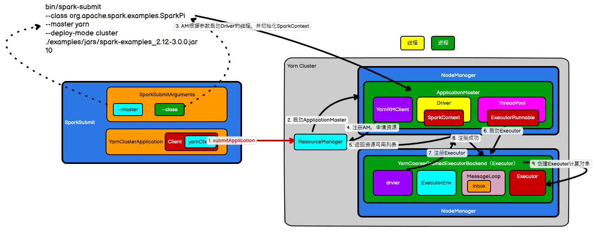
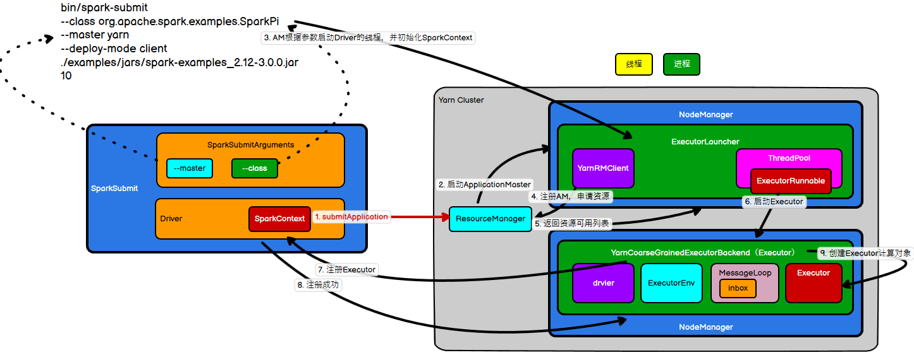

# 环境准备(Yarn集群)

Driver,Executor



## 向Yarnr提交应用

首先根据上图的启动命令`bin/spark-submit`,进入Spark的`bin`目录使用编辑器打开`spark-submit.cmd`(作者这里使用的win系统),看到如下命令

```sh
cmd /V /E /C ""%~dp0spark-submit2.cmd" %*"
```

继续打开当前目录下的`spark-submit2.cmd`

```sh
set CLASS=org.apache.spark.deploy.SparkSubmit
"%~dp0spark-class2.cmd" %CLASS% %*
```

继续打开`spark-class2.cmd`,注意这里的`SPARK_CMD`的启动命令

```
del %LAUNCHER_OUTPUT%
%SPARK_CMD%
```

在前面加一行打印命令`echo %SPARK_CMD%`

```
del %LAUNCHER_OUTPUT%
echo %SPARK_CMD%
%SPARK_CMD%
```

执行下面的命令

```sh
JWxDragon@DESKTOP-3FPJMGH E:\Program Files\spark-3.5.1-bin-hadoop3\bin
# spark-submit --class org.apache.spark.examples.SparkPi --master local[2] ../examples/jars/spark-examples_2.12-3.5.1.jar 10
"E:\Program Files\OpenJDK\jdk8u352-b08\\bin\java" -cp "E:\Program Files\spark-3.5.1-bin-hadoop3\bin\..\conf\;E:\Program Files\spark-3.5.1-bin-hadoop3\bin\..\jars\*" -Xmx1g -XX:+IgnoreUnrecognizedVMOptions "--add-opens=java.base/java.lang=ALL-UNNAMED" "--add-opens=java.base/java.lang.invoke=ALL-UNNAMED" "--add-opens=java.base/java.lang.reflect=ALL-UNNAMED" "--add-opens=java.base/java.io=ALL-UNNAMED" "--add-opens=java.base/java.net=ALL-UNNAMED" "--add-opens=java.base/java.nio=ALL-UNNAMED" "--add-opens=java.base/java.util=ALL-UNNAMED" "--add-opens=java.base/java.util.concurrent=ALL-UNNAMED" "--add-opens=java.base/java.util.concurrent.atomic=ALL-UNNAMED" "--add-opens=java.base/jdk.internal.ref=ALL-UNNAMED" "--add-opens=java.base/sun.nio.ch=ALL-UNNAMED" "--add-opens=java.base/sun.nio.cs=ALL-UNNAMED" "--add-opens=java.base/sun.security.action=ALL-UNNAMED" "--add-opens=java.base/sun.util.calendar=ALL-UNNAMED" "--add-opens=java.security.jgss/sun.security.krb5=ALL-UNNAMED" "-Djdk.reflect.useDirectMethodHandle=false" org.apache.spark.deploy.SparkSubmit --master local[2] --class org.apache.spark.examples.SparkPi ../examples/jars/spark-examples_2.12-3.5.1.jar 10
```

注意这里的`org.apache.spark.deploy.SparkSubmit`的提交类就是要找的目标,在IDEA编辑器里`crtl+shift+t`全局搜索`SparkSubmit`其伴生对象,进入其main()方法,如下

`SparkSubmit.scala`

```scala
object SparkSubmit extends CommandLineUtils with Logging {

    ......
    
    override def main(args: Array[String]): Unit = {
        Option(System.getenv("SPARK_PREFER_IPV6"))
        .foreach(System.setProperty("java.net.preferIPv6Addresses", _))
        val submit = new SparkSubmit() {
            self =>

            override protected def parseArguments(args: Array[String]): SparkSubmitArguments = {
                new SparkSubmitArguments(args) {
                    override protected def logInfo(msg: => String): Unit = self.logInfo(msg)

                    override protected def logWarning(msg: => String): Unit = self.logWarning(msg)

                    override protected def logError(msg: => String): Unit = self.logError(msg)
                }
            }

            override protected def logInfo(msg: => String): Unit = printMessage(msg)

            override protected def logWarning(msg: => String): Unit = printMessage(s"Warning: $msg")

            override protected def logError(msg: => String): Unit = printMessage(s"Error: $msg")

            override def doSubmit(args: Array[String]): Unit = {
                try {
                    super.doSubmit(args)
                } catch {
                    case e: SparkUserAppException =>
                    exitFn(e.exitCode)
                }
            }

        }

        // args参数是执行命令后面 -- 的所有参数
        // 点击进入,如下
        submit.doSubmit(args)
    }
    
    def doSubmit(args: Array[String]): Unit = {
        // Initialize logging if it hasn't been done yet. Keep track of whether logging needs to
        // be reset before the application starts.
        val uninitLog = initializeLogIfNecessary(true, silent = true)

        // 解析命令参数 ,点击进入,如下
        val appArgs = parseArguments(args)
        if (appArgs.verbose) {
            logInfo(appArgs.toString)
        }
        // 匹配命令参数的动作
        appArgs.action match {
            // 点击submit,进入如下
            case SparkSubmitAction.SUBMIT => submit(appArgs, uninitLog)
            case SparkSubmitAction.KILL => kill(appArgs)
            case SparkSubmitAction.REQUEST_STATUS => requestStatus(appArgs)
            case SparkSubmitAction.PRINT_VERSION => printVersion()
        }
    }
    
    protected def parseArguments(args: Array[String]): SparkSubmitArguments = {
        // 点击进入,如下
        new SparkSubmitArguments(args)
    }
    
    private def submit(args: SparkSubmitArguments, uninitLog: Boolean): Unit = {

        // 先声明一个方法,这里先不调用
        def doRunMain(): Unit = {
            // 判断当前命令行参数是否有传这个,当然是没有传,直接跳过
            if (args.proxyUser != null) {
              ......
            } else {
                // 直接进入这里,点击进入,如下
                runMain(args, uninitLog)
            }
        }

        // In standalone cluster mode, there are two submission gateways:
        //   (1) The traditional RPC gateway using o.a.s.deploy.Client as a wrapper
        //   (2) The new REST-based gateway introduced in Spark 1.3
        // The latter is the default behavior as of Spark 1.3, but Spark submit will fail over
        // to use the legacy gateway if the master endpoint turns out to be not a REST server.
        //判断当前是否Standalone集群(当前环境下是YARN集群),所以这里肯定为false
        if (args.isStandaloneCluster && args.useRest) {
          ......
        } else {
            // 进入这里,这方法就是上面声明的方法
            doRunMain()
        }
    }
    
    private def runMain(args: SparkSubmitArguments, uninitLog: Boolean): Unit = {
        // 注意:这里是重点,准备提交环境,使用了模式匹配,重点看childMainClass是什么?
        // 点击进入,如下
        val (childArgs, childClasspath, sparkConf, childMainClass) = prepareSubmitEnvironment(args)
        // Let the main class re-initialize the logging system once it starts.
        if (uninitLog) {
            Logging.uninitialize()
        }

        if (args.verbose) {
            logInfo(s"Main class:\n$childMainClass")
            logInfo(s"Arguments:\n${childArgs.mkString("\n")}")
            // sysProps may contain sensitive information, so redact before printing
            logInfo(s"Spark config:\n${Utils.redact(sparkConf.getAll.toMap).sorted.mkString("\n")}")
            logInfo(s"Classpath elements:\n${childClasspath.mkString("\n")}")
            logInfo("\n")
        }
        assert(!(args.deployMode == "cluster" && args.proxyUser != null && childClasspath.nonEmpty) ||
               sparkConf.get(ALLOW_CUSTOM_CLASSPATH_BY_PROXY_USER_IN_CLUSTER_MODE),
               s"Classpath of spark-submit should not change in cluster mode if proxy user is specified " +
               s"when ${ALLOW_CUSTOM_CLASSPATH_BY_PROXY_USER_IN_CLUSTER_MODE.key} is disabled")
        // 获取类加载器
        val loader = getSubmitClassLoader(sparkConf)
        for (jar <- childClasspath) {
            addJarToClasspath(jar, loader)
        }

        var mainClass: Class[_] = null

        try {
            // 根据累名称获取类信息(说明白就是使用反射)
            mainClass = Utils.classForName(childMainClass)
        } catch {
            case e: ClassNotFoundException =>
            logError(s"Failed to load class $childMainClass.")
            if (childMainClass.contains("thriftserver")) {
                logInfo(s"Failed to load main class $childMainClass.")
                logInfo("You need to build Spark with -Phive and -Phive-thriftserver.")
            } else if (childMainClass.contains("org.apache.spark.sql.connect")) {
                logInfo(s"Failed to load main class $childMainClass.")
                // TODO(SPARK-42375): Should point out the user-facing page here instead.
                logInfo("You need to specify Spark Connect jars with --jars or --packages.")
            }
            throw new SparkUserAppException(CLASS_NOT_FOUND_EXIT_STATUS)
            case e: NoClassDefFoundError =>
            logError(s"Failed to load $childMainClass: ${e.getMessage()}")
            if (e.getMessage.contains("org/apache/hadoop/hive")) {
                logInfo(s"Failed to load hive class.")
                logInfo("You need to build Spark with -Phive and -Phive-thriftserver.")
            }
            throw new SparkUserAppException(CLASS_NOT_FOUND_EXIT_STATUS)
        }

        // 判断 类是否继承了SparkApplication,因此重点childMainClass究竟是什么?
        val app: SparkApplication = if (classOf[SparkApplication].isAssignableFrom(mainClass)) {
            // 使用反射直接初始化该类进行转化
            mainClass.getConstructor().newInstance().asInstanceOf[SparkApplication]
        } else {
            // 使用Java类来实始化
            new JavaMainApplication(mainClass)
        }

        @tailrec
        def findCause(t: Throwable): Throwable = t match {
            case e: UndeclaredThrowableException =>
            if (e.getCause() != null) findCause(e.getCause()) else e
            case e: InvocationTargetException =>
            if (e.getCause() != null) findCause(e.getCause()) else e
            case e: Throwable =>
            e
        }

        try {
            app.start(childArgs.toArray, sparkConf)
        } catch {
            case t: Throwable =>
            throw findCause(t)
        } finally {
            if (args.master.startsWith("k8s") && !isShell(args.primaryResource) &&
                !isSqlShell(args.mainClass) && !isThriftServer(args.mainClass) &&
                !isConnectServer(args.mainClass)) {
                try {
                    SparkContext.getActive.foreach(_.stop())
                } catch {
                    case e: Throwable => logError(s"Failed to close SparkContext: $e")
                }
            }
        }
    }
    
    private[deploy] def prepareSubmitEnvironment(
        args: SparkSubmitArguments,
        conf: Option[HadoopConfiguration] = None)
    : (Seq[String], Seq[String], SparkConf, String) = {

        ......
        var childMainClass = ""
        ......

        // 判断当前是否YARN集群环境,就是找这里
        if (isYarnCluster) {
            // 这就是一直在找的值,点击进入,如下
            childMainClass = YARN_CLUSTER_SUBMIT_CLASS
            if (args.isPython) {
                childArgs += ("--primary-py-file", args.primaryResource)
                childArgs += ("--class", "org.apache.spark.deploy.PythonRunner")
            } else if (args.isR) {
                val mainFile = new Path(args.primaryResource).getName
                childArgs += ("--primary-r-file", mainFile)
                childArgs += ("--class", "org.apache.spark.deploy.RRunner")
            } else {
                if (args.primaryResource != SparkLauncher.NO_RESOURCE) {
                    childArgs += ("--jar", args.primaryResource)
                }
                childArgs += ("--class", args.mainClass)
            }
            if (args.childArgs != null) {
                args.childArgs.foreach { arg => childArgs += ("--arg", arg) }
            }
        }

        ......

        (childArgs.toSeq, childClasspath.toSeq, sparkConf, childMainClass)

    }

    // 重点就是这个YarnClusterApplication,下一节继续讲解
    private[deploy] val YARN_CLUSTER_SUBMIT_CLASS =
    "org.apache.spark.deploy.yarn.YarnClusterApplication"
    
    
     ......
}
```

`SparkSubmitArguments.scala`

```scala
private[deploy] class SparkSubmitArguments(args: Seq[String], env: Map[String, String] = sys.env)
  extends SparkSubmitArgumentsParser with Logging {
      
      ......
      
      // 注意 这里的action为null值,那上面的匹配命令是如何成功呢?
      // 直接在当前页面搜索action,查找到方法 action = Option(action).getOrElse(SUBMIT)
      // 重点就是如果当前action没有值时,会默认赋值为SUBMIT,因此上面匹配动作就可以提交了
      var action: SparkSubmitAction = null
      
      // 命令行参数解析成java,点击进入,如下
       parse(args.asJava)
      
      override protected def handle(opt: String, value: String): Boolean = {
          opt match {
              case NAME =>
              name = value

              // 是否感觉有点眼熟,点击进入,如下(发现这就是上面命令行参数的 --master)
              case MASTER =>
              maybeMaster = Option(value)

              case REMOTE =>
              maybeRemote = Option(value)

              // 如上同理
              case CLASS =>
              mainClass = value

              case DEPLOY_MODE =>
              if (value != "client" && value != "cluster") {
                  error("--deploy-mode must be either \"client\" or \"cluster\"")
              }
              deployMode = value

				......
      }
      ......
          
  }
```

`SparkSubmitOptionParser.java`

```java
class SparkSubmitOptionParser {
    
    ......
        
    protected final String CLASS = "--class";
    protected final String MASTER = "--master";

    protected final void parse(List<String> args) {
        // 使用正则匹配获取参数
        Pattern eqSeparatedOpt = Pattern.compile("(--[^=]+)=(.+)");

        int idx = 0;
        for (idx = 0; idx < args.size(); idx++) {
            String arg = args.get(idx);
            String value = null;

            Matcher m = eqSeparatedOpt.matcher(arg);
            if (m.matches()) {
                 // 参数name
                arg = m.group(1);
                 // 参数 value
                value = m.group(2);
            }

            // Look for options with a value.
            String name = findCliOption(arg, opts);
            if (name != null) {
                if (value == null) {
                    if (idx == args.size() - 1) {
                        throw new IllegalArgumentException(
                            String.format("Missing argument for option '%s'.", arg));
                    }
                    idx++;
                    value = args.get(idx);
                }
                // 点击进入handle 处理命令行参数 ,如下
                if (!handle(name, value)) {
                    break;
                }
                continue;
            }

            // Look for a switch.
            name = findCliOption(arg, switches);
            if (name != null) {
                if (!handle(name, null)) {
                    break;
                }
                continue;
            }

            if (!handleUnknown(arg)) {
                break;
            }
        }

        if (idx < args.size()) {
            idx++;
        }
        handleExtraArgs(args.subList(idx, args.size()));
    }
 
    // 抽像方法,crtl + t搜索其实现 SparkSubmitArguments.handle(),返回如上
    protected boolean handle(String opt, String value) {
        throw new UnsupportedOperationException();
    }
    ......
}
```

## 启动 ApplicationMaster

在上一节中的`org.apache.spark.deploy.yarn.YarnClusterApplication`在原有的项目中是没有源码,需要引入如下依赖

```xml
<dependency>
    <groupId>org.apache.spark</groupId>
    <artifactId>spark-yarn_2.13</artifactId>
    <version>3.5.1</version>
</dependency>
```

`crtl+shift+t`全局搜索`YarnClusterApplication`,如下

`Client.scala`

> 之前上面`mainClass.getConstructor().newInstance().asInstanceOf[SparkApplication]`使用反射创建的方法就是如下,然后`app.start(childArgs.toArray, sparkConf)`调的就是如下

```scala
private[spark] class Client(
    val args: ClientArguments,
    val sparkConf: SparkConf,
    val rpcEnv: RpcEnv)
extends Logging {
    
    ......

    // 重点是这里,点击进入,如下2
    private val yarnClient = YarnClient.createYarnClient
    .....

    private[spark] class YarnClusterApplication extends SparkApplication {

        override def start(args: Array[String], conf: SparkConf): Unit = {
            // SparkSubmit would use yarn cache to distribute files & jars in yarn mode,
            // so remove them from sparkConf here for yarn mode.
            conf.remove(JARS)
            conf.remove(FILES)
            conf.remove(ARCHIVES)

            // 点击ClientArguments进入,如下1
            // 点击Client进入,如上yarnClient
            // 点击run,进入如下
            new Client(new ClientArguments(args), conf, null).run()
        }

    }
    
    def run(): Unit = {
        // 提交应用程序 ,点击进入,如下
        submitApplication()
        // 下面这里的执行状态和报告 与所需要的提交关系不大
        if (!launcherBackend.isConnected() && fireAndForget) {
         	......
        } else {
         	......
        }
    }
    
    def submitApplication(): Unit = {
        ResourceRequestHelper.validateResources(sparkConf)

        try {
            launcherBackend.connect()
            yarnClient.init(hadoopConf)
            // 启动yarn客户端
            yarnClient.start()

            if (log.isDebugEnabled) {
                logDebug("Requesting a new application from cluster with %d NodeManagers"
                         .format(yarnClient.getYarnClusterMetrics.getNumNodeManagers))
            }

            // Get a new application from our RM
            // 创建应用
            val newApp = yarnClient.createApplication()
            // 获取其响应信息
            val newAppResponse = newApp.getNewApplicationResponse()
            // 注意这个appId,就是全局YARN的ID,
            this.appId = newAppResponse.getApplicationId()

            // The app staging dir based on the STAGING_DIR configuration if configured
            // otherwise based on the users home directory.
            // scalastyle:off FileSystemGet
            val appStagingBaseDir = sparkConf.get(STAGING_DIR)
            .map { new Path(_, UserGroupInformation.getCurrentUser.getShortUserName) }
            .getOrElse(FileSystem.get(hadoopConf).getHomeDirectory())
            stagingDirPath = new Path(appStagingBaseDir, getAppStagingDir(appId))
            // scalastyle:on FileSystemGet

            new CallerContext("CLIENT", sparkConf.get(APP_CALLER_CONTEXT),
                              Option(appId.toString)).setCurrentContext()

            // Verify whether the cluster has enough resources for our AM
            verifyClusterResources(newAppResponse)

            // Set up the appropriate contexts to launch our AM
            // 创建容器的启动环境 ,点击进入,如下 
            val containerContext = createContainerLaunchContext()
            // 创建提交环境,可以点击进入看下
            val appContext = createApplicationSubmissionContext(newApp, containerContext)

            // Finally, submit and monitor the application
            logInfo(s"Submitting application $appId to ResourceManager")
            // 与YARN建立连接提交
            yarnClient.submitApplication(appContext)
            launcherBackend.setAppId(appId.toString)
            reportLauncherState(SparkAppHandle.State.SUBMITTED)
        } catch {
            case e: Throwable =>
            if (stagingDirPath != null) {
                cleanupStagingDir()
            }
            throw e
        }
    }
    
    private def createContainerLaunchContext(): ContainerLaunchContext = {
        logInfo("Setting up container launch context for our AM")
        val pySparkArchives =
        if (sparkConf.get(IS_PYTHON_APP)) {
            findPySparkArchives()
        } else {
            Nil
        }

        val launchEnv = setupLaunchEnv(stagingDirPath, pySparkArchives)
        val localResources = prepareLocalResources(stagingDirPath, pySparkArchives)

        val amContainer = Records.newRecord(classOf[ContainerLaunchContext])
        amContainer.setLocalResources(localResources.asJava)
        amContainer.setEnvironment(launchEnv.asJava)

        val javaOpts = ListBuffer[String]()

        javaOpts += s"-Djava.net.preferIPv6Addresses=${Utils.preferIPv6}"

		......
        // 判断是否集群模式, 当前当然是,注意这里的org.apache.spark.deploy.yarn.ApplicationMaster
        // 在下一节继续讲解ApplicationMaster
        val amClass =
        if (isClusterMode) {
            Utils.classForName("org.apache.spark.deploy.yarn.ApplicationMaster").getName
        } else {
            Utils.classForName("org.apache.spark.deploy.yarn.ExecutorLauncher").getName
        }
        if (args.primaryRFile != null &&
            (args.primaryRFile.endsWith(".R") || args.primaryRFile.endsWith(".r"))) {
            args.userArgs = ArrayBuffer(args.primaryRFile) ++ args.userArgs
        }
        val userArgs = args.userArgs.flatMap { arg =>
            Seq("--arg", YarnSparkHadoopUtil.escapeForShell(arg))
        }
        val amArgs =
        Seq(amClass) ++ userClass ++ userJar ++ primaryPyFile ++ primaryRFile ++ userArgs ++
        Seq("--properties-file",
            buildPath(Environment.PWD.$$(), LOCALIZED_CONF_DIR, SPARK_CONF_FILE)) ++
        Seq("--dist-cache-conf",
            buildPath(Environment.PWD.$$(), LOCALIZED_CONF_DIR, DIST_CACHE_CONF_FILE))

        // Command for the ApplicationMaster
        val commands = prefixEnv ++
        // 这时是启动Java + 启动参数 + org.apache.spark.deploy.yarn.ApplicationMaster
        Seq(Environment.JAVA_HOME.$$() + "/bin/java", "-server") ++
        javaOpts ++ amArgs ++
        Seq(
            "1>", ApplicationConstants.LOG_DIR_EXPANSION_VAR + "/stdout",
            "2>", ApplicationConstants.LOG_DIR_EXPANSION_VAR + "/stderr")

        // TODO: it would be nicer to just make sure there are no null commands here
        val printableCommands = commands.map(s => if (s == null) "null" else s).toList
        amContainer.setCommands(printableCommands.asJava)

		......

        // send the acl settings into YARN to control who has access via YARN interfaces
        val securityManager = new SecurityManager(sparkConf)
        amContainer.setApplicationACLs(
            YarnSparkHadoopUtil.getApplicationAclsForYarn(securityManager).asJava)
        setupSecurityToken(amContainer)
        setTokenConf(amContainer)
        // 返回容器
        amContainer
    }
```

1. `ClientArguments.scala`

   ```scala
   private[spark] class ClientArguments(args: Array[String]) extends Logging {
   
       	......
       // 解析参数,如下 
       parseArgs(args.toList)
   
       private def parseArgs(inputArgs: List[String]): Unit = {
           var args = inputArgs
   
           while (!args.isEmpty) {
               args match {
                   case ("--jar") :: value :: tail =>
                   userJar = value
                   args = tail
   
                   case ("--class") :: value :: tail =>
                   userClass = value
                   args = tail
   
                   case ("--primary-py-file") :: value :: tail =>
                   primaryPyFile = value
                   args = tail
   
                   case ("--primary-r-file") :: value :: tail =>
                   primaryRFile = value
                   args = tail
   
                   case ("--arg") :: value :: tail =>
                   userArgs += value
                   args = tail
   
                   case ("--verbose" | "-v") :: tail =>
                   verbose = true
                   args = tail
   
                   case Nil =>
   
                   case _ =>
                   throw new IllegalArgumentException(getUsageMessage(args))
               }
           }
   
           if (primaryPyFile != null && primaryRFile != null) {
               throw new IllegalArgumentException("Cannot have primary-py-file and primary-r-file" +
                                                  " at the same time")
           }
   
           if (verbose) {
               logInfo(s"Parsed user args for YARN application: [${userArgs.mkString(" ")}]")
           }
       }
       ......
   }
   ```

2. `YarnClient.java`

   > > 这里必须引入其指定版本的`Hadoop-client`,否则无法匹配到源码
   > >
   > > ```xml
   > > <dependency>
   > >     <groupId>org.apache.hadoop</groupId>
   > >     <artifactId>hadoop-client</artifactId>
   > >     <version>3.3.6</version>
   > > </dependency>
   > > ```

   ```java
   public abstract class YarnClient extends AbstractService {
    
       @Public
       public static YarnClient createYarnClient() {
           // 点击进入,如下 
           YarnClient client = new YarnClientImpl();
           return client;
       }
       .....
   }
   ```

   `YarnClientImpl.java`

   ```java
   public class YarnClientImpl extends YarnClient {
       ......
       // 这个rm 就是 resource manage,Yarn的调度节点
       protected ApplicationClientProtocol rmClient;
       
       public YarnClientImpl() {
           super(YarnClientImpl.class.getName());
       }
        ......
   }
   ```

## 启动Driver线程

上面启动参数`org.apache.spark.deploy.yarn.ApplicationMaster`创建了一个线程,线程当然有启动main,全局搜索`ApplicationMaster`,进入如下

`ApplicationMaster.scala`

```scala
private[spark] class ApplicationMaster(
    args: ApplicationMasterArguments,
    sparkConf: SparkConf,
    yarnConf: YarnConfiguration) extends Logging {
    ......
    
    // 点击进入,如下
    private val client = new YarnRMClient()
    ......
    
    
    
    object ApplicationMaster extends Logging {
        
        ......
     
        def main(args: Array[String]): Unit = {
            SignalUtils.registerLogger(log)
            // 把命令行参数进行封装,点击进入,如下 1
            val amArgs = new ApplicationMasterArguments(args)
            val sparkConf = new SparkConf()
            if (amArgs.propertiesFile != null) {
                Utils.getPropertiesFromFile(amArgs.propertiesFile).foreach { case (k, v) =>
                    sparkConf.set(k, v)
                }
            }
            // Set system properties for each config entry. This covers two use cases:
            // - The default configuration stored by the SparkHadoopUtil class
            // - The user application creating a new SparkConf in cluster mode
            //
            // Both cases create a new SparkConf object which reads these configs from system properties.
            sparkConf.getAll.foreach { case (k, v) =>
                sys.props(k) = v
            }

            val yarnConf = new YarnConfiguration(SparkHadoopUtil.newConfiguration(sparkConf))
            // 点击进入,如上,关注点在YarnRMClient, 
            master = new ApplicationMaster(amArgs, sparkConf, yarnConf)

			......

            ugi.doAs(new PrivilegedExceptionAction[Unit]() {
                // 点击进入run,如下
                override def run(): Unit = System.exit(master.run())
            })
        }
        ......
    }
    
    final def run(): Int = {
        try {
            val attemptID = if (isClusterMode) {
				......
            } else {
                None
            }
			......

            // 判断当前是否集群模式 ,当然是
            if (isClusterMode) {
                // 点击进入,如下
                runDriver()
            } else {
                runExecutorLauncher()
            }
        } catch {
            case e: Exception =>
            // catch everything else if not specifically handled
            logError("Uncaught exception: ", e)
            finish(FinalApplicationStatus.FAILED,
                   ApplicationMaster.EXIT_UNCAUGHT_EXCEPTION,
                   "Uncaught exception: " + StringUtils.stringifyException(e))
        } finally {
            try {
                metricsSystem.foreach { ms =>
                    ms.report()
                    ms.stop()
                }
            } catch {
                case e: Exception =>
                logWarning("Exception during stopping of the metric system: ", e)
            }
        }

        exitCode
    }
    
    private def runDriver(): Unit = {
        addAmIpFilter(None, System.getenv(ApplicationConstants.APPLICATION_WEB_PROXY_BASE_ENV))
        // 启动用户的应用程序 ,点击进入,如下 
        userClassThread = startUserApplication()

        // This a bit hacky, but we need to wait until the spark.driver.port property has
        // been set by the Thread executing the user class.
        logInfo("Waiting for spark context initialization...")
        val totalWaitTime = sparkConf.get(AM_MAX_WAIT_TIME)
        try {
            // 使用线程工具进行阻塞等待上下文环境对象,这个环境对象就是userClassThread里准备的
            // 如果没有返回就无法再进去往下走
            val sc = ThreadUtils.awaitResult(sparkContextPromise.future,
                                             Duration(totalWaitTime, TimeUnit.MILLISECONDS))
            if (sc != null) {
                val rpcEnv = sc.env.rpcEnv

                val userConf = sc.getConf
                val host = userConf.get(DRIVER_HOST_ADDRESS)
                val port = userConf.get(DRIVER_PORT)
                registerAM(host, port, userConf, sc.ui.map(_.webUrl), appAttemptId)

                val driverRef = rpcEnv.setupEndpointRef(
                    RpcAddress(host, port),
                    YarnSchedulerBackend.ENDPOINT_NAME)
                createAllocator(driverRef, userConf, rpcEnv, appAttemptId, distCacheConf)
            } else {
                // Sanity check; should never happen in normal operation, since sc should only be null
                // if the user app did not create a SparkContext.
                throw new IllegalStateException("User did not initialize spark context!")
            }
            // 继续执行Driver,这里就是继续执行 WordCount ,进入 WordCount,点击SparkContext,如下3
            // 回到这里,点击进入
            resumeDriver()
            userClassThread.join()
        } catch {
            case e: SparkException if e.getCause().isInstanceOf[TimeoutException] =>
            logError(
                s"SparkContext did not initialize after waiting for $totalWaitTime ms. " +
                "Please check earlier log output for errors. Failing the application.")
            finish(FinalApplicationStatus.FAILED,
                   ApplicationMaster.EXIT_SC_NOT_INITED,
                   "Timed out waiting for SparkContext.")
        } finally {
            resumeDriver()
        }
    }
    
    private def resumeDriver(): Unit = {
        // When initialization in runDriver happened the user class thread has to be resumed.
        sparkContextPromise.synchronized {
            // 线程通知 ,使其Driver线程可往下走,然后WordCount 初始化完SparkContext后的程序可以继续往下走
            sparkContextPromise.notify()
        }
    }

    private def startUserApplication(): Thread = {
        logInfo("Starting the user application in a separate Thread")

        var userArgs = args.userArgs
        if (args.primaryPyFile != null && args.primaryPyFile.endsWith(".py")) {
            // When running pyspark, the app is run using PythonRunner. The second argument is the list
            // of files to add to PYTHONPATH, which Client.scala already handles, so it's empty.
            userArgs = Seq(args.primaryPyFile, "") ++ userArgs
        }
        if (args.primaryRFile != null &&
            (args.primaryRFile.endsWith(".R") || args.primaryRFile.endsWith(".r"))) {
            // TODO(davies): add R dependencies here
        }
		// 使用了类加载器 ,加载userClass ,可以点击进入查看
        // 其是 --class 的参数,并且获取指定的main方法
        val mainMethod = userClassLoader.loadClass(args.userClass)
        .getMethod("main", classOf[Array[String]])

        val userThread = new Thread {
            // 线程run方法
            override def run(): Unit = {
                try {
                    // 判断方法是否静态,如果是直接报异常
                    if (!Modifier.isStatic(mainMethod.getModifiers)) {
                        logError(s"Could not find static main method in object ${args.userClass}")
                        finish(FinalApplicationStatus.FAILED, ApplicationMaster.EXIT_EXCEPTION_USER_CLASS)
                    } else {
                        // 否则使用反射调用,等同于这里调用了WordCount 的main方法
                        mainMethod.invoke(null, userArgs.toArray)
                        finish(FinalApplicationStatus.SUCCEEDED, ApplicationMaster.EXIT_SUCCESS)
                        logDebug("Done running user class")
                    }
                } catch {
                    case e: InvocationTargetException =>
                    e.getCause match {
                        case _: InterruptedException =>
                        // Reporter thread can interrupt to stop user class
                        case SparkUserAppException(exitCode) =>
                        val msg = s"User application exited with status $exitCode"
                        logError(msg)
                        finish(FinalApplicationStatus.FAILED, exitCode, msg)
                        case cause: Throwable =>
                        logError("User class threw exception: ", cause)
                        finish(FinalApplicationStatus.FAILED,
                               ApplicationMaster.EXIT_EXCEPTION_USER_CLASS,
                               "User class threw exception: " + StringUtils.stringifyException(cause))
                    }
                    sparkContextPromise.tryFailure(e.getCause())
                } finally {
                    // Notify the thread waiting for the SparkContext, in case the application did not
                    // instantiate one. This will do nothing when the user code instantiates a SparkContext
                    // (with the correct master), or when the user code throws an exception (due to the
                    // tryFailure above).
                    sparkContextPromise.trySuccess(null)
                }
            }
        }
        userThread.setContextClassLoader(userClassLoader)
        // 线程名为Driver
        userThread.setName("Driver")
        // 启动线程
        userThread.start()
        userThread
    }
    
    ......

}
```

1. `ApplicationMasterArguments.scala`

   ```scala
   class ApplicationMasterArguments(val args: Array[String]) {
   
       ......
       // 解析参数,如下
       parseArgs(args.toList)
       
       private def parseArgs(inputArgs: List[String]): Unit = {
           val userArgsBuffer = new ArrayBuffer[String]()
   
           var args = inputArgs
   
           while (!args.isEmpty) {
               // --num-workers, --worker-memory, and --worker-cores are deprecated since 1.0,
               // the properties with executor in their names are preferred.
               args match {
                   case ("--jar") :: value :: tail =>
                   userJar = value
                   args = tail
   
                   case ("--class") :: value :: tail =>
                   userClass = value
                   args = tail
   
                   case ("--primary-py-file") :: value :: tail =>
                   primaryPyFile = value
                   args = tail
   
                   case ("--primary-r-file") :: value :: tail =>
                   primaryRFile = value
                   args = tail
   
                   case ("--arg") :: value :: tail =>
                   userArgsBuffer += value
                   args = tail
   
                   case ("--properties-file") :: value :: tail =>
                   propertiesFile = value
                   args = tail
   
                   case ("--dist-cache-conf") :: value :: tail =>
                   distCacheConf = value
                   args = tail
   
                   case _ =>
                   printUsageAndExit(1, args)
               }
           }
   
           if (primaryPyFile != null && primaryRFile != null) {
               // scalastyle:off println
               System.err.println("Cannot have primary-py-file and primary-r-file at the same time")
               // scalastyle:on println
               System.exit(-1)
           }
   
           userArgs = userArgsBuffer.toList
       }
   
       
       ......
   
   }
   ```

2. `YarnRMClient`

   ```scala
   private[spark] class YarnRMClient extends Logging {
   
       // AM = ApplicationMaster RM = Resource Manage
       private var amClient: AMRMClient[ContainerRequest] = _
   	......
   
   }
   ```

3. `SparkContext.scala`

   ```scala
   class SparkContext(config: SparkConf) extends Logging {
   
       ......
       // 构造器方法 的 694行,如下方法
       try{
           // 告诉准备工作已经准备好了,点击进入,如下 
            _taskScheduler.postStartHook()
       }
      
       ......
   }
   ```

   `TaskScheduler.scala`

   ```scala
   private[spark] trait TaskScheduler {
   
   	......
       // 其是一个抽象方法,在上面trait 按F4搜索 看到 YarnClusterScheduler,如下
   	def postStartHook(): Unit = { }
   	......
   }
   ```

   `YarnClusterScheduler.scala`

   ```scala
   private[spark] class YarnClusterScheduler(sc: SparkContext) extends YarnScheduler(sc) {
   
     logInfo("Created YarnClusterScheduler")
   
     override def postStartHook(): Unit = {
         // 环境初始化完成 ,这一步可以 ApplicationMaster.runDriver()的线程阻塞方法继续执行下去
       ApplicationMaster.sparkContextInitialized(sc)
         // 点击进入,如下
       super.postStartHook()
       logInfo("YarnClusterScheduler.postStartHook done")
     }
   
   }
   ```

   `TaskSchedulerImpl.scala`

   ```scala
     private[spark] class TaskSchedulerImpl(
       val sc: SparkContext,
       val maxTaskFailures: Int,
       isLocal: Boolean = false,
       clock: Clock = new SystemClock)
     extends TaskScheduler with Logging {
         
         ......
         
         override def postStartHook(): Unit = {
             // 继续点击,如下
             waitBackendReady()
         }
         
         private def waitBackendReady(): Unit = {
             if (backend.isReady) {
                 return
             }
             // 循环等待状态,使程序继续往下去,需要唤醒,其唤醒在看回ApplicationMaster.runDriver()的 resumeDriver()
             while (!backend.isReady) {
                 // Might take a while for backend to be ready if it is waiting on resources.
                 if (sc.stopped.get) {
                     // For example: the master removes the application for some reason
                     throw new IllegalStateException("Spark context stopped while waiting for backend")
                 }
                 synchronized {
                     this.wait(100)
                 }
             }
         }
         
          ......
         
     }
   ```

   

## 启动Executor进程

上一节介绍到`Driver`线程启动成功,现在接着往下走

`ApplicationMaster`

```scala
private[spark] class ApplicationMaster(
    args: ApplicationMasterArguments,
    sparkConf: SparkConf,
    yarnConf: YarnConfiguration) extends Logging {
    
    ......

    private def runDriver(): Unit = {
        addAmIpFilter(None, System.getenv(ApplicationConstants.APPLICATION_WEB_PROXY_BASE_ENV))
        // 启动用户的应用程序 ,点击进入,如下 
        userClassThread = startUserApplication()

        // This a bit hacky, but we need to wait until the spark.driver.port property has
        // been set by the Thread executing the user class.
        logInfo("Waiting for spark context initialization...")
        val totalWaitTime = sparkConf.get(AM_MAX_WAIT_TIME)
        try {
            // 使用线程工具进行阻塞等待上下文环境对象,这个环境对象就是userClassThread里准备的
            // 如果没有就无法再进去往下走(上一节介绍到这 Driver线程启动成功可以继续往下走)
            val sc = ThreadUtils.awaitResult(sparkContextPromise.future,
                                             Duration(totalWaitTime, TimeUnit.MILLISECONDS))
            // 判断上下文环境不为空
            if (sc != null) {
                // rpcEnv 通信环境
                val rpcEnv = sc.env.rpcEnv

                val userConf = sc.getConf
                val host = userConf.get(DRIVER_HOST_ADDRESS)
                val port = userConf.get(DRIVER_PORT)
                // 注册AM,申请资源
                registerAM(host, port, userConf, sc.ui.map(_.webUrl), appAttemptId)

                val driverRef = rpcEnv.setupEndpointRef(
                    RpcAddress(host, port),
                    YarnSchedulerBackend.ENDPOINT_NAME)
                // 点击进入,如下
                createAllocator(driverRef, userConf, rpcEnv, appAttemptId, distCacheConf)
            } else {
                // Sanity check; should never happen in normal operation, since sc should only be null
                // if the user app did not create a SparkContext.
                throw new IllegalStateException("User did not initialize spark context!")
            }
            resumeDriver()
            userClassThread.join()
        } catch {
            case e: SparkException if e.getCause().isInstanceOf[TimeoutException] =>
            logError(
                s"SparkContext did not initialize after waiting for $totalWaitTime ms. " +
                "Please check earlier log output for errors. Failing the application.")
            finish(FinalApplicationStatus.FAILED,
                   ApplicationMaster.EXIT_SC_NOT_INITED,
                   "Timed out waiting for SparkContext.")
        } finally {
            resumeDriver()
        }
    }
    
    private def createAllocator(
        driverRef: RpcEndpointRef,
        _sparkConf: SparkConf,
        rpcEnv: RpcEnv,
        appAttemptId: ApplicationAttemptId,
        distCacheConf: SparkConf): Unit = {
		......

        // 创建分配器,通过YARN获取
        allocator = client.createAllocator(
            yarnConf,
            _sparkConf,
            appAttemptId,
            driverUrl,
            driverRef,
            securityMgr,
            localResources)

        // Initialize the AM endpoint *after* the allocator has been initialized. This ensures
        // that when the driver sends an initial executor request (e.g. after an AM restart),
        // the allocator is ready to service requests.
        rpcEnv.setupEndpoint("YarnAM", new AMEndpoint(rpcEnv, driverRef))
        if (_sparkConf.get(SHUFFLE_SERVICE_ENABLED)) {
            logInfo("Initializing service data for shuffle service using name '" +
                    s"${_sparkConf.get(SHUFFLE_SERVICE_NAME)}'")
        }
        // 获取可分配的资源,点击进入,如下
        allocator.allocateResources()
        val ms = MetricsSystem.createMetricsSystem(MetricsSystemInstances.APPLICATION_MASTER, sparkConf)
        val prefix = _sparkConf.get(YARN_METRICS_NAMESPACE).getOrElse(appId)
        ms.registerSource(new ApplicationMasterSource(prefix, allocator))
        // do not register static sources in this case as per SPARK-25277
        ms.start(false)
        metricsSystem = Some(ms)
        reporterThread = launchReporterThread()
    }
    
    ......
    
}
```

`YarnAllocator.scala`

```scala
private[yarn] class YarnAllocator(
    driverUrl: String,
    driverRef: RpcEndpointRef,
    conf: YarnConfiguration,
    sparkConf: SparkConf,
    amClient: AMRMClient[ContainerRequest],
    appAttemptId: ApplicationAttemptId,
    securityMgr: SecurityManager,
    localResources: Map[String, LocalResource],
    resolver: SparkRackResolver,
    clock: Clock = new SystemClock)
  extends Logging {
      
      ......

      def allocateResources(): Unit = synchronized {
          updateResourceRequests()

          val progressIndicator = 0.1f
          // Poll the ResourceManager. This doubles as a heartbeat if there are no pending container
          // requests.
          // 采集返回信息
          val allocateResponse = amClient.allocate(progressIndicator)

          // 容器信息
          val allocatedContainers = allocateResponse.getAllocatedContainers()
          allocatorNodeHealthTracker.setNumClusterNodes(allocateResponse.getNumClusterNodes)

          if (isYarnExecutorDecommissionEnabled) {
              handleNodesInDecommissioningState(allocateResponse)
          }

          // 可分配容器是否大于0
          if (allocatedContainers.size > 0) {
              logDebug(("Allocated containers: %d. Current executor count: %d. " +
                        "Launching executor count: %d. Cluster resources: %s.")
                       .format(
                           allocatedContainers.size,
                           getNumExecutorsRunning,
                           getNumExecutorsStarting,
                           allocateResponse.getAvailableResources))

              // 处理可分配容器 ,点击进入,如下 
              handleAllocatedContainers(allocatedContainers.asScala.toSeq)
          }

          val completedContainers = allocateResponse.getCompletedContainersStatuses()
          if (completedContainers.size > 0) {
              logDebug("Completed %d containers".format(completedContainers.size))
              processCompletedContainers(completedContainers.asScala.toSeq)
              logDebug("Finished processing %d completed containers. Current running executor count: %d."
                       .format(completedContainers.size, getNumExecutorsRunning))
          }
      }
      
      def handleAllocatedContainers(allocatedContainers: Seq[Container]): Unit = {
          val containersToUse = new ArrayBuffer[Container](allocatedContainers.size)

          // Match incoming requests by host
          // 使用节点对容器进行分组
          val remainingAfterHostMatches = new ArrayBuffer[Container]
          for (allocatedContainer <- allocatedContainers) {
              matchContainerToRequest(allocatedContainer, allocatedContainer.getNodeId.getHost,
                                      containersToUse, remainingAfterHostMatches)
          }

			......

          // 运行已分配容器,点击进入,如下
          runAllocatedContainers(containersToUse)

          logInfo("Received %d containers from YARN, launching executors on %d of them."
                  .format(allocatedContainers.size, containersToUse.size))
      }
      
      private def runAllocatedContainers(containersToUse: ArrayBuffer[Container]): Unit = synchronized {
          // 遍历所有可用容器
          for (container <- containersToUse) {
              val rpId = getResourceProfileIdFromPriority(container.getPriority)
              executorIdCounter += 1
              val executorHostname = container.getNodeId.getHost
              val containerId = container.getId
              val executorId = executorIdCounter.toString
              val yarnResourceForRpId = rpIdToYarnResource.get(rpId)
              assert(container.getResource.getMemorySize >= yarnResourceForRpId.getMemorySize)
              logInfo(s"Launching container $containerId on host $executorHostname " +
                      s"for executor with ID $executorId for ResourceProfile Id $rpId")

              val rp = rpIdToResourceProfile(rpId)
              val defaultResources = ResourceProfile.getDefaultProfileExecutorResources(sparkConf)
              val containerMem = rp.executorResources.get(ResourceProfile.MEMORY).
              map(_.amount).getOrElse(defaultResources.executorMemoryMiB).toInt

              assert(defaultResources.cores.nonEmpty)
              val defaultCores = defaultResources.cores.get
              val containerCores = rp.getExecutorCores.getOrElse(defaultCores)

              val rpRunningExecs = getOrUpdateRunningExecutorForRPId(rpId).size
              // 判断需要多少个Executor 和 运行的Executor,如果小于就是当前资源不满足
              if (rpRunningExecs < getOrUpdateTargetNumExecutorsForRPId(rpId)) {
                  getOrUpdateNumExecutorsStartingForRPId(rpId).incrementAndGet()
                  launchingExecutorContainerIds.add(containerId)
                  // 启动Container容器
                  if (launchContainers) {
                      // launcherPool是一个线程池 ,启动Executor运行,点击 run(),进入,如下
                      launcherPool.execute(() => {
                          try {
                              new ExecutorRunnable(
                                  Some(container),
                                  conf,
                                  sparkConf,
                                  driverUrl,
                                  executorId,
                                  executorHostname,
                                  containerMem,
                                  containerCores,
                                  appAttemptId.getApplicationId.toString,
                                  securityMgr,
                                  localResources,
                                  rp.id
                              ).run()
                              updateInternalState(rpId, executorId, container)
                          } catch {
                              case e: Throwable =>
                              getOrUpdateNumExecutorsStartingForRPId(rpId).decrementAndGet()
                              launchingExecutorContainerIds.remove(containerId)
                              if (NonFatal(e)) {
                                  logError(s"Failed to launch executor $executorId on container $containerId", e)
                                  // Assigned container should be released immediately
                                  // to avoid unnecessary resource occupation.
                                  amClient.releaseAssignedContainer(containerId)
                              } else {
                                  throw e
                              }
                          }
                      })
                  } else {
                      // For test only
                      updateInternalState(rpId, executorId, container)
                  }
              } else {
                  logInfo(("Skip launching executorRunnable as running executors count: %d " +
                           "reached target executors count: %d.").format(rpRunningExecs,
                                                                         getOrUpdateTargetNumExecutorsForRPId(rpId)))
              }
          }
      }

      ......      
}
```

`ExecutorRunnable.scala`

```scala
private[yarn] class ExecutorRunnable(
    container: Option[Container],
    conf: YarnConfiguration,
    sparkConf: SparkConf,
    masterAddress: String,
    executorId: String,
    hostname: String,
    executorMemory: Int,
    executorCores: Int,
    appId: String,
    securityMgr: SecurityManager,
    localResources: Map[String, LocalResource],
    resourceProfileId: Int) extends Logging {
    
    ......

    def run(): Unit = {
        logDebug("Starting Executor Container")
        // nm == node manager
        nmClient = NMClient.createNMClient()
        nmClient.init(conf)
        nmClient.start()
        // 启动容器,点击进入,如下 
        startContainer()
    }
    
    def startContainer(): java.util.Map[String, ByteBuffer] = {
        val ctx = Records.newRecord(classOf[ContainerLaunchContext])
        .asInstanceOf[ContainerLaunchContext]
        val env = prepareEnvironment().asJava

        ctx.setLocalResources(localResources.asJava)
        ctx.setEnvironment(env)

        val credentials = UserGroupInformation.getCurrentUser().getCredentials()
        val dob = new DataOutputBuffer()
        credentials.writeTokenStorageToStream(dob)
        ctx.setTokens(ByteBuffer.wrap(dob.getData()))

        // 准备指令 , 点击进入,如下 
        val commands = prepareCommand()

        ctx.setCommands(commands.asJava)
        ctx.setApplicationACLs(
            YarnSparkHadoopUtil.getApplicationAclsForYarn(securityMgr).asJava)

        // If external shuffle service is enabled, register with the Yarn shuffle service already
        // started on the NodeManager and, if authentication is enabled, provide it with our secret
        // key for fetching shuffle files later
        if (sparkConf.get(SHUFFLE_SERVICE_ENABLED)) {
            configureServiceData(ctx)
        }

        // Send the start request to the ContainerManager
        try {
            // 向指定nm启动容器,ctx 这里是环境信息,如上
            nmClient.startContainer(container.get, ctx)
        } catch {
            case ex: Exception =>
            throw new SparkException(s"Exception while starting container ${container.get.getId}" +
                                     s" on host $hostname", ex)
        }
    }
    
    private def prepareCommand(): List[String] = {
      	......
        val commands = prefixEnv ++
        // 关注点 启动了一个新的进程 ,这是一个通信后台,下一节点重点介绍这个
  		//bin java -server org.apache.spark.executor.YarnCoarseGrainedExecutorBackend
        Seq(Environment.JAVA_HOME.$$() + "/bin/java", "-server") ++
        javaOpts ++
        Seq("org.apache.spark.executor.YarnCoarseGrainedExecutorBackend",
            "--driver-url", masterAddress,
            "--executor-id", executorId,
            "--hostname", hostname,
            "--cores", executorCores.toString,
            "--app-id", appId,
            "--resourceProfileId", resourceProfileId.toString) ++
		......
    }

    ......
}
```

## 创建Executor计算对象

`crtl+shift+t` 全局搜索`YarnCoarseGrainedExecutorBackend`,进入如下`YarnCoarseGrainedExecutorBackend.scala`

```scala
// Backend:后台
private[spark] object YarnCoarseGrainedExecutorBackend extends Logging {

  def main(args: Array[String]): Unit = {
    val createFn: (RpcEnv, CoarseGrainedExecutorBackend.Arguments, SparkEnv, ResourceProfile) =>
      CoarseGrainedExecutorBackend = { case (rpcEnv, arguments, env, resourceProfile) =>
      new YarnCoarseGrainedExecutorBackend(rpcEnv, arguments.driverUrl, arguments.executorId,
        arguments.bindAddress, arguments.hostname, arguments.cores,
        env, arguments.resourcesFileOpt, resourceProfile)
    }
    val backendArgs = CoarseGrainedExecutorBackend.parseArguments(args,
      this.getClass.getCanonicalName.stripSuffix("$"))
     // 点击 进入,如下
    CoarseGrainedExecutorBackend.run(backendArgs, createFn)
    System.exit(0)
  }

}
```

`CoarseGrainedExecutorBackend.scala`

```scala
private[spark] class CoarseGrainedExecutorBackend(
    override val rpcEnv: RpcEnv,
    driverUrl: String,
    executorId: String,
    bindAddress: String,
    hostname: String,
    cores: Int,
    env: SparkEnv,
    resourcesFileOpt: Option[String],
    resourceProfile: ResourceProfile)
  extends IsolatedThreadSafeRpcEndpoint with ExecutorBackend with Logging {
      ......

      def run(
          arguments: Arguments,
          backendCreateFn: (RpcEnv, Arguments, SparkEnv, ResourceProfile) =>
          CoarseGrainedExecutorBackend): Unit = {

          Utils.initDaemon(log)

          SparkHadoopUtil.get.runAsSparkUser { () =>
              // Debug code
              Utils.checkHost(arguments.hostname)

              // Bootstrap to fetch the driver's Spark properties.
              val executorConf = new SparkConf
              // 注意这里的Driver 建立连接
              val fetcher = RpcEnv.create(
                  "driverPropsFetcher",
                  arguments.bindAddress,
                  arguments.hostname,
                  -1,
                  executorConf,
                  new SecurityManager(executorConf),
                  numUsableCores = 0,
                  clientMode = true)

              var driver: RpcEndpointRef = null
              val nTries = 3
              for (i <- 0 until nTries if driver == null) {
                  try {
                      driver = fetcher.setupEndpointRefByURI(arguments.driverUrl)
                  } catch {
                      case e: Throwable => if (i == nTries - 1) {
                          throw e
                      }
                  }
              }

              val cfg = driver.askSync[SparkAppConfig](RetrieveSparkAppConfig(arguments.resourceProfileId))
              val props = cfg.sparkProperties ++ Seq[(String, String)](("spark.app.id", arguments.appId))
              fetcher.shutdown()

              // Create SparkEnv using properties we fetched from the driver.
              val driverConf = new SparkConf()
              for ((key, value) <- props) {
                  // this is required for SSL in standalone mode
                  if (SparkConf.isExecutorStartupConf(key)) {
                      driverConf.setIfMissing(key, value)
                  } else {
                      driverConf.set(key, value)
                  }
              }

              cfg.hadoopDelegationCreds.foreach { tokens =>
                  SparkHadoopUtil.get.addDelegationTokens(tokens, driverConf)
              }

              driverConf.set(EXECUTOR_ID, arguments.executorId)
              // 创建一个运行时环境
              val env = SparkEnv.createExecutorEnv(driverConf, arguments.executorId, arguments.bindAddress,
                                                   arguments.hostname, arguments.cores, cfg.ioEncryptionKey, isLocal = false)
              // Set the application attemptId in the BlockStoreClient if available.
              val appAttemptId = env.conf.get(APP_ATTEMPT_ID)
              appAttemptId.foreach(attemptId =>
                                   env.blockManager.blockStoreClient.setAppAttemptId(attemptId)
                                  )
              // 注意这里的参数是从上面 createFn 传过来的
              val backend = backendCreateFn(env.rpcEnv, arguments, env, cfg.resourceProfile)
              // endpoint:终端,在通信环境设置一个终端
              // 重点是Executor ,点击 进入,如下 1
              env.rpcEnv.setupEndpoint("Executor", backend)
              arguments.workerUrl.foreach { url =>
                  env.rpcEnv.setupEndpoint("WorkerWatcher",
                                           new WorkerWatcher(env.rpcEnv, url, isChildProcessStopping = backend.stopping))
              }
              env.rpcEnv.awaitTermination()
          }
      }
   
      
      override def onStart(): Unit = {
			......
          rpcEnv.asyncSetupEndpointRefByURI(driverUrl).flatMap { ref =>
              // This is a very fast action so we can use "ThreadUtils.sameThread"
              // 获取到Driver
              driver = Some(ref)
              env.executorBackend = Option(this)
              // 对Driver 进行请求 注册执行器, 因此这里的请求找SparkContext ,如下2
              ref.ask[Boolean](RegisterExecutor(executorId, self, hostname, cores, extractLogUrls,
                                                extractAttributes, _resources, resourceProfile.id))
          }(ThreadUtils.sameThread).onComplete {
              // 收到下面的CoarseGrainedSchedulerBackend.receiveAndReply() 回复成功信息
              case Success(_) =>
              // 注册无毕后看下面的receive接收消息
              self.send(RegisteredExecutor)
              case Failure(e) =>
              exitExecutor(1, s"Cannot register with driver: $driverUrl", e, notifyDriver = false)
          }(ThreadUtils.sameThread)
      }
      
      override def receive: PartialFunction[Any, Unit] = {
          case RegisteredExecutor =>
          logInfo("Successfully registered with driver")
          try {
              // 注册成功 ,创建 Executor 计算对象
              executor = new Executor(executorId, hostname, env, getUserClassPath, isLocal = false,
                                      resources = _resources)
              // 发送 Executor 进入  CoarseGrainedSchedulerBackend.receive()搜索 LaunchedExecutor,如下2 继续分析
              driver.get.send(LaunchedExecutor(executorId))
          } catch {
              case NonFatal(e) =>
              exitExecutor(1, "Unable to create executor due to " + e.getMessage, e)
          }

          case LaunchTask(data) =>
          if (executor == null) {
              exitExecutor(1, "Received LaunchTask command but executor was null")
          } else {
              val taskDesc = TaskDescription.decode(data.value)
              logInfo("Got assigned task " + taskDesc.taskId)
              taskResources.put(taskDesc.taskId, taskDesc.resources)
              executor.launchTask(this, taskDesc)
          }

          case KillTask(taskId, _, interruptThread, reason) =>
          if (executor == null) {
              exitExecutor(1, "Received KillTask command but executor was null")
          } else {
              executor.killTask(taskId, interruptThread, reason)
          }

          case StopExecutor =>
          stopping.set(true)
          logInfo("Driver commanded a shutdown")
          // Cannot shutdown here because an ack may need to be sent back to the caller. So send
          // a message to self to actually do the shutdown.
          self.send(Shutdown)

          case Shutdown =>
          stopping.set(true)
          new Thread("CoarseGrainedExecutorBackend-stop-executor") {
              override def run(): Unit = {
                  // `executor` can be null if there's any error in `CoarseGrainedExecutorBackend.onStart`
                  // or fail to create `Executor`.
                  if (executor == null) {
                      System.exit(1)
                  } else {
                      // executor.stop() will call `SparkEnv.stop()` which waits until RpcEnv stops totally.
                      // However, if `executor.stop()` runs in some thread of RpcEnv, RpcEnv won't be able to
                      // stop until `executor.stop()` returns, which becomes a dead-lock (See SPARK-14180).
                      // Therefore, we put this line in a new thread.
                      executor.stop()
                  }
              }
          }.start()

          case UpdateDelegationTokens(tokenBytes) =>
          logInfo(s"Received tokens of ${tokenBytes.length} bytes")
          SparkHadoopUtil.get.addDelegationTokens(tokenBytes, env.conf)

          case DecommissionExecutor =>
          decommissionSelf()
      }
      ......
  }
```

1. `RpcEnv.scala`

   ```scala
   private[spark] abstract class RpcEnv(conf: SparkConf) {
       
       ......
   
       // 是一个抽象访求,在上面RpcEnv 按F4 可以看到其子类,如下
   	def setupEndpoint(name: String, endpoint: RpcEndpoint): RpcEndpointRef
       
        ......
   }
   ```

   `NettyRpcEnv.scala`

   ```scala
   private[netty] class NettyRpcEnv(
       val conf: SparkConf,
       javaSerializerInstance: JavaSerializerInstance,
       host: String,
       securityManager: SecurityManager,
       numUsableCores: Int) extends RpcEnv(conf) with Logging {
       
       ......
       
       override def setupEndpoint(name: String, endpoint: RpcEndpoint): RpcEndpointRef = {
           // 注册RPC的通信终端,点击进入,如下 
           dispatcher.registerRpcEndpoint(name, endpoint)
       }
   
       ......
   }
   ```

   `Dispatcher.scla`

   ```scala
   private[netty] class Dispatcher(nettyEnv: NettyRpcEnv, numUsableCores: Int) extends Logging {
   
       ......
   
       def registerRpcEndpoint(name: String, endpoint: RpcEndpoint): NettyRpcEndpointRef = {
           // rpc 通信地址
           val addr = RpcEndpointAddress(nettyEnv.address, name)
           // rcp 通信引用
           val endpointRef = new NettyRpcEndpointRef(nettyEnv.conf, addr, nettyEnv)
           synchronized {
               if (stopped) {
                   throw new IllegalStateException("RpcEnv has been stopped")
               }
               if (endpoints.containsKey(name)) {
                   throw new IllegalArgumentException(s"There is already an RpcEndpoint called $name")
               }
   
               // This must be done before assigning RpcEndpoint to MessageLoop, as MessageLoop sets Inbox be
               // active when registering, and endpointRef must be put into endpointRefs before onStart is
               // called.
               endpointRefs.put(endpoint, endpointRef)
   
               // 消息循环器
               var messageLoop: MessageLoop = null
               try {
                   // 匹配成功,则进入DedicatedMessageLoop,点击进入,如下
                   messageLoop = endpoint match {
                       case e: IsolatedRpcEndpoint =>
                       new DedicatedMessageLoop(name, e, this)
                       case _ =>
                       sharedLoop.register(name, endpoint)
                       sharedLoop
                   }
                   endpoints.put(name, messageLoop)
               } catch {
                   case NonFatal(e) =>
                   endpointRefs.remove(endpoint)
                   throw e
               }
           }
           endpointRef
       }
   
       ......   
   }
   ```

   `DedicatedMessageLoop.scala`

   ```scala
   private class DedicatedMessageLoop(
       name: String,
       endpoint: IsolatedRpcEndpoint,
       dispatcher: Dispatcher)
   extends MessageLoop(dispatcher) {
   
       // 点击进入,如下 
       private val inbox = new Inbox(name, endpoint)
   
   	// 线程池
       override protected val threadpool = if (endpoint.threadCount() > 1) {
           ThreadUtils.newDaemonCachedThreadPool(s"dispatcher-$name", endpoint.threadCount())
       } else {
           ThreadUtils.newDaemonSingleThreadExecutor(s"dispatcher-$name")
       }
   
       (1 to endpoint.threadCount()).foreach { _ =>
           /**
        * We need to be careful not to use [[ExecutorService#submit]].
        * `submit` api will swallow uncaught exceptions in [[FutureTask#setException]].
        * */
           threadpool.execute(receiveLoopRunnable)
       }
   
       // Mark active to handle the OnStart message.
       setActive(inbox)
   
       override def post(endpointName: String, message: InboxMessage): Unit = {
           require(endpointName == name)
           inbox.post(message)
           setActive(inbox)
       }
   
       override def unregister(endpointName: String): Unit = synchronized {
           require(endpointName == name)
           inbox.stop()
           // Mark active to handle the OnStop message.
           setActive(inbox)
           setActive(MessageLoop.PoisonPill)
           threadpool.shutdown()
       }
   }
   ```

   `Inbox.scala`

   ```scala
   private[netty] class Inbox(val endpointName: String, val endpoint: RpcEndpoint)
     extends Logging {
      
         
         ......
         // 当前Inbox是一个收件箱
         @GuardedBy("this")
         protected val messages = new java.util.LinkedList[InboxMessage]()
   
         // 当其状态是OnStart,这里对应的 RpcEndpoint 的生命周期
         // The life-cycle of an endpoint is: constructor -> onStart -> receive* -> onStop
         // 因此 CoarseGrainedExecutorBackend 也是遵循其生命周期,应该也会有onStart,如上
         inbox.synchronized {
             messages.add(OnStart)
         }
         ......
     }
   ```

2. `SprakContext.scala`

   ```scala
   class SparkContext(config: SparkConf) extends Logging {
       
       .....
       // 关注点是这里,这个意思是通信后台,点击进入,如下
       private var _schedulerBackend: SchedulerBackend = _
       .....
   
   }
   ```

   `SchedulerBackend.scala`

   ```scala
   // 按F4 搜索进入CoarseGrainedSchedulerBackend,如下
   private[spark] trait SchedulerBackend {
   	......
   }
   ```

   `CoarseGrainedSchedulerBackend.scala`

   ```scala
   // 这是一个通信终端,因此肯定有问有答
   class CoarseGrainedSchedulerBackend(scheduler: TaskSchedulerImpl, val rpcEnv: RpcEnv)
     extends ExecutorAllocationClient with SchedulerBackend with Logging {
     
     ......
         
          override def onStart(): Unit = {
              .....
          }
         
         override def receive: PartialFunction[Any, Unit] = { 
         		......
             
             // 启动Executor,增加核数,至此返回 ApplicationMaster.runDirver() 的 线程阻塞,继续往下执行
             case LaunchedExecutor(executorId) =>
             executorDataMap.get(executorId).foreach { data =>
                 data.freeCores = data.totalCores
             }
             // 点击进入,如下
              makeOffers(executorId)
             ...
         }
         
         private def makeOffers(executorId: String): Unit = {
             // Make sure no executor is killed while some task is launching on it
             val taskDescs = withLock {
                 // Filter out executors under killing
                 if (isExecutorActive(executorId)) {
                     val executorData = executorDataMap(executorId)
                     val workOffers = IndexedSeq(buildWorkerOffer(executorId, executorData))
                     scheduler.resourceOffers(workOffers, false)
                 } else {
                     Seq.empty
                 }
             }
             // 增加任务 , 
             if (taskDescs.nonEmpty) {
                 launchTasks(taskDescs)
             }
         }
         
         override def receiveAndReply(context: RpcCallContext): PartialFunction[Any, Unit] = {
   
             // 这里按收消息,对应上面的发送消息
             // CoarseGrainedExecutorBackend.onstart()里的ref.ask[Boolean](RegisterExecutor(...))
             case RegisterExecutor(executorId, executorRef, hostname, cores, logUrls,
                                   attributes, resources, resourceProfileId) =>
             if (executorDataMap.contains(executorId)) {
                 context.sendFailure(new IllegalStateException(s"Duplicate executor ID: $executorId"))
             } else if (scheduler.excludedNodes.contains(hostname) ||
                        isExecutorExcluded(executorId, hostname)) {
                 // If the cluster manager gives us an executor on an excluded node (because it
                 // already started allocating those resources before we informed it of our exclusion,
                 // or if it ignored our exclusion), then we reject that executor immediately.
                 logInfo(s"Rejecting $executorId as it has been excluded.")
                 context.sendFailure(
                     new IllegalStateException(s"Executor is excluded due to failures: $executorId"))
             } else {
                 // If the executor's rpc env is not listening for incoming connections, `hostPort`
                 // will be null, and the client connection should be used to contact the executor.
                 val executorAddress = if (executorRef.address != null) {
                     executorRef.address
                 } else {
                     context.senderAddress
                 }
                 logInfo(s"Registered executor $executorRef ($executorAddress) with ID $executorId, " +
                         s" ResourceProfileId $resourceProfileId")
                 // 收到消息后对其参数进行增加
                 addressToExecutorId(executorAddress) = executorId
                 totalCoreCount.addAndGet(cores)
                 totalRegisteredExecutors.addAndGet(1)
   				......
                 // 这里true是回复 成功信息
                 // CoarseGrainedExecutorBackend.onstart()里的 case Success(_) =>
                 context.reply(true)
             }
   
            ......
         }
   
     ......
   }
   ```


## 补充 Client模式下



当如果是client模式下,就不会走YARN那边,所以现在回`SparkSubmit.prepareSubmitEnvironment()`源码

`SparkSubmit.scala`

```scala
private[deploy] class SparkSubmitArguments(args: Seq[String], env: Map[String, String] = sys.env)
  extends SparkSubmitArgumentsParser with Logging {
      
      ......
  
          
      private[deploy] def prepareSubmitEnvironment(
          args: SparkSubmitArguments,
          conf: Option[HadoopConfiguration] = None)
      : (Seq[String], Seq[String], SparkConf, String) = {

          ......
          var childMainClass = ""
          ......

          // 判断当前是客户端模式,就是在这里,可以看到当客户端模式下,Driver是在SparkSubmit内执行的
          if (deployMode == CLIENT) {
              // mianClass: --class
              childMainClass = args.mainClass
              if (localPrimaryResource != null && isUserJar(localPrimaryResource)) {
                  childClasspath += localPrimaryResource
              }
              if (localJars != null) { childClasspath ++= localJars.split(",") }
          }

          ......

          (childArgs.toSeq, childClasspath.toSeq, sparkConf, childMainClass)

      }
          
          // 重点就是这个YarnClusterApplication,下一节继续讲解
          private[deploy] val YARN_CLUSTER_SUBMIT_CLASS =
          "org.apache.spark.deploy.yarn.YarnClusterApplication"
          
  }
```

`Client.scala`

```scala
private[spark] class Client(
    val args: ClientArguments,
    val sparkConf: SparkConf,
    val rpcEnv: RpcEnv)
extends Logging {
    
    ......


    private def createContainerLaunchContext(): ContainerLaunchContext = {

		......
        // 如果不是集群模式的话,则是org.apache.spark.deploy.yarn.ExecutorLauncher,全局搜索进入如下
        val amClass =
        if (isClusterMode) {
            Utils.classForName("org.apache.spark.deploy.yarn.ApplicationMaster").getName
        } else {
            Utils.classForName("org.apache.spark.deploy.yarn.ExecutorLauncher").getName
        }
       	......
    }
```

`ApplicationMaster.scala`

```scala
private[spark] class ApplicationMaster(

    final def run(): Int = {
        
        ......
      
        // 现在不是集群模式
        if (isClusterMode) {
            runDriver()
        } else {
            // 点击进入,这里,如下
            runExecutorLauncher()
        }

		......
    }
    
    // 可以看到这里没有Yarn那Driver的线程概念,直接注册AM,申请资源完成操作
    private def runExecutorLauncher(): Unit = {
        val hostname = Utils.localHostNameForURI()
        val amCores = sparkConf.get(AM_CORES)
        val rpcEnv = RpcEnv.create("sparkYarnAM", hostname, hostname, -1, sparkConf, securityMgr,
                                   amCores, true)

        // The client-mode AM doesn't listen for incoming connections, so report an invalid port.
        registerAM(hostname, -1, sparkConf, sparkConf.get(DRIVER_APP_UI_ADDRESS), appAttemptId)

        // The driver should be up and listening, so unlike cluster mode, just try to connect to it
        // with no waiting or retrying.
        val (driverHost, driverPort) = Utils.parseHostPort(args.userArgs(0))
        val driverRef = rpcEnv.setupEndpointRef(
            RpcAddress(driverHost, driverPort),
            YarnSchedulerBackend.ENDPOINT_NAME)
        addAmIpFilter(Some(driverRef),
                      System.getenv(ApplicationConstants.APPLICATION_WEB_PROXY_BASE_ENV))
        createAllocator(driverRef, sparkConf, rpcEnv, appAttemptId, distCacheConf)

        // In client mode the actor will stop the reporter thread.
        reporterThread.join()
    }
}

object ExecutorLauncher {

 	// 可以看到ExecutorLauncher 执行的就是ApplicationMaster.main()方法
  def main(args: Array[String]): Unit = {
      // 点击进入,如下
    ApplicationMaster.main(args)
  }

}
```

------

